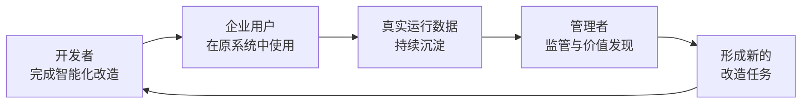
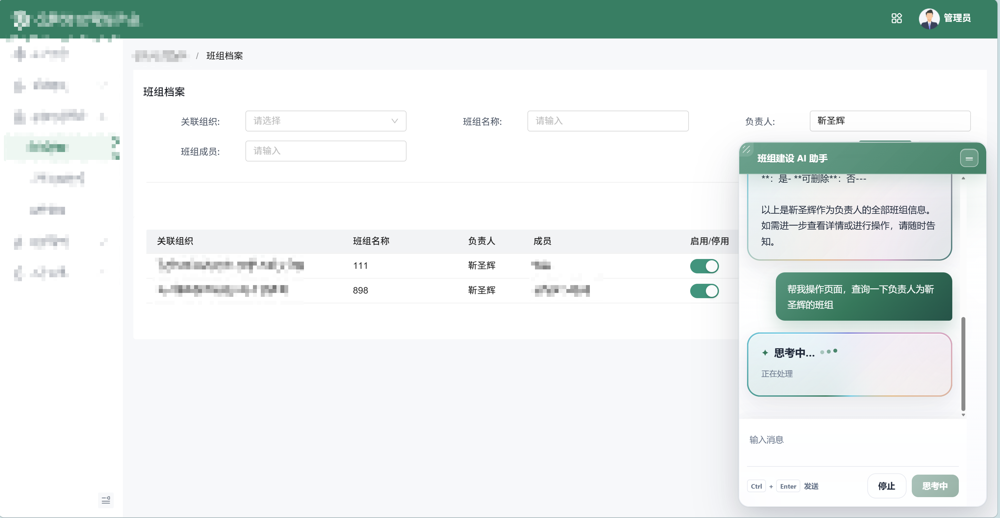
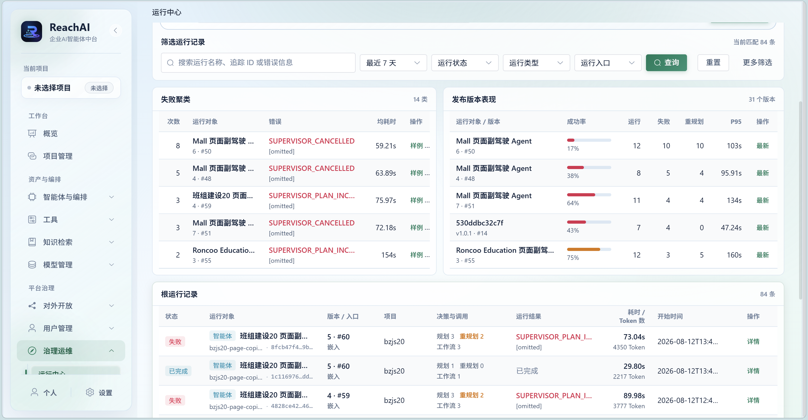
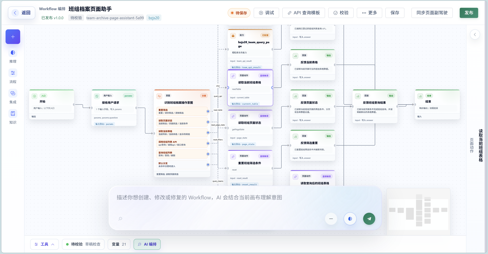
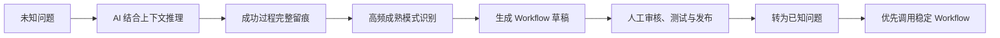

<p align="center">
  
</p>

<h1 align="center">睿池 ReachAI</h1>

<p align="center">
  <strong>面向企业全域业务系统的可信智能协同平台</strong>
</p>

<p align="center">
  帮助开发者快速完成既有业务系统智能化改造，<br />
  让企业用户在原系统中直接使用 AI，<br />
  让管理者统一监管运行，并从真实使用中持续发现新的业务价值。
</p>

<p align="center">
  <a href="https://openjdk.org/projects/jdk/17/"></a>
  <a href="https://spring.io/projects/spring-boot"></a>
  <a href="https://vuejs.org/"></a>
  <a href="LICENSE"></a>
</p>

> **开发者完成智能化改造 → 企业用户在原系统中使用 → 管理者查看运行与高频需求 → 形成新的改造任务 → 开发者持续优化。**

## ReachAI 是什么

企业通常已经建设了 OA、ERP、CRM、合同、采购、工单等多个业务系统，真正有价值的数据、规则、权限和流程都沉淀在这些系统中。推进 AI 应用时，企业需要的往往不是再建设一个孤立的聊天机器人，而是让 AI 能够在保留原有系统和业务规则的前提下，理解用户需求、调用已有功能并协同完成工作。

ReachAI 不替换原有系统，而是在它们之上建立统一的智能协同与治理能力：

- 开发者借助 AI Coding 工具完成系统分析、能力接入、流程建设、代码改造和验证。
- 企业用户无需学习新的独立系统，在原有业务页面中即可查询、办理和协同。
- 管理者统一查看智能体和业务流程的运行状态、成功率、耗时、异常及高频需求。
- 平台把真实使用转化为下一轮改造依据，形成持续演进的企业智能化闭环。

ReachAI 不是单纯的 Workflow Builder，也不只是接口扫描工具。它连接系统改造、业务执行和持续运营，让 AI 真正进入已有企业系统，同时保留权限、审核、确认、版本和审计边界。

## 三类用户，一条持续改造闭环

| 服务对象 | 面临的问题 | ReachAI 提供的价值 |
| --- | --- | --- |
| 开发者 | 系统架构、接口和页面各不相同，接入 AI 需要大量分析与联调 | 通过 Trae、Codex、Cursor、Claude Code 等已适配的 AI Coding 客户端获取受限项目上下文，完成代码、流程、页面能力和测试方案的生成或修改 |
| 企业管理与运营人员 | 智能体上线后缺少统一运行视图，也难以从日常使用中发现值得继续建设的场景 | 集中查看运行状态、调用量、成功率、耗时、异常和执行链路，并识别高频需求与价值候选 |
| 企业用户 | 办理一项工作需要反复查找入口、切换页面和手工汇总信息 | 在原有业务系统和当前页面中通过自然语言查询、办理和协同，关键操作确认后执行 |



这一闭环不是一次性交付。系统接入越多、使用数据越充分，企业越容易发现新的协同场景、复用成熟流程，并把有限建设资源投向真正高频、耗时或容易出错的环节。

## AI 原生驱动

ReachAI 所说的“AI 原生”，不是在平台中增加一个聊天窗口，而是让 AI 贯穿价值发现、工程改造、流程建设、业务执行和运行分析：

> **AI 发现价值线索 → AI 生成流程 → AI 生成代码 → AI 协同执行 → AI 分析运行结果 → 进入下一轮优化。**

| AI 原生环节 | 在平台中的落地方式 | 人的职责 |
| --- | --- | --- |
| 发现价值 | 分析运行记录、高频需求、重复成功模式、异常和耗时 | 判断业务价值和建设优先级 |
| 生成流程 | 根据业务目标与现有能力形成可审核的 Workflow 草稿 | 审核规则、边界和发布条件 |
| 生成代码 | 由 AI Coding 工具分析真实工程并生成或修改接入代码 | 控制改造范围，检查、测试和验收 |
| 协同执行 | 理解用户意图，选择已发布 Workflow 或经过授权的系统能力 | 对修改、提交、审批等关键操作进行确认 |
| 分析优化 | 汇总成功率、耗时、异常环节和实际使用效果 | 确定下一轮改造任务 |

AI 负责发现、生成和协同执行，人负责决策、审核与授权。平台最终执行的不是一段不可控的“万能提示词”，而是经过校验、发布和版本管理的能力及流程。

## 核心产品能力

### 1. 面向开发者：AI Coding 驱动智能化改造

ReachAI 把业务系统接入和 Workflow 工程能力设计为 AI Coding 工具可以直接理解和调用的工程接口。开发者可以在项目接入工作台或业务页面工作台创建改造任务，将范围、上下文、可用资源和验收条件交给当前 AI Coding 会话。

AI Coding 工具可以在授权范围内完成：

- 分析 Java / Spring Boot 工程、业务模块、页面和直接关联接口。
- 接入 Capability SDK、Starter、嵌入式对话和页面动作。
- 创建或修改 Workflow `GraphSpec`，执行校验、调试和发布前检查。
- 持续回传真实进度、待确认问题、结构化结果和验证证据。

<p align="center">
  
</p>

任务交接使用明确的作用域、短期凭据和结果契约。AI Coding 工具不能凭一段自然语言宣布任务完成；代码、运行和真实业务验收分别进入平台门禁，最终由服务端记录形成完成事实。

### 2. 面向企业用户：AI 回到原有业务页面

ReachAI 不要求企业用户离开熟悉的业务系统。Chat Embed SDK 将智能入口嵌入当前页面，Page Bridge 将页面状态和经过登记的页面动作提供给智能体。

典型使用流程是：

1. 用户在原有业务页面中用自然语言提出查询、办理或协同需求。
2. 智能体结合用户身份、当前页面和业务上下文理解需求。
3. 已有稳定流程覆盖的问题优先调用经过审核和发布的 Workflow。
4. 需要调用业务功能时，只使用当前用户和当前场景被授权的能力。
5. 涉及修改、提交或审批等关键操作时，先请求用户确认。
6. 结果回到当前业务页面，完整执行过程进入运行记录。

<p align="center">
  
</p>

### 3. 面向管理者：统一治理与价值发现

智能体上线不是结束。ReachAI 通过统一运行视图和全过程记录，帮助管理者持续了解实际运行效果：

- 查看智能体、Workflow、系统能力和发布版本的在线状态。
- 查看调用次数、成功率、响应耗时、失败聚类和异常环节。
- 按用户、项目、智能体、Workflow 或任务追溯完整执行链路。
- 识别高频需求、重复操作和多次成功的执行模式。
- 将高价值场景转化为候选能力、候选流程或新的改造任务。

<p align="center">
  
</p>

### 4. Workflow：让成熟业务流程稳定执行

企业业务不能全部依赖大模型临场发挥。规则明确、频繁发生的业务问题，应优先调用经过审核和发布的 Workflow，以获得更稳定的速度、成本和执行结果。

ReachAI 支持用 AI 生成 Workflow 草稿，也支持自然语言局部修改；最终保存和执行的是平台统一的 `GraphSpec`：

- `GraphSpec` 承载 Workflow 的可执行语义。
- `canvas_json` 只承载画布布局，不作为运行时事实源。
- 发布前执行结构、节点、引用、权限和资源校验。
- 发布后形成版本快照，可用于 Runtime 执行、Trace 和 RunOps 复盘。

<p align="center">
  
</p>

### 5. Capability：低改造连接已有系统

新系统和核心 Java 系统可以通过 `reachai-capability-sdk` 与 `reachai-spring-boot2-starter` 主动注册项目、实例和业务能力。平台形成能力快照、字段级差异和评审记录，再沉淀为可治理、可编排、可复用的 Capability 资产。

```java
@ReachCapability(
    name = "submitLeaveRequest",
    title = "提交请假申请",
    description = "根据员工、时间和请假类型提交 OA 请假流程",
    domain = "oa",
    module = "leave",
    sideEffect = ReachSideEffectLevel.WRITE,
    requiredRoles = {"oa.leave.submit"}
)
public LeaveResult submitLeave(
    @ReachParam(name = "request", description = "请假申请信息", required = true)
    LeaveRequest request
) {
    return leaveService.submit(request);
}
```

存量系统也可以从一个具体模块或页面切入，逐步扩展，而不必一次性重写整个业务系统。

## 可信运行边界

企业 AI 不仅要“能调用”，还要知道谁在调用、为何调用、可以调用什么，以及发生问题后如何定位。

| 可信要求 | ReachAI 的处理方式 |
| --- | --- |
| 改造有范围 | AI Coding 工具只获取当前任务需要的项目上下文和操作范围 |
| 生成有审核 | AI 生成的代码、能力和 Workflow 经过开发者或业务人员检查后发布 |
| 执行有权限 | 智能体只能调用当前用户、项目和场景允许的业务能力 |
| 关键操作有确认 | 修改、提交、审批等操作在执行前与用户进行绑定确认 |
| 过程有记录 | 智能体决策、Workflow 节点、工具调用和业务结果形成 Trace / RunOps 记录 |
| 问题可定位 | 管理者可以查看版本、状态、耗时、失败环节和相关上下文 |

嵌入式场景使用短期 Token 连接平台身份、业务用户、Agent 授权、Origin 和页面实例。对外开放则通过 Gateway、MCP、A2A 等协议复用已经治理的 Agent 与 Capability，而不是绕过平台直接访问业务数据库。

## 从未知问题到稳定流程（演进方向）

ReachAI 希望逐步形成“确定性流程优先、智能推理补充、成功经验持续沉淀”的运行模式：



这同时解决两个矛盾：只使用固定流程覆盖不了不断出现的新问题；所有问题都依赖 AI 临场推理，又难以控制成本、速度和稳定性。

> 这是后续演进方向。当前仓库已经具备 Workflow 编排、智能体执行、运行留痕、运行分析和人工审核等基础能力；自动识别成熟模式并生成可发布流程，仍需在真实运行数据和验收门槛下持续完善。

## 当前模块

| 模块 | 职责 |
| --- | --- |
| `ai-admin-front` | Vue 3 管理端，承载项目接入、业务页面工作台、Agent、Workflow Studio、RunOps、模型、知识和治理页面 |
| `reachai-control-service` | Platform Control 与 public API / BFF 入口，收口 `/api/**`、`/embed/**` 和 SDK 注册公开入口 |
| `reachai-runtime-service` | Runtime Host，承载 Agent、Workflow、GraphSpec、Trace、RunOps、调试和执行 |
| `reachai-capability-service` | Capability Catalog，承载 SDK 注册、能力快照、diff / review / apply 和能力资产 |
| `reachai-knowledge-service` | Knowledge / Retrieval，承载知识库、文件、RAG、业务索引和向量检索 |
| `reachai-model-service` | Model Gateway，承载模型中心、Chat、Embedding 和 Rerank |
| `reachai-capability-sdk` | JDK 8 兼容的业务能力声明 SDK 契约 |
| `reachai-spring-boot2-starter` | Spring Boot 2 业务系统注册、心跳、能力和 SDK 图同步 |
| `ai-runtime-contract` | 平台内部 Tool / Skill 运行时契约 |

当前后端采用五服务部署拓扑，第一阶段共享一个 MySQL 数据库，但继续维护明确的服务表所有权和内部 API 边界。旧 `ai-agent-service` 已从主路径删除，不再作为 Maven、IDEA、本地启动或部署单元。

## 快速开始

### 环境要求

- JDK 17+
- Maven
- Node.js 20 LTS、npm
- MySQL、Redis、Milvus

### 1. 启动基础设施

```bash
docker compose -f deploy/docker-compose.infra.yml up -d
```

### 2. 初始化数据库

```bash
mysql -h localhost -u root -p < sql/initV2.sql
```

### 3. 构建后端

```bash
mvn clean install -DskipTests
```

### 4. 启动五个服务

IDEA 已提供共享运行配置 `00 ReachAI Five Services`，也可以按照以下顺序分别启动：

1. `reachai-model-service`：18601
2. `reachai-knowledge-service`：18602，context path `/ai`
3. `reachai-capability-service`：18605
4. `reachai-runtime-service`：18604
5. `reachai-control-service`：18603

服务启动后执行链路自检：

```powershell
$env:REACHAI_PLATFORM_SESSION_TOKEN = '<登录 ReachAI 管理端后取得的平台会话令牌>'
node scripts/check-physical-service-smoke.mjs --wait-ms 120000 --interval-ms 3000
Remove-Item Env:REACHAI_PLATFORM_SESSION_TOKEN
```

完整环境变量、认证配置和启动验证方式见 [后端物理服务与启动验证](docs/architecture/physical-services-and-startup.md)。

### 5. 启动管理端

```bash
cd ai-admin-front
npm install
npm run dev
```

访问 [http://localhost:5200](http://localhost:5200)。

## 文档导航

| 文档 | 内容 |
| --- | --- |
| [文档中心](docs/README.md) | 产品、架构、接口、SQL 和实现边界总入口 |
| [Workflow AI Coding](docs/reference/Workflow-AI-Coding.md) | AI Coding 创建、修改、校验、调试和发布 Workflow |
| [业务页面工作台](docs/architecture/business-page-workbench.md) | 页面发现、接入任务、发布与真实业务验收 |
| [嵌入式对话与页面动作](docs/reference/嵌入式对话与页面动作.md) | Embed Chat、Page Bridge、Page Action 和业务身份 |
| [JDK 8 SDK 与 JDK 17 Runtime 分层](docs/reference/JDK8-SDK与JDK17-Runtime分层.md) | 企业 Java 系统低改造接入边界 |
| [服务表所有权](docs/architecture/service-table-ownership.md) | 五服务同库阶段的数据所有权与跨服务约束 |

## 技术栈

| 层级 | 技术 |
| --- | --- |
| 后端 | Java 17、Spring Boot 3.4、Spring Cloud 2024、Spring Cloud Alibaba |
| AI | Spring AI、Spring AI Alibaba、AgentScope、LangGraph4j |
| 数据 | MySQL、Redis、Milvus、MyBatis-Plus |
| 前端 | Vue 3、Vite、Element Plus、TypeScript、Pinia、Vue Flow、AntV G6 |
| 部署 | Docker、Kubernetes |

## 学习交流

ReachAI 仍在持续演进，欢迎交流企业系统智能化改造、Agent Runtime、Workflow、AI Coding 与运行治理实践。

<p align="center">
  
</p>

## 一句话总结

> **ReachAI 让开发者借助 AI Coding 持续改造已有企业系统，让企业用户在原系统中使用 AI，让管理者从真实运行中发现价值，并以可信、可控、可追溯的方式进入下一轮优化。**
