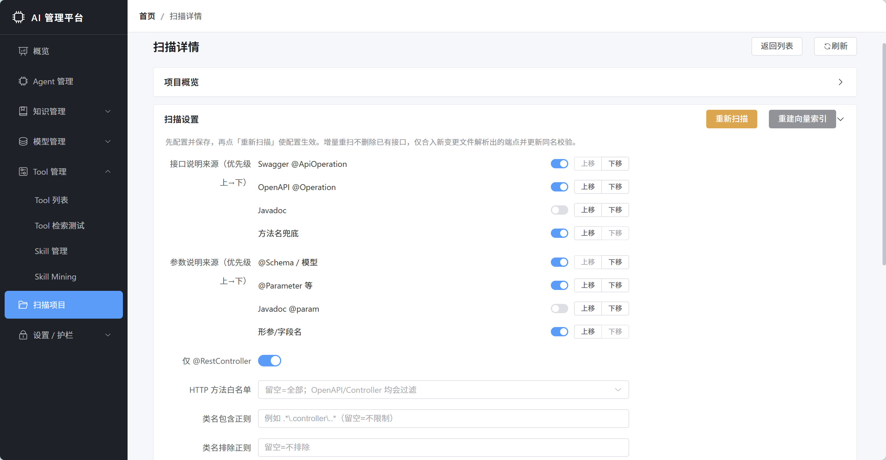

# Enterprise Agent Framework

**让已有 Java 系统，长出自己的 AI Agent。**

[](https://openjdk.org/projects/jdk/17/)
[](https://spring.io/projects/spring-boot)
[](https://spring.io/projects/spring-ai)
[](LICENSE)

Enterprise Agent Framework 是一套面向 **Java 企业系统** 的 Agent 开发与治理中台。它不是只做一个聊天框，而是把已有 Spring / Java 业务接口转化为 Agent 可理解、可拖拽、可治理、可观测的企业 AI 能力。

如果你的团队有大量存量 Java 系统，又希望快速落地智能助手、业务办理 Agent、内部效率工具或 AI 中台，这个项目提供了一条渐进式路径：**先扫描接口，再补充业务语义，然后编排成 Agent，并用权限、审计、Trace 和灰度发布把它带向生产。**


## 为什么值得关注

大多数 Agent 框架优先服务 Python 生态，但企业里的核心系统往往已经在 Java / Spring / SSM / Dubbo 上稳定运行多年。真正落地时，难点不是再写一个对话 Demo，而是：

- 如何低侵入接入历史系统，不推倒重来。
- 如何让 Agent 看懂接口的真实业务含义，而不只是看到方法名和 Swagger 描述。
- 如何让多步业务流程稳定执行，避免 LLM 临场推理带来的跳步、漏步和误调用。
- 如何接入企业权限、审计、灰度、回滚和可观测体系，让业务敢上线。

这个项目的目标就是把这些问题收束到一套 Java 原生的基础设施里：**Tool 层管“有没有能力”，Skill 层管“稳不稳执行”，Agent Studio 管“能不能运营起来”，治理护栏管“敢不敢上生产”。**

## 你可以用它做什么

| 能力 | 解决的问题 |
| --- | --- |
| **运行时扫描 Java 项目** | 录入项目域名和磁盘路径，扫描 OpenAPI / Spring Controller，接口直接入库成为动态 Tool。 |
| **AI 语义理解** | 基于 README、Controller、Service、DTO、Mapper 等源码生成项目级、模块级、接口级业务说明，让 Agent 选 Tool 更准。 |
| **领域识别与软路由** | 维护领域词典和能力归属，按用户问题识别领域，并在 Tool Retrieval 中对候选 Tool / Skill 做软过滤。 |
| **Agent Studio** | 在管理后台拖拽 Tool / Skill / Knowledge 节点，调试、发布、灰度、回滚 Agent。 |
| **Skill 三态能力层** | 用 SubAgent、InteractiveForm、AugmentedTool 等形态把稳定流程封装成可治理能力，降低 ReAct 不稳定性。 |
| **企业治理护栏** | Tool ACL、`sideEffect` 分级、不可逆操作闸口、Redis Tool 限流、Trace 回放和调用日志，覆盖权限、审计和风险控制。 |
| **MCP / A2A 对外开放** | 将 Tool / Skill / Agent 暴露给 Cursor、Claude Desktop、Dify、OpenClaw 等外部生态，并提供凭证、可见性和调用审计。 |
| **RAG + 模型网关** | 内置文档管线、Milvus 向量检索、多 Provider 模型路由、OpenAI 兼容代理和 SSE 流式输出。 |

## 三分钟理解架构

核心链路很短：

1. 扫描已有 Java 项目，生成 `tool_definition`。
2. 用 AI 语义理解补齐业务描述，写回 `tool_definition.ai_description`。
3. 用领域词典和能力归属把 Tool / Skill / Agent 挂到业务域，运行时按用户问题做领域软过滤。
4. 在 Agent Studio 中选择 Tool / Skill / Knowledge，发布为可调用 Agent。
5. 运行时通过 Tool Retrieval、Tool ACL、`sideEffect` 闸口、Tool 限流和 Trace 记录保证可控可追踪。
6. 通过 MCP / A2A 把受控能力开放给外部 IDE、Agent 平台和远程 Agent 编排器。

## 快速开始

### 环境要求

- JDK 17+
- Maven 3.8+
- Node.js 18+
- Docker & Docker Compose
- MySQL 客户端（用于初始化数据库）

### 1. 克隆项目

```bash
git clone https://github.com/w8123/EnterpriseAgentFramework.git
cd EnterpriseAgentFramework
```

### 2. 启动基础设施

一键拉起 MySQL、Redis、Milvus、Nacos：

```bash
docker compose -f deploy/docker-compose.infra.yml up -d
```

### 3. 初始化数据库

```bash
mysql -h localhost -u root -proot ai_text_service < ai-skills-service/sql/init.sql
```

### 4. 构建并启动后端服务

```bash
mvn clean install -DskipTests

# 终端 1：模型网关
cd ai-model-service && mvn spring-boot:run

# 终端 2：RAG 与 Tooling 基础层
cd ai-skills-service && mvn spring-boot:run

# 终端 3：Agent 编排服务
cd ai-agent-service && mvn spring-boot:run
```

### 5. 启动管理前端

```bash
cd ai-admin-front
npm install
npm run dev
```

访问 [http://localhost:3000](http://localhost:3000) 进入管理后台。

## 第一个接入场景：扫描历史 Java 项目

对于已经部署或可访问源码的历史 Java 项目，推荐先走管理后台的 **扫描项目** 流程：

1. 在管理后台新增扫描项目，填写项目名称、项目域名、磁盘路径、扫描方式（OpenAPI / Controller）。
2. 后端由 `ai-agent-service` 调用 `ai-skills-service` 的扫描能力，解析接口、参数和源码上下文。
3. 扫描结果写入 `scan_project`、`scan_project_tool` 和 `tool_definition`。
4. 开发者或运营在页面中编辑工具名、描述、参数、启停和可见性。
5. 进入「AI 理解」Tab，一键生成项目级、模块级、接口级业务语义。
6. 在 Agent Studio 中拖拽这些 Tool / Skill，调试后发布为 Agent。

这条链路没有 YAML 中间文件，也不要求历史项目必须生成 jar，更适合企业内部运维、联调和增量接入。


## 模块说明

| 模块 | 说明 | 端口 |
| --- | --- | --- |
| `ai-common` | 公共库，包含 DTO、异常定义、通用配置。 | - |
| `ai-skill-sdk` | Skill / Tool 开发契约，包含 `AiTool`、`AiSkill`、`ToolRegistry` 和治理元数据。 | - |
| `ai-model-service` | 统一模型网关，提供 LLM Chat / Embedding、多 Provider 路由和 OpenAI 兼容代理。 | 8601 |
| `ai-skills-service` | RAG、文档 Pipeline、向量检索、OpenAPI / Controller 扫描和语义上下文采集。 | 8602 |
| `ai-agent-service` | Agent 编排、动态 Tool 管理、Skill 执行、Agent Studio 后端、领域识别、MCP/A2A、Tool ACL、限流、Trace 和 Skill Mining。 | 8603 |
| `ai-admin-front` | Vue 3 管理端，提供 Agent、Skill、Studio、Tool、扫描项目、Trace 和治理配置界面。 | 3000 |
| `deploy` | Docker Compose、Kubernetes 和服务 Dockerfile 等部署配置。 | - |

仓库根目录 `pom.xml` 当前聚合 5 个 Java 子模块；`ai-admin-front` 是同目录下的 Vite 前端工程，不参与 Maven 聚合。

## 🛠️ 技术栈


| 层级       | 技术                                                               |
| -------- | ---------------------------------------------------------------- |
| **语言**   | Java 17                                                          |
| **框架**   | Spring Boot 3.4 · Spring Cloud 2024.0 · Spring Cloud Alibaba     |
| **AI**   | Spring AI 1.0 · Spring AI Alibaba (DashScope) · AgentScope 1.0.9 |
| **数据**   | MySQL 8 · Redis 7 · Milvus 2.4                                   |
| **注册中心** | Nacos 3.0（可选；与统一网关能力持续完善中）                                  |
| **ORM**  | MyBatis-Plus 3.5                                                 |
| **文档解析** | Apache POI 5.2 · PDFBox 2.0                                      |
| **前端**   | Vue 3 · Vite 6 · Element Plus · TypeScript · Pinia               |
| **部署**   | Docker · Kubernetes                                              |


---

## 🗺️ 当前进度

> README 只放面向外部读者的状态摘要；更细的阶段验收见 `docs/`。

### ✅ 已交付能力

- ✅ **AI Agent 编排引擎** — AgentScope + Spring AI ReAct Agent；`IntentService` 从已启用 `AgentDefinition` 动态生成意图候选，新增领域 Agent 后无需改代码即可参与意图识别。
- ✅ **RAG 知识引擎** — 文档 Pipeline + Milvus 向量检索 + 业务索引，支持企业知识问答和结构化数据语义检索。
- ✅ **统一模型网关** — 多 Provider 路由（通义千问 / DashScope / OpenAI 兼容）+ SSE 流式响应 + OpenAI 兼容代理。
- ✅ **运行时扫描与 AI 语义理解** — OpenAPI / Controller 扫描入库，项目 / 模块 / 接口三层语义写回 `tool_definition.ai_description`。
- ✅ **Tool Retrieval + 领域软过滤** — Milvus `tool_embeddings` 召回，支持 `project / module / kinds / enabled / agentVisible / domains` 等过滤；`DomainClassifier` + `DomainAssignment` 已接入召回软过滤。
- ✅ **Skill 层与 InteractiveForm** — `AiSkill extends AiTool`，已支持 SubAgentSkill、InteractiveFormSkill、确定性槽填充和 UI 原语协议；SlotExtractor SPI 已接入时间、部门、金额等内置提取器。
- ✅ **Agent Studio 与版本灰度** — `AgentDefinition` DB 化，画布编排、真实链路调试、发布快照、按 `userId` hash 灰度、一键回滚和 Trace → Skill 抽取。
- ✅ **企业治理护栏** — Tool ACL、`sideEffect` 五级标注、IRREVERSIBLE 闸口、Redis Tool 限流、`tool_call_log`、Trace 回放和 Skill 指标 API。
- ✅ **接口图谱一期** — 扫描后投影 API / FIELD / DTO / MODULE 节点，支持关系维护、过滤、布局持久化和 PNG 导出。
- ✅ **MCP 对外开放** — `/mcp/jsonrpc` 支持 `initialize`、`tools/list`、`tools/call`；系统级可见性、Client 白名单、Tool ACL 三层过滤；调用写入 `mcp_call_log`。
- ✅ **A2A 对外开放** — `/a2a/{agentKey}/.well-known/agent.json` 暴露 AgentCard，`/a2a/{agentKey}/jsonrpc` 支持 `message/send`、`tasks/get`、`tasks/cancel`；A2A Task 已持久化并带回 traceId。
- ✅ **管理后台** — 覆盖 Agent、Skill、Skill Mining、Studio、版本、Tool、Tool ACL、领域管理、MCP、A2A、知识库、模型、扫描项目、接口图谱、Trace 和 Dashboard。

### 🔨 仍在演进

- 🔨 **Skill Mining 真实数据验证 + LLM 反写** — 已有聚合、挖掘、草稿、发布和评估骨架，仍需要真实 `tool_call_log` 数据调阈值和反写策略。
- 🔨 **源码级扫描增强** — Service / JavaDoc 深扫、差异对比、增量更新、冲突提示和 OpenAPI 复杂契约增强。
- 🔨 **MCP / A2A 生态补强** — HTTP JSON-RPC 已可用；CLI / stdio MCP 桥、接入诊断和更完整的异步任务事件仍在推进。
- 🔨 **生产级护栏增强** — HITL 执行流、灰度策略增强、跨 Trace 对比、Prompt Diff、Agent / Skill 市场等继续作为后续方向。

---

## 🤝 适用场景


| 场景               | 说明                                   |
| ---------------- | ------------------------------------ |
| **传统企业 AI 转型**   | 有大量 Java 存量系统，想快速落地 AI Agent，但不想重写系统 |
| **智能客服 / 智能助手**  | 基于 RAG + Agent 构建企业知识问答与业务操作助手       |
| **内部效率工具**       | 让员工通过自然语言查数据、下单、审批，告别复杂的系统操作         |
| **AI 中台建设**      | 统一管理企业内多个 AI Agent、知识库、模型，避免烟囱式建设    |
| **Java 团队学习 AI** | 完整的 Spring AI + Agent 实战项目，最佳学习参考    |


---

## 💡 设计理念

1. **老系统零改动** — 历史项目保持独立运行（原 JDK 版本、原部署方式），框架通过 HTTP 桥接调用
2. **Java 原生 + Python辅助** — 不是 Python 的附庸，而是 Java 生态的一等公民方案
3. **SDK 化、可插拔** — Tool 体系高度解耦，实现 AiTool 接口即可注册，无框架绑定
4. **生产可用** — 不是 Demo，而是面向生产环境设计的完整基础设施
5. **渐进式接入** — 可以从一个 Tool 开始，逐步扩展，无需一步到位

---

## 📚 架构与设计文档

更完整的背景、现状与演进路径见仓库内文档（与 README 同步维护，每篇都按交付时间戳收口，README 的状态以这些文档为准）：

**总览与背景**

- [docs/背景、现状、目标.md](docs/背景、现状、目标.md) — 背景与动机、Tool 分层与调用链路、运行时 Web 扫描主线、分阶段实施与中台演进概要
- [docs/AI能力系统升级规划.md](docs/AI能力系统升级规划.md) — 单仓模块划分、各服务职责、扫描项目 Web 化、Phase 1 Tool Retrieval / Skill Mining 演进路径

**产品演进路线（顶层）**

- [docs/产品演进路线-Skill-AgentStudio-护栏.md](docs/产品演进路线-Skill-AgentStudio-护栏.md) — Skill、Agent Studio、Tool 护栏与 Trace 的阶段路线
- [docs/AI中台生态扩展规划.md](docs/AI中台生态扩展规划.md) — 领域、对外协议、生态接入与中台化扩展规划

**Phase 2 Skill 层验收清单**

- [docs/Phase2.0-SubAgentSkill-落地验收清单.md](docs/Phase2.0-SubAgentSkill-落地验收清单.md) — `AiSkill` 契约、`SubAgentSkill` 三态枚举、扫描期 `SideEffectInferrer`、SkillController、前端 SkillList；含 28 用例 UT 清单与 6 项手工验收
- [docs/Phase2.x-InteractiveFormSkill-落地验收清单.md](docs/Phase2.x-InteractiveFormSkill-落地验收清单.md) — `INTERACTIVE_FORM` 第四态、`skill_interaction` 挂起 / 恢复表、UI 原语协议、PoC `create_team_interactive`

**Phase 3 Agent Studio 与护栏**

- [docs/Phase3.0-AgentStudio-落地验收清单.md](docs/Phase3.0-AgentStudio-落地验收清单.md) — `agent_definition` / `agent_version` 双表、`@vue-flow/core` 三栏画布、调试抽屉 + 发布灰度 + 一键回滚、Trace → Skill 一键抽取、IRREVERSIBLE 闸口
- [docs/Phase3.1-ToolACL-落地验收清单.md](docs/Phase3.1-ToolACL-落地验收清单.md) — `tool_acl` 表 + `ToolAclService.decide` 四态判定 + `AgentFactory.createToolkit` 装配过滤 + 管理端 CRUD / 批量授权 / 决策诊断

**对外生态**

- [docs/PhaseP2-MCP-A2A-落地验收清单.md](docs/PhaseP2-MCP-A2A-落地验收清单.md) — MCP / A2A 对外开放、Client 凭证、可见性、调用日志和管理端页面
- [docs/PhaseP3-MCP-A2A生态补强设计.md](docs/PhaseP3-MCP-A2A生态补强设计.md) — A2A Task 持久化、MCP stdio / CLI 桥和接入诊断

**专题设计**

- [docs/AI语义理解-设计与落地.md](docs/AI语义理解-设计与落地.md) — 三层语义（项目 / 模块 / 接口）、`SemanticContextCollector` 顺藤摸到底、`tool_definition.ai_description` 写回、`scan_module` 合并 / 重命名
- [docs/接口图谱-设计与落地.md](docs/接口图谱-设计与落地.md) — Phase 4.0 接口图谱一期：节点投影、MODEL_REF 自动推断、画布手动连线、`ApiGraphRepository` 抽象与二期演进策略
- [docs/Skill-评估指标口径.md](docs/Skill-评估指标口径.md) — `HitRate / ReplacementRate / SuccessRateDiff / TokenSavings` 四指标 SQL 口径，唯一实现点 `ToolCallLogService.computeCoverageMetrics`

---

## 📄 项目结构

```
EnterpriseAgentFramework/
├── ai-common/                公共库（DTO、异常、通用配置）
├── ai-skill-sdk/             Skill 开发 SDK
│                             ├─ AiTool / ToolParameter / ToolRegistry  Tool 契约
│                             └─ AiSkill / SkillKind / SkillMetadata   Skill 三态契约
│                                / SideEffectLevel / HitlPolicy         + 治理元数据
├── ai-model-service/         模型网关（LLM Chat / Embedding，多 Provider 路由，OpenAI 兼容代理）
├── ai-skills-service/        知识 / Tooling 基础层
│   ├── 业务能力              RAG · 文档 Pipeline · 向量检索 · 业务索引 · 扫描核心
│   └── sql/                  init.sql / upgrade_v2.sql / tool_definition_v4.sql
│                             scan_project_v5.sql / semantic_docs_v6.sql
│                             scan_project_tool_v7.sql / business_index_v3.sql
├── ai-agent-service/         智能体编排
│   ├── 业务能力              AgentScope ReAct · IntentService · 会话记忆
│   │                         Skill 三态执行器 · Agent Studio 后端 · 领域识别
│   │                         MCP / A2A · Tool ACL · 限流 · Trace 回放
│   │                         Skill Mining · AI 语义理解编排
│   └── sql/                  tool_call_log_v8.sql            Phase 1
│                             skill_phase2_0.sql              Phase 2.0 SubAgent
│                             skill_interaction_phase2_x.sql  Phase 2.x InteractiveForm
│                             tool_call_log_index_phase2_0_1.sql  Phase 2.0.1 Trace 索引
│                             skill_mining_phase2_1.sql       Phase 2.1 Skill Mining
│                             agent_studio_phase3_0.sql       Phase 3.0 Studio + 版本灰度
│                             tool_acl_phase3_1.sql           Phase 3.1 Tool ACL
│                             api_graph_phase4_0.sql          Phase 4.0 接口图谱
│                             domain_classifier_phase_p1.sql  领域识别
│                             mcp_phase_p2.sql                MCP 对外开放
│                             a2a_phase_p2.sql                A2A 对外开放
│                             a2a_task_phase_p3.sql           A2A Task 持久化
│                             backfill_side_effect.sql        一次性回填脚本
├── ai-admin-front/           管理前端（Vue 3 + Vite + Element Plus + TypeScript + @vue-flow/core）
├── deploy/                   部署配置（Docker Compose / Kubernetes / Dockerfile）
├── sql/                      根级聚合冷启动脚本（init.sql 与各服务 phase 脚本同步）
├── agent-definitions.json    Agent 定义旧 JSON 来源；Phase 3.0 已 DB 化，仍作为冷启动迁移源
└── docs/                     架构、设计与阶段验收文档
```

根目录 Maven 聚合与各模块关系见上文「模块说明」表格下方的说明。

---


## 系统截图

以下为管理端与相关能力界面截图（源文件位于 [`docs/系统截图`](docs/系统截图/)）。

### 扫描历史项目


### 扫描历史项目设置



### Tool 管理列表


### 编辑交互式表单 Skill


### 高频 Skill 识别


### 智能体执行链路追踪


### 接口知识图谱


---

## 🌟 Star History

如果这个项目对你有帮助，请给一个 ⭐ Star，这是对作者最大的鼓励！

---

## 📬 联系与交流

- 如果你也在做 Java + AI 的事情，或者企业面临AI转型，欢迎交流探讨
- QQ群 1073839193

## 🤝 参与贡献

欢迎通过 Issue 反馈使用问题、业务场景和改进建议，也欢迎提交 Pull Request。开始贡献前可以先阅读 [CONTRIBUTING.md](CONTRIBUTING.md)。

## 📄 开源协议

本项目基于 [MIT License](LICENSE) 开源。

---

**Enterprise Agent Framework** — 让 Java 企业拥抱 AI Agent 时代

*Built with ❤️ by Java developers, for Java developers.*

