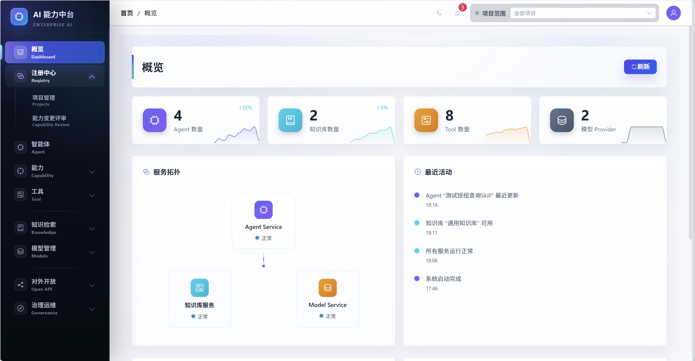
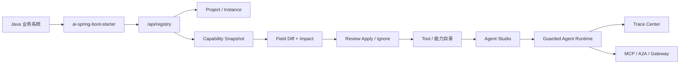
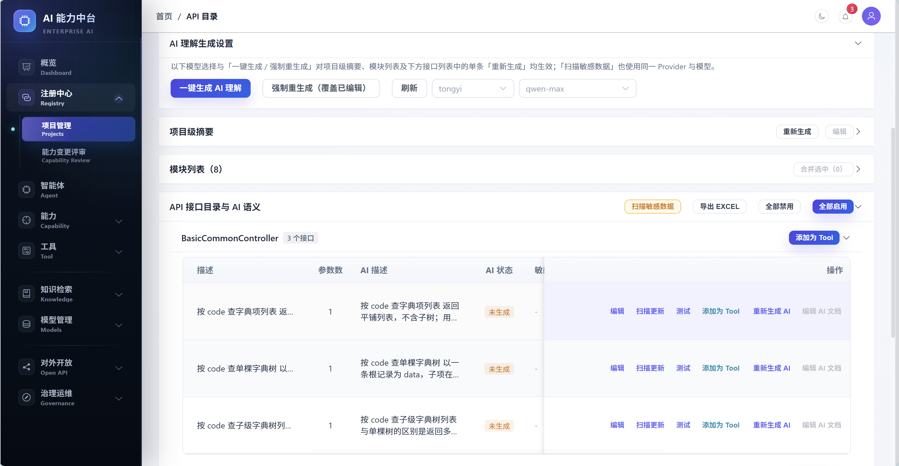
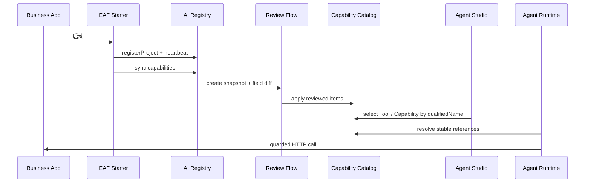
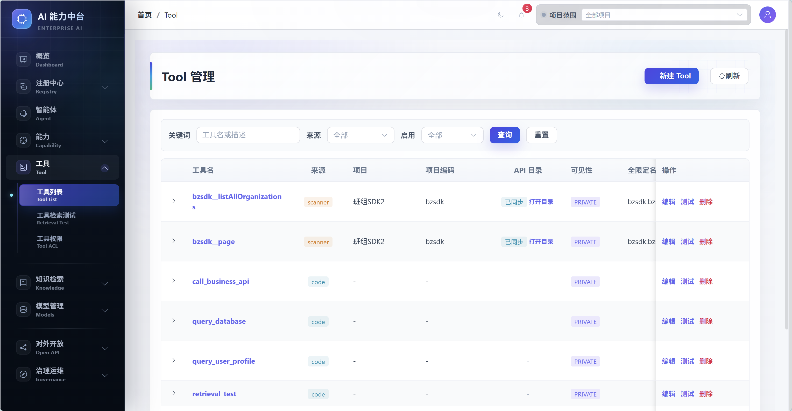
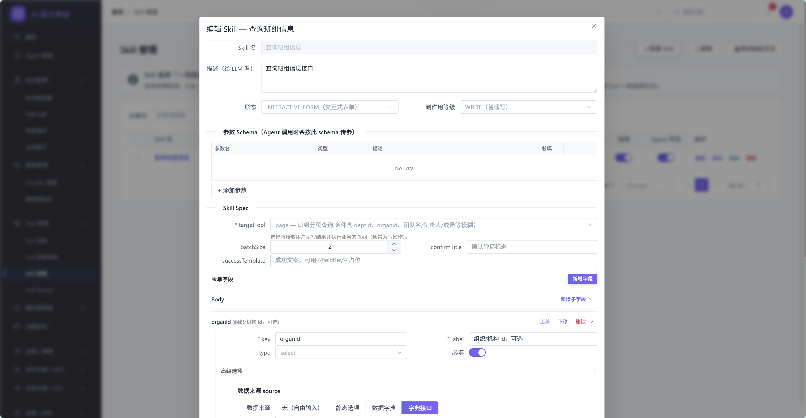

# Enterprise Agent Framework

**让已有 Java 系统，注册成为可治理、可编排、可开放的企业 AI 能力。**

[](https://openjdk.org/projects/jdk/17/)
[](https://spring.io/projects/spring-boot)
[](https://spring.io/projects/spring-ai)
[](https://vuejs.org/)
[](LICENSE)

Enterprise Agent Framework 是一个面向 **Java 企业系统** 的 AI 能力注册中心与 Agent 治理运行平台。它不是又一个聊天 Demo，而是把企业里已经存在的 Spring Boot / Java 服务、接口、知识库、工具、**粗粒度能力（Capability）** 和 Agent 统一纳入一个可审批、可观测、可回滚、可对外开放的 AI 中台。

如果你的团队有大量存量业务系统，又希望把它们升级成可被 AI Agent 调用的企业能力，这个项目提供一条渐进式路径：

- 历史系统可以先通过 **平台侧扫描** 接入。
- 可改造系统可以引入 **`ai-spring-boot-starter` 主动注册**。
- 接口能力进入注册中心后，会形成 **项目、实例、能力快照、字段级 diff、稳定引用和治理审计**。
- 运营人员可以在管理端把 Tool / 能力 / Knowledge 编排成 Agent，并通过 MCP / A2A / Gateway 对外开放。



## 项目一句话

> **EAF = AI Registry Center + Agent Studio + Tool/Capability Runtime + Governance + Open Protocols for Java enterprises.**

企业 AI 真正难的不是“让大模型回复一句话”，而是：

- 如何让旧系统不重写，也能被 Agent 安全调用。
- 如何让业务系统启动后自动把接口、实例、能力元数据注册到平台。
- 如何避免多项目同名接口、同名 Tool、同名能力互相污染。
- 如何让能力变更不直接覆盖生产配置，而是走快照、diff、评审、apply。
- 如何把 ACL、sideEffect、限流、Trace、灰度、回滚、市场化复用放进同一个治理闭环。

Enterprise Agent Framework 的目标就是把这些问题做成一套 Java 原生的企业 AI 基础设施。

## 核心亮点

| 能力 | 说明 |
| --- | --- |
| **AI 注册中心** | 业务系统引入 Starter 后，启动即可注册项目、实例、接口能力和能力元数据。 |
| **能力变更评审流** | SDK 上报不再只是 upsert，而是生成 `capability_snapshot`、字段级 diff、影响分析和逐条 apply / ignore。 |
| **项目隔离与稳定引用** | 用 `projectCode / visibility / qualifiedName / definitionId` 解决多项目同名能力冲突。 |
| **Agent Studio** | 在管理端拖拽 Tool / 能力 / Knowledge，调试、发布、灰度、回滚 Agent。 |
| **粗粒度能力三形态** | 支持子智能体能力、交互式表单能力、AugmentedTool，把稳定流程封装为可治理单元。 |
| **企业治理护栏** | Tool ACL、sideEffect 分级、IRREVERSIBLE 闸口、Redis 限流、Preflight、Trace Center 与调用审计。 |
| **MCP / A2A / Gateway** | 将受控 Tool、能力、Agent 暴露给 IDE、外部 Agent 平台、远程 Agent 和业务系统。 |
| **RAG 与模型网关** | 内置文档管线、Milvus 向量检索、多 Provider 模型路由和 OpenAI 兼容代理。 |
| **接口图谱** | 扫描 API、字段、DTO、模块关系，支持手动连线、推断、布局和 Agent Studio 参数提示。 |

## AI 注册中心：本次重点升级

过去的平台主链路偏“扫描项目”：

```text
管理端录入项目 -> 扫描 OpenAPI / Controller -> 生成 Tool -> Agent Studio 编排 -> Agent 调用业务系统
```

这对历史系统非常友好，但企业级规模化接入更需要“业务系统主动注册”：

```text
业务系统引入 EAF Starter
  -> 启动注册项目与实例
  -> 扫描 @AiCapability / Spring MVC Mapping
  -> 上报能力快照
  -> 平台生成字段级 diff
  -> 人工评审 apply / ignore
  -> Agent / 能力 / MCP / A2A / Gateway 复用能力
```

### 改造后的注册中心模型



### 已落地的关键能力

- `scan_project` 升级为业务项目承载模型，支持 `projectCode / projectKind / environment / owner / visibility`。
- `tool_definition` 增加 `projectCode / visibility / qualifiedName`，能力不再只靠裸 `name`。
- `agent_definition` 增加项目归属和稳定能力引用结构，兼容历史 `toolsJson / skillsJson`。
- 新增能力评审表：`capability_snapshot`、`capability_diff_item`、`capability_apply_record`。
- 注册中心 API 支持项目注册、实例心跳、离线、能力 diff / sync / apply、快照查询和逐条评审。
- 注册 API 支持 `appKey / appSecret` HMAC 签名、timestamp、nonce，Starter 自动添加签名头。
- 实例心跳支持 TTL 自动下线，避免异常退出后长期显示 ONLINE。
- MCP / A2A / Trace / ACL 等资产开始补齐项目、环境和租户字段，为多租户治理做准备。
- 管理端菜单已按“概览、AI 注册中心、Agent、能力、Tool、知识、模型、对外开放、治理”重新组织。

## 两种接入方式

### 1. 历史系统：平台侧扫描

适合无法改造或暂时不想改造的旧系统。

1. 在管理端创建“项目与 API 接入”。
2. 填写项目域名、源码路径、扫描方式。
3. 平台扫描 OpenAPI / Spring Controller / DTO / Service 上下文。
4. 生成 `scan_project_tool` 和动态 `tool_definition`。
5. 在 Agent Studio 中把接口能力编排成 Agent。



### 2. 新系统或核心系统：Starter 主动注册

业务系统引入 Starter 后，启动即可注册到 AI 注册中心。

```yaml
eaf:
  registry:
    url: http://ai-agent-service:8603
    app-key: contract-center
    app-secret: change-me
    heartbeat-interval-ms: 30000
  project:
    code: contract-center
    name: 合同中心
    base-url: http://contract-center:8080
    environment: prod
    visibility: PROJECT
  capability:
    scan-controller: true
    expose-actuator-endpoint: true
    sync-on-startup: true
```

能力声明示例：

```java
@AiCapability(
    name = "queryContract",
    title = "查询合同",
    description = "按合同编号查询合同基础信息和审批状态",
    sideEffect = SideEffectLevel.READ_ONLY
)
@GetMapping("/contracts/{contractNo}")
public ContractDTO queryContract(@AiParam("合同编号") @PathVariable String contractNo) {
    return contractService.query(contractNo);
}
```

启动后 Starter 会：

1. 注册或更新业务项目。
2. 上报实例心跳、host、port、appVersion、sdkVersion。
3. 扫描 Spring MVC Mapping 和 `@AiCapability / @AiParam`。
4. 生成能力快照并同步到注册中心。
5. 使用 HMAC 签名保护注册、心跳和能力同步请求。
6. 提供 `EafAgentClient`，让业务系统反向调用平台 Agent。

```java
Map<?, ?> result = eafAgentClient.chat(
    "contract-assistant",
    "帮我查询合同 HT-2026-0001 的审批进度"
);
```

## 能力从注册到调用的生命周期



## 系统模块

| 模块 | 说明 | 端口 |
| --- | --- | --- |
| `ai-common` | 公共 DTO、异常定义和通用配置。 | - |
| `ai-skill-sdk` | Tool / 能力开发契约（`AiSkill` 等为历史接口名），包含 `AiTool`、`AiSkill`、`ToolRegistry` 和治理元数据。 | - |
| `ai-spring-boot-starter` | 业务系统接入 Starter，支持项目注册、实例心跳、能力扫描上报和 `EafAgentClient`。 | - |
| `ai-model-service` | 统一模型网关，提供 LLM Chat / Embedding、多 Provider 路由和 OpenAI 兼容代理。 | 8601 |
| `ai-skills-service` | RAG、文档 Pipeline、向量检索、OpenAPI / Controller 扫描和语义上下文采集。 | 8602 |
| `ai-agent-service` | Agent 编排、AI 注册中心、动态 Tool、粗粒度能力、Agent Studio、MCP/A2A、Gateway、ACL、Trace 和治理护栏。 | 8603 |
| `ai-admin-front` | Vue 3 管理端，提供注册中心、Agent、能力、Tool、知识、模型、开放协议和治理页面。 | 3000 |
| `deploy` | Docker Compose、Kubernetes、Dockerfile 等部署配置。 | - |

## 技术栈

| 层级 | 技术 |
| --- | --- |
| 语言 | Java 17 |
| 后端 | Spring Boot 3.4 · Spring Cloud 2024 · Spring Cloud Alibaba |
| AI | Spring AI 1.0 · Spring AI Alibaba · AgentScope 1.0.9 |
| 数据 | MySQL 8 · Redis 7 · Milvus 2.4 |
| ORM | MyBatis-Plus |
| 文档与扫描 | JavaParser · Apache POI · PDFBox |
| 前端 | Vue 3 · Vite 6 · Element Plus · TypeScript · Pinia · Vue Flow |
| 部署 | Docker · Kubernetes |

## 快速开始

### 1. 克隆项目

```bash
git clone https://github.com/w8123/EnterpriseAgentFramework.git
cd EnterpriseAgentFramework
```

### 2. 启动基础设施

```bash
docker compose -f deploy/docker-compose.infra.yml up -d
```

基础设施包括 MySQL、Redis、Milvus、Nacos 等。

### 3. 初始化数据库

推荐使用根目录聚合脚本：

```bash
mysql -h localhost -u root -proot < sql/init.sql
```

如果你只想增量补注册中心相关表和字段：

```bash
mysql -h localhost -u root -proot ai_text_service < ai-agent-service/sql/registry_phase_p4.sql
```

### 4. 构建后端

```bash
mvn clean install -DskipTests
```

### 5. 启动服务

```bash
# 模型网关
cd ai-model-service
mvn spring-boot:run

# RAG 与扫描基础层
cd ../ai-skills-service
mvn spring-boot:run

# Agent 编排与 AI 注册中心
cd ../ai-agent-service
mvn spring-boot:run
```

### 6. 启动管理端

```bash
cd ai-admin-front
npm install
npm run dev
```

访问 [http://localhost:3000](http://localhost:3000)。

## 管理端信息架构

管理端已按企业控制台思路重新整理：

| 菜单 | 说明 |
| --- | --- |
| 概览 | 全局指标与入口。 |
| AI 注册中心 | 项目管理、能力变更评审、项目与 API 接入。 |
| Agent | Agent 定义、Studio、调试、版本、灰度与回滚。 |
| 能力 | 能力管理、能力挖掘、槽位提取器。 |
| Tool | Tool 列表、Tool 检索测试、Tool ACL。 |
| 知识与检索 | 知识库、文件入库、检索测试、业务索引。 |
| 模型管理 | Provider 和模型调试台。 |
| 对外开放 | MCP 与 A2A 统一入口，管理暴露范围、凭证和调用流水。 |
| 治理与运维 | 领域定义、归属画布、分类器测试；后续承接 Trace / GuardRuntime / 限流熔断。 |


## 当前进度

### 已具备

- AI 注册中心：项目注册、实例心跳、能力同步、快照、字段级 diff、逐条评审 apply / ignore。
- Spring Boot Starter：自动注册、Controller 能力扫描、签名请求、心跳、离线、Agent Client。
- 项目隔离：Tool、能力、Agent、ACL、MCP、A2A、Trace 等资产逐步接入 `projectId / projectCode / environment / tenantId`。
- 稳定引用：Agent 开始支持 `CapabilityReference`，新数据优先使用 `qualifiedName / definitionId`。
- Agent Studio：画布编排、链路调试、版本发布、灰度、回滚。
- Tool / 能力 Runtime：动态 HTTP Tool、子智能体能力、交互式表单能力、SlotExtractor、Tool Retrieval。
- Governance：Tool ACL、sideEffect、IRREVERSIBLE 闸口、Redis Tool 限流、Preflight、Trace Center。
- Open Protocols：MCP JSON-RPC、A2A AgentCard / JSON-RPC、AI Gateway 目录与 Agent Chat 入口。
- Agent / 能力 Market：上架、审批、依赖检查、导出包的数据模型与 API 骨架。

### 继续演进

- 更完整的注册中心凭证轮换、吊销、白名单和审计事件。
- 更完整的租户、环境、项目强隔离策略。
- 可配置限流、熔断、HITL 和统一 GuardRuntime。
- Trace Center 时间线、成本、风险、治理决策聚合视图。
- CLI、MCP stdio 桥、接入诊断和能力市场产品化。

## 适用场景

| 场景 | 价值 |
| --- | --- |
| 传统企业 AI 转型 | 让大量 Java 存量系统渐进式变成 AI 可调用能力。 |
| 企业 AI 中台 | 统一管理项目、能力、Agent、知识、模型和治理策略。 |
| 智能业务助手 | 基于 RAG + Tool + 能力 + Agent Studio 构建业务办理 Agent。 |
| 内部效率工具 | 员工通过自然语言查数据、办流程、调接口、看审计。 |
| AI 开放平台 | 通过 MCP / A2A / Gateway 把企业能力开放给外部 Agent 生态。 |
| Java 团队学习 AI | 一个完整的 Spring AI + Agent + RAG + Governance 工程样板。 |

## 设计理念

1. **注册优先，而不是扫描优先**：扫描保留给历史系统，核心系统走 Starter 主动注册。
2. **能力先治理，再编排**：进入 Agent Studio 之前先解决项目边界、可见性、ACL、sideEffect 和稳定引用。
3. **变更必须可审计**：SDK 上报不直接覆盖生产能力，而是进入快照、diff、评审、apply。
4. **Java 原生**：面向 Spring / Java 企业系统，不要求业务团队迁移到 Python 技术栈。
5. **渐进式生产化**：从扫描一个接口开始，到项目注册、Agent 编排、开放协议、治理审计逐步演进。

## 文档导航

| 文档 | 内容 |
| --- | --- |
| [AI 注册中心企业级改造设计](docs/AI注册中心企业级改造设计.md) | 注册中心背景、项目隔离、Starter 主动注册、评审流和企业级路线。 |
| [AI 中台生态扩展规划](docs/AI中台生态扩展规划.md) | Gateway、MCP、A2A、CLI、Agent / 能力市场规划。 |
| [产品演进路线](docs/产品演进路线-Skill-AgentStudio-护栏.md) | 能力、Agent Studio、护栏与 Trace 的阶段路线（文档文件名保留 Skill 为历史）。 |
| [Phase3.0 Agent Studio](docs/Phase3.0-AgentStudio-落地验收清单.md) | 画布编排、版本快照、灰度、回滚与调试链路。 |
| [Phase3.1 Tool ACL](docs/Phase3.1-ToolACL-落地验收清单.md) | Tool ACL 表、决策服务、运行时过滤与管理端页面。 |
| [Phase4.1 接口图谱](docs/Phase4.1-接口图谱智能反哺设计.md) | API / FIELD / DTO / MODULE 图谱与 Agent Studio 参数提示。 |
| [生产护栏与 TraceCenter](docs/Phase4.2-生产护栏与TraceCenter设计.md) | GuardRuntime、RateLimit、Breaker、Preflight、Trace Center 设计。 |

## 项目结构

```text
EnterpriseAgentFramework/
├── ai-common/                公共库
├── ai-skill-sdk/             Tool / 能力开发契约（Maven 模块名保留）
├── ai-spring-boot-starter/   业务系统注册中心 Starter
├── ai-model-service/         模型网关
├── ai-skills-service/        RAG、扫描、知识与语义基础层
├── ai-agent-service/         Agent 编排、AI 注册中心、治理与开放协议
├── ai-admin-front/           Vue 3 管理端
├── deploy/                   部署配置
├── sql/                      根级聚合初始化脚本
└── docs/                     架构、设计与阶段验收文档
```

## 截图

### 扫描历史项目


### Tool 管理



### 编辑交互式表单能力



### 智能体执行链路追踪


### 接口知识图谱


## 命名与兼容（Capability / 能力）

- 产品语义中的「编排型粗粒度单元」统一称为 **Capability（能力）**。
- 历史代码、REST 兼容路径、数据库字段仍可能出现 `skill`、`skills`、`SKILL`、`skill_draft` 等命名，属于 **legacy storage/API naming**，与上述语义共存；`/api/skills` 与 `/api/capabilities` 在后端并行可用。
- Maven 模块 **`ai-skills-service`** 主要承载知识检索（RAG），与「粗粒度能力」业务概念不同；模块名暂不强制 rename。

## 参与贡献

欢迎通过 Issue 反馈使用问题、企业 AI 落地场景和改进建议，也欢迎提交 Pull Request。开始贡献前可以先阅读 [CONTRIBUTING.md](CONTRIBUTING.md)。

## 联系交流

- 如果你也在做 Java + AI、企业 AI 中台、Agent 治理平台，欢迎交流。
- QQ 群：1073839193

## 开源协议

本项目基于 [MIT License](LICENSE) 开源。

---

**Enterprise Agent Framework** — 让 Java 企业系统进入 AI Agent 时代。
