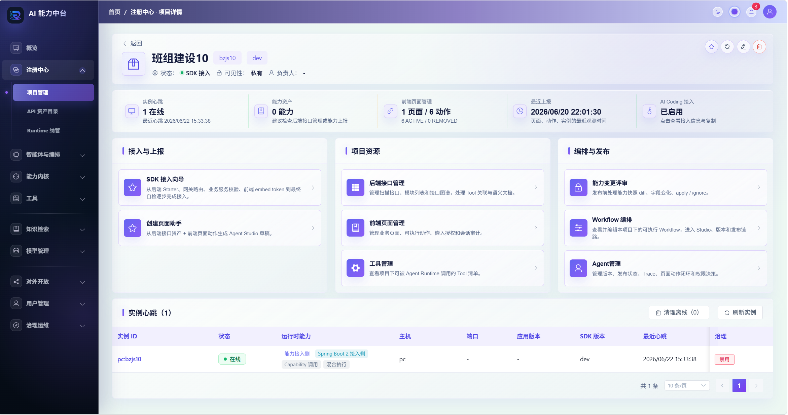
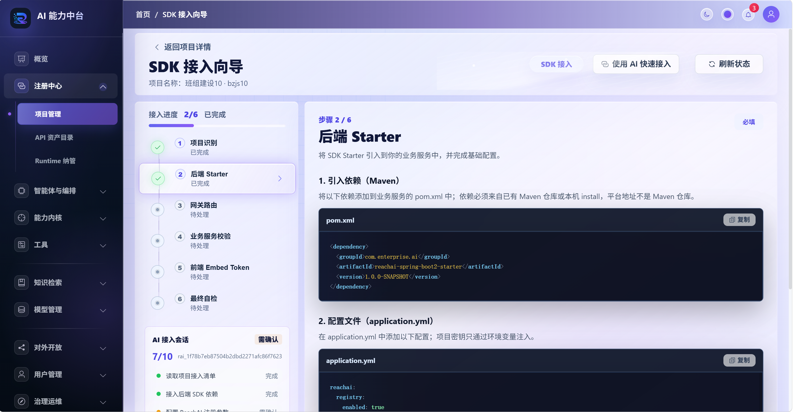
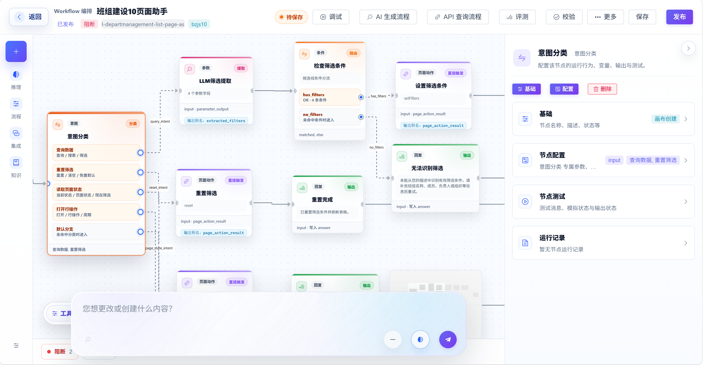
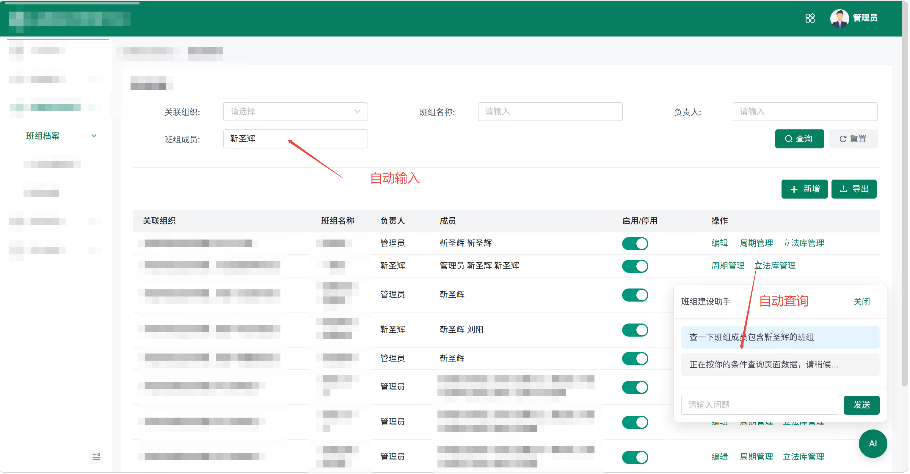
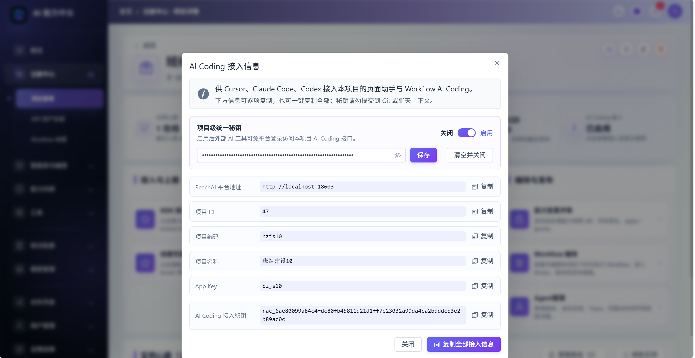
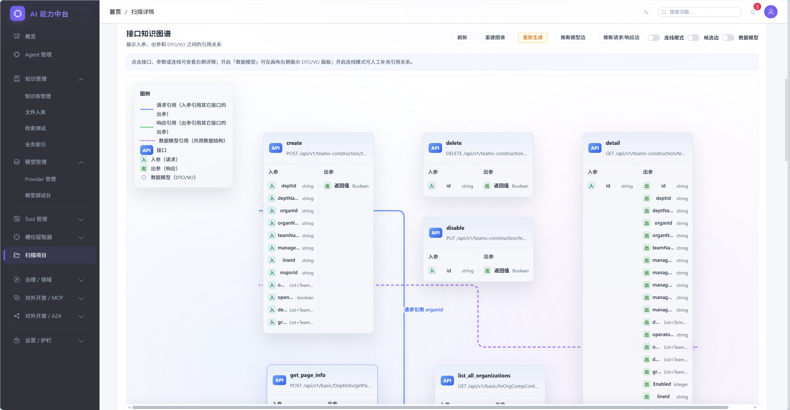
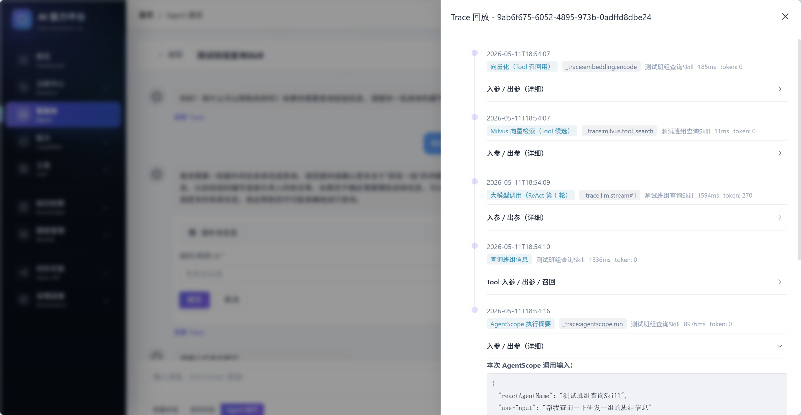
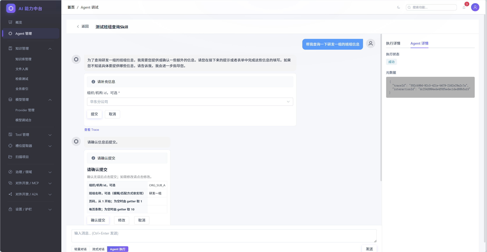
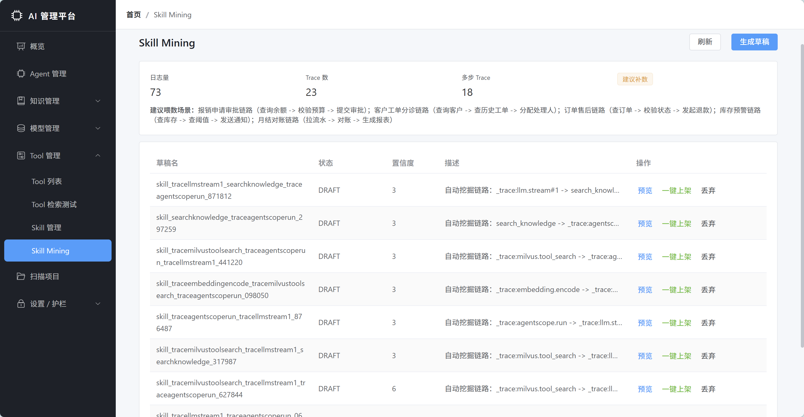
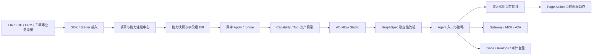

<p align="center">
  
</p>

<h1 align="center">睿池 ReachAI</h1>

<p align="center">
  <strong>让已有 Java 企业系统快速接入可控 AI</strong>
</p>

<p align="center">
  用 AI 辅助搭建确定性业务流程，用 Graph 层固化可执行语义，让智能体安全调用 OA、ERP、CRM、工单、合同、采购等系统中的真实业务能力。
</p>

<p align="center">
  <a href="https://openjdk.org/projects/jdk/17/"></a>
  <a href="https://spring.io/projects/spring-boot"></a>
  <a href="https://spring.io/projects/spring-ai"></a>
  <a href="https://vuejs.org/"></a>
  <a href="LICENSE"></a>
</p>

<p align="center">
  
</p>

## 产品截图

>

| SDK 快速接入 | Workflow Studio / GraphSpec |
| --- | --- |
|  |  |

| 嵌入到业务系统 | 使用 AI Coding 快速接入 |
| --- | --- |
|  |  |

| AI 生成 Workflow 草稿 | 接口图谱与业务能力 |
| --- | --- |
|  |  |

| RunOps 运行中心 | 执行链路追踪 |
| --- | --- |
|  |  |

| 交互式卡片 | 高频能力识别 |
| --- | --- |
|  |  |

## ReachAI 是什么

ReachAI 面向已有 Java 企业系统，帮助企业把存量接口、领域方法、页面动作、知识库和固定业务流程接入到 AI 智能体体系中。

它不是再搭一个孤立的 AI 应用，也不是只做聊天机器人或工作流画布。ReachAI 的核心思路是：

**AI 负责理解需求和辅助搭建，Graph 负责确定性执行，SDK 和临时 token 负责跨系统连接，智能体最终回到真实业务页面里完成工作。**

对于 OA、ERP、CRM、MES、合同、采购、工单、班组管理等系统，ReachAI 希望解决的是一个很现实的问题：

> 已有企业系统如何低改造接入 AI，同时不牺牲流程确定性、权限边界、审计追踪和跨系统协作？

## 为什么不是 AI 孤岛

很多 AI 应用搭建平台更适合从零构建一个独立 AI 应用。但企业现场的大量价值已经沉淀在现有系统中：接口、审批流、页面操作、业务权限、用户身份、运行日志和历史数据都在老系统里。

ReachAI 不要求企业把业务搬到另一个 AI 平台里，而是把 AI 接回企业系统：

- 后端通过 `reachai-spring-boot2-starter` 和 `reachai-capability-sdk` 注册已有业务能力。
- 平台形成项目、实例、能力快照、字段级 diff 和评审链路。
- Workflow Studio 用 `GraphSpec` 固化确定性业务流程。
- Agent 根据用户意图选择 Workflow、Capability、Tool、知识检索、MCP 调用或页面动作。
- Chat Embed SDK 和 Page Bridge 让智能体嵌入到 OA / ERP / CRM 等业务页面。
- 临时 token 机制打通平台身份、业务用户、Agent 授权和跨系统调用。
- Trace / RunOps / ACL / Guard 让每一次调用都可审计、可复盘、可治理。

## 和 Dify 这类 AI 应用编排平台的区别

Dify 这类平台很适合快速搭建独立 AI 应用、Prompt 编排和知识库问答。但在已有企业系统改造场景里，如果 AI 应用和业务系统之间只靠手写 HTTP 接口连接，就很容易变成新的孤岛：

- 业务接口需要在 AI 平台里手工配置和维护。
- 业务系统字段、参数、权限或流程变化后，Workflow 需要人工同步修改。
- 一旦变量很多，节点之间的参数传递、字段映射和错误排查会越来越痛苦。
- AI 应用知道自己的流程，却不天然知道企业系统里的项目、实例、能力版本、页面动作和业务用户身份。
- 调用链路分散在 AI 平台和业务系统两边，审计、复盘、权限解释和变更影响分析都更难闭环。

ReachAI 更关注“已有企业系统如何持续接入 AI”，所以它不是把业务系统当成外部黑盒接口，而是通过 SDK、Graph、临时 token 和治理链路把系统连接起来。

| 对比点 | 常见独立 AI 应用编排方式 | ReachAI 的方式 |
| --- | --- | --- |
| 业务能力接入 | 手写 HTTP Tool，靠人工维护接口参数 | SDK / Starter 主动注册能力、实例、快照和 SDK 图 |
| 业务变化同步 | 接口变了以后手动改 Workflow | 字段级 diff、评审 apply/ignore、稳定能力引用 |
| 流程语义 | 画布和变量配置容易绑定在应用内部 | `GraphSpec` 作为 Workflow 的可执行语义层 |
| 复杂变量传递 | 变量越多，节点映射越难维护 | Graph 节点、端口、引用、上下文和运行轨迹统一建模 |
| 业务身份 | AI 应用通常只知道自己的用户或 API Key | 临时 token 连接平台用户、业务用户、Agent、页面实例和 Origin |
| 网页内操作 | 通常需要业务系统额外写大量胶水代码 | Chat Embed + Page Bridge + Page Action 嵌入当前业务页面 |
| 运行治理 | 调用日志和业务审计容易割裂 | Trace / RunOps / ACL / Guard / Replay / Compare 统一复盘 |
| 外部 AI 修改流程 | 多数停留在平台内拖拽和配置 | Workflow AI Coding 接口支持 Cursor 等工具读取、patch、校验、运行 |

一句话说：**Dify 更像独立 AI 应用搭建器，ReachAI 更像已有企业系统的 AI 接入层、Graph 工程层和运行治理层。**

## 核心闭环



这条链路把企业 AI 落地拆成几件可控的事情：

1. 业务系统注册自己已有的接口、领域方法和运行实例。
2. 平台把这些能力沉淀为可评审、可治理、可复用的资产。
3. AI 辅助生成或修改 Workflow，但最终落到可执行的 `GraphSpec`。
4. Agent 作为统一入口，根据用户意图调用确定性流程和企业能力。
5. 网页智能体嵌入到业务页面内，通过临时 token 和 Page Action 安全操作当前页面。
6. RunOps、Trace、ACL、Guard 和审计日志负责生产治理。

## 亮点能力

### AI 生成流程，但 Graph 保证确定性

企业业务不能完全依赖大模型临场发挥。请假审批、费用报销、合同查询、工单流转、采购申请等流程需要可校验、可发布、可回滚和可审计。

ReachAI 支持用 AI 生成 Workflow 草稿，也支持用自然语言对局部节点和流程进行语义修改。但最终保存和执行的是平台统一的 `GraphSpec`，而不是一段不可控提示词。

`GraphSpec` 是 ReachAI 的运行语义层：

- 连接 Workflow Studio 画布、AI 生成、AI 局部修改和 SDK 图同步。
- 支撑发布校验、版本快照、Runtime 执行和 RunOps 复盘。
- 区分运行语义和画布布局，避免流程只停留在前端展示层。

### 工作流可以被外部 AI Coding 工具修改

ReachAI 的 Workflow 不只在控制台里拖拽。平台提供面向 AI Coding 的 Workflow 工程接口，外部工具可以读取 Workflow 上下文、提交 Graph patch、校验、运行并查看版本。

这意味着开发者可以在 Cursor 等外部编码工具中用自然语言修改业务流程：

- “在审批前增加合同金额校验。”
- “把查询客户信息节点改成调用 CRM 能力。”
- “在提交工单后增加通知节点。”
- “为页面助手增加一个设置筛选条件的 Page Action。”

外部 AI 可以参与修改，但平台仍然通过 `GraphSpec`、版本、校验、权限和 RunOps 保持可控。

### SDK 低改造接入已有系统

业务系统不需要为了接入 AI 重写一套服务。新系统和核心系统可以通过 ReachAI SDK 主动注册能力，存量系统也可以通过扫描和治理逐步接入。

```java
@ReachCapability(
    name = "submitLeaveRequest",
    title = "提交请假申请",
    description = "根据员工、时间和请假类型提交 OA 请假流程",
    domain = "oa",
    module = "leave",
    sideEffect = ReachSideEffectLevel.WRITE,
    requiredRoles = {"oa.leave.submit"}
)
public LeaveResult submitLeave(
    @ReachParam(name = "request", description = "请假申请信息", required = true)
    LeaveRequest request
) {
    return leaveService.submit(request);
}
```

Starter 会同步项目、实例、能力快照和 SDK 图。平台侧不会直接覆盖生产资产，而是形成字段级 diff、评审 apply/ignore、稳定引用和审计记录。

### 临时 token 打通平台和业务身份

企业智能体不能只知道“平台用户是谁”，还必须知道“业务系统当前登录用户是谁”。

ReachAI 的嵌入式对话链路使用短期 token：

- 前端 SDK 只持有短期 `embedToken`，不保存 `appSecret`。
- 业务后端使用应用凭证和当前登录用户向平台申请 token。
- 平台校验 App、Origin、Agent、用户状态、TTL、撤销记录和密钥。
- Tool 调用和 Page Action 可以携带业务用户上下文，方便业务系统二次鉴权。
- Trace / RunOps 可以按平台用户、业务用户、Agent、项目、会话和页面实例复盘。

### 网页智能体嵌入业务页面

ReachAI 支持把智能体嵌入到已有业务系统页面中，而不是把用户带到另一个平台。

业务页面可以通过 Chat Embed SDK 接入对话框，通过 Page Bridge 注册当前页面动作。智能体可以理解当前页面上下文，并在授权范围内调用已注册动作：

- 打开详情。
- 设置筛选条件。
- 回填表单。
- 提交审批。
- 创建工单。
- 展示结构化结果。

页面动作必须绑定当前 `sessionId + pageInstanceId`，执行结果会回传平台并写入审计。

### 开放协议连接更多工具和智能体

ReachAI 不只服务自己的管理端。平台可以通过 Gateway、MCP、A2A 等协议，把已治理的 Agent 和 Capability 暴露给 IDE、外部 Agent、自动化工具或其他业务系统。

这让 ReachAI 更像企业 AI 能力的控制面和运行治理层，而不是一个封闭工作流编辑器。

## 你可以用 ReachAI 做什么

| 场景 | ReachAI 提供的能力 |
| --- | --- |
| OA 快速接入 AI | 把请假、审批、通知、查询等能力注册为可治理 Capability，并用 Workflow 固化流程 |
| 企业固定流程自动化 | 用 AI 生成流程草稿，用 `GraphSpec` 发布可校验、可回放的确定性流程 |
| 智能体调用多个系统 | Agent 根据用户意图选择 Workflow、Tool、Capability、MCP 或 A2A 调用 |
| 网页智能体嵌入 | 在业务页面内接入 Chat Widget，通过 Page Bridge 调用当前页面动作 |
| 跨系统身份打通 | 用短期 token 连接平台用户、业务用户、Agent 授权和页面实例 |
| 运行治理与审计 | 通过 RunOps、Trace、ACL、Guard、Replay 和 Compare 复盘每一次执行 |
| 外部 AI Coding 修改流程 | 让 Cursor 等工具读取 Workflow 上下文、提交 Graph patch、校验并运行 |
| 能力资产治理 | 管理项目、实例、能力快照、字段级 diff、评审记录和稳定引用 |

## 当前功能模块

| 模块 | 说明 |
| --- | --- |
| `reachai-capability-sdk` | JDK8 兼容的业务能力声明 SDK 契约 |
| `reachai-spring-boot2-starter` | Spring Boot 2 业务系统接入 Starter，支持注册、心跳、能力同步和 SDK 图同步 |
| `reachai-control-service` | 当前 Platform Control / public API BFF 主入口，承接 `/api/**`、`/embed/**` 和 SDK 注册公开入口 |
| `reachai-runtime-service` | 当前 Runtime Host 部署单元，承接 Agent、Workflow、GraphSpec、Trace、RunOps、调试和运行时内部 API |
| `reachai-capability-service` | 当前 Capability Catalog 部署单元，承接 SDK 注册、项目实例、能力快照、diff/review/apply、扫描目录和能力资产 API |
| `reachai-knowledge-service` | 当前 Knowledge / Retrieval 部署单元，承接知识库、文件、chunk、RAG、业务索引、向量检索和历史扫描器实现 |
| `reachai-model-service` | 当前 Model Gateway 部署单元，承接模型实例、Chat、Embedding、Rerank 和 OpenAI 兼容代理 |
| `ai-runtime-contract` | 中台内部 Tool / Skill 运行时契约 |
| `ai-admin-front` | Vue 3 管理端，承载注册中心、Workflow Studio、RunOps、模型、知识、治理和开放协议页面 |
| `sql` | 统一 SQL 基线和升级脚本 |
| `docs` | 系统知识库、产品说明和截图资料 |

## 当前部署单元与目标逻辑域

当前后端重塑已进入物理服务拆分后的旧结构退场阶段。第一阶段保持同一个 MySQL 库，不拆库；公共入口由 `reachai-control-service` 保持 `/api/**`、`/embed/**` 和 SDK 注册入口兼容。默认 Maven reactor、本地启动和部署清单收敛到五个当前物理服务：

| 目标逻辑域 | 当前部署单元 | 说明 |
| --- | --- | --- |
| Model Gateway | `reachai-model-service` | 模型实例、供应商适配、Chat、Embedding、Rerank、OpenAI 兼容代理 |
| Knowledge / Retrieval | `reachai-knowledge-service` | 知识库、文件、chunk、RAG、向量检索、业务索引 |
| Capability Catalog | `reachai-capability-service` | SDK 注册、能力快照、字段级 diff、评审 apply/ignore、扫描目录、语义文档、Tool/Capability 资产 |
| Runtime Host | `reachai-runtime-service` | Agent 入口、Workflow、GraphSpec 执行、调试、人工交互、Runtime Adapter |
| Platform Control | `reachai-control-service` | 身份、RBAC、ACL、Guard、Gateway、MCP、A2A、市场、RunOps/Trace 管理面和 public API/BFF |

这次拆分不改变公开路由、SQL 表名、前端代理或页面结构。旧 `ai-agent-service` 已从仓库主路径删除，不再是平台主后端、Maven module、IDEA 后端项目、本地启动项或部署单元；剩余兼容路径必须显式迁入 owning service 本地实现，或正式删除。公共路由主路径、冻结兼容 alias 和 retired route 见 [Public Route Contracts](docs/architecture/public-route-contracts.md)；详细规则见 [Backend Boundaries And Naming](docs/architecture/backend-boundaries-and-naming.md)、[Physical Split Route Ownership](docs/architecture/physical-split-route-ownership.md) 和 [Legacy Retirement](docs/architecture/legacy-retirement.md)。

## 快速开始

### 1. 启动基础设施

```bash
docker compose -f deploy/docker-compose.infra.yml up -d
```

### 2. 初始化数据库

```bash
mysql -h localhost -u root -proot < sql/init.sql
```

### 3. 构建后端

```bash
mvn clean install -DskipTests
```

默认 Maven reactor 只包含当前主路径模块和五服务部署单元；旧 `ai-agent-service` module 已删除。

### 4. 启动服务

仓库已提供 IDEA 共享 Run Configurations：`00 ReachAI Five Services` 可一键启动五个服务，`01 ReachAI Model Service` 到 `05 ReachAI Control Service` 可按编号单独启动和调试。在 IDEA 重新加载 Maven 项目后即可使用；这些配置只指定 Spring Boot 主类和 Maven module，不写入任何本机密钥。

```bash
# Model Gateway，默认 18601
cd reachai-model-service
mvn spring-boot:run

# Knowledge / Retrieval，默认 18602，context-path /ai
cd ../reachai-knowledge-service
mvn spring-boot:run

# Capability Catalog，默认 18605
cd ../reachai-capability-service
mvn spring-boot:run

# Runtime Host，默认 18604
cd ../reachai-runtime-service
mvn spring-boot:run

# Platform Control / public API BFF，默认 18603
cd ../reachai-control-service
mvn spring-boot:run
```

本地推荐启动顺序：`reachai-model-service`（18601）→ `reachai-knowledge-service`（18602，`/ai`）→ `reachai-capability-service`（18605）→ `reachai-runtime-service`（18604）→ `reachai-control-service`（18603）。默认五服务拓扑不再包含 `ai-agent-service:18606`；剩余 public route 必须逐路由确认由 owning service 本地实现承接，或正式删除。

常用环境变量：

```powershell
$env:AI_MYSQL_URL="jdbc:mysql://localhost:3306/ai_text_service?useUnicode=true&characterEncoding=utf-8&serverTimezone=Asia/Shanghai"
$env:AI_MYSQL_USER="ai_text_service"
$env:AI_MYSQL_PASSWORD="2b4sSjymF7BcZZBA"
$env:REDIS_HOST="localhost"
$env:REDIS_PORT="6379"
$env:REDIS_PASSWORD=""
$env:MILVUS_HOST="localhost"
$env:MILVUS_PORT="19530"
$env:MODEL_SERVICE_URL="http://localhost:18601"
$env:KNOWLEDGE_SERVICE_URL="http://localhost:18602"
$env:CAPABILITY_SERVICE_URL="http://localhost:18605"
$env:RUNTIME_SERVICE_URL="http://localhost:18604"
```

五个服务都启动后，在仓库根目录执行一次启动链路自检：

```powershell
node scripts/check-physical-service-smoke.mjs --wait-ms 120000 --interval-ms 3000
```

### 5. 启动管理端

```bash
cd ai-admin-front
npm install
npm run dev
```

访问 [http://localhost:5200](http://localhost:5200)。

## 技术栈

| 层级 | 技术 |
| --- | --- |
| 后端 | Java 17、Spring Boot 3.4、Spring Cloud 2024、Spring Cloud Alibaba |
| AI | Spring AI 1.0、Spring AI Alibaba、AgentScope、LangGraph4j |
| 数据 | MySQL、Redis、Milvus |
| ORM | MyBatis-Plus |
| 文档与扫描 | JavaParser、Apache POI、PDFBox |
| 前端 | Vue 3、Vite、Element Plus、TypeScript、Pinia、Vue Flow、AntV G6 |
| 部署 | Docker、Kubernetes |

## 命名说明

- 产品语义中，可编排、可治理、可复用的业务单元统一称为 **Capability / 能力**。
- 历史代码、接口和数据表中仍可能出现 `skill`、`skills`、`skill_draft`、`skill_interaction` 等命名，它们属于 legacy storage/API naming。
- `GraphSpec` 是 Workflow 的运行语义，`canvas_json` 是画布布局，不应把画布 JSON 当作运行时语义来源。
- `eaf.*`、`X-EAF-*`、`Eaf*` 等历史技术标识仍可能作为兼容边界存在；产品品牌和新接入默认使用 ReachAI。

## 一句话总结

ReachAI 让企业已有系统快速拥有可控 AI：**AI 辅助搭建流程，Graph 固化确定性执行，SDK 接入真实业务能力，临时 token 打通跨系统身份，网页智能体回到 OA/ERP/CRM 页面里完成工作。**
