<p align="center">
  
</p>

<h1 align="center">快速、安全完成业务系统智能化改造：<br />让 AI 能查数据、填表单、办业务</h1>

<p align="center">
  <strong>适用于 OA、ERP、CRM、eHR、采购、工单、合同等已有业务系统。</strong>
</p>

<p align="center">
  <strong>ReachAI · 面向 Java 企业系统的企业智能体开发与运行底座</strong>
</p>

> **Codex for Open Source application verification:** I am the owner and core maintainer of this repository. The OpenAI/ChatGPT account used for the application is associated with the masked email address `jonellmednick****@outlook.jp`. This notice is published solely to help OpenAI reviewers verify that the applicant controls this repository.

## 改造完成后，业务系统能做什么

ReachAI 将 AI 助手嵌入 OA、eHR、采购、CRM 等现有业务页面。员工无需切换系统，即可通过自然语言查询数据、填写表单、办理业务：

| 业务系统 | AI 可执行的业务任务 |
| --- | --- |
| OA | “汇总我今天的待办，并打开最紧急的一项。” |
| eHR | “查询本月异常考勤，筛出还没有处理的记录。” |
| 采购 | “帮我创建办公用品采购申请，提交前给我确认。” |
| CRM | “根据本周客户动态生成跟进计划。” |

<p align="center">
  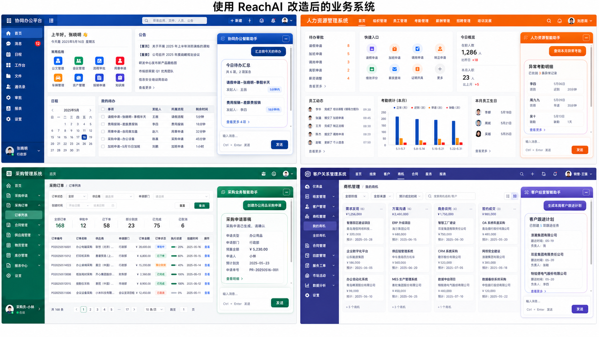
</p>

ReachAI 会结合当前登录身份、页面状态与业务上下文理解需求，仅调用已授予当前用户的业务能力。页面筛选、跳转与表单操作由已注册的页面动作执行；真实数据查询与写入仍由后端 Capability 或业务 API 完成。涉及写入、提交和审批等关键操作时，必须经用户确认后执行。

### 从一个界面掌握智能体运营状态

智能体运营中心按项目汇总 Agent、运行样本、可识别用户、Token、技术完成率、风险待办和业务系统贡献，让管理者先看到真实使用效果，再进入具体项目、版本或运行记录排查。

<p align="center">
  <a href="./docs/images/readme-v2/01-operations-dashboard.png">
    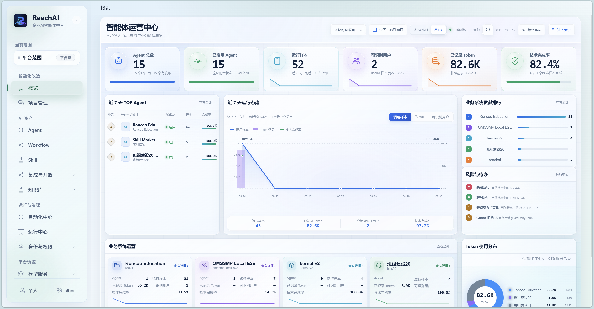
  </a>
</p>

## 从现有系统到上线使用

<p align="center">
  <strong>连接业务系统并接入智能运行底座 → 扫描页面、接口和能力 → 推荐改造项 → AI Coding 实施 → 发布与验收 → 原系统使用 AI</strong>
</p>

ReachAI 覆盖业务系统接入、系统盘点、改造实施、能力发布、业务验收和上线运行：

| AI主动完成          | ReachAI 做什么 | 交付结果 |
|-----------------| --- | --- |
| 1. 添加AI运行底座     | 识别项目技术栈，生成标准接入任务，由 AI Coding 集成后端连接、网关通信、页面助手、身份传递和安全校验组件 | 业务系统与 ReachAI 建立受控连接，获得能力注册、智能调度、页面交互与运行治理的统一支撑 |
| 2. 扫描业务系统       | 主动识别页面、路由、组件、接口和已有业务能力 | 形成系统能力地图，明确业务资源的位置、实现方式和调用关系 |
| 3. 推荐改造项        | 对选定页面进行只读分析，区分已确认事实、技术推断和待确认问题 | 自动推荐最多 3 个候选改造项，并提供代码证据、实现参考和验收标准 |
| 4. AI Coding 实施 | 将业务目标、代码上下文、技术约束和验收条件组织为标准化工程任务 | AI Coding 在真实代码仓库中完成接入、修改和测试，并回传实施证据 |
| 5. 组装并发布智能能力    | 同步 Capability，编排并发布 Workflow，挂载 Agent 和页面助手 | 形成可版本化、可授权、可复用、可追踪的企业智能能力 |
| 6. 真实业务验收       | 核验代码、服务、SDK 回调、浏览器会话、运行轨迹和业务结果 | 验收通过后，业务人员可在原业务系统中使用 AI |

业务系统继续沿用原有页面、身份、权限、接口和业务规则；ReachAI 在平台侧统一提供智能体调度、工作流执行、模型接入、操作确认和运行追踪。完成基础接入后，后续新增 AI 场景可以持续复用同一套智能运行底座。

<table>
  <tr>
    <td width="50%" align="center">
      <a href="./docs/images/readme-v2/02-project-management.png">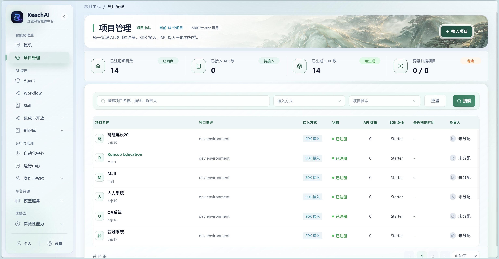</a><br />
      <strong>项目管理</strong><br /><sub>统一查看 SDK、API 和扫描接入状态</sub>
    </td>
    <td width="50%" align="center">
      <a href="./docs/images/readme-v2/03-project-overview.png">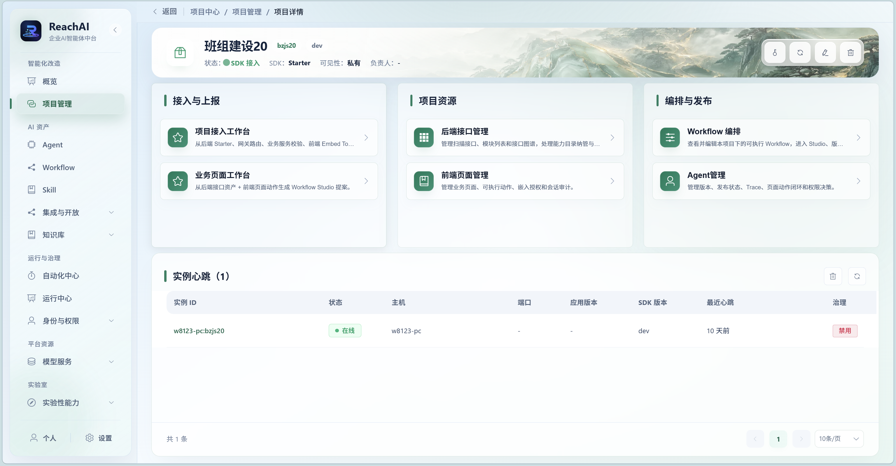</a><br />
      <strong>项目详情</strong><br /><sub>从接入上报到 Agent、Workflow 编排与发布</sub>
    </td>
  </tr>
</table>

### 三类角色，形成持续改造闭环

> AI 主动扫描与推荐 → 开发者确认并实施 → 用户在原系统使用 → 系统识别新的改造机会 → 管理者制定计划 → 进入下一轮改造

| 角色 | 在持续改造闭环中的作用 |
| --- | --- |
| 开发者 | AI 主动扫描系统的页面、接口和业务能力并推荐改造项；开发者确认后，平台生成标准工程任务，协同 AI Coding 完成接入、改造和测试 |
| 用户 | 无需改变原有使用习惯，在原业务系统中即可通过 AI 查询数据、填写表单和办理业务 |
| 管理者 | 系统持续分析真实使用中的高频问题、耗时环节和异常记录，主动推荐高价值改造点，为制定下一步改造计划提供依据 |

## ReachAI 与 Dify、OpenClaw 有什么不同

| 平台类型 | 主要解决什么 | ReachAI 的不同 |
| --- | --- | --- |
| Dify 等 AI 应用编排平台 | 创建和发布 AI 应用、Agent 与 Workflow | ReachAI 面向已有业务系统，覆盖系统扫描、改造推荐、AI Coding 实施、能力接入、真实业务验收和上线治理 |
| OpenClaw 等个人智能体 | 从聊天入口连接工具和服务，帮助个人跨应用完成任务 | ReachAI 面向企业多用户、多系统和生产业务，让 AI 在原业务系统中受控调用已授权能力，关键操作需确认，全程可追踪 |

**一句话：Dify 侧重创建 AI 应用，OpenClaw 侧重个人智能体的跨应用执行，ReachAI 侧重已有业务系统的快速、安全智能化改造与生产级治理。**

## 技术优势：ReachAI 解决的七个关键问题

### 1. 对存量系统做有证据的智能化盘点

许多存量企业系统缺少完整接口文档，页面、路由、组件、后端接口和权限逻辑分散在代码中。ReachAI 将系统资产识别与改造分析拆分为两个可验证阶段：

- 页面地图首先识别页面、路由、组件和 API 依赖，扫描阶段不依据名称推断业务价值。
- 开发者选定页面后再进行只读分析，推荐最有价值的改造候选项。
- 每个候选项分别记录 `confirmedFact`、`technicalInference`、`openQuestion`、`codeReferences`、`implementationReference` 和 `acceptanceCriteria`。

最终输出可由开发者复核并直接进入实施的改造清单，而不是缺少代码依据的概念性建议。


### 2. 将改造需求转化为可验收的 AI Coding 工程任务

ReachAI 将任务范围、仓库上下文、修改约束、结构化输出和验收条件封装为标准化工程任务，交付给 Codex、Trae、Cursor 或 Claude Code 执行。AI Coding 工具持续回传进度、问题和交付证据；只有代码、服务与真实业务验收全部通过，任务才会闭环。

平台持续核验：

- 客户端是否连接、任务处于什么状态；
- 代码是否接入、服务是否运行、SDK 回调是否闭环；
- Embed 对话、页面动作和真实业务结果是否通过验收；
- 本次验收对应的会话、Trace、Workflow 与发布版本是否一致。

<table>
  <tr>
    <td width="50%" align="center">
      <a href="./docs/images/readme-v2/04-page-access-center.png">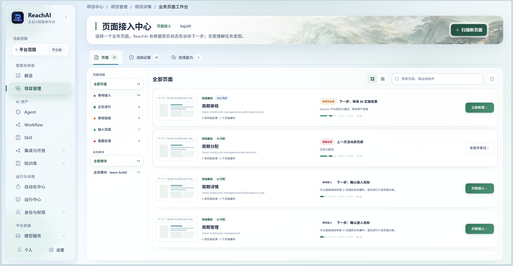</a><br />
      <strong>页面接入中心</strong><br /><sub>按真实状态推进页面扫描、实施与验收</sub>
    </td>
    <td width="50%" align="center">
      <a href="./docs/images/readme-v2/06-ai-coding-acceptance.png">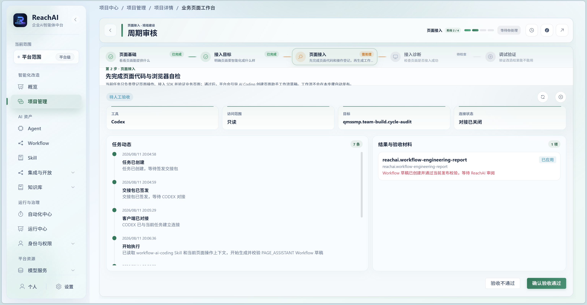</a><br />
      <strong>AI Coding 实施与验收</strong><br /><sub>保留任务进度、交付材料和人工验收结论</sub>
    </td>
  </tr>
</table>

### 3. 将 Java 接口和业务方法沉淀为可治理的 Capability

对于可修改的 Java 系统，JDK 8 兼容的 SDK 与 Spring Boot 2 Starter 可以主动注册项目、实例和业务能力；对于暂不具备代码改造条件的历史系统，可通过扫描方式完成补充盘点。

```java
import com.enterprise.ai.reach.sdk.annotation.ReachCapability;
import com.enterprise.ai.reach.sdk.annotation.ReachParam;
import com.enterprise.ai.reach.sdk.annotation.ReachSideEffectLevel;

import java.util.List;

@ReachCapability(
    name = "purchase.createApplication",
    title = "创建采购申请",
    description = "创建采购申请草稿，提交前需要用户确认",
    domain = "purchase",
    module = "application",
    sideEffect = ReachSideEffectLevel.WRITE,
    requiredRoles = {"PURCHASE_APPLICANT"}
)
public PurchaseApplication create(
        @ReachParam(name = "reason", description = "采购事由", required = true)
        String reason,
        @ReachParam(name = "items", description = "采购明细", required = true)
        List<PurchaseItem> items) {
    // 继续复用原业务系统的领域服务、权限和事务
}
```

Starter 自动扫描 `@ReachCapability` 业务方法和 Spring MVC 接口，完成实例心跳与签名上报。平台保存能力快照，计算字段级 diff，再由开发者执行 apply / ignore，最终沉淀为 Capability Catalog。


### 4. 智能体应对新需求，Workflow 稳定执行成熟业务

固定 Workflow 稳定，却难以覆盖不断出现的新需求；全部依赖 AI 动态规划虽然灵活，但成本、速度和结果一致性难以控制。

**ReachAI 让智能体负责理解需求、规划任务和选择路径，让 Workflow 按已验证、已授权的步骤稳定执行。**

- **未知需求灵活处理**：智能体理解意图，并选择合适的执行路径。
- **已有业务稳定复用**：高频任务直接运行已发布 Workflow，执行更快、结果更稳定、全程可追溯。
- **成功经验持续沉淀**：新路径留下 Trace；高频稳定模式可生成 Workflow 草稿，经人工审核后发布。

<details>
<summary><strong>查看运行机制与代码依据</strong></summary>

```text
Agent → 已发布配置版本 → AgentScope Supervisor
      → 选择 0 / 1 / 多个已授权 Workflow-as-Tool
      → Runtime 执行版本固定的 GraphSpec
      → 汇总结果并记录 Trace
```

- AgentScope Supervisor 负责意图理解、任务规划、Workflow 选择和有限重规划。
- Workflow 的 `GraphSpec` 保存可执行语义；`canvas_json` 只保存画布布局。
- Workflow Studio、AI 编排与发布校验共用 Runtime 节点能力注册表，并在发布前检查执行器支持，避免“画布能画、运行时不能跑”。
- Agent 只能选择白名单中的 Workflow-as-Tool，Runtime 始终执行对应的已发布版本。

</details>


<table>
  <tr>
    <td width="50%" align="center">
      <a href="./docs/images/readme-v2/07-agent-overview.png">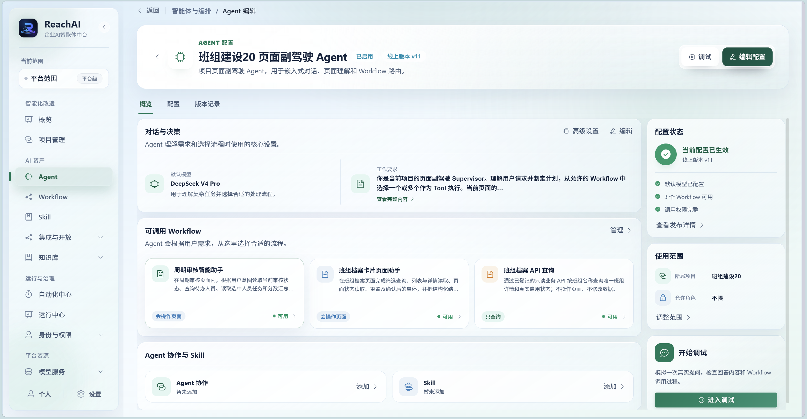</a><br />
      <strong>Agent 配置</strong><br /><sub>固定配置版本、使用范围和可调用 Workflow</sub>
    </td>
    <td width="50%" align="center">
      <a href="./docs/images/readme-v2/08-workflow-studio.png">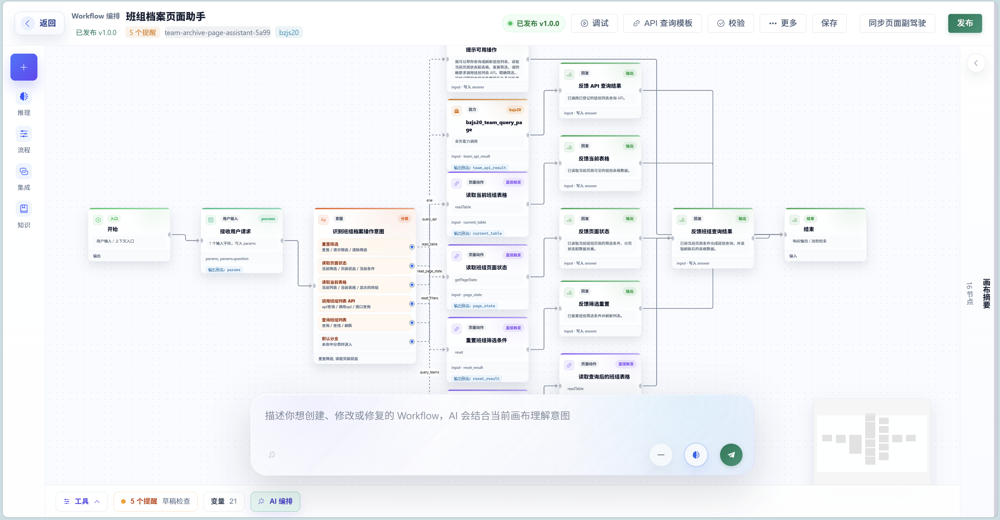</a><br />
      <strong>Workflow Studio</strong><br /><sub>AI 辅助编排、校验、调试和发布 GraphSpec</sub>
    </td>
  </tr>
</table>

### 5. 通过显式协议接入业务页面，不依赖截图识别和鼠标模拟

ReachAI Embed 将对话入口嵌入原业务系统，Page Bridge 则将当前页面允许执行的筛选、跳转、读取和表单操作显式注册为 AI 可用动作。跨页面操作采用可观测的导航与目标页面就绪协议；修改真实业务数据时，仍调用后端 Capability 或业务 API。

因此，页面自动化依赖已登记的动作契约、页面上下文和后端能力，而非通过 Computer Use 推断坐标并模拟鼠标键盘。

代码与说明：[eafPageBridge.ts](ai-admin-front/src/sdk/eafPageBridge.ts) · [嵌入式对话与页面动作](docs/reference/嵌入式对话与页面动作.md)

<p align="center">
  <a href="./docs/images/readme-v2/05-page-actions.png">
    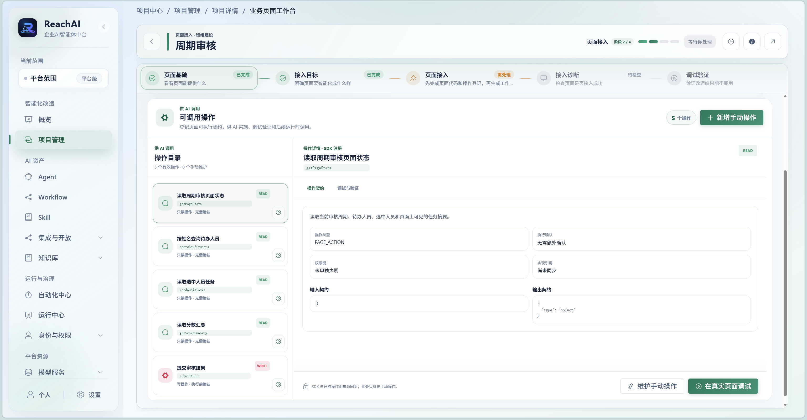
  </a><br />
  <strong>页面可调用操作</strong> · 显式登记读取、筛选与写入动作，并在真实页面中调试
</p>

### 6. 在调用真实业务能力前后建立治理证据链

**让 AI 以当前业务用户的身份工作。** 业务后端为当前登录用户签发短期 Token，前端不保存 App Secret。ReachAI 将用户、Agent、项目和页面绑定到同一会话，调用真实业务能力时携带业务身份，并由原系统完成最终鉴权。

ReachAI 在模型与企业系统之间执行明确的运行策略：

- 继承企业用户、租户、项目、角色和权限上下文；
- 先按 Capability 白名单、Tool ACL、风险级别和页面意图过滤可用工具；
- `READ` 可自动执行，`PAGE_ACTION` 需要明确页面意图，`WRITE` 需要一次确认，`IRREVERSIBLE` 默认拒绝；
- 后端业务系统保留最终鉴权与业务校验；
- 理解、规划、Workflow、节点、工具调用、Guard 决策、耗时和异常进入 Trace / RunOps，可回放并关联发布版本。

### 7. 让上线后的智能体持续运行、测评和改进

ReachAI 不把“发布成功”当作结束。运营概览负责汇总价值和风险，自动化中心负责按时间运行指定 Agent 或 Workflow，EvalOps 使用版本化数据集、目标快照和评测器比较发布候选，RunOps 则保留每次理解、规划、调用、重规划和异常的完整证据。

- 自动化任务固定执行目标、发布版本、身份和输入快照，并关联运行记录；执行引擎可按环境显式启用。
- EvalOps 支持数据集版本、基线与候选实验、逐项评分、发布门禁和 Trace 回查。
- RunOps 聚合失败类型、发布版本表现、耗时、Token 与治理决策，支持从统计下钻到单次运行。

<table>
  <tr>
    <td width="50%" align="center">
      <a href="./docs/images/readme-v2/14-automation-center.png">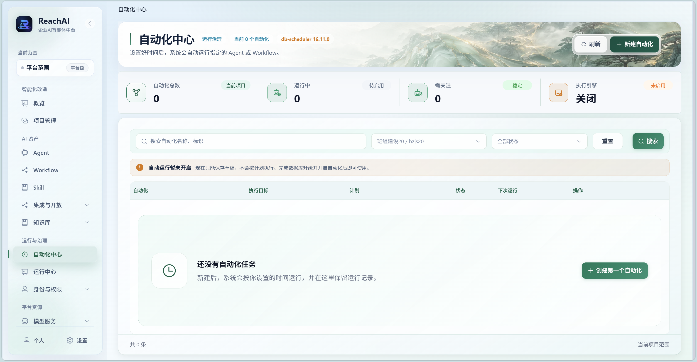</a><br />
      <strong>自动化中心</strong><br /><sub>按计划运行 Agent 或 Workflow；截图环境的执行引擎尚未启用</sub>
    </td>
    <td width="50%" align="center">
      <a href="./docs/images/readme-v2/15-runops-center.png">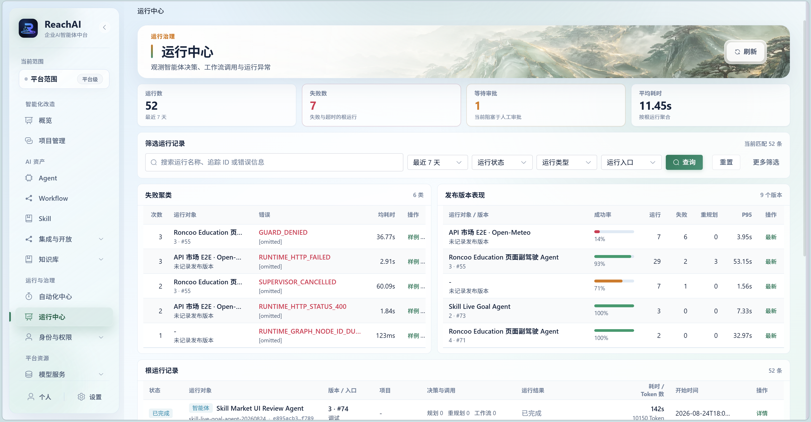</a><br />
      <strong>RunOps 运行中心</strong><br /><sub>查看失败聚类、版本表现与根运行记录</sub>
    </td>
  </tr>
</table>

## ReachAI 平台能力全景

| 能力域 | 作用 |
| --- | --- |
| 项目与页面工程 | 注册业务系统，扫描页面和接口，管理改造清单、AI Coding 任务和真实验收 |
| Capability Catalog | 管理 SDK 注册、历史扫描、能力快照、diff、评审、授权和语义文档 |
| Workflow Studio | AI 生成或可视化编排 GraphSpec，完成校验、调试、版本发布和回放 |
| Agent Runtime | 管理 Agent 身份与配置版本，由 Supervisor 调度白名单中的 Workflow-as-Tool |
| Agent Skill | 管理标准 Skill 包、版本、评审、发布、撤销和 Agent 绑定，不与 Capability 业务资产混用 |
| Page Embed / Bridge | 在原业务页面建立对话、页面上下文和显式动作通道 |
| Automation / EvalOps | 调度 Agent 或 Workflow，并通过版本化数据集、对比实验、发布门禁和 Trace 形成质量闭环 |
| RunOps / Governance | 汇总运行、失败、版本表现与治理决策，提供身份、ACL、Guard、审计、回放和诊断 |
| Integration / Open | 通过 API 市场、MCP Hub 和 A2A 互联中心发现、发布并治理外部能力与远程 Agent |
| Model / Knowledge | 统一管理 Chat、Embedding、Rerank、模型目录、知识库、文件、RAG 和业务索引 |

**开放协议连接外部工具与智能体。** ReachAI 通过 Gateway、MCP 和 A2A，将经过登记和授权的 Tool、Capability 与 Agent 提供给 IDE、自动化工具、其他业务系统和远程智能体调用。外部调用仍遵守能力可见范围、客户端白名单、身份权限和审计规则，不会绕开平台治理。

因此，ReachAI 不只是 Workflow 编辑器，更是企业 AI 能力的开放控制面与运行治理层。

三个核心对象具有明确边界：**Capability 是企业业务资产，Tool 是模型调用协议，Workflow 是 GraphSpec 编排。** ReachAI 对三者进行独立建模与治理，不将其合并为单一“插件”抽象。

### AI 资产与开放生态

<table>
  <tr>
    <td width="50%" align="center">
      <a href="./docs/images/readme-v2/09-skill-management.png">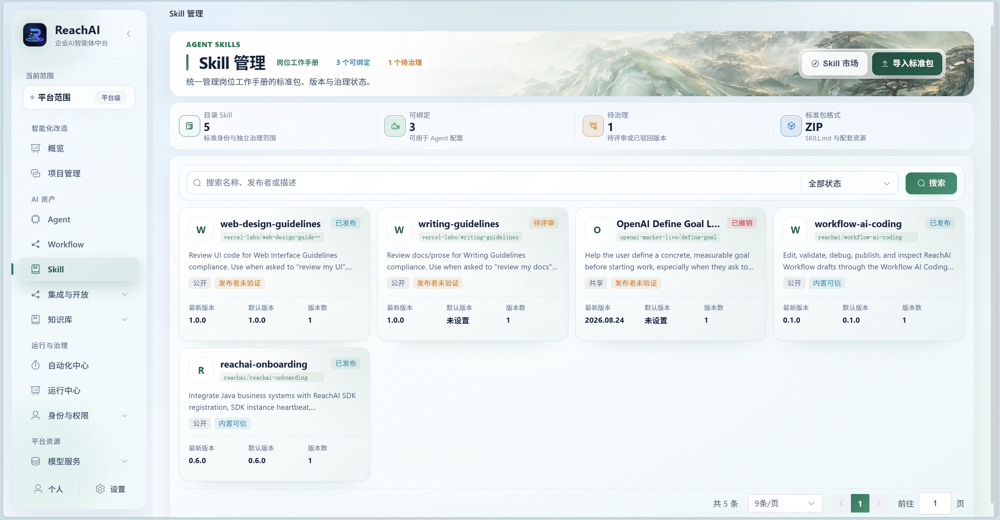</a><br />
      <strong>Skill 管理</strong><br /><sub>标准包、版本、评审与治理状态</sub>
    </td>
    <td width="50%" align="center">
      <a href="./docs/images/readme-v2/10-api-market.png">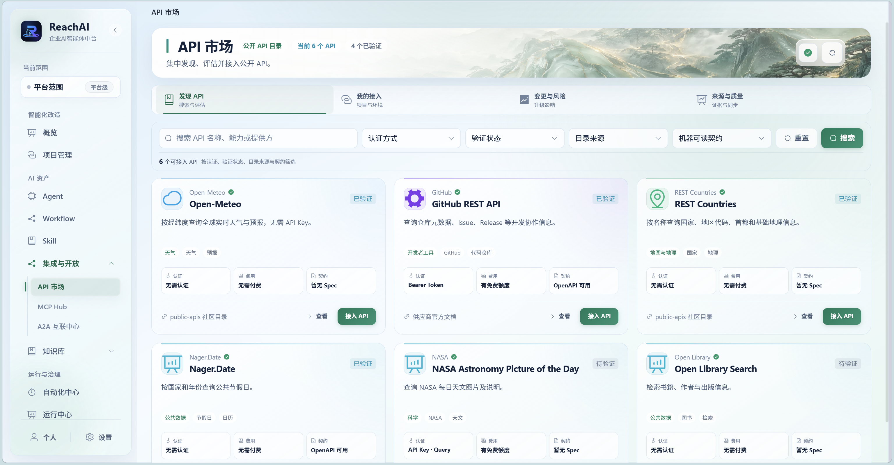</a><br />
      <strong>API 市场</strong><br /><sub>发现、评估、验证并接入公开 API</sub>
    </td>
  </tr>
  <tr>
    <td width="50%" align="center">
      <a href="./docs/images/readme-v2/11-mcp-hub.png">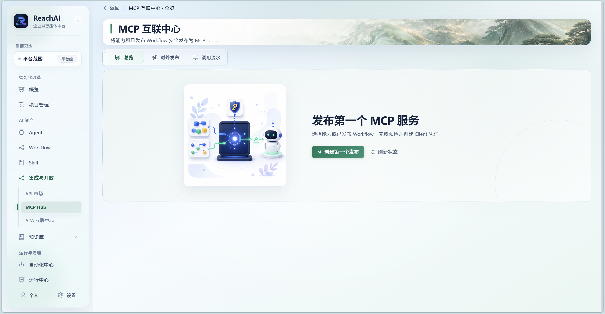</a><br />
      <strong>MCP Hub</strong><br /><sub>将 Capability 或已发布 Workflow 安全发布为 MCP Tool</sub>
    </td>
    <td width="50%" align="center">
      <a href="./docs/images/readme-v2/12-a2a-hub.png">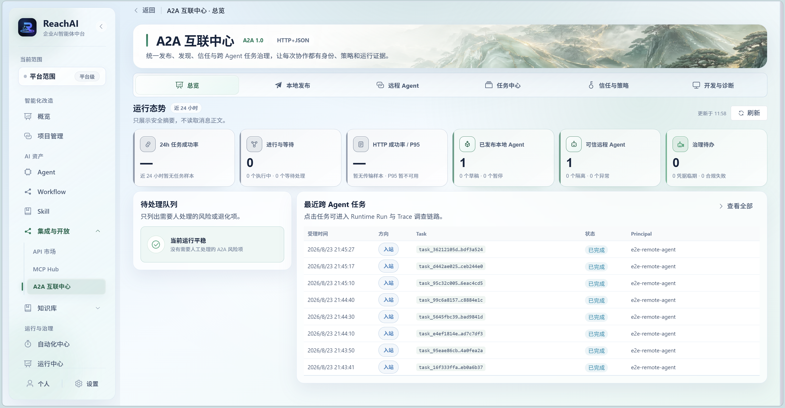</a><br />
      <strong>A2A 互联中心</strong><br /><sub>统一管理本地发布、远程 Agent、任务、信任和诊断</sub>
    </td>
  </tr>
</table>

### 知识与模型资源

<table>
  <tr>
    <td width="50%" align="center">
      <a href="./docs/images/readme-v2/13-knowledge-base.png">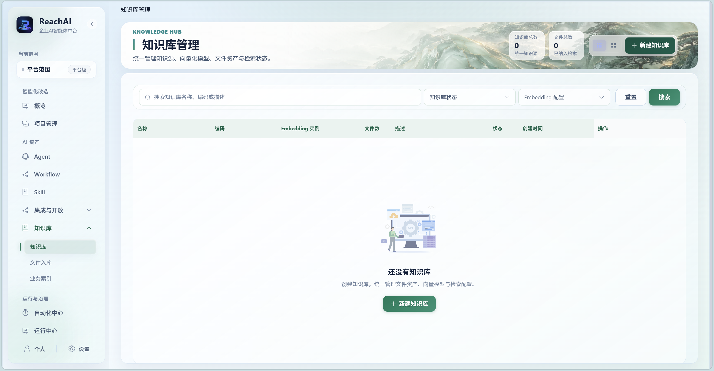</a><br />
      <strong>知识库</strong><br /><sub>统一管理知识源、文件、向量模型和检索状态</sub>
    </td>
    <td width="50%" align="center">
      <a href="./docs/images/readme-v2/16-model-center.png">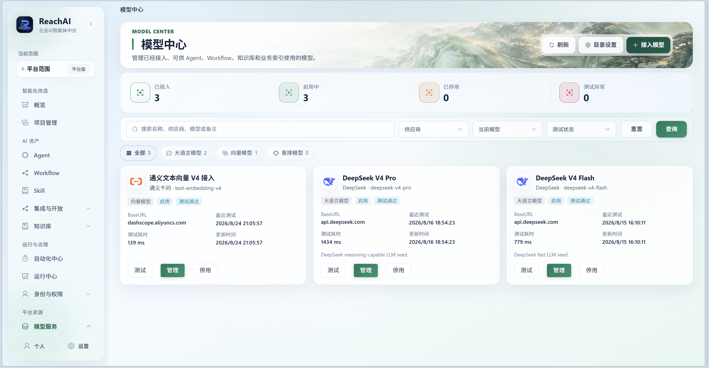</a><br />
      <strong>模型中心</strong><br /><sub>管理大语言模型、向量模型、测试状态与目录同步</sub>
    </td>
  </tr>
</table>

## 技术架构

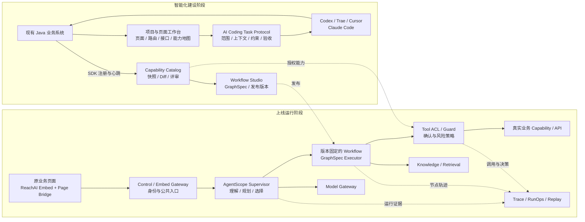
```mermaid
flowchart LR
    subgraph BUILD[智能化建设阶段]
        SYS[现有 Java 业务系统]
        MAP[项目与页面工作台<br/>页面 / 路由 / 接口 / 能力地图]
        TASK[AI Coding Task Protocol<br/>范围 / 上下文 / 约束 / 验收]
        CODER[Codex / Trae / Cursor<br/>Claude Code]
        CATALOG[Capability Catalog<br/>快照 / Diff / 评审]
        STUDIO[Workflow Studio<br/>GraphSpec / 发布版本]

        SYS --> MAP --> TASK --> CODER --> SYS
        SYS -- SDK 注册与心跳 --> CATALOG --> STUDIO
    end

    subgraph RUN[上线运行阶段]
        PAGE[原业务页面<br/>ReachAI Embed + Page Bridge]
        CONTROL[Control / Embed Gateway<br/>身份与公共入口]
        SUPERVISOR[AgentScope Supervisor<br/>理解 / 规划 / 选择]
        WORKFLOW[版本固定的 Workflow<br/>GraphSpec Executor]
        POLICY[Tool ACL / Guard<br/>确认与风险策略]
        BIZ[真实业务 Capability / API]
        MODEL[Model Gateway]
        KNOWLEDGE[Knowledge / Retrieval]
        OPS[Trace / RunOps / Replay]

        PAGE --> CONTROL --> SUPERVISOR --> WORKFLOW --> POLICY --> BIZ
        SUPERVISOR --> MODEL
        WORKFLOW --> KNOWLEDGE
        SUPERVISOR -. 运行证据 .-> OPS
        WORKFLOW -. 节点轨迹 .-> OPS
        POLICY -. 调用与决策 .-> OPS
    end

    STUDIO -. 发布 .-> WORKFLOW
    CATALOG -. 授权能力 .-> POLICY
```

### 当前五服务拓扑

| 服务 | 默认端口 | 当前职责 |
| --- | ---: | --- |
| `reachai-model-service` | 18601 | Model Gateway：Chat、Embedding、Rerank 和模型实例管理 |
| `reachai-knowledge-service` | 18602 | Knowledge / Retrieval：知识库、文件、Chunk、RAG、向量检索和业务索引；context path 为 `/ai` |
| `reachai-control-service` | 18603 | Public API / BFF：项目与页面工程、身份、公共 `/api/**`、`/embed/**` 和 SDK 兼容入口 |
| `reachai-runtime-service` | 18604 | Runtime Host：Agent、Workflow、GraphSpec 执行、Trace、RunOps 和调试 |
| `reachai-capability-service` | 18605 | Capability Catalog：SDK 注册、快照、diff、评审、扫描目录和能力资产 |

第一阶段五个服务共用一个 MySQL 实例，但每张表有唯一 owning service；跨服务协作通过 internal API 或显式 client 完成。边界以 [服务表所有权](docs/architecture/service-table-ownership.md) 为准。

### 主要技术栈

| 层次 | 技术 |
| --- | --- |
| 平台后端 | Java 17、Spring Boot 3.4.5、Spring AI 1.0.0、Spring AI Alibaba 1.0.0.2 |
| 智能体与工作流 | AgentScope 2.0.0、LangGraph4j 1.8.16、GraphSpec |
| 业务系统接入 | JDK 8 兼容 Capability SDK / Spring Boot 2 Starter、Embed Chat SDK、Page Bridge |
| 管理端 | Vue 3.5、TypeScript、Element Plus、Pinia、Vue Flow、Vite 6 |
| 基础设施 | MySQL 8、Redis 7、Milvus 2.4；Docling 可选 |

<details>
<summary><strong>当前实现边界</strong></summary>

- 项目处于快速迭代阶段；README 描述的是当前主路径，不代表所有能力都已经达到生产完备状态。
- 新建或可修改的 Java 系统优先使用 SDK 主动注册；历史扫描用于存量系统盘点和补充接入。
- Workflow 节点按 Runtime 能力注册表分级开放，部分节点仍处于 BETA；发布校验结果优先于画布显示。
- Tool ACL、Guard、人工确认、开放协议和治理面仍在持续产品化；真实业务系统保留最终鉴权与事务边界。
- 当前五服务共用一个 MySQL 库，但代码、表所有权和 internal API 必须遵守服务边界。

最新事实请以 [项目文档入口](docs/README.md)、当前代码和 [SQL 基线](sql/initV2.sql) 为准。

</details>

## 快速开始

### 环境要求

- JDK 17 和 Maven
- Node.js 与 npm
- Docker Compose

### 1. 启动基础设施并初始化数据库

先复制凭据模板并填写本机随机值；`deploy/.env` 已被 Git 忽略，不得提交。PowerShell 可将 `cp` 换成 `Copy-Item`。

```bash
cp deploy/.env.example deploy/.env
docker compose --env-file deploy/.env -f deploy/docker-compose.infra.yml up -d
mysql --default-character-set=utf8mb4 -h localhost -u root -p -e "source sql/initV2.sql"
```

### 2. 构建后端

```bash
mvn clean install -DskipTests
```

### 3. 启动五个服务

仓库提供 `.run/00-reachai-five-services.run.xml`，可在 IntelliJ IDEA 中一键启动。默认本地模式会为五服务注入公开的开发专用加密/签名值，体验用户无需配置 `MODEL_CREDENTIAL_SECRET`、`AGENT_WORKFLOW_CREDENTIAL_SECRET`、`EAF_EMBED_TOKEN_SECRET`、`REACHAI_AI_CODING_TASK_SECRET_PEPPER` 或内部调用密钥；显式环境变量始终优先。`prod` / `production` profile、Kubernetes 环境以及 `REACHAI_LOCAL_DEVELOPMENT_DEFAULTS_ENABLED=false` 都不会注入这些开发值，正式部署仍必须从 Secret 注入独立密钥。也可以按以下顺序分别执行 `mvn spring-boot:run`：

```text
reachai-model-service      18601
reachai-knowledge-service  18602  /ai
reachai-capability-service 18605
reachai-runtime-service    18604
reachai-control-service    18603
```

### 4. 启动管理端

```bash
cd ai-admin-front
npm ci
npm run dev
```

本地开源模式默认提供 `admin / admin123` 并在登录页预填，方便首次体验。该账号只用于本地开发；生产环境必须设置 `REACHAI_LOCAL_AUTH_ENABLED=false` 和 `REACHAI_BOOTSTRAP_ADMIN_ENABLED=false`，并接入正式身份体系。

更完整的启动、环境变量和服务检查说明见 [五服务边界与本地启动](docs/architecture/service-boundaries.md)。

## 给 AI 编程工具的入口

Codex、Trae、Cursor、Claude Code 等工具进入仓库后，请按以下顺序读取事实源：

1. [AGENTS.md](AGENTS.md)：项目规则、模块边界、SQL 和验证要求。
2. [docs/README.md](docs/README.md)：当前五服务拓扑与权威文档导航。
3. [PROJECT-MEMORY.md](docs/ai-memory/PROJECT-MEMORY.md)：产品定位、模块地图与当前事实。
4. [WORKING-RULES.md](docs/ai-memory/WORKING-RULES.md)：开发、SQL、验证和协作规则。
5. 与任务直接相关的真实代码、接口、SQL 和测试。

接入业务系统时，从 [SDK 与 Embed Chat 快速参考](docs/reference/SDK接入与EmbedChat快速参考.md) 开始；开发 Workflow 时，从 [Workflow AI Coding](docs/reference/Workflow-AI-Coding.md) 开始。不要根据旧截图、旧服务名或历史文档猜测当前实现。

## 继续阅读

| 文档 | 说明 |
| --- | --- |
| [平台定位与架构总览](docs/01-平台定位与架构总览.md) | 产品定位、核心主线和平台页面 |
| [项目注册与能力资产](docs/02-项目注册与能力资产.md) | SDK、扫描、Capability 快照、diff 与评审 |
| [Workflow Studio 与 Runtime](docs/03-Workflow-Studio与Runtime.md) | Agent、Supervisor、GraphSpec、Page Bridge 和发布运行 |
| [运行治理与开放协议](docs/04-运行治理与开放协议.md) | Trace、RunOps、ACL、Guard、MCP、A2A 与 Gateway |
| [知识、模型与企业资产](docs/05-知识模型与企业资产.md) | Model Gateway、Knowledge / Retrieval 和企业资产 |

## License

[MIT License](LICENSE)

<p align="center">
  
</p>
