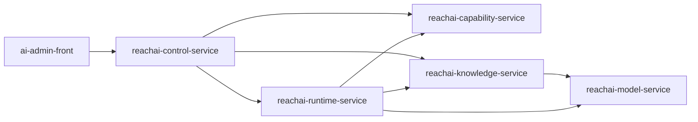

# 知识、模型与企业资产

## 定位

ReachAI 的知识与资产体系分为两条主线：

- Knowledge / Retrieval：知识库、文件、Chunk、向量检索、RAG、业务索引和检索评测。
- Capability Catalog：业务能力、Tool、项目 API 管理、能力快照、字段级 diff、评审和发布治理。

两者协作但不混同。知识检索由 `reachai-knowledge-service` 承接；能力资产由 `reachai-capability-service` 承接；公共管理入口由 `reachai-control-service` 暴露。

## 五服务关系

| 服务 | 与知识和资产的关系 |
| --- | --- |
| `reachai-control-service` | 提供管理端 `/api/**` BFF 和公开入口，聚合 Runtime、Capability、Knowledge、Model 的状态和公共操作。 |
| `reachai-runtime-service` | 在 Agent / Workflow 执行时消费 Capability 和 Knowledge，生成 Trace、RunOps 和调试数据。 |
| `reachai-capability-service` | 管理能力资产、SDK 注册、项目 API 管理、扫描项目目录、能力快照和变更评审。 |
| `reachai-knowledge-service` | 管理知识库、文件、Chunk、RAG、向量检索、业务索引和扫描器实现。 |
| `reachai-model-service` | 提供 Chat、Embedding、Rerank 和模型实例能力，供 Knowledge 和 Runtime 调用。 |

第一阶段保持同一个 MySQL 库，不拆库，但新增实现必须尊重 owning service 边界。

## 知识模型

核心实体包括：

| 实体 | 说明 |
| --- | --- |
| `knowledge_base` | 知识库定义、可见性、Chunk 策略和业务配置。 |
| `knowledge_file_info` | 文件元数据、解析状态、入库状态和归属知识库。 |
| `knowledge_chunk` | 文本 Chunk、向量写入状态、来源文件和检索元数据。 |
| `knowledge_business_index` | 面向业务对象的语义索引定义。 |
| `knowledge_business_index_record` | 业务对象记录及其可检索内容。 |
| `knowledge_user_file_permission` | 文件级权限过滤的基础数据。 |

这些表当前仍位于统一 SQL 基线中，入口是 `sql/initV2.sql`。

## 能力资产模型

Capability Catalog 关注可执行或可治理的企业能力。典型资产包括：

- SDK 主动注册的项目、实例、能力和参数。
- 扫描项目产生的接口目录、Tool 定义和调用图谱。
- 能力快照、字段级 diff、评审记录、apply/ignore 结果。
- Runtime 可调用的 Tool / Capability 元数据和治理策略。

历史扫描器实现仍由 Knowledge / Retrieval 服务提供底层 OpenAPI 和 Controller 解析能力，但扫描项目目录、资产沉淀和能力治理归 `reachai-capability-service`。

## 模型中心

`reachai-model-service` 只维护两类持久对象：

- `model_template`：Provider/协议模板和参数 Schema，不保存用户密钥。
- `model_instance`：稳定 `modelInstanceId`、连接配置、加密凭据引用、测试与归档状态。

公共路径为 `/model/templates`、`/model/instances`、`/model/chat`、`/model/chat/stream/events`、`/model/embedding` 和 `/model/rerank`。已退役的 `/model/openai-proxy` 不再是接入方式。Knowledge 和 Runtime 通过明确的 Model client 使用实例，不自行保存第二套 Provider 密钥。

## 数据事实与检索投影

- Knowledge 文本、向量和 Business Index 都是检索资产，不自动成为授权事实。
- 个人长期记忆的 canonical owner 在 Control，`knowledge_personal_memory_index` 只是可重建投影；命中后仍需回读 canonical item。
- 订单、客户等业务对象以原业务系统为事实源。Business Index 命中只提供带版本引用，Runtime 必须在当前可信业务身份下调用 resolver 重新鉴权和回读。
- `KNOWLEDGE_RETRIEVAL` 的 `NO_EVIDENCE` 是成功业务分支；`evidencePolicy=REQUIRED` 时必须直接给出无证据回答，不能继续让 LLM 凭空补全。

## 调用关系

```mermaid
flowchart LR
  Frontend["ai-admin-front"] --> Control["reachai-control-service"]
  Control --> Capability["reachai-capability-service"]
  Control --> Runtime["reachai-runtime-service"]
  Control --> Knowledge["reachai-knowledge-service"]
  Knowledge --> Model["reachai-model-service"]
  Runtime --> Capability
  Runtime --> Knowledge
  Runtime --> Model
```

## 约束

- 不再把 Knowledge / Retrieval 描述为旧的技能服务。
- 能力资产 API 不应绕过 `reachai-capability-service` 写入对方表。
- RAG、Embedding、Rerank、模型调用应通过 `reachai-model-service` 或明确的服务间客户端完成。
- 前端使用 `/api/**`、`/ai/**`、`/model/**` 三类入口，不重新依赖旧大后端。
