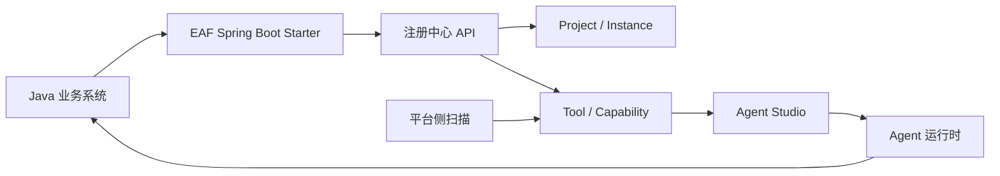

# AI 注册中心企业级改造设计

> **命名说明**：本文档中部分历史表述仍写为「Skill」；与代码、数据库中的 `skill` 一样，属 **legacy naming**。产品语义已统一为 **Capability / 粗粒度能力**（Tool / Agent 命名不变）。

> 本文沉淀 2026-05-08 关于 Enterprise Agent Framework 下一阶段方向的讨论与首轮改造结果。核心结论：项目不应只停留在“平台侧扫描 Java 项目”，而应升级为面向企业多业务系统的 **AI 能力注册中心 + Agent 治理运行平台**。

## 一、背景与判断

当前系统已经具备扫描项目、动态 Tool、`@AiCapability` 能力声明、Agent Studio、粗粒度能力（Capability）、Tool ACL、Trace、MCP / A2A 等基础能力。原有主链路是：

```text
管理端录入项目 -> 平台扫描 OpenAPI / Controller -> 生成 Tool -> Agent Studio 编排 -> Agent 调用业务系统
```

这条链路适合历史系统和不可改造系统，但不是企业级长期接入的最优解。对于可改造的业务系统，更合理的方式是：

```text
业务系统引入 EAF Starter / SDK
  -> 启动时主动注册项目、实例、接口能力和能力元数据
  -> 平台按项目隔离管理 Tool / 能力 / Agent / Knowledge / ACL / Trace
  -> 业务系统也可以反向调用平台发布的 Agent / 能力
```

因此后续产品定位应从“扫描已有 Java 项目”升级为：

**面向 Java 企业系统的 AI 能力注册中心与 Agent 治理平台。**

## 二、目标架构



三类接入方式并存：

| 接入方式 | 适用对象 | 特点 |
| --- | --- | --- |
| 平台侧扫描 | 历史系统、不可改造系统、PoC | 低侵入，平台录入路径或 OpenAPI 后扫描 |
| 能力声明扫描 | 可改造业务系统 | 使用 `@AiCapability / @AiParam / @AiOutput` 提供结构化语义 |
| Starter 主动注册 | 新系统、核心系统、规模化接入 | 启动自动注册项目、实例、接口能力和心跳 |

## 三、首轮已改造内容

### 3.1 项目隔离底座

已经把 `scan_project` 从单纯“扫描项目”扩展为业务项目承载模型，新增或接入了以下概念：

- `projectCode`：业务系统稳定编码，供 SDK、网关、导入导出和跨系统引用使用。
- `projectKind`：`SCAN / REGISTERED / HYBRID`，区分平台扫描、SDK 注册和混合项目。
- `environment`：环境维度，当前默认 `default`，后续可扩展为 `dev / test / prod`。
- `visibility`：`PRIVATE / PROJECT / SHARED / PUBLIC`，为跨项目复用和能力市场做准备。
- `qualifiedName`：能力稳定全名，建议形如 `projectCode:name`。

涉及后端模型：

- `ScanProjectEntity`：补项目编码、形态、环境、负责人和可见性。
- `ToolDefinitionEntity`：补 `projectCode / visibility / qualifiedName`。
- `AgentDefinition` 与 `AgentDefinitionEntity`：补项目归属和可见性。
- `ToolAclEntity`：补项目级 ACL 上下文。
- `ToolExecutionContext`：运行时透传 `projectCode`。

### 3.2 能力引用与运行时过滤

当前仍兼容历史 `tool_definition.name`，同时开始引入更稳定的引用方式：

- SDK 注册能力时使用 `projectCode + name` 生成平台内存储名，避免多项目同名冲突。
- 同时保存 `qualifiedName = projectCode:name`，为后续 Agent 引用从裸 `name` 迁移到稳定引用做准备。
- Tool / Skill 分页、Agent 列表、Skill 列表支持按 `projectId` 过滤。
- Agent 运行时将 `projectCode` 注入 `ToolExecutionContext`，Tool ACL 决策可以按项目维度过滤。
- Tool Retrieval 在 Agent 带 `projectId` 时优先限定当前项目范围。

### 3.3 注册中心 API

新增注册中心入口：

```text
POST /api/registry/projects/register
POST /api/registry/projects/{projectCode}/instances/heartbeat
GET  /api/registry/projects/{projectCode}/instances
POST /api/registry/projects/{projectCode}/instances/offline
POST /api/registry/projects/{projectCode}/capabilities/diff
POST /api/registry/projects/{projectCode}/capabilities/sync
POST /api/registry/projects/{projectCode}/capabilities/apply
```

新增数据表：

- `ai_project_instance`：记录业务系统实例、版本、SDK 版本、在线状态和心跳时间。
- `capability_sync_log`：记录能力同步批次、状态、摘要和错误。

相关迁移：

- `ai-agent-service/sql/registry_phase_p4.sql`
- `sql/init.sql`

### 3.4 Spring Boot Starter MVP

新增模块：

```text
ai-spring-boot-starter
```

业务系统可通过配置接入：

```yaml
eaf:
  registry:
    url: http://ai-agent-service:8603
    app-key: contract-center
    app-secret: xxx
  project:
    code: contract-center
    name: 合同中心
    base-url: http://contract-center:8080
  capability:
    scan-controller: true
    expose-actuator-endpoint: true
```

Starter 当前能力：

- 启动时注册项目。
- 扫描 Spring MVC `RequestMappingHandlerMapping`。
- 读取方法上的 `@AiCapability` 和参数上的 `@AiParam`。
- 生成能力描述并同步到注册中心。
- 定时上报实例心跳。
- 应用关闭时尝试下线实例。
- 提供 `/actuator/eaf-capabilities` 查看本地能力清单。

### 3.5 业务系统反向调用 Agent

Starter 中新增 `EafAgentClient`，业务系统可以调用平台已发布 Agent：

```java
Map<?, ?> response = eafAgentClient.chat("contract-assistant", "帮我查询合同审批进度");
```

后续可以在此基础上继续增强：

- 业务身份、角色、部门、租户上下文透传。
- `traceId` 双向透传。
- 结构化返回模型。
- 超时、降级、熔断和幂等保护。

### 3.6 前端类型与 API 基础

管理端已补充：

- `src/api/registry.ts`
- `src/types/registry.ts`
- Tool / Skill / Agent / ScanProject 类型增加项目字段。
- Agent 列表 API 支持 `projectId` 查询参数。

当前这一步主要为后续项目选择器、实例状态页、能力同步评审页和项目级 Studio 做类型准备。

## 四、仍需继续深化的点

首轮改造是注册中心主线的 MVP 骨架，后续还需要继续推进以下事项。

### 4.1 能力同步从即时 upsert 升级为快照评审

当前 `/capabilities/diff` 可以计算 `ADDED / CHANGED / UNCHANGED`，`sync / apply` 可以写入 Tool，但还不是完整的企业级变更评审。

后续应补齐：

- `capability_snapshot`：每次 SDK 上报先写快照。
- `capability_diff_item`：字段级差异、冲突类型和处理状态。
- `apply` 时保留人工编辑字段，如描述、AI 语义、ACL、可见性、Agent 引用。
- 删除能力时分析影响范围：Agent、Skill、MCP、A2A、ACL、接口图谱边。
- 管理端新增“注册变更评审”页面。

### 4.2 Agent 引用模型继续演进

当前 Agent 仍主要存 `toolsJson / skillsJson` 的字符串名称列表。后续建议迁移为稳定引用：

```json
{
  "kind": "TOOL",
  "projectCode": "contract-center",
  "name": "queryContract",
  "qualifiedName": "contract-center:queryContract",
  "definitionId": 1001
}
```

迁移原则：

- 保持裸 `name` 兼容历史 Agent。
- 新 Studio 保存时优先写稳定引用。
- 发布版本快照中冻结引用解析结果。
- 导入导出 Agent 时通过 `qualifiedName` 做依赖检查。

### 4.3 项目级 Studio

Agent Studio 需要进入项目上下文：

- 进入 Studio 前先选择项目。
- Tool / Skill / Knowledge 调色板默认只展示当前项目和授权共享能力。
- Agent 保存时写入 `projectId / projectCode / visibility`。
- 发布前检查跨项目引用、ACL、`sideEffect`、HITL、变量映射缺失。

### 4.4 企业级注册安全

注册中心 API 当前已有结构，但企业生产必须补齐安全机制：

- `appKey / appSecret` 签名校验。
- 请求时间戳、防重放 nonce。
- 项目级注册白名单。
- SDK 上报权限与运行时调用权限分离。
- 注册行为写审计日志。
- 管理端可吊销项目凭证。

### 4.5 多环境与多租户

企业接入后很快会遇到多环境和多租户问题：

- `environment` 从展示字段升级为过滤维度。
- `dev / test / prod` 能力、实例、Agent 版本隔离。
- 租户 / 组织 / 部门维度进入 ACL、Trace 和能力目录。
- AI Gateway 统一解析身份与上下文。

### 4.6 生产护栏与市场化

当跨项目复用出现后，需要补齐：

- 公共 Skill 上架审批。
- Agent / Skill 市场导入导出。
- 依赖能力检查。
- 默认禁用导入能力，发布前必须通过 ACL 和副作用检查。
- 网关层限流、熔断和 Trace 透传。

## 五、推荐后续路线

### Sprint 1：注册中心闭环可演示

目标：准备一个示例业务系统，引入 `ai-spring-boot-starter`，启动后自动注册项目、实例和接口能力。

验收：

- 平台能看到 `projectCode`、项目实例和心跳状态。
- SDK 上报能力进入 `tool_definition`。
- 同名能力在不同项目下不冲突。
- Agent 运行时只召回当前项目能力。

### Sprint 2：能力变更评审

目标：让 SDK 上报从“直接同步”升级为“快照、diff、评审、apply”。

验收：

- 修改接口参数后能看到字段级 diff。
- 删除接口时能看到被哪些 Agent / Skill / ACL 引用。
- 人工编辑过的描述和可见性不会被覆盖。
- 管理端能逐条应用或忽略变更。

### Sprint 3：项目级 Studio

目标：让 Agent Studio 真正按项目编排。

验收：

- Studio 进入项目上下文。
- 调色板按项目过滤 Tool / Skill / Knowledge。
- 跨项目引用必须显式授权。
- 发布版本快照保留稳定引用。

### Sprint 4：安全与网关

目标：注册中心进入生产边界。

验收：

- SDK 注册请求有签名校验。
- Gateway 统一注入用户、角色、租户、项目上下文。
- Tool ACL 支持项目级规则。
- Trace 可按项目检索和审计。

## 六、阶段结论

Enterprise Agent Framework 的下一步主线应是：

**从“扫描 Java 项目并生成 Tool”升级为“企业 AI 能力注册中心”，让业务系统的接口、流程、权限、实例和 Agent 能力都成为可注册、可治理、可编排、可观测的企业 AI 资产。**

平台侧扫描仍然保留，服务历史系统；Starter / SDK 主动注册成为可改造系统和新系统的主接入方式。项目隔离、能力稳定引用、注册变更评审、项目级 Studio 和生产级安全，是这条路线能否走向企业落地的关键。
