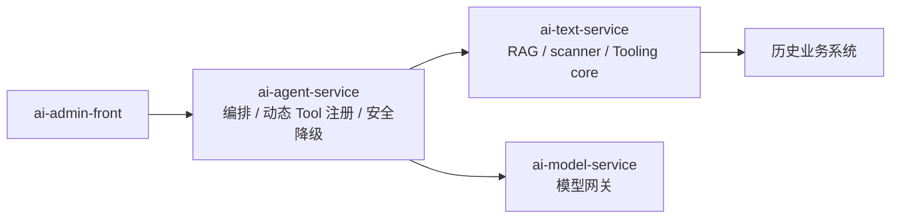

---
name: AI Agent 架构升级规划
overview: 当前统一采用“管理端扫描历史项目 -> 动态 Tool 入库 -> 运行时注册调用”的主线；Tooling 能力已进一步收拢到 ai-text-service / ai-agent-service。
status: P0/P1/P2 核心收口已完成；后续聚焦扫描增强与 AI 中台能力完善。
isProject: false
---

# 企业级 AI Agent 基础设施升级规划

## 一、当前状态

### 1.1 已完成的核心能力

| 能力 | 说明 | 状态 |
|------|------|------|
| 模型网关收口 | `ai-model-service` 统一 LLM / Embedding 调用 | ✅ |
| RAG 引擎拆分 | `ai-text-service` 承担知识库、文档处理、检索 | ✅ |
| Tooling 收编 | scanner 并入 `ai-text-service`，`ai-skill-services` 下线 | ✅ |
| 智能体编排 | `ai-agent-service` 负责意图识别、Tool 调用、会话记忆 | ✅ |
| 管理前端统一 | `ai-admin-front` 统一承载 Agent、知识库、模型、Tool、扫描项目 | ✅ |
| 扫描项目 Web 化 | `scan_project` + `tool_definition.project_id` + 前后端页面与 API | ✅ |
| 动态 Tool 运行时注册 | 扫描结果入库并通过 `DynamicHttpAiTool` 直接调用历史系统 | ✅ |
| 最小安全降级 | `AgentWorkflow` 仅保留 `KNOWLEDGE_QA` / `GENERAL_CHAT` | ✅ |

### 1.2 当前仓库结构

```text
EnterpriseAgentFramework/
├── ai-common/
├── ai-skill-sdk/
├── ai-model-service/
├── ai-text-service/
├── ai-agent-service/
├── ai-admin-front/
└── deploy/
```

说明：

- 根 `pom.xml` 当前聚合 5 个 Java 子模块。
- `ai-admin-front` 为独立 npm 工程，不纳入 Maven 聚合。
- scanner 核心当前位于 `ai-text-service` 的 `com.enterprise.ai.text.tooling.scanner.*`。

## 二、目标架构



边界约束：

- `ai-agent-service` 只保留编排、注册、执行、最小安全降级。
- `ai-text-service` 承担知识库与 scanner / Tooling 基础能力。
- `ai-skill-sdk` 继续作为最底层 Tool 契约，不动。

## 三、关键设计决策

### 3.1 历史系统接入策略

1. 历史系统保持独立部署，不强制代码改造。
2. 统一通过 HTTP 方式桥接业务能力。
3. 统一采用管理端扫描，而不是开发时生成。

### 3.2 Tool 管理策略

1. 历史项目接口统一转为 `tool_definition` 中的动态 Tool。
2. 通过 `project_id` 管理扫描项目与工具归属关系。
3. 手写 Tool 与动态 Tool 共用 `AiTool` / `ToolRegistry` 契约。

### 3.3 降级策略

1. `AgentScope` 失败后仍保留 `AgentWorkflow`。
2. `KNOWLEDGE_QA` 走安全可用的知识问答降级链路。
3. 其他历史依赖代码 Tool 的意图统一转为 `GENERAL_CHAT`。

## 四、后续重点

### 4.1 扫描能力增强

- 更复杂的 OpenAPI 契约支持
- Service / JavaDoc 深扫
- 扫描差异对比
- 增量更新与冲突提示

### 4.2 AI 中台能力

- `/api/ai/*` 标准化能力接口
- 结构化输出：`TypedAgentResult` + JSON Schema
- Prompt 模板管理
- 多知识库协同检索
- Tool 权限、限流、审计、可观测性

### 4.3 延后决策

当前暂不改动：

- `spring.application.name`
- Nacos 服务名
- Docker / 部署名称
- 数据库名 `ai_text_service`

等 Tooling 边界稳定后，再统一评估 `ai-text-service` 的正式命名与迁移方案。

## 五、结论

当前架构已经完成从“开发时生成”到“运行时扫描注册”的收口，并进一步把 Tooling 核心并入 `ai-text-service`。后续工作的重点不再是生成代码，而是提升扫描质量、动态 Tool 治理能力以及 AI 中台的完整度。
