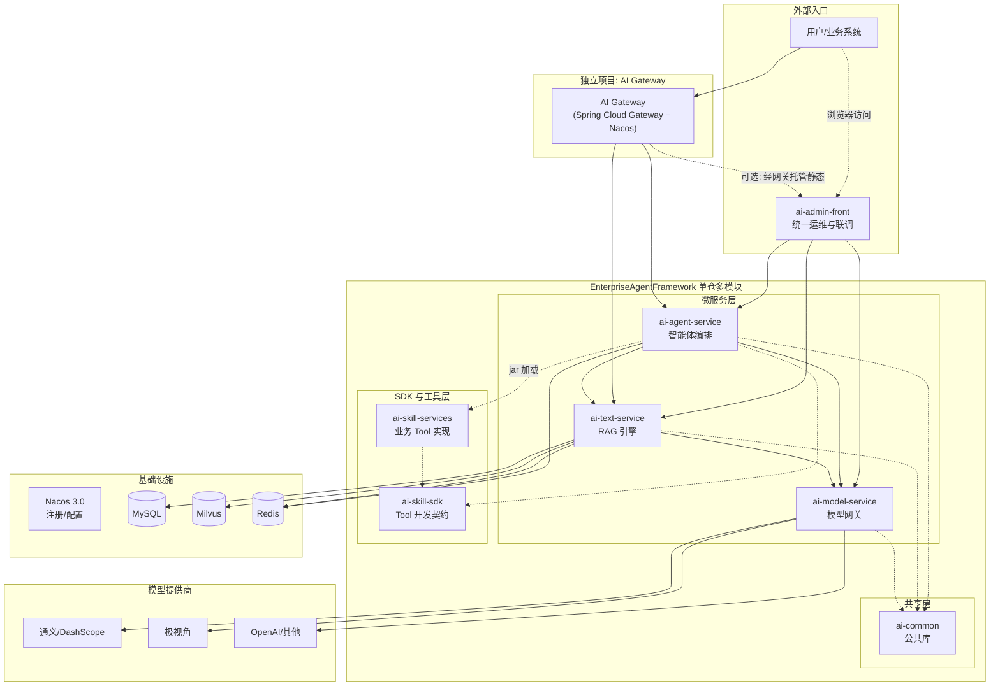
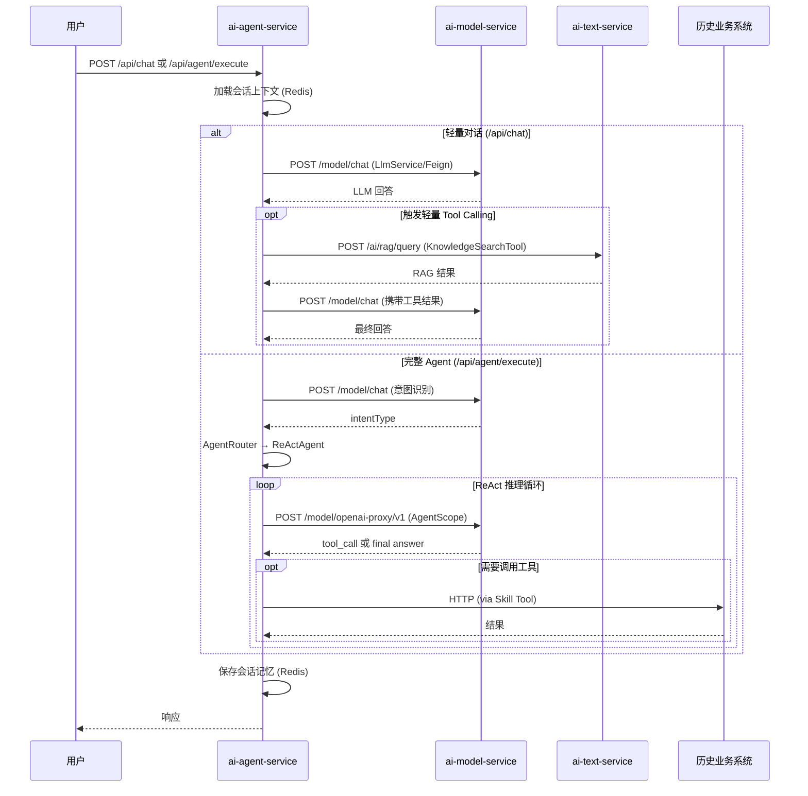

# 企业级 AI Agent 基础设施架构重构方案

---

## 一、现状分析

### 1.1 项目现状

Enterprise Agent Framework 已从三个独立项目演进为统一的单仓多模块架构，并完成了 P0（调用链路归正）和 P1（核心能力补齐）两个阶段的实施。

当前仓库包含以下模块：

```
EnterpriseAgentFramework/
├── ai-common/           公共库（DTO、异常、通用配置）
├── ai-skill-sdk/        Skill 开发 SDK（AiTool 接口、ToolRegistry）     [P1 新增]
├── ai-skill-services/   业务工具实现（jar 包加载到 agent-service）      [P1 新增]
├── ai-skill-scanner/    开发时扫描器（OpenAPI / Controller -> Tool Manifest） [P2 新增]
├── skill-services/      生成的 Skill Service 示例目录                  [P2 新增]
├── ai-model-service/    模型网关（LLM Chat / Embedding，多 Provider）
├── ai-text-service/     RAG 引擎（知识库、文档 Pipeline、向量检索）
├── ai-agent-service/    智能体编排（AgentScope、意图识别、Tool 调用）
├── ai-admin-front/      统一管理前端（Vue 3 + Vite；运维入口对接 text/agent/model）
└── deploy/              部署配置（Docker / K8s）
```

### 1.2 已解决的核心问题（P0 + P1）

| 问题 | 解决方案 | 状态 |
|------|---------|------|
| 耦合与职责不清（RAG 绕道极视角） | ai-agent-service 改为通过 Feign 调 ai-text-service 和 ai-model-service | ✅ 已完成 |
| 无统一模型层 | ai-model-service 统一模型网关，多 Provider 路由 | ✅ 已完成 |
| Agent 直连 DashScope | AgentScope OpenAIChatModel → model-service OpenAI 兼容代理 | ✅ 已完成 |
| LlmService 直连 Spring AI | 改为 Feign → model-service /model/chat | ✅ 已完成 |
| 无会话记忆 | ConversationMemoryService (Redis 短期上下文窗口) | ✅ 已完成 |
| /api/chat 无 Tool 能力 | LightweightToolCaller 轻量 Tool Calling | ✅ 已完成 |
| 无流式输出 | WebClient + SseEmitter → /api/chat/stream SSE | ✅ 已完成 |
| Agent 定义硬编码 | AgentDefinitionService + REST CRUD API | ✅ 已完成 |
| Tool 层与 agent-service 耦合 | ai-skill-sdk 下沉 AiTool 接口，ai-skill-services 外置业务工具 | ✅ 已完成 |
| 极视角大量冗余 | JishiAgentClient 瘦身，仅保留业务工具能力 | ✅ 已完成 |
| 管理前端能力碎片化 | ai-admin-front 统一承载知识库、Agent、模型、概览等；开发态经 Vite 多路径代理联调三后端 | ✅ 核心页面已落地 |
| 缺少开发时标准化接入链路 | `ai-skill-scanner` + `Tool Manifest` + 模板生成 + CLI，并以 `RetrievalController` 验证闭环 | ✅ 已完成 |

### 1.3 遗留问题

| 问题 | 说明 | 计划阶段 |
|------|------|---------|
| ~~groupId 未统一~~ | ~~agent-service 已从 `com.jishi.ai.agent` 统一为 `com.enterprise.ai.agent`~~ | ✅ 已完成 |
| 无共享基础设施 | Nacos 配置中心尚未启用、无 API 网关 | P2 |
| ~~管理端 Tool 闭环~~ | ~~Tool 列表/测试需 ai-agent-service 暴露 REST~~ | ✅ 已完成 |
| 管理端深化 | 会话列表与历史、Prompt 管理、知识库组管理等需后端 API 配合 | P2 |
| 长期记忆未实现 | 当前仅 Redis 短期记忆，MySQL 长期历史待实现 | P2 |

---

## 二、目标架构

### 2.1 整体拓扑



### 2.2 服务职责定义

#### (1) ai-model-service — 模型网关 ✅ 已实现

统一 LLM/Embedding 调用的核心网关。

**已实现能力:**
- 统一 LLM Chat 接口（同步 + SSE 流式）
- 统一 Embedding 接口
- 多模型 Provider 适配（通义/DashScope）
- OpenAI 兼容代理端点（供 AgentScope 使用）
- Provider 连通性测试

**待实现（P2）:**
- Token 统计与计费埋点
- 限流/熔断/降级
- API Key 池管理

#### (2) ai-text-service — RAG 引擎 ✅ 已实现

**已实现能力:**
- 知识库 CRUD（MySQL 元数据）
- 文档解析 Pipeline（PDF/Word/TXT → Chunk）
- 向量存储与检索（Milvus）
- RAG 一站式问答（`/ai/rag/query`）
- 业务索引语义搜索

**待实现（P2）:**
- Embedding 调用改为调 ai-model-service（当前仍内部直连通义）

#### (3) ai-agent-service — 智能体编排 ✅ P0+P1+P2 核心已完成

**已实现能力:**
- AgentScope 编排（ReActAgent、Pipeline）
- 意图识别与路由
- Tool 注册与执行框架（基于 ai-skill-sdk）
- 全部 LLM 调用统一走 ai-model-service
- 全部 RAG 调用统一走 ai-text-service
- 会话记忆管理（Redis 短期上下文窗口）
- /api/chat 轻量 Tool Calling
- SSE 流式输出
- Agent 定义持久化与 CRUD API
- 极视角瘦身（仅保留业务工具能力）
- **AgentDefinition 驱动路由** — AgentRouter/AgentFactory 全配置化，消除硬编码 switch-case ✅
- **IntentService 动态化** — 意图候选列表从 AgentDefinition 动态生成 ✅
- **AgentDefinition 扩展字段** — triggerMode、knowledgeBaseGroupId、promptTemplateId、outputSchemaType、useMultiAgentModel ✅
- **Tool 管理 REST API** — `GET/POST /api/tools` 列表、详情、测试执行 ✅

**待实现:**
- 长期记忆（MySQL）
- 执行链追踪（AgentScope Hook）
- AI 能力 API Gateway（`/api/ai/*` 标准化能力接口）
- 结构化输出（TypedAgentResult + JSON Schema 约束）
- Prompt 模板管理（PromptTemplate 实体 + CRUD + 前端）
- 多知识库协同检索（KnowledgeBaseGroup）

#### (4) ai-skill-sdk — Skill 开发 SDK ✅ P1 新增

**已实现:**
- `AiTool` 接口（含 `parameters()` 参数定义）
- `ToolParameter` 参数描述
- `ToolRegistry` 通用注册中心

**待实现（P2）:**
- `ToolMetadata` 增强元数据（权限要求、来源标识）
- `RemoteTool` 基类（HTTP 桥接通用实现）

#### (5) ai-skill-services — 业务工具实现 ✅ P1 新增

从 ai-agent-service 迁移出的业务工具，以 jar 包形式加载。

**已迁移工具:**
- `DatabaseQueryTool`（NL2SQL 数据查询）
- `BusinessApiTool`（业务 API 调用）
- `UserProfileTool`（用户信息查询，Mock）
- `BusinessSystemClient`（业务系统 REST 客户端）
- `SkillAutoConfiguration`（Spring Boot 自动配置）

#### (6) ai-common — 公共库 ✅ 已实现

- 统一响应体 `ApiResult<T>`
- 统一异常体系与错误码

#### (7) ai-admin-front — 统一管理前端 ✅ 核心页面已实现

**已有:**
- 知识库/文件/检索/业务索引（RAG 域）
- Dashboard 概览（统计卡片、健康探测、快览）
- Agent 列表与 CRUD、编辑、调试台（轻量对话 / SSE / 详细执行）
- **Agent 编辑页 AI 能力中台配置** — 触发方式、多 Agent 模型、输出 Schema、知识库组 ID、Prompt 模板 ID ✅
- **Agent 列表页多维筛选** — 意图类型（含自定义）、触发方式、状态 ✅
- 模型 Provider 管理与模型调试台（同步与流式）
- **Tool 管理页** — 列表、参数 Schema 展开、测试弹窗（已对接后端 `/api/tools` REST） ✅

**仍属持续迭代:** 会话列表与历史 API；Prompt 模板管理页；知识库组管理页；执行链深度可视化、权限与登录、ECharts 等规划项。

#### (8) ai-skill-scanner — 开发时工具链 ✅ MVP 已实现

**已实现能力：**
- OpenAPI / Swagger 扫描 -> `Tool Manifest`
- Spring MVC Controller 注解扫描（JavaParser）-> `Tool Manifest`
- Freemarker 模板生成 Skill Service 骨架
- CLI：`scan-openapi`、`scan-controller`、`generate`
- 项目级 Cursor Skill：`.cursor/skills/generate-skill`
- 真实样例：`docs/generated-manifests/ai-text-retrieval.yaml` 与 `skill-services/skill-ai-text-retrieval`

**当前边界：**
- 当前优先打通 `ToolRegistry` 路径，ReAct / AgentScope 仍需 `ToolRegistryAdapter` 补桥接
- 源码级 `Service + JavaDoc` 深扫仍待下一阶段

#### (9) AI Gateway（独立项目，未启动）

统一入口路由、鉴权、限流。计划 P2 阶段。

---

## 三、仓库与构建结构（当前态）

```
EnterpriseAgentFramework/
  pom.xml                          # 根 POM（聚合 + dependencyManagement）
  ai-common/                       # 公共库模块
  ai-skill-sdk/                    # Skill 开发 SDK
  ai-skill-services/               # 业务工具实现（jar 加载）
  ai-skill-scanner/                # 开发时扫描器与生成 CLI
  skill-services/skill-ai-text-retrieval/ # 生成示例模块（端到端验证）
  ai-model-service/                # 模型网关服务 :8090
  ai-text-service/                 # RAG 引擎 :8080
  ai-agent-service/                # 智能体编排 :8081
  ai-admin-front/                  # 管理前端（Vue + Vite，**未**纳入根 POM 的 Maven 聚合）
  templates/                       # Skill Service Freemarker 模板
  deploy/                          # 部署配置
  docs/                            # 架构文档
```

**根 POM 关键配置:**
- Spring Boot 3.4.5
- 统一 groupId: `com.enterprise.ai`（各 Java 子模块已对齐）
- **8 个 Maven 子模块**：在原有运行时模块基础上，新增 `ai-skill-scanner`，并纳入一个生成示例模块 `skill-services/skill-ai-text-retrieval`；`ai-admin-front` 为同仓 **npm 工程**，独立构建与部署

---

## 四、服务间通信



**通信方式:**
- 服务间同步调用：OpenFeign（+ Nacos 可选）
- Agent LLM 调用：AgentScope OpenAIChatModel → model-service OpenAI 代理端点
- 流式响应：SSE，model-service → agent-service (WebClient) → 用户 (SseEmitter)

**管理前端（ai-admin-front）与后端：**
- 开发态：Vite 将 `/ai`、`/api/*`、`/model` 分别代理至 text（8080）、agent（8081）、model（8090）服务。
- 生产态：静态资源 + Nginx（或网关）按路径拆分反向代理；流式接口建议关闭 `proxy_buffering`。
- 详见同目录 [`ai-admin-front/README.md`](../ai-admin-front/README.md)。

---

## 五、实施进展与路线图

### ~~P0 — 调用链路归正~~ ✅ 已完成

| 任务 | 状态 |
|------|------|
| LlmService 改用 Feign → model-service | ✅ |
| AgentScopeConfig 改用 OpenAIChatModel → model-service 代理 | ✅ |
| 移除 spring-ai-alibaba-starter-dashscope 依赖 | ✅ |
| RagClient / KnowledgeSearchTool 改调 ai-text-service | ✅ |
| JishiAgentClient 瘦身（删除 chat/RAG 方法） | ✅ |
| model-service 新增 OpenAI 兼容代理端点 | ✅ |
| AgentResult metadata 补全 toolCalls/steps | ✅ |
| 清理死代码（SpringAIConfig、directToJishi 等） | ✅ |
| ModelServiceClient / TextServiceClient 强类型 DTO | ✅ |

### ~~P1 — 核心能力补齐~~ ✅ 已完成

| 任务 | 状态 |
|------|------|
| 会话记忆管理（Redis ConversationMemoryService） | ✅ |
| /api/chat 轻量 Tool Calling（LightweightToolCaller） | ✅ |
| SSE 流式输出（ModelStreamClient + SseEmitter） | ✅ |
| Agent 定义持久化（AgentDefinitionService + REST API） | ✅ |
| 创建 ai-skill-sdk 模块（AiTool + ToolRegistry 下沉） | ✅ |
| 业务工具迁移到 ai-skill-services | ✅ |

### P2 — 扩展能力

#### 已完成

| 任务 | 说明 | 状态 |
|------|------|------|
| ~~groupId 统一~~ | `com.jishi.ai.agent` → `com.enterprise.ai.agent` | ✅ |
| ~~Agent 管理 UI~~ | ai-admin-front：Agent 列表 / 编辑 / 调试台（含 SSE 消费） | ✅ |
| ~~模型管理 UI~~ | ai-admin-front：Provider 列表、连通性测试、模型调试台 | ✅ |
| ~~管理概览 Dashboard~~ | ai-admin-front：统计卡片、Actuator 健康探测、最近数据快览 | ✅ |
| ~~Tool 管理 REST API~~ | ai-agent-service：`GET/POST /api/tools` 列表、详情、测试执行 | ✅ |
| ~~AgentDefinition 驱动路由~~ | AgentRouter/AgentFactory 全配置化，消除硬编码 switch-case | ✅ |
| ~~IntentService 动态化~~ | 意图候选列表从 AgentDefinition 动态生成，不再硬编码 | ✅ |
| ~~AgentDefinition 扩展~~ | 新增 triggerMode、knowledgeBaseGroupId、promptTemplateId、outputSchemaType、useMultiAgentModel | ✅ |
| ~~管理前端 AI 能力中台配置~~ | Agent 编辑页新增触发方式/多 Agent 模型/输出 Schema/知识库组/Prompt 模板配置；列表页多维筛选 | ✅ |
| ~~scanner-first 开发时工具链 MVP~~ | `ai-skill-scanner`：OpenAPI / Controller 扫描、`Tool Manifest`、Freemarker 模板生成、CLI | ✅ |
| ~~生成样例与端到端验证~~ | 基于 `ai-text-service` `RetrievalController` 生成 `skill-ai-text-retrieval` 并完成 `ToolRegistry` 集成测试 | ✅ |
| ~~项目级 Cursor Skill~~ | `.cursor/skills/generate-skill`，约束 scanner-first 工作流与当前边界 | ✅ |

#### 进行中 / Backlog

| 任务 | 说明 | 优先级 |
|------|------|--------|
| AI 能力 API Gateway | `/api/ai/*` 标准化 REST API（generate/review/extract/search/summarize/qa/query-data） | 高 |
| 结构化输出 | TypedAgentResult + JSON Schema 约束 + BeanOutputConverter | 高 |
| Prompt 模板管理 | PromptTemplate 实体 + CRUD + 变量注入 + 前端管理页 | 高 |
| 多知识库协同检索 | KnowledgeBaseGroup + 多 Collection 并行 + 融合排序 | 高 |
| ai-text-service Embedding 解耦 | Embedding 调用改走 ai-model-service | 中 |
| 长期记忆 | MySQL 持久化会话历史和用户偏好 | 中 |
| AI Gateway | Spring Cloud Gateway + 统一鉴权 + 限流 | 中 |
| 管理端深化 | 登录鉴权、执行链可视化、调用量图表、会话列表与历史 | 中～低 |
| RemoteToolProvider | Python/MCP 远程工具协议支持 | 中 |
| 源码级扫描增强 | Service 层 / JavaDoc 扫描，补齐三级扫描策略最后一层 | 中 |
| 执行链追踪 | AgentScope Hook System + 日志持久化 | 中 |
| ToolRegistryAdapter 动态化 | 消除每新增 AiTool 都要手动添加桥接方法的问题 | 中 |
| WorkflowEngine | 有状态流程编排 + 人机协同 + 条件分支 | 中 |
| Workflow 可视化编排 | 前端拖拽 + 后端 DAG 引擎 | 低 |
| Agent 模板系统 | 预置模板快速创建 Agent | 低 |

> 详细的 AI 能力中台演进方案见 [企业AI能力中台 — 架构演进方案](企业AI能力中台%20—%20架构演进方案.md)

---

## 六、关键设计决策记录

### 6.1 ai-model-service 用 Spring AI 内部适配，对外自定义接口

- 内部使用 Spring AI 的 `ChatModel` / `EmbeddingModel` 对接各 Provider
- 对外暴露自定义 REST 接口，不绑定 Spring AI 协议
- 额外提供 OpenAI 兼容代理端点，供 AgentScope 原生 `OpenAIChatModel` 使用

### 6.2 极视角的定位

极视角在新架构中定位为 **ai-model-service 的一个 Provider**，与通义、OpenAI 同级。`JishiAgentClient` 中的 LLM/RAG 能力已迁移，仅保留业务工具功能。

### 6.3 Skill Service 以 jar 包形式加载

业务工具不独立部署，而是作为 ai-agent-service 的 Maven 依赖通过 Spring Boot AutoConfiguration 自动注册。避免多一跳网络开销，ToolRegistry 的自动发现机制天然支持此方式。

### 6.4 三入口设计

- `/api/chat`：轻量对话 + 会话记忆 + 轻量 Tool Calling（知识搜索等）
- `/api/agent/execute`：完整 Agent 编排（意图识别 + ReAct + Pipeline）
- `/api/ai/*`：标准化 AI 能力 API（规划中），业务系统直接调用 AI 能力
- 三者共享底层 Agent 编排引擎、RAG 引擎、模型网关和 Tool 体系

### 6.5 ai-admin-front 与多后端对接

- **职责**：面向运维与研发的统一控制台，覆盖 RAG（text）、Agent/对话（agent）、模型网关（model）三类 API。
- **协议**：REST + `text/event-stream`；前端对 SSE 做行级解析，仅拼接 `data:` 载荷，避免将 `event:` 等协议行展示给用户。
- **与 P2 关系**：页面与路由已就绪；Tool 全链路、会话治理、登录与可观测性深化仍与后端能力同步迭代。
