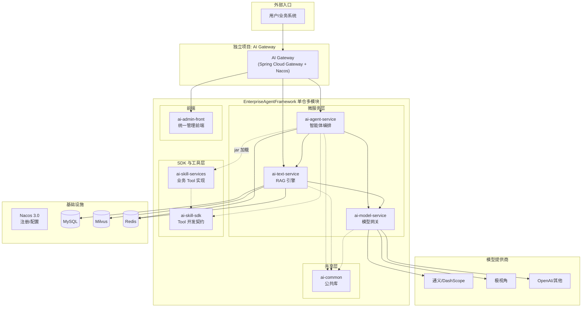
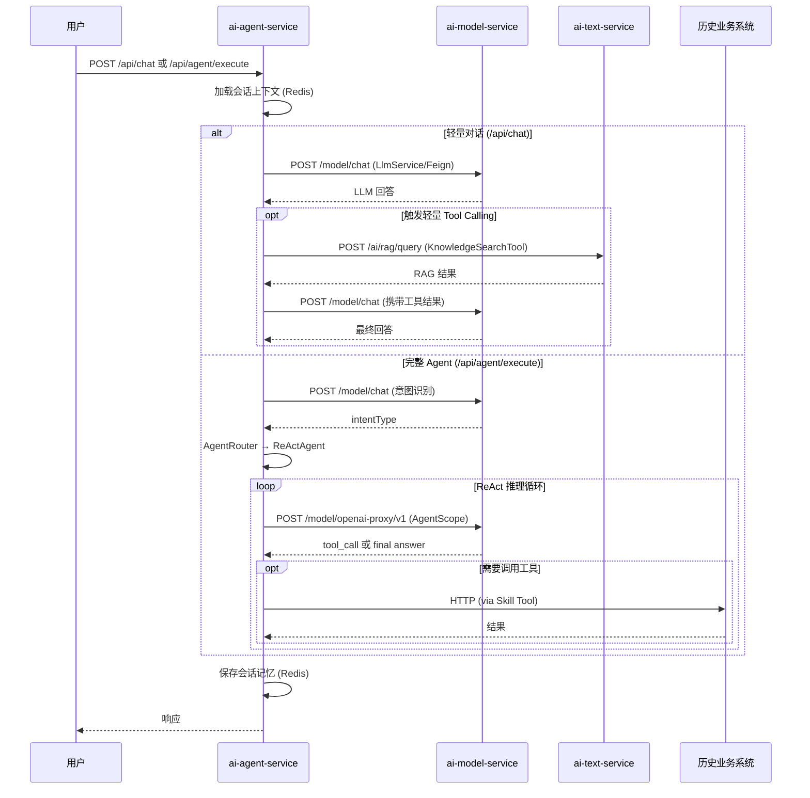

# 企业级 AI Agent 基础设施架构重构方案

---

## 一、现状分析

### 1.1 项目现状

Enterprise Agent Framework 已从三个独立项目演进为统一的单仓多模块架构，并完成了 P0（调用链路归正）和 P1（核心能力补齐）两个阶段的实施。

当前仓库包含以下模块：

```
EnterpriseAgentFramework/
├── ai-common/           公共库（DTO、异常、通用配置）
├── ai-skill-sdk/        Skill 开发 SDK（AiTool 接口、ToolRegistry）     [P1 新增]
├── ai-skill-services/   业务工具实现（jar 包加载到 agent-service）      [P1 新增]
├── ai-model-service/    模型网关（LLM Chat / Embedding，多 Provider）
├── ai-text-service/     RAG 引擎（知识库、文档 Pipeline、向量检索）
├── ai-agent-service/    智能体编排（AgentScope、意图识别、Tool 调用）
├── ai-admin-front/      统一管理前端（Vue 3 + Element Plus）
└── deploy/              部署配置（Docker / K8s）
```

### 1.2 已解决的核心问题（P0 + P1）

| 问题 | 解决方案 | 状态 |
|------|---------|------|
| 耦合与职责不清（RAG 绕道极视角） | ai-agent-service 改为通过 Feign 调 ai-text-service 和 ai-model-service | ✅ 已完成 |
| 无统一模型层 | ai-model-service 统一模型网关，多 Provider 路由 | ✅ 已完成 |
| Agent 直连 DashScope | AgentScope OpenAIChatModel → model-service OpenAI 兼容代理 | ✅ 已完成 |
| LlmService 直连 Spring AI | 改为 Feign → model-service /model/chat | ✅ 已完成 |
| 无会话记忆 | ConversationMemoryService (Redis 短期上下文窗口) | ✅ 已完成 |
| /api/chat 无 Tool 能力 | LightweightToolCaller 轻量 Tool Calling | ✅ 已完成 |
| 无流式输出 | WebClient + SseEmitter → /api/chat/stream SSE | ✅ 已完成 |
| Agent 定义硬编码 | AgentDefinitionService + REST CRUD API | ✅ 已完成 |
| Tool 层与 agent-service 耦合 | ai-skill-sdk 下沉 AiTool 接口，ai-skill-services 外置业务工具 | ✅ 已完成 |
| 极视角大量冗余 | JishiAgentClient 瘦身，仅保留业务工具能力 | ✅ 已完成 |

### 1.3 遗留问题

| 问题 | 说明 | 计划阶段 |
|------|------|---------|
| groupId 未统一 | agent-service 仍为 `com.jishi.ai.agent`，需统一为 `com.enterprise.ai.agent` | P2 |
| 无共享基础设施 | Nacos 配置中心尚未启用、无 API 网关 | P2 |
| 前端覆盖不足 | ai-admin-front 只管知识库，无 Agent 管理界面 | P2 |
| 长期记忆未实现 | 当前仅 Redis 短期记忆，MySQL 长期历史待实现 | P2 |

---

## 二、目标架构

### 2.1 整体拓扑



### 2.2 服务职责定义

#### (1) ai-model-service — 模型网关 ✅ 已实现

统一 LLM/Embedding 调用的核心网关。

**已实现能力:**
- 统一 LLM Chat 接口（同步 + SSE 流式）
- 统一 Embedding 接口
- 多模型 Provider 适配（通义/DashScope）
- OpenAI 兼容代理端点（供 AgentScope 使用）
- Provider 连通性测试

**待实现（P2）:**
- Token 统计与计费埋点
- 限流/熔断/降级
- API Key 池管理

#### (2) ai-text-service — RAG 引擎 ✅ 已实现

**已实现能力:**
- 知识库 CRUD（MySQL 元数据）
- 文档解析 Pipeline（PDF/Word/TXT → Chunk）
- 向量存储与检索（Milvus）
- RAG 一站式问答（`/ai/rag/query`）
- 业务索引语义搜索

**待实现（P2）:**
- Embedding 调用改为调 ai-model-service（当前仍内部直连通义）

#### (3) ai-agent-service — 智能体编排 ✅ P0+P1 已完成

**已实现能力:**
- AgentScope 编排（ReActAgent、Pipeline）
- 意图识别与路由
- Tool 注册与执行框架（基于 ai-skill-sdk）
- 全部 LLM 调用统一走 ai-model-service
- 全部 RAG 调用统一走 ai-text-service
- 会话记忆管理（Redis 短期上下文窗口）
- /api/chat 轻量 Tool Calling
- SSE 流式输出
- Agent 定义持久化与 CRUD API
- 极视角瘦身（仅保留业务工具能力）

**待实现（P2）:**
- groupId 统一为 `com.enterprise.ai.agent`
- 长期记忆（MySQL）
- 执行链追踪（AgentScope Hook）

#### (4) ai-skill-sdk — Skill 开发 SDK ✅ P1 新增

**已实现:**
- `AiTool` 接口（含 `parameters()` 参数定义）
- `ToolParameter` 参数描述
- `ToolRegistry` 通用注册中心

**待实现（P2）:**
- `ToolMetadata` 增强元数据（权限要求、来源标识）
- `RemoteTool` 基类（HTTP 桥接通用实现）

#### (5) ai-skill-services — 业务工具实现 ✅ P1 新增

从 ai-agent-service 迁移出的业务工具，以 jar 包形式加载。

**已迁移工具:**
- `DatabaseQueryTool`（NL2SQL 数据查询）
- `BusinessApiTool`（业务 API 调用）
- `UserProfileTool`（用户信息查询，Mock）
- `BusinessSystemClient`（业务系统 REST 客户端）
- `SkillAutoConfiguration`（Spring Boot 自动配置）

#### (6) ai-common — 公共库 ✅ 已实现

- 统一响应体 `ApiResult<T>`
- 统一异常体系与错误码

#### (7) ai-admin-front — 统一管理前端（部分实现）

**已有:** 知识库管理、文件管理、检索测试

**待实现（P2）:** Agent 管理、模型管理、Tool 管理、监控 Dashboard

#### (8) AI Gateway（独立项目，未启动）

统一入口路由、鉴权、限流。计划 P2 阶段。

---

## 三、仓库与构建结构（当前态）

```
EnterpriseAgentFramework/
  pom.xml                          # 根 POM（聚合 + dependencyManagement）
  ai-common/                       # 公共库模块
  ai-skill-sdk/                    # Skill 开发 SDK
  ai-skill-services/               # 业务工具实现（jar 加载）
  ai-model-service/                # 模型网关服务 :8090
  ai-text-service/                 # RAG 引擎 :8080
  ai-agent-service/                # 智能体编排 :8081
  ai-admin-front/                  # 管理前端
  deploy/                          # 部署配置
  docs/                            # 架构文档
```

**根 POM 关键配置:**
- Spring Boot 3.4.5
- 统一 groupId: `com.enterprise.ai`（agent-service 内部包名待迁移）
- 6 个 Maven 子模块

---

## 四、服务间通信



**通信方式:**
- 服务间同步调用：OpenFeign（+ Nacos 可选）
- Agent LLM 调用：AgentScope OpenAIChatModel → model-service OpenAI 代理端点
- 流式响应：SSE，model-service → agent-service (WebClient) → 用户 (SseEmitter)

---

## 五、实施进展与路线图

### ~~P0 — 调用链路归正~~ ✅ 已完成

| 任务 | 状态 |
|------|------|
| LlmService 改用 Feign → model-service | ✅ |
| AgentScopeConfig 改用 OpenAIChatModel → model-service 代理 | ✅ |
| 移除 spring-ai-alibaba-starter-dashscope 依赖 | ✅ |
| RagClient / KnowledgeSearchTool 改调 ai-text-service | ✅ |
| JishiAgentClient 瘦身（删除 chat/RAG 方法） | ✅ |
| model-service 新增 OpenAI 兼容代理端点 | ✅ |
| AgentResult metadata 补全 toolCalls/steps | ✅ |
| 清理死代码（SpringAIConfig、directToJishi 等） | ✅ |
| ModelServiceClient / TextServiceClient 强类型 DTO | ✅ |

### ~~P1 — 核心能力补齐~~ ✅ 已完成

| 任务 | 状态 |
|------|------|
| 会话记忆管理（Redis ConversationMemoryService） | ✅ |
| /api/chat 轻量 Tool Calling（LightweightToolCaller） | ✅ |
| SSE 流式输出（ModelStreamClient + SseEmitter） | ✅ |
| Agent 定义持久化（AgentDefinitionService + REST API） | ✅ |
| 创建 ai-skill-sdk 模块（AiTool + ToolRegistry 下沉） | ✅ |
| 业务工具迁移到 ai-skill-services | ✅ |

### P2 — 扩展能力（待规划）

| 任务 | 说明 | 优先级 |
|------|------|--------|
| groupId 统一 | `com.jishi.ai.agent` → `com.enterprise.ai.agent` | 高 |
| ai-text-service Embedding 解耦 | Embedding 调用改走 ai-model-service | 高 |
| 长期记忆 | MySQL 持久化会话历史和用户偏好 | 中 |
| AI Gateway | Spring Cloud Gateway + 统一鉴权 + 限流 | 中 |
| Agent 管理 UI | ai-admin-front 扩展 Agent 配置与调试页面 | 中 |
| RemoteToolProvider | Python/MCP 远程工具协议支持 | 中 |
| 执行链追踪 | AgentScope Hook System + 日志持久化 | 中 |
| Workflow 可视化编排 | 前端拖拽 + 后端 DAG 引擎 | 低 |
| Agent 模板系统 | 预置模板快速创建 Agent | 低 |
| Dockerfile + K8s | 容器化部署配置 | 低 |

---

## 六、关键设计决策记录

### 6.1 ai-model-service 用 Spring AI 内部适配，对外自定义接口

- 内部使用 Spring AI 的 `ChatModel` / `EmbeddingModel` 对接各 Provider
- 对外暴露自定义 REST 接口，不绑定 Spring AI 协议
- 额外提供 OpenAI 兼容代理端点，供 AgentScope 原生 `OpenAIChatModel` 使用

### 6.2 极视角的定位

极视角在新架构中定位为 **ai-model-service 的一个 Provider**，与通义、OpenAI 同级。`JishiAgentClient` 中的 LLM/RAG 能力已迁移，仅保留业务工具功能。

### 6.3 Skill Service 以 jar 包形式加载

业务工具不独立部署，而是作为 ai-agent-service 的 Maven 依赖通过 Spring Boot AutoConfiguration 自动注册。避免多一跳网络开销，ToolRegistry 的自动发现机制天然支持此方式。

### 6.4 双入口设计

- `/api/chat`：轻量对话 + 会话记忆 + 轻量 Tool Calling（知识搜索等）
- `/api/agent/execute`：完整 Agent 编排（意图识别 + ReAct + Pipeline）
- 两者共享 Tool 层和会话记忆
