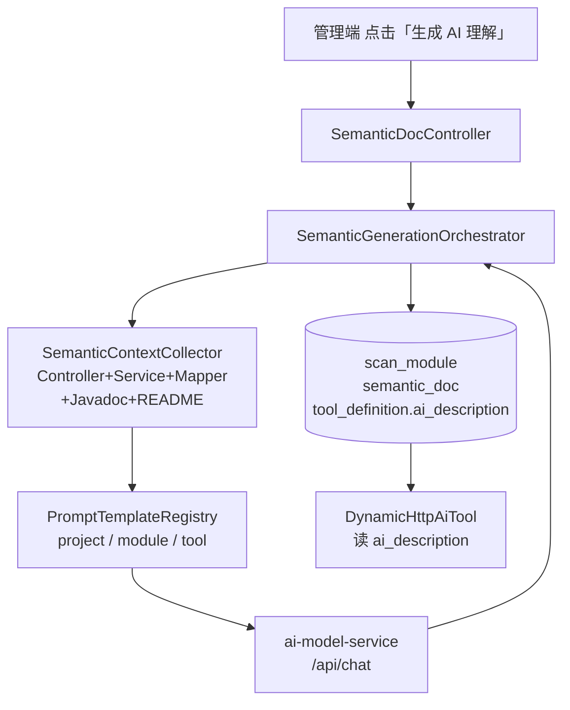

# AI 语义理解 — 设计与落地

> 文档版本：v1.0
> 更新时间：2026-04-23
> 目标读者：架构 / 后端 / 前端 / 产品

## 一、背景

企业里大量历史 Java 系统仍在稳定运行，按「背景、现状、目标 v1.8」的方向，我们已经做到：

- 管理端录入项目名、域名、磁盘路径。
- 后端运行时扫描 OpenAPI / Spring MVC Controller。
- 扫描结果直接写入 `scan_project` / `tool_definition`，并注册为动态 Tool。
- Agent 通过 `DynamicHttpAiTool` 直接调用历史系统。

但这只解决了「**Agent 能看到接口**」，没有解决「**Agent 能看懂接口**」：

- 扫描出来的 `description` 往往只是方法名或 Swagger 里一行空话；
- 参数含义、返回值结构、使用场景、与其他接口的关系，全都丢失；
- Agent 在真正决定要不要调某个接口时，没有足够的上下文。

结果是：能看到一堆接口，但 Agent 选择能力弱，Tool 的实际命中率低。

## 二、目标与非目标

**目标**：让 Agent 真正「懂」历史系统的**每一个接口 / 每一个模块 / 整个项目**分别是干什么的，而不是只看到方法名。

**非目标**：
- 不改现有扫描链路（OpenAPI / Controller scanner 保持原样）。
- 不做 Cursor 外部协同导出方案。
- 不在本期做 Agent 编排 UI 的扩展；本期只聚焦「语义层」。

## 三、核心思路

### 3.1 三层语义

把「看懂」拆成三层，粒度不同、用途不同：

| 层级 | 面向 | 典型用途 | 参考字数 |
|------|------|----------|----------|
| 项目级 | 架构/产品 | 一页业务域说明、模块地图、典型使用场景 | 1000-1500 字 Markdown |
| 模块级 | 开发/Agent | 模块职责、对外能力清单、与其他模块的依赖关系 | 500-800 字 |
| 接口级 | **Agent 运行时** | 一句话业务语义 + 使用场景 + 参数表 + 返回值 + 注意事项 | 结构化 Markdown |

接口级的产出会直接冗余写入 `tool_definition.ai_description`，Agent 运行时看到的 description 就是它。

### 3.2 不是只给 LLM 看 Controller

如果只把 Controller 方法签名发给 LLM，产出质量很差。我们用 JavaParser **顺藤摸到底**：

- **项目级**：README、`pom.xml <description>`、所有 Controller 类名索引。
- **模块级**：本 Controller 源码 + 通过字段/构造函数引用的 Service/Manager/Mapper 类源码。
- **接口级**：方法体 + 方法内调用的 Service/DTO 类型定义 + 出入参 DTO 字段。

每层有字符预算（项目 40k、模块 20k、接口 8k × 4 chars/token），超预算裁剪并加 `/* ...truncated... */` 标记。

### 3.3 生成策略

- **全手动触发**：不搞后台定时扫描，一切以管理端点击为准。
- **三种粒度**：整个项目一键生成 / 单模块重新生成 / 单接口重新生成。
- **人工编辑优先**：人改过的文档 `status=edited`，重生成时默认保留，`force=true` 才覆盖。
- **项目级互斥锁**：同一项目同一时刻只允许一个批量任务在跑。
- **Token 全链路记账**：`semantic_doc.token_usage` 记录单次生成消耗，管理端可聚合展示。

### 3.4 模块到底是什么

- 没有严格的技术定义（不是按包、不是按 jar）。
- **默认以 Controller 类名作为一个模块**，扫描完自动聚合初始化。
- **支持手动合并**：把多个 Controller 合并成一个业务模块，聚合后的类名保留在 `scan_module.source_classes`。
- **支持重命名**：`scan_module.display_name` 单独保存展示名，不污染原始 `name`。

## 四、整体数据流



## 五、数据模型

### 5.1 新建 `scan_module`

| 字段 | 说明 |
|------|------|
| `id` | 主键 |
| `project_id` | 所属扫描项目 |
| `name` | 模块唯一名，默认 = Controller 类名 |
| `display_name` | 用户可编辑的展示名 |
| `source_classes` | JSON 数组，合并后聚合多个原始 Controller 类名 |
| `create_time / update_time` | 审计字段 |

唯一键 `(project_id, name)`；索引 `(project_id)`。

### 5.2 新建 `semantic_doc`

| 字段 | 说明 |
|------|------|
| `id` | 主键 |
| `level` | `project` / `module` / `tool` |
| `project_id / module_id / tool_id` | 归属引用，按 level 有无 |
| `content_md` | LLM 产出 / 人工编辑后的 Markdown |
| `prompt_version` | 生成使用的 prompt 版本（随 prompt 模板升版） |
| `model_name` | 生成使用的模型名 |
| `token_usage` | 单次 `total_tokens` |
| `status` | `draft` / `generated` / `edited` |
| `create_time / update_time` | 审计字段 |

唯一键 `(level, project_id, module_id, tool_id)`：同一 ref 只保留最新一版，重生成覆盖。

### 5.3 扩展 `tool_definition`

- `ai_description MEDIUMTEXT`：LLM 生成的业务语义描述，Agent 运行时优先使用。
- `module_id BIGINT`：指向 `scan_module.id`。

迁移脚本：[`ai-skills-service/sql/semantic_docs_v6.sql`](../ai-skills-service/sql/semantic_docs_v6.sql)。

## 六、后端落地（ai-agent-service 为主）

### 6.1 上下文收集 `SemanticContextCollector`

`com.enterprise.ai.agent.semantic.context.SemanticContextCollector`

- 入参：`ScanProjectEntity`（带 `scanPath`）+ 目标层级。
- 产出：结构化 `SemanticContext` record，包含 `readmeExcerpt` / `moduleIndex` / `controllerSources` / `serviceSnippets` / `mapperSnippets` / `dtoSnippets` / `toolMethodSource` / `toolEndpoint` 等字段。
- 预算裁剪：超过每层字符预算时裁剪 DTO/Service 片段，只保留签名；末尾附 `/* ...truncated... */`。
- 依赖定位：通过构造函数参数、字段声明识别 `*Service` / `*ServiceImpl` / `*Manager` / `*Mapper` / `*Repository` / `*Dao` / `*Client`。

`JavaSourceIndex` 以 `project.scanPath` 为根构建「简名 → 文件路径」索引，避免重复扫盘。

### 6.2 Prompt 模板 `PromptTemplateRegistry`

模板文件放 `ai-agent-service/src/main/resources/prompts/semantic/`：

- `project.prompt.md` — 项目级
- `module.prompt.md` — 模块级
- `tool.prompt.md` — 接口级（接口级必须以 `## 一句话语义` 开头，便于抽取 `ai_description`）

`PromptTemplateRegistry.VERSION` 固定一个字符串版本号，随模板迭代升版，写入 `semantic_doc.prompt_version`。

### 6.3 生成编排 `SemanticGenerationOrchestrator`

三组同步方法 + 一组异步批量：

- `generateForProject(projectId, force)` — 1 次 LLM 调用。
- `generateForModule(moduleId, force)` — 1 次 LLM 调用。
- `generateForTool(toolId, force)` — 1 次 LLM 调用，额外回写 `tool_definition.ai_description`。
- `startProjectBatch(projectId, force)` → 异步 `runBatchAsync`：项目 1 次 + N 个模块 + M 个接口，内存任务表暴露进度（`QUEUED → RUNNING → DONE / FAILED`）。

关键约束：
- **项目级互斥锁**：`projectLocks: ConcurrentMap<Long, String>`，`putIfAbsent` 成功才允许启动，结束 `finally` 释放。
- **`@Lazy` 自引用解决 Spring 自调用**：`runBatchAsync` 内调用 `self.generateForXxx`，确保 `@Transactional` / `@Async` 代理生效。
- **force 语义**：
  - `force=false`：`status=edited` 的文档会被跳过，返回现有版本。
  - `force=true`：覆盖任何现有版本。

接口级生成后，从产出 Markdown 里抽取 `## 一句话语义` 下首段作为 `tool_definition.ai_description`，缺少标题时回退到前 500 字。

### 6.4 REST API `SemanticDocController`

| 端点 | 说明 |
|------|------|
| `POST /api/scan-projects/{id}/semantic/generate` | 项目级批量异步生成，返回 `taskId` |
| `GET /api/scan-projects/{id}/semantic/status` | 进度轮询，`taskId` 可选，缺省取最近任务 |
| `POST /api/scan-projects/{id}/semantic/generate-project` | 单层：仅项目级 |
| `POST /api/scan-modules/{id}/semantic/generate` | 单层：某个模块 |
| `POST /api/tools/{name}/semantic/generate` | 单层：某个接口（按 tool.name） |
| `GET /api/semantic-docs` | 按 level + refId 查询文档 |
| `GET /api/scan-projects/{id}/semantic-docs` | 列出项目下全部文档（含 toolName） |
| `PUT /api/semantic-docs/{id}` | 人工编辑，自动置 `status=edited` |
| `GET /api/scan-projects/{id}/modules` | 列出模块 |
| `PUT /api/scan-modules/{id}` | 重命名（只改 `display_name`） |
| `POST /api/scan-modules/merge` | 合并模块（`targetId` + `sourceIds` → 并入 targetId，自动迁移 `tool_definition.module_id`） |

### 6.5 扫描链路衔接

- `ScanProjectService.performScan` 完成后调用 `ScanModuleService.bootstrapFromTools`：按 Controller 类聚合，生成 `scan_module` 并回写 `tool_definition.module_id`。
- `ScanProjectService.delete` 调用 `SemanticDocService.deleteByProject` + `ScanModuleService.deleteByProject`，避免孤儿数据。

### 6.6 Agent 运行时消费

`DynamicHttpAiTool.description()` 改为：

```java
@Override
public String description() {
    String aiDescription = definition.getAiDescription();
    if (aiDescription != null && !aiDescription.isBlank()) {
        return aiDescription;
    }
    return definition.getDescription();
}
```

Agent 在选择 Tool 时看到的就是 LLM 产出的业务语义，而不是原始方法名。

## 七、前端落地（ai-admin-front）

### 7.1 左侧菜单

把原先的单项「扫描项目」改成子菜单：

- **项目列表** → `/scan-project`
- **AI 理解** → `/scan-project?intent=ai`

当前路由带 `tab=ai` 或 `intent=ai` 时侧栏高亮「AI 理解」。

### 7.2 扫描项目列表页

- 从菜单进入「AI 理解」时，顶部显示提示条：引导用户选择具体项目。
- 操作列新增绿色快捷入口「AI 理解」→ `/scan-project/{id}?tab=ai`。

### 7.3 扫描详情页新增「AI 理解」Tab

文件：[`ScanProjectDetail.vue`](../ai-admin-front/src/views/scan/ScanProjectDetail.vue)

Tab 分三块：

- **项目摘要卡片**：Markdown 预览 + `重新生成` + `编辑`。
- **模块列表**：每行展示 `display_name`、原始类名、`生成` / `编辑` / `合并` / `重命名`；合并用多选 + 下拉选目标模块。
- **接口列表**：每行显示 `ai_description` 缩略（120 字），悬浮弹窗查看完整 Markdown，`重新生成` 单行按钮。

顶部工具栏：
- 「一键生成 AI 理解」→ 后台任务 + 进度条轮询（2s 一次，`DONE / FAILED` 停止）。
- 「强制重生成（覆盖已编辑）」= `force=true`。
- URL 同步：切换 Tab 会 `router.replace` 更新 `?tab=ai`，收藏 / 分享 / 高亮都友好。

### 7.4 新增前端文件

- `ai-admin-front/src/types/semanticDoc.ts`：类型定义（`SemanticDoc` / `SemanticTask` / `ScanModule` + 请求/响应）。
- `ai-admin-front/src/api/semanticDoc.ts`：对 `SemanticDocController` 的所有端点封装。
- `package.json` 新增 `marked` 依赖用于 Markdown 渲染。

## 八、关键风险与应对

| 风险 | 应对 |
|------|------|
| 大项目 token 爆炸 | 预算裁剪 + 模块/接口永不合批 |
| LLM 输出不稳定 | Prompt 强约束 section；`status=edited` 保留人工版 |
| 成本 | 默认全手动触发；`token_usage` 入库便于核算 |
| 并发 / 重复生成 | `projectLocks` 项目级互斥锁 |
| Spring 自调用失效 | `@Lazy self` 解决 `@Async` / `@Transactional` |
| 模块划分不合业务 | 支持手动合并 + 重命名，`display_name` 与 `source_classes` 解耦 |

## 九、单元测试

新增覆盖：

- `DynamicHttpAiToolDescriptionTest`：`ai_description` 优先、空白回退。
- `SemanticContextCollectorTest`：项目级 README/pom、模块级 Controller/Service、接口级方法体/DTO、Controller 缺失降级。
- `SemanticGenerationOrchestratorTest`：`extractToolSummary` 三种输入；`startProjectBatch` 同项目并发触发 409。
- `SemanticDocControllerTest`：批量 202 / 409、`status` 任务缺省回退、`generateTool` 404/200。

全量 `mvn -pl ai-agent-service test` 与前端 `vue-tsc --noEmit` 均通过。

## 十、端到端闭环

1. 在管理端「扫描项目」里选一个历史项目（如 `legacy-order`），触发扫描。
2. 进入「AI 理解」Tab，点击「一键生成 AI 理解」。
3. 进度条跑完后检查：
   - 项目摘要 / 模块说明 / 接口卡片都已填充。
   - 模块可合并 / 重命名，合并后接口自动归到新模块。
4. Agent 端触发一次包含该项目接口的对话，在 LLM 的 prompt 里应看到该接口的 description 已经是生成的业务语义，而不再是方法名。

做到以上 4 步，即视为闭环成功。

## 十一、与主线文档的关系

本文档是对 [`背景、现状、目标.md`](./背景、现状、目标.md) 中「下一步目标 · 补齐 Service / JavaDoc 深扫能力」的**具体落地**。扫描主线保持不变，本期工作全部叠加在既有的 `scan_project` / `tool_definition` 之上，没有破坏原来的运行时主线。
