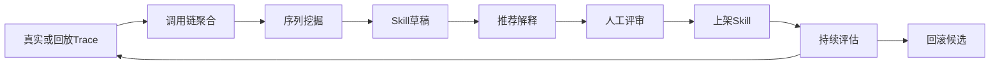

# Phase 2.1 Skill Mining 数据闭环设计

> 承接 `产品演进路线-Skill-AgentStudio-护栏.md` 中“代码已交付，待真实 `tool_call_log` 数据验证”的状态。目标是让 Skill Mining 从候选生成工具变成持续发现、评审、上架、评估、回滚的运营闭环。

## 一、当前问题

已有能力：

- `tool_call_log` 记录 Tool / Skill 调用。
- `ToolChainAggregator` 可按 trace 聚合调用链。
- `PrefixSpanMiner` 可发现高频序列。
- `skill_draft` 支持草稿评审。
- `skill_eval_snapshot` 支持指标快照。

缺口：

- 真实 trace 数据不足，阈值不可验证。
- 草稿内容偏模板，业务可读性不够。
- 评审时缺少“为什么推荐”的证据。
- 上架后没有清晰对比原 ReAct 路径和 Skill 路径。
- 回滚候选缺少可解释依据。

## 二、闭环目标



本阶段交付不追求复杂算法，而是优先把“可验证、可解释、可运营”打通。

## 三、Trace 数据来源

### 3.1 真实流量

从现有 Agent 调试、Studio 调试、MCP/A2A 调用中自然沉淀。

要求：

- 每条 trace 必须有 `traceId`、`sessionId`、`userId`、`agentName`。
- Tool 调用必须记录 `args_json`、`result_summary`、`success`、`cost_ms`。
- Retrieval trace 尽量记录候选 Tool 和最终 Tool 集合。

### 3.2 Demo 流量生成器

为避免没有真实业务流量导致 Mining 无法调参，建议新增演示数据生成能力。

API：

```text
POST /api/skill-mining/demo-traces/generate
```

参数：

- `scenario`：如 `order_after_sale`、`user_profile_update`、`knowledge_to_ticket`。
- `traceCount`：生成数量。
- `successRate`：成功率。
- `noiseRate`：插入无关 Tool 的比例。

生成规则：

- 写入 `tool_call_log`，但 `source=DEMO` 或 `metadata_json.demo=true`。
- 默认不参与生产评估，只有显式勾选才参与 Mining。
- 可一键清理 demo trace。

### 3.3 Trace 回放器

对已有 trace 支持回放：

```text
POST /api/skill-mining/traces/{traceId}/replay
```

回放目标：

- 验证相同输入下原 ReAct 路径是否稳定。
- 验证 Skill 上架后是否能替代原链路。
- 生成对比报告。

## 四、草稿生成升级

### 4.1 混合策略

`SkillDraftLlmWriter` 升级为混合策略：

- 工具序列和 `toolWhitelist` 只能来自挖掘结果，不允许 LLM 编造。
- LLM 只生成 `name`、`description`、`systemPrompt`、`reviewReason`。
- 参数 schema 和调用边界来自现有 Tool 定义。
- 生成结果必须经过工具名白名单校验。

提示词约束：

```text
你只能使用输入中出现的 toolNames。
不要新增、改名或删除任何 Tool。
请基于 trace 摘要说明这个 Skill 解决的业务目标、适用场景和边界。
```

### 4.2 草稿字段扩展

建议扩展 `skill_draft`：

- `review_reason`：推荐理由。
- `evidence_json`：支持度、来源 trace、成功率、平均耗时、token 估算。
- `draft_kind`：`SUB_AGENT / INTERACTIVE_FORM / AUGMENTED_TOOL / WORKFLOW_CANDIDATE`。
- `source`：`MINING / TRACE_EXTRACT / DEMO / MANUAL`。
- `risk_level`：根据 sideEffect 和失败率计算。

### 4.3 Skill 类型判断

推荐规则：

- 单 Tool 高频调用，且存在参数清洗 / 结果整形需求：`AUGMENTED_TOOL`。
- 多 Tool 顺序稳定、分支少：`WORKFLOW_CANDIDATE`。
- 多 Tool 顺序不稳定但业务域清晰：`SUB_AGENT`。
- 入参缺失率高、需要用户补齐：`INTERACTIVE_FORM`。

当前系统可先产出 `SUB_AGENT` 和 `WORKFLOW_CANDIDATE` 草稿，后者进入 Agent Studio 画布草稿，而不是直接发布成 WorkflowSkill。

## 五、评审体验

Skill Mining 页面需要回答四个问题：

1. 为什么推荐这个 Skill？
2. 它来自哪些 trace？
3. 上架后能替代多少现有调用？
4. 风险是什么？

评审页建议展示：

- 高频序列泳道图。
- 来源 trace 时间线。
- Tool 成功率、P50/P95 耗时、Token 成本。
- sideEffect 最大等级。
- 参数缺失率。
- 推荐 Skill 类型。
- LLM 生成的业务描述和 systemPrompt。

操作：

- 上架为 Skill。
- 进入 Studio 生成 Workflow 草稿。
- 丢弃。
- 标记为需要更多数据。
- 合并相似草稿。

## 六、上架后评估

### 6.1 指标

延续 `Skill-评估指标口径.md`，新增对比指标：

- `AdoptionRate`：相同意图下 Skill 路径占比。
- `SuccessRateDiff`：Skill 路径成功率 - 原 ReAct 路径成功率。
- `LatencyDiff`：Skill 路径 P95 耗时 - 原 ReAct 路径 P95 耗时。
- `TokenSavings`：平均 token 节省。
- `RiskCallReduction`：高 sideEffect Tool 暴露次数下降。

### 6.2 对照组

Skill 发布后需要保留一段灰度：

- 10% 请求走 Skill。
- 90% 请求走原 Agent 路径。
- 按 `userId` 或 `sessionId` hash 分桶。
- 至少积累 7 天或 100 条 trace 后给出评估结论。

### 6.3 回滚候选

自动标记 `ROLLBACK_CANDIDATE` 的条件：

- Skill 成功率低于原路径 5 个百分点以上。
- P95 耗时高于原路径 30% 以上。
- 触发限流 / 熔断 / sideEffect 拦截次数异常。
- 用户人工反馈为负。
- 连续 7 天 AdoptionRate 低于 5%。

## 七、API 设计

```text
POST /api/skill-mining/demo-traces/generate
DELETE /api/skill-mining/demo-traces
POST /api/skill-mining/traces/{traceId}/replay
POST /api/skill-mining/drafts/generate?includeDemo=false
GET  /api/skill-mining/drafts/{id}/evidence
POST /api/skill-mining/drafts/{id}/merge
POST /api/skill-mining/drafts/{id}/publish-with-gray
GET  /api/skill-mining/skills/{name}/evaluation
POST /api/skill-mining/skills/{name}/rollback
```

## 八、与 Agent Studio 的关系

当草稿判断为 `WORKFLOW_CANDIDATE` 时，不直接进入 Skill 列表，而是生成 Studio 画布草稿：

- 每个 Tool 调用变成一个 Tool 节点。
- trace 顺序变成默认控制流。
- 接口图谱确认边变成参数映射建议。
- 运营在 Studio 中调整后发布。

这样避免重新引入独立 Workflow DSL。

## 九、验收用例

1. 生成 100 条 demo trace 后，Mining precheck 显示数据已满足挖掘条件。
2. 运行草稿生成后，草稿列表展示来源 trace、支持度和推荐理由。
3. LLM 生成的草稿不得包含不存在的 Tool 名。
4. 上架 Skill 后，评估页能对比 Skill 路径和原 ReAct 路径。
5. 当 Skill 成功率显著低于原路径时，系统自动标记 `ROLLBACK_CANDIDATE`。
6. `WORKFLOW_CANDIDATE` 能进入 Agent Studio 形成可编辑画布草稿。

## 十、推荐拆分

1. `2.1.1`：demo trace 生成器 + 清理能力。
2. `2.1.2`：LLM 草稿反写 + evidence_json。
3. `2.1.3`：评审页证据面板 + trace 对比。
4. `2.1.4`：灰度上架与持续评估。
5. `2.1.5`：Workflow 草稿导入 Agent Studio。
