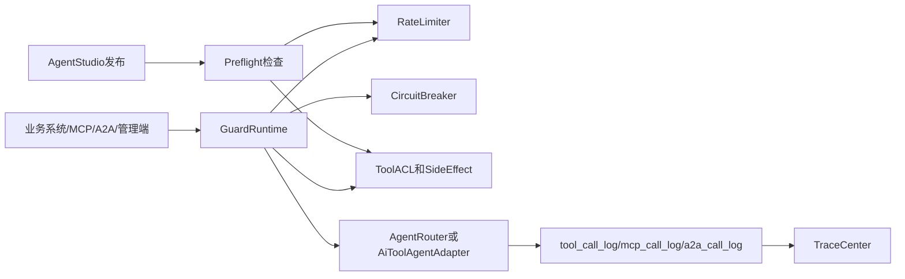
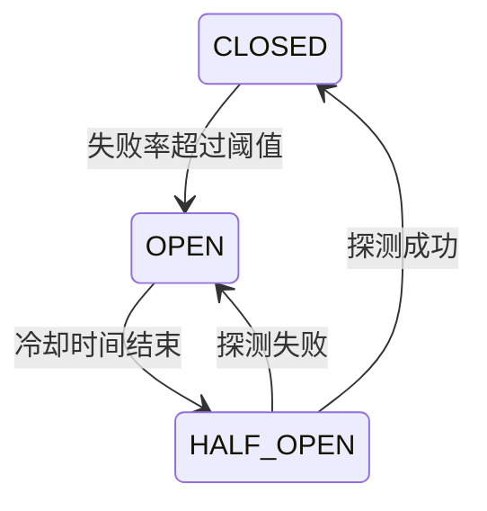

# Phase 4.2 生产护栏与 Trace Center 设计

> 承接 `产品演进路线-Skill-AgentStudio-护栏.md` 中 Phase 4 Backlog。目标是让 Agent Studio、MCP、A2A、业务网关都能在统一护栏下开放能力。

## 一、设计目标

当前系统已经具备 `sideEffect`、Tool ACL、Trace、MCP/A2A 调用日志。下一步需要补齐生产运行时的四类能力：

1. 限流：避免单个用户、租户、Client、Agent 或 Tool 打爆模型和业务系统。
2. 熔断：下游历史系统异常时快速止损。
3. 审计中心：把 Agent、Tool、MCP、A2A 调用统一到一个查询入口。
4. 发布前检查：Agent Studio 发布前暴露风险，而不是上线后靠事故发现。

## 二、整体架构



建议新增统一运行时组件：

- `GuardRuntimeService`：封装限流、熔断、ACL、sideEffect 检查的统一入口。
- `RateLimitService`：Redis 令牌桶。
- `CircuitBreakerService`：按资源维度统计失败率并熔断。
- `TraceCenterService`：跨日志表查询与聚合。
- `AgentPreflightService`：发布前检查。

## 三、限流设计

### 3.1 限流维度

支持多维规则，命中多条时取最严格结果：

- `TENANT`：租户级总额度。
- `USER`：用户级额度。
- `ROLE`：角色级额度。
- `AGENT`：`keySlug` 或 `agentId`。
- `TOOL`：Tool / Skill 名称。
- `PROJECT`：扫描项目或历史系统域名。
- `MCP_CLIENT`：MCP Client。
- `A2A_ENDPOINT`：A2A 暴露端点。
- `MODEL_PROVIDER`：模型供应商，控制 token 成本。

### 3.2 数据模型

建议新增 `rate_limit_rule`：

```text
id
scope_type
scope_key
window_seconds
limit_count
burst_count
enabled
priority
note
created_at
updated_at
```

Redis key：

```text
eaf:rl:{scopeType}:{scopeKey}:{windowStart}
```

令牌桶可先用固定窗口 + Lua 原子递增实现，后续再升级滑动窗口。对企业后台场景，固定窗口足够解释清楚，也便于运营配置。

### 3.3 执行点

- `AgentGatewayController`：外部业务 Agent 调用入口。
- `AgentRouter`：内部统一执行入口，防止绕过 Gateway。
- `AiToolAgentAdapter`：Tool / Skill 调用前的最后一道闸。
- `McpServerEndpoint.tools/call`：Client 级与 Tool 级限流。
- `A2aServerEndpoint.message/send`：Endpoint 与 Agent 级限流。

返回建议：

```json
{
  "code": "RATE_LIMITED",
  "message": "当前调用超过限流规则",
  "scopeType": "TOOL",
  "scopeKey": "create_order",
  "retryAfterSeconds": 30
}
```

## 四、熔断设计

### 4.1 熔断维度

- 历史系统域名：`project.base_url`。
- Tool project：扫描项目整体异常时熔断。
- Agent key：某个 Agent 错误率异常。
- Model provider：模型供应商异常。

### 4.2 状态机



数据模型建议：

- `circuit_breaker_rule`：规则配置。
- `circuit_breaker_state`：当前状态、失败计数、最近打开时间、下一次探测时间。

默认策略：

- 统计窗口：60 秒。
- 最小请求数：20。
- 失败率阈值：50%。
- 打开时长：60 秒。
- 半开探测请求数：3。

## 五、统一 Trace Center

当前已有：

- `tool_call_log`
- `mcp_call_log`
- `a2a_call_log`
- `/api/traces/{traceId}`

建议新增 Trace Center，不替代原接口，而是做聚合视图。

### 5.1 查询维度

```text
GET /api/trace-center/search
  ?traceId=
  &userId=
  &agentKey=
  &toolName=
  &mcpClientId=
  &a2aEndpointId=
  &success=
  &startTime=
  &endTime=
```

返回结构：

- Trace 摘要：入口类型、用户、角色、Agent、耗时、成功状态、风险等级。
- 调用时间线：Agent 节点、Tool 节点、MCP/A2A 节点。
- 治理决策：ACL、sideEffect、rateLimit、breaker 命中情况。
- 成本指标：token、模型、耗时、重试次数。

### 5.2 审计事件

建议新增 `guard_decision_log`：

```text
id
trace_id
decision_type      -- RATE_LIMIT / BREAKER / ACL / SIDE_EFFECT / PREFLIGHT
target_kind
target_name
decision           -- ALLOW / DENY / WARN / SKIP
reason
metadata_json
created_at
```

这样 Trace Center 能回答“为什么这个工具没被 Agent 看见 / 为什么这次调用被拒绝”。

## 六、Studio 发布前检查

`AgentPreflightService` 在发布 AgentVersion 前运行，输出阻断项和警告项。

阻断项：

- Agent 没有任何 Tool / Skill。
- 引用了不存在或禁用的 Tool / Skill。
- 当前发布角色无法通过 Tool ACL。
- 包含 `IRREVERSIBLE` Tool 但 `allowIrreversible=false`。
- Tool 参数 schema 为空或无必填字段说明。

警告项：

- Tool 缺少 `ai_description`。
- Tool 缺少限流规则。
- 目标项目没有熔断规则。
- 引用了外部 MCP / A2A 暴露能力但无调用额度。
- P95 延迟或失败率超过阈值。

API：

```text
POST /api/agents/{id}/preflight
POST /api/agent-versions/{id}/preflight
```

前端：

- Studio 发布弹窗增加“发布前检查”步骤。
- 阻断项必须处理后才能发布。
- 警告项允许继续发布，但写入版本备注和审计日志。

## 七、管理端信息架构

建议新增一级或二级菜单“治理中心”：

- 限流规则
- 熔断规则
- Trace Center
- 发布检查记录
- 治理决策日志

已有 `Tool ACL` 可以保留在设置中，也可以迁移到治理中心下。

## 八、兼容与灰度

上线顺序建议：

1. 只记录 `guard_decision_log`，不拦截。
2. 开启限流 dry-run，观察命中量。
3. 对 MCP Client 和 A2A Endpoint 开启真实限流。
4. 对 Tool / Agent 开启熔断。
5. Studio 发布前检查从 warn-only 切换为阻断。

所有规则都需要 `enabled` 和 `dry_run` 字段，避免一次性影响存量演示。

## 九、验收用例

1. 配置某 MCP Client 每分钟 3 次调用，第 4 次返回 `RATE_LIMITED` 并写入治理决策日志。
2. 某历史系统连续失败超过阈值后，相关 Tool 调用被熔断，冷却后进入半开探测。
3. Trace Center 能通过 `traceId` 同时看到 A2A 入口、Agent 执行、Tool 调用和治理决策。
4. Studio 发布引用一个禁用 Tool 时，preflight 给出阻断项。
5. 规则 dry-run 时调用不被拒绝，但 Trace Center 能看到本应拒绝的决策。

## 十、推荐拆分

1. `4.2.1`：`guard_decision_log` + Trace Center 聚合查询。
2. `4.2.2`：Redis 限流规则、执行点接入、管理端页面。
3. `4.2.3`：熔断规则、状态机、半开探测。
4. `4.2.4`：Agent Studio 发布前检查。
