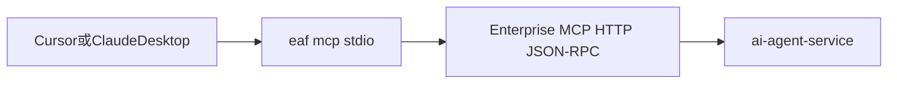

# Phase P3 MCP / A2A 生态补强设计

> 承接 `PhaseP2-MCP-A2A-落地验收清单.md`。P2 已完成协议入口、Client 管理、可见性、调用日志和管理端页面。P3 的目标是让外部生态真正可用、可诊断、可自动化。

## 一、阶段目标

P3 聚焦三件事：

1. A2A Task Persistence：让 `tasks/get` 和 `tasks/cancel` 有真实状态，不再只是同步调用占位。
2. MCP stdio / CLI 桥：让 Cursor、Claude Desktop、CI、内网机器在无 HTTP 出网或更偏命令行的场景下接入。
3. 接入诊断：让运营能解释“为什么 tools/list 看不到某个 Tool”或“为什么 tools/call 被拒绝”。

## 二、A2A Task Persistence

### 2.1 当前状态

P2 中 `message/send` 已经能调用 `AgentRouter.executeByDefinition`，但 `tasks/get` 和 `tasks/cancel` 还没有真实任务生命周期。这对 Dify、LangGraph、远程 Agent 编排器不友好，因为它们通常期望：

- 提交任务后可轮询。
- 能查历史结果。
- 能取消长任务。
- 能拿到 traceId 做排障。

### 2.2 数据模型

新增 `a2a_task`：

```text
id
task_id
endpoint_id
agent_key
context_id
user_id
state             -- submitted / working / completed / failed / canceled
input_message_json
output_task_json
trace_id
error_message
started_at
completed_at
created_at
updated_at
```

新增 `a2a_task_event`：

```text
id
task_id
event_type        -- submitted / progress / tool_call / completed / failed / canceled
event_json
created_at
```

### 2.3 执行模式

短期仍保持同步执行，但写真实 task：

1. `message/send` 收到请求。
2. 创建 `a2a_task(state=working)`。
3. 调用 `AgentRouter`。
4. 写入输出、traceId、最终状态。
5. 返回 A2A Task。

中期支持异步：

- 请求中 `metadata.async=true` 时立即返回 `submitted`。
- 后台执行 Agent。
- 客户端通过 `tasks/get` 轮询。

### 2.4 API 行为

- `message/send`：始终创建或更新 `a2a_task`。
- `tasks/get`：按 `taskId` 返回持久化 Task。
- `tasks/cancel`：仅对 `submitted / working` 生效；同步执行中的 Java 线程不强杀，先标记取消并让后续步骤检查取消标记。

## 三、MCP stdio / CLI 桥

### 3.1 目标

HTTP MCP 已经适合服务器到服务器接入，但仍有三类场景需要 CLI：

- 本地 IDE 只方便启动 stdio MCP server。
- CI/CD 环境希望直接命令行调用 Agent、Tool、Skill、Trace。
- 内网或安全域不允许外部应用直接访问后端 HTTP。

### 3.2 命令设计

命令名建议 `eaf`。

```text
eaf auth login --server http://host:8603 --api-key <prefix.plain>
eaf mcp stdio
eaf agent chat <keySlug> --message "..." --user-id demo
eaf tool list --project <projectId>
eaf tool call <toolName> --json args.json
eaf skill test <skillName> --message "..."
eaf scan trigger <projectId>
eaf trace show <traceId>
eaf doctor
```

### 3.3 实现边界

CLI 不绕过后端治理：

- 所有调用仍走 REST / MCP HTTP。
- API Key、roles、Tool ACL、sideEffect、限流、Trace 逻辑全部沿用后端。
- CLI 本地只保存 server 地址和 token，不缓存 Tool 执行结果。

### 3.4 stdio MCP 桥

`eaf mcp stdio` 作为本地进程：



桥接职责：

- 从 stdio 读取 JSON-RPC。
- 转发到 `/mcp/jsonrpc`。
- 注入 Authorization header。
- 原样返回 JSON-RPC 响应。
- 本地打印诊断日志到 stderr。

## 四、接入诊断

### 4.1 MCP 可见性诊断

新增 API：

```text
POST /api/mcp/diagnose/tools
```

输入：

```json
{
  "clientId": 1,
  "toolNames": ["create_order", "refund_order"]
}
```

输出每个 Tool 的判断链：

- `mcp_visibility` 是否 exposed。
- 是否在 `client.tool_whitelist_json` 内。
- `ToolAclService.decide` 结果。
- Tool 是否 enabled。
- Tool 是否 agentVisible。
- sideEffect 风险。
- 限流规则是否存在。

### 4.2 A2A Endpoint 诊断

新增 API：

```text
POST /api/a2a/endpoints/{id}/diagnose
```

检查：

- Agent 是否存在。
- AgentVersion 是否有 active snapshot。
- AgentCard URL 是否可访问。
- Tool ACL 是否会导致无工具可用。
- 是否配置限流和熔断。
- 最近 24 小时失败率。

### 4.3 Onboarding 向导增强

MCP Onboarding 增加：

- 一键生成 `mcp.json`。
- 连通性测试。
- `tools/list` 预览。
- 不可见 Tool 的原因解释。
- 复制 `eaf mcp stdio` 配置。

A2A Onboarding 增加：

- AgentCard 预览。
- Dify / LangGraph 配置示例。
- `message/send` 测试。
- `tasks/get` 测试。
- Trace 深链。

## 五、调用日志与 Trace 对齐

P3 要求所有外部调用都能从 Trace Center 追到：

- MCP `tools/list`：没有 Tool 调用，但要有 `mcp_call_log`。
- MCP `tools/call`：必须关联 `tool_call_log.trace_id`。
- A2A `message/send`：必须写 `a2a_task.trace_id`。
- A2A `tasks/get`：写 `a2a_call_log`，但不新建 trace。
- CLI 调用：`userId` 建议为 `cli:{profileName}` 或显式参数。

## 六、安全策略

- CLI token 只在本机用户目录保存，文件权限尽量收紧。
- `eaf auth login` 不打印完整 API Key。
- `eaf doctor` 不输出密钥，只输出 prefix。
- stdio 桥不允许配置绕过 TLS 校验，除非显式 `--insecure`。
- A2A task 历史查询必须校验 endpoint 权限，不允许通过 taskId 枚举。

## 七、验收用例

1. Dify 调用 A2A `message/send` 后，`tasks/get` 能返回同一个 task 的最终状态和 traceId。
2. 对已完成 task 调用 `tasks/cancel` 返回不可取消的明确错误。
3. `eaf mcp stdio` 能代理 `tools/list` 和 `tools/call`。
4. `eaf trace show <traceId>` 能展示 Agent、Tool、MCP/A2A 入口摘要。
5. MCP 诊断能解释某 Tool 因 `mcp_visibility=false` 不可见。
6. A2A 诊断能发现某 Agent 没有 active version 或 Tool ACL 后无可用工具。

## 八、推荐拆分

1. `P3.1`：A2A task 表、`tasks/get`、`tasks/cancel` 真实状态。
2. `P3.2`：MCP / A2A 诊断 API 和前端诊断面板。
3. `P3.3`：`eaf` CLI 基础命令。
4. `P3.4`：`eaf mcp stdio` 桥。
5. `P3.5`：Onboarding 向导升级与 Trace 深链。
