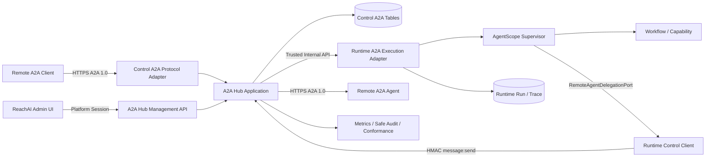
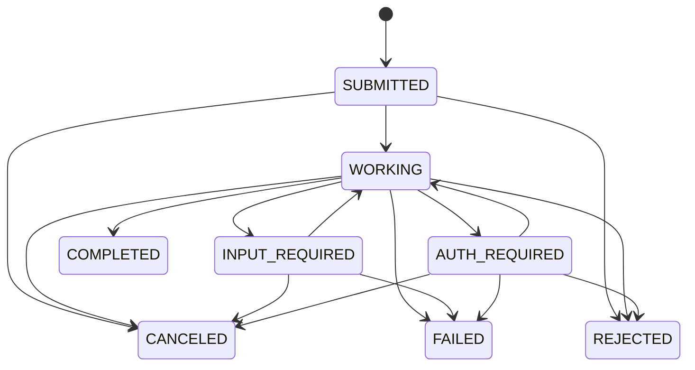

# A2A 互联中心技术架构

> 状态：CORE_E2E_VERIFIED_PRODUCTION_GATES_PENDING
> 依赖产品契约：[a2a-hub-product-design.md](./a2a-hub-product-design.md)
> 协议基线：A2A Protocol 1.0 / HTTP+JSON first
> SDK 评估基线：官方 `a2a-java` 1.2.0.Final（只允许进入 transport adapter）

## 1. 架构决策

### 1.1 Clean-slate replacement

新实现建立在 `com.enterprise.ai.control.a2a` 和 `com.enterprise.ai.runtime.a2a` 命名空间。旧 `governance.ControlA2a*` 代码不作为抽象、基类、DTO、Mapper 或兼容入口复用。

迁移完成后旧路由、旧表结构、旧页面和旧测试全部删除。开发期间允许新旧源码短暂同时存在以保持小步可编译，但：

- 新代码不得调用旧 Mapper 或 Controller。
- 新表不得从旧表读取或双写。
- 新 API 不提供旧字段 alias。
- 发布切换必须一次完成，不能长期保留两个事实源。

### 1.2 五服务拓扑不变

首期不增加第六个微服务。

- `reachai-control-service` 是 A2A Hub 产品与协议 owner。
- `reachai-runtime-service` 是本地 Agent 执行、Supervisor 决策、委派挂起/恢复和取消 owner。
- Capability、Knowledge、Model 服务不拥有 A2A 表，也不直接接收 A2A 协议请求。
- 同库不等于同边界；Control 与 Runtime 只通过 internal API 协作，不跨服务 Mapper/SQL。

### 1.3 领域模型与协议模型分离

A2A SDK、JSON 字段和 transport 错误只存在于 protocol adapter。核心领域使用自己的类型和状态规则：

- Domain 不依赖 Spring MVC、MyBatis、Jackson、Feign 或 A2A SDK。
- Application 依赖 Domain 与 Port，不依赖具体 HTTP binding。
- Persistence Entity 不作为 API 响应。
- 管理 API 使用类型化 request/view，不以 `Map<String,Object>` 作为核心契约。
- Agent Card 从不可变 Publication Revision 确定性生成，不把任意 JSON 当事实源。

## 2. 系统上下文



## 3. 限界上下文

### 3.1 Publication

职责：把本地 `runtime_agent` 的一个已发布配置投影为对外 A2A 契约。

聚合根：`A2aPublication`

不变量：

- 一个 revision 固定 `agentId + agentConfigVersionId`。
- `PUBLISHED` revision 不可修改。
- Agent Card 必填字段、接口、securityRequirements 和真实实现能力一致。
- 生产 Publication 必须使用 HTTPS origin 和非匿名 Trust Profile。
- current revision 只能指向校验通过且未归档的 revision。

### 3.2 Remote Agent Catalog

职责：发现、验证、版本化并固定远程 Agent 契约。

聚合根：`A2aRemoteAgent`

不变量：

- 每次 Card 内容变化产生新 revision；不覆盖历史 JSON/hash/验证证据。
- Runtime 绑定只引用明确的 remote revision，不引用“latest”。
- Card URL、interface URL、icon/docs URL 分别执行用途匹配的 SSRF/HTTPS 策略。
- `TRUSTED` 不由网络可达自动推导；必须经过 Trust Profile 和审核。

### 3.3 Trust & Identity

职责：把传输层凭据解析为稳定 Principal，并在每个操作上授权。

聚合根：`A2aPrincipal`、`A2aTrustProfile`、`A2aCredential`

不变量：

- `principalId` 来自认证结果，永不来自 A2A Message/Task metadata。
- tenant、scope、trust level 和 delegated user 只能来自受信任凭据声明或策略映射。
- 凭据 API 只接收一次秘密，返回 fingerprint/状态，不返回秘密或密文。
- credential material 只保存慢哈希、AES-GCM 密文、证书引用或外部 secret reference。
- 每次 Task Get/List/Cancel/Subscribe 都按 Principal、tenant 和授权范围重新判断。

### 3.4 Context & Task

职责：维护协议资源、生命周期、幂等、消息、产物和事件账本。

聚合根：`A2aTask`，`A2aContext` 是所有权与连续性边界。

不变量：

- taskId 由服务端生成；Message 的 taskId 只能引用已存在且属于当前 Principal 的 Task。
- contextId 与 taskId 同时出现时必须匹配。
- `principalId + direction + messageId` 唯一，重复请求不产生第二个执行。
- 每个 Task 的 event sequence 从 1 单调递增，不覆盖历史事件。
- 状态迁移只能由领域状态机完成。
- terminal Task 不再回到工作态。
- Message 用于通信，任务输出使用 Artifact。

### 3.5 Transport & Conformance

职责：协议版本协商、binding 映射、Card 序列化、错误映射、流式/推送适配、TCK 证据和安全摘要。

Transport 不是领域事实源；完整 HTTP request/response body 不写 transport event。

## 4. 服务职责

### 4.1 Control

Control 拥有：

- Management API 和 A2A public protocol routes。
- Publication、Remote Agent、Principal、Trust Profile、Credential。
- Context/Task/Message/Artifact/Event 的协议事实。
- Agent Card 生成、发现、签名/证书验证、协议协商。
- 入站认证授权、出站凭据注入、限流/并发/大小策略。
- HTTP+JSON、后续 JSON-RPC/gRPC binding。
- Outbox、push delivery、transport safe audit、conformance report。

Control 不拥有：

- Agent 推理、Workflow 执行、Tool 调用。
- Runtime Run/Trace 的最终执行事实。
- Supervisor 如何选择 Workflow 或远程 Agent 的推理实现。

### 4.2 Runtime

Runtime 拥有：

- A2A 入站任务对应的本地 Agent 执行。
- Agent 配置版本下的 Remote Agent allowlist/binding。
- Supervisor 动态委派选择。
- 未来 GraphSpec `REMOTE_AGENT` 节点。
- 执行挂起/恢复、真实取消、Run/Trace 与 A2A_DELEGATION span。
- 把执行事件以幂等 internal callback 交给 Control。

Runtime 不解析 Agent Card、不保存远端凭据、不实现外部 A2A transport。

## 5. 代码结构

### 5.1 Control

```text
com.enterprise.ai.control.a2a
├─ domain
│  ├─ publication
│  ├─ remoteagent
│  ├─ identity
│  ├─ task
│  └─ conformance
├─ application
│  ├─ port
│  ├─ publication
│  ├─ remoteagent
│  ├─ identity
│  ├─ task
│  └─ overview
├─ api
│  ├─ management
│  ├─ protocol
│  └─ internal
└─ infrastructure
   ├─ persistence
   ├─ security
   ├─ transport
   │  ├─ httpjson
   │  └─ sdk
   ├─ runtime
   ├─ outbox
   └─ observability
```

依赖方向固定为 `api/infrastructure → application → domain`。`application.port` 定义 repository、clock、id generator、cipher、Runtime gateway、remote transport、event publisher。

### 5.2 Runtime

```text
com.enterprise.ai.runtime.a2a
├─ domain
├─ application
├─ api.internal
├─ supervisor
├─ graph
├─ client.control
└─ persistence
```

Runtime 的 `RemoteAgentDelegationPort` 只暴露协议中立命令：`send`、`get`、`cancel`、`subscribe/resume`。A2A SDK 类型不得进入 Supervisor 或 GraphSpec executor。

## 6. 公共路由

### 6.1 Management API

平台会话认证，统一前缀 `/api/a2a-hub`：

| 资源 | 主要路由 |
| --- | --- |
| 总览 | `GET /api/a2a-hub/overview` |
| 本地发布 | `/api/a2a-hub/publications/**` |
| 远程 Agent | `/api/a2a-hub/remote-agents/**` |
| Task/Context | `/api/a2a-hub/tasks/**`、`/api/a2a-hub/contexts/**` |
| 信任 | `/api/a2a-hub/trust-profiles/**`、`/api/a2a-hub/principals/**` |
| 凭据 | `/api/a2a-hub/credentials/**` |
| 诊断 | `/api/a2a-hub/conformance-runs/**`、`/api/a2a-hub/diagnostics/**` |

列表响应使用稳定 `PageView<T>`；创建/命令接口使用 request DTO；错误使用统一 problem detail，不返回 Entity、Mapper 字段或异常堆栈。

### 6.2 A2A 1.0 public protocol

生产发布采用 host-based routing：独立公开 host 映射到一个 Publication Revision。

| 操作 | HTTP+JSON route |
| --- | --- |
| Agent Card | `GET /.well-known/agent-card.json` |
| Send Message | `POST /a2a/v1/message:send` |
| Streaming Message | `POST /a2a/v1/message:stream` |
| Get Task | `GET /a2a/v1/tasks/{id}` |
| List Tasks | `GET /a2a/v1/tasks` |
| Cancel Task | `POST /a2a/v1/tasks/{id}:cancel` |
| Subscribe | `POST /a2a/v1/tasks/{id}:subscribe` |
| Extended Card | `GET /a2a/v1/extendedAgentCard` |

首发只声明已经实现的 HTTP+JSON 能力。未实现 streaming/push/extended card 时 Agent Card 对应 capability 必须为 false/省略，调用返回规范的 UnsupportedOperation 错误。

开发环境可以提供 publication-scoped 诊断 URL，但 Agent Card/TCK 的生产合规证据必须来自 host-based 标准入口。旧 `/.well-known/agent.json` 与 JSON-RPC 路由不提供 alias。

### 6.3 版本协商

- Card 中 interface `protocolVersion` 使用 `1.0`，不包含 patch。
- 协议请求必须携带 `A2A-Version: 1.0`；缺失 header 按规范只能解释为 0.3，因此新实现返回明确 `VersionNotSupportedError`，不静默按 1.0 处理。
- response 返回协商后的版本 header。
- 不支持版本使用 binding 对应标准错误。

## 7. Internal API

所有 internal API 使用现有服务间 HMAC、nonce、时间窗和重放防护。

### 7.1 Control → Runtime：入站执行

`POST /internal/runtime/a2a/executions`

请求只包含执行所需、已经认证授权后的上下文：

```json
{
  "executionId": "...",
  "taskId": "...",
  "contextId": "...",
  "agentId": "...",
  "agentConfigVersionId": 123,
  "principal": {
    "type": "REMOTE_AGENT",
    "id": "...",
    "tenantId": "...",
    "trustLevel": "TRUSTED",
    "scopes": ["..."]
  },
  "messageRef": "encrypted-control-resource-ref",
  "traceContext": {}
}
```

Control 不把远端自报 userId 填入 Runtime `userId`。若某 Trust Profile 允许 delegated user，必须携带验证方式和 attestation reference；否则 Runtime 使用 `principalType=REMOTE_AGENT` 的独立身份域，Personal Memory 默认关闭。

Runtime 接收后返回 accepted/runId/traceId；执行结果通过 callback 交付，不要求协议 HTTP 连接持续存在。

### 7.2 Runtime → Control：执行结果

首版不开放一个尚不存在的 callback 路由。Control 的 durable outbox worker 调用 Runtime 后，在同一次受信任 internal 调用中取得类型化 `ExecutionResult`，再以独立数据库事务投影 TaskEvent、Message、Artifact、Run 和 Trace 关联。协议客户端连接与这次服务间调用解耦；outbox 的 lease、heartbeat 和结果不确定 phase 负责崩溃恢复。

未来如果引入长连接 callback，事件契约必须包含 `executionId + runtimeSequence` 并保持幂等，但在真实路由实现前不得写成现行 API。

### 7.3 Control → Runtime：取消/继续

- `POST /internal/runtime/a2a/executions/{executionId}:cancel`

取消只有在 Runtime 返回 accepted 且最终发送 canceled/terminal event 后，A2A Task 才进入 `TASK_STATE_CANCELED`。超时保持“取消请求中/结果未知”的内部 phase，不伪造终态。

首版没有独立 `:resume` 路由。`INPUT_REQUIRED` 后续 Message 通过同一个 durable execute 边界重新进入 Runtime；安全授权恢复仍属于后续增量。

### 7.4 Runtime → Control：出站委派

- `POST /internal/control/a2a-hub/delegations/message:send`

Runtime 只提交已经发布的固定 binding/config version、本地 `LOCAL_AGENT` Principal、固定 remote revision、消息和超时预算。Control 在解析 JSON 前先按原始字节校验 HMAC、body hash、nonce 和时间窗，随后重新计算双 Trust Profile 策略交集、解析凭据并执行具体 binding；Runtime 对结果不确定的请求不自动重试。

远端 `GET /tasks/{id}` 和 `POST /tasks/{id}:cancel` 不暴露为 Runtime 内部路由：Control 在 Task 接受时保存不可变执行快照，通过分布式 lease 自动查询；平台取消命令也由 Control 针对固定 remote Task 执行。GET 的网络不确定/5xx 可以在截止时间内指数退避重试，Cancel 绝不自动重发，结果不确定时记录 `cancelPhase=UNKNOWN` 并只用后续 GET 收敛真实状态。

## 8. Agent Card 生成

`AgentCardAssembler` 从 Publication Revision 生成官方 1.0 字段：

- `name`、`description`、`version`。
- `supportedInterfaces[]`：绝对 URL、`HTTP+JSON`、`1.0`；共享入口需要 tenant 时显式声明。
- `provider`、`documentationUrl`、`iconUrl`。
- `capabilities`：只反映已部署实现。
- `securitySchemes` 与 `securityRequirements`：由 Trust Profile 的公开契约投影，绝不包含凭据。
- `defaultInputModes`、`defaultOutputModes`。
- `skills[]`：A2A 标准描述字段。
- `signatures[]`：后续通过 JCS + JWS 生成。

生成结果做 canonical JSON、SHA-256 和 schema 校验。发布时保存 immutable snapshot；请求时读取 snapshot，不临时拼接会漂移的 Card。

## 9. 身份、认证与授权

### 9.1 入站认证链

1. 根据 Host/route 解析 Publication。
2. 校验 `A2A-Version`、Content-Type、大小和 transport。
3. 按 Publication 的 Trust Profile 选择认证器。
4. 从 API key/HMAC/OAuth token/mTLS certificate 解析 `A2aPrincipalContext`。
5. 校验 principal status、tenant、scope、publication/skill policy、速率和并发。
6. 将不可变 PrincipalContext 放入 request scope。
7. Application command 必须显式接收 PrincipalContext；禁止从静态 ThreadLocal 隐式取主体。

Card discovery 可按策略公开；Task 操作绝不匿名。

### 9.2 Credential

- API Key 入站只保存随机 salt + Argon2id/bcrypt 哈希和 fingerprint。
- 出站 bearer/client secret 使用 AES-256-GCM envelope encryption 或外部 secret reference。
- 数据库保存 `keyId`、nonce、ciphertext、fingerprint、版本、过期时间；AAD 绑定 credential id、direction、tenant 和 type。
- 加密主密钥只来自环境/KMS，不进入数据库、API、日志或 Git。
- 轮换创建新 credential version，旧版本进入 grace period 后吊销。

### 9.3 授权与任务所有权

Repository 查询签名必须携带 owner scope，例如：

```text
findTask(direction, principalId, tenantId, taskId)
listTasks(direction, principalId, tenantId, filters, cursor)
findContext(direction, principalId, tenantId, contextId)
```

禁止先按 taskId 查询再在 Controller 中判断 owner。数据库唯一键和查询条件都包含 Principal 作用域。

## 10. Task 状态机

### 10.1 合法状态

- `TASK_STATE_SUBMITTED`
- `TASK_STATE_WORKING`
- `TASK_STATE_INPUT_REQUIRED`
- `TASK_STATE_AUTH_REQUIRED`
- `TASK_STATE_COMPLETED`
- `TASK_STATE_FAILED`
- `TASK_STATE_CANCELED`
- `TASK_STATE_REJECTED`

`TASK_STATE_UNSPECIFIED` 只用于解析未知外部数据，不允许作为持久正常状态。

### 10.2 合法迁移



状态迁移与 event insert 在同一数据库事务中完成，使用 `state_version` 乐观锁和 `last_event_sequence`。失败重试不得产生重复序号或丢事件。

### 10.3 Runtime 映射

| Runtime 语义 | A2A TaskState |
| --- | --- |
| accepted / queued | SUBMITTED |
| running / replanning / tool execution | WORKING |
| interaction input wait | INPUT_REQUIRED |
| external authorization wait | AUTH_REQUIRED |
| succeeded | COMPLETED |
| execution error / timeout with terminal evidence | FAILED |
| real cancellation acknowledged | CANCELED |
| policy/guard refuses before or during work | REJECTED |

Runtime Run 和 A2A Task 不做 1:1 强等价：一个 A2A Task 可以跨恢复产生多个 execution attempt，但必须有一个 canonical runId/trace root 和 attempt 列表事件。

## 11. 幂等、并发与投递

### 11.1 Message 幂等

入站唯一键：`direction + principal_id + message_id`。

- 相同 messageId + 相同 canonical payload hash：返回已有 Message/Task。
- 相同 messageId + 不同 payload hash：返回冲突错误并记录安全事件。
- Runtime execution 使用由 taskId 派生的稳定 `executionId`，重复 dispatch 不重复执行。

### 11.2 Durable outbox

Task 状态事务同时写 `control_a2a_outbox`。Worker claim 采用显式状态、租约、attempt、nextAttemptAt；投递成功后幂等标记。用途包括：

- Control → Runtime execution/cancel/resume。
- Runtime callback 的下游推送。
- Webhook / push notification。
- 指标和异步 conformance 工件索引。

Outbox payload 只保存资源引用和安全摘要，不复制 Message/Artifact 明文。

### 11.3 事件顺序

- TaskEvent `sequence_no` 是单 Task 顺序事实。
- SSE/Push 从 TaskEvent 投影，必须按 sequence 输出。
- 多实例通过数据库/消息总线广播；单连接断开不改变 Task 生命周期。

## 12. 持久化模型

### 12.1 Control-owned tables

| 表 | 职责 |
| --- | --- |
| `control_a2a_publication` | 本地发布聚合与当前 revision 指针 |
| `control_a2a_publication_revision` | 不可变发布契约、Card snapshot/hash、校验证据 |
| `control_a2a_remote_agent` | 远程 Agent 稳定身份、信任与健康状态 |
| `control_a2a_remote_agent_revision` | 不可变远端 Card、接口、签名和发现证据 |
| `control_a2a_trust_profile` | 认证、授权、数据、配额和委派身份策略 |
| `control_a2a_principal` | 认证主体和 Trust Profile 绑定 |
| `control_a2a_credential` | 哈希/密文/外部引用及轮换状态 |
| `control_a2a_context` | Principal 作用域的连续协作上下文 |
| `control_a2a_task` | A2A Task 当前投影和 Runtime/Trace 关联 |
| `control_a2a_outbound_execution` | 出站 Task 不可变接受快照、固定接口/凭据引用、查询计划与分布式 lease |
| `control_a2a_message` | 加密 Message canonical payload 与安全摘要 |
| `control_a2a_artifact` | 加密/外置 Artifact 与内容完整性信息 |
| `control_a2a_task_event` | 不可变有序任务事件账本 |
| `control_a2a_push_notification_config` | Task webhook 配置及安全凭据引用 |
| `control_a2a_transport_event` | 无原文的协议调用审计摘要 |
| `control_a2a_conformance_run` | TCK/预检执行和报告引用 |
| `control_a2a_outbox` | 可靠异步投递 |

表之间使用逻辑 ID 和索引，不让 MySQL FK 代替领域不变量。所有多租户/owner 查询索引必须以 direction/principal/tenant 或稳定聚合 ID 开头。

### 12.2 Runtime-owned table

`runtime_agent_remote_agent_binding`：

- `agent_id + agent_config_version_id` 绑定。
- 固定 `remote_agent_id + remote_revision_id` 的 Control 目录引用快照。
- 包含 Supervisor tool name、description、input/output modes、允许 AgentSkill、风险/权限、优先级、timeout 和 enabled。
- 随 Agent config revision 不可变发布；Runtime 通过 Control internal catalog API 校验引用，不直读 Control 表。

## 13. 内容保存与日志

### 13.1 协议资源正文

Message/Artifact 是业务资源，允许在策略保留期内保存，但必须：

- 使用 AES-GCM 加密或受控对象存储引用。
- AAD 绑定 principal、tenant、task/message/artifact id。
- 保存 sha256、媒体类型、大小、数据等级和脱敏摘要。
- 删除/过期清理密文和对象，保留无正文生命周期审计。

### 13.2 Transport event

允许保存：operation、binding/version、HTTP/error code、success、latency、bytes、payload hash、safe summary、remote address hash、trace/task refs。

禁止保存：Authorization/Cookie、API key/token、credential、完整 headers、request/response body、raw file、模型 prompt/answer、数据库密文。

## 14. Remote Agent 网络安全

- Discovery 和出站调用只允许解析后的目标与审核 Card interface 一致。
- 默认拒绝 loopback、link-local、RFC1918、metadata IP、非 HTTP(S)、URL userinfo 和重定向跨 host；私网 Agent 需独立 allowlist。
- 每次 DNS 解析和重定向都重新校验，防止 DNS rebinding。
- 限制 Card/response/stream 单帧大小、总时长、并发和解压比例。
- TLS hostname verification 不可关闭；证书/签名变化产生候选 revision 或 quarantine。
- Webhook callback 同样执行 SSRF、HTTPS、credential 和重试策略。

## 15. Runtime 集成

### 15.1 Supervisor 动态委派

发布 Agent config 时固定 remote binding。Supervisor 只接收最小工具描述：

- stable tool name。
- remote agent/skill description。
- input/output modes 和 schema 摘要。
- risk、permission、timeout、cost/latency hint。

选中远程 Agent 后调用 `RemoteAgentDelegationPort`；Trace 创建 `span_type=A2A_DELEGATION`，记录 remote revision、task reference 和安全摘要，不记录凭据/正文。

### 15.2 GraphSpec

后续 `REMOTE_AGENT` 节点必须把执行语义写入 Workflow GraphSpec：固定 bindingId、输入映射、输出 Artifact 映射、timeout、retry、interrupt policy。Canvas 只负责布局。禁止在普通 HTTP Tool 节点中暗藏 A2A 语义。

## 16. 前端架构

```text
ai-admin-front/src
├─ api/a2aHub.ts
├─ types/a2aHub.ts
├─ views/a2a-hub
│  ├─ A2aHubLayout.vue
│  ├─ A2aHubOverview.vue
│  ├─ publications/
│  ├─ remote-agents/
│  ├─ tasks/
│  ├─ trust/
│  └─ developer/
└─ components/a2a-hub
   ├─ TaskStateBadge.vue
   ├─ TrustLevelBadge.vue
   ├─ AgentCardPreview.vue
   ├─ TaskTimeline.vue
   └─ ConformanceSummary.vue
```

前端规则：

- 一个一级菜单“A2A 互联中心”，内部子导航，不再出现“智能体暴露/会话监控”两个孤立菜单。
- Pinia/composable 只管理页面查询与草稿状态；后端仍是发布/任务事实源。
- 原始 JSON 只作为只读开发者视图，产品表单使用类型化字段。
- 内容正文默认折叠并脱敏；查看动作独立鉴权和审计。
- Task timeline 使用 event sequence，不根据更新时间猜测顺序。

## 17. 官方 SDK 与 TCK

### 17.1 SDK

官方 Java SDK 要求 Java 17，与当前仓库一致。采用原则：

- 固定发布版本，不跟随 SNAPSHOT。
- 先在 adapter spike 验证 Spring Boot 3/Jackson/Netty 依赖树。
- 能复用官方 spec model、client、validation/error mapping 时复用。
- SDK server runtime 若要求 Quarkus/Jakarta 容器，不把它直接扩散到 Spring Domain；由 ReachAI transport adapter 包装或实现等价 Spring binding。
- 禁止把官方 `AgentSkill` 映射为 ReachAI 内部 Skill 资产。

### 17.2 TCK

CI 使用官方 A2A TCK：

- 首发 binding：`--transport http_json --level must` 是阻断门禁。
- SHOULD 报告允许带有书面理由的 xfail，不得静默跳过。
- 每次 Publication Revision 可关联一次 conformance run 与报告 hash/ref。
- TCK 运行目标必须是标准 `/.well-known/agent-card.json` host，不用开发 alias 冒充生产证据。

## 18. 错误模型

Domain error 分类：

- validation/version/content type。
- authentication/authorization/policy rejection。
- task not found/not cancelable/context mismatch/idempotency conflict。
- Runtime unavailable/execution failed/unknown cancellation result。
- remote discovery/signature/TLS/network/timeout/protocol violation。
- capacity/rate/concurrency/quota。

Protocol adapter 映射到 A2A binding 标准错误；Management API 映射到 ProblemDetail。外部响应只返回安全 detail 和 correlation id，不返回内部 host、SQL、堆栈或远端原始正文。

## 19. 配置

建议配置前缀：

```yaml
reachai:
  a2a-hub:
    enabled: false
    protocol-version: "1.0"
    agent-card-cache-max-age: 5m
    content-key-base64: ${REACHAI_A2A_CONTENT_KEY_BASE64:}
    content-key-id: ${REACHAI_A2A_CONTENT_KEY_ID:}
    credential-key-base64: ${REACHAI_A2A_CREDENTIAL_KEY_BASE64:}
    credential-key-id: ${REACHAI_A2A_CREDENTIAL_KEY_ID:}
    audit-ip-hash-key: ${REACHAI_A2A_AUDIT_IP_HASH_KEY:}
    max-history-messages: 50
    max-page-size: 100
    outbox-delay: 1s
    outbox-lease: 4m
    outbox-heartbeat: 30s
    outbox-batch-size: 10
    outbox-max-attempts: 5
    outbox-workers: 4
    deadline-scan-delay: 5s
    outbound:
      connect-timeout: 5s
      response-timeout: 10s
      poll-scan-delay: 1s
      initial-poll-delay: 2s
      max-poll-delay: 15s
      poll-lease: 30s
      poll-batch-size: 20
      poll-workers: 4
      max-agent-card-bytes: 1048576
      private-network-allowed: false
      allowed-ports: [443]
```

默认 `enabled=false`，直到 schema、加密 key、至少一个 Trust Profile 和协议门禁就绪。缺少加密 key 时禁止创建凭据或接受正文任务，不能回退明文。

## 20. 实施顺序

当前源码状态：M0 与 M1 核心闭环已实现；M2 的固定远端修订、出站凭据、Agent 配置绑定、Supervisor 委派、Task 查询/取消、Trace 治理和独立远端 E2E 已验证；M3 只完成 durable outbox 与出站查询租约，streaming/subscribe/push 和完整授权恢复尚未实现；M4 及正式生产发布验收仍为 PENDING。

2026-08-24 数据库证据：目标远程开发库（MySQL 5.7、`reach_ai`、utf8mb4）执行合并前来源脚本 `upgrade-20260823-a2a-hub.sql`（现为合并升级 Section 01）两遍成功，每遍 70 条语句；19 张目标表、8 项权限、关键列/索引均通过回查，旧 `control_a2a_endpoint`、`control_a2a_call_log` 和旧 Task `endpoint_id` 结构均已退场。该证据只证明开发库 schema 已就绪，不替代运行中服务、浏览器、真实跨系统 E2E 或 TCK 证据。

### M0：领域与基线

- 两份权威契约、旧面清单、全新 schema/upgrade SQL。
- Domain value/state machine、typed contracts、repository ports。
- 官方 SDK dependency spike、TCK runner contract。

### M1：企业入站

- Publication/Revision、Card、host routing。
- Principal/Trust/Credential、HTTP+JSON 1.0、Message/Task/Artifact。
- Control → Runtime 异步执行、所有权、幂等、真实取消、safe audit。
- Management UI 的总览/发布/任务/信任最小闭环。

### M2：远端与 Supervisor

- Remote discovery/revision/signature/health/credential。
- Runtime binding 与 RemoteAgentDelegationPort。
- Supervisor 动态委派、A2A_DELEGATION trace、真实双系统 E2E。

### M3：异步完整性

- streaming/subscribe/push、durable outbox、多实例广播。
- INPUT_REQUIRED/AUTH_REQUIRED 恢复。
- GraphSpec REMOTE_AGENT 节点。

### M4：生产门禁

- OAuth2/mTLS/JWS、轮换/吊销、容量/熔断/配额。
- TCK MUST/SHOULD、负载、安全、故障恢复与运维手册。
- 一次性切换并删除旧实现。

## 21. 完成审计

最终全文搜索必须证明：

- 不存在 `protocolVersion = 0.2.0` 或旧 A2A `kind` discriminator。
- 不存在旧 `ControlA2a*` 类、旧页面、旧管理/协议路由。
- 不存在核心 `Map<String,Object>` protocol/domain contract。
- 不存在从 message metadata 提升 userId/tenant/scope 的路径。
- 不存在 transport request/response body 持久化字段或日志。
- 所有 Control A2A 表在 ownership 文档中唯一归属 Control，Runtime binding 唯一归属 Runtime。
- TCK、Maven、前端构建、浏览器、数据库和真实跨系统 E2E 均有对应证据；缺一项就保持 PENDING。

## 22. 2026-08-24 开发验收证据

### 22.1 独立远端与浏览器业务链路

- 使用独立 HTTPS A2A mock（非 Control/Runtime 进程内替身）完成 Agent Card 发现、修订审核、信任、出站 API Key、LOCAL_AGENT Principal、固定修订绑定与 Supervisor 委派。
- 出站 Task `task_1b03a049c4444682b2c11e3f89b88026` 已收敛为 `TASK_STATE_COMPLETED`，关联 Runtime Run `bbc023802c494085` 和 Trace `707715e899e944099028c8a2ef27cd88`；数据库保存 6 个有序事件、2 条加密 Message、1 个加密 Artifact 和成功的 transport 审计。
- 浏览器从任务中心打开同一 Task，完成 Artifact 受控解密查看并生成平台审计，随后一键进入同一 Trace；Trace 中可见 `delegate_remote_reviewer_e2e` 工具节点和远端终态。
- Task Center 深链接会把 `taskId` 与 `direction` 同时还原为列表筛选和调查抽屉，避免用户进入详情后失去列表上下文。

### 22.2 自动化与数据库

- `reachai-control-service -am test`：583 tests，0 failure，0 error，2 skipped。
- Runtime A2A 定向测试：delegation 3、internal controller 2、execution registry 3，全部通过。
- 前端生产构建通过；A2A presentation/deep-link Vitest 4/4 通过；路由、物理服务、内部 API、领域依赖和旧契约守卫通过。
- `initV2.sql`、当前合并升级 Section 01 与 ownership 文档精确包含同一组 19 张表：Control 18 张、Runtime 1 张。Section 01 的合并前来源由受保护 SQL parser 解析为 70 条语句；远程开发库已执行两遍并通过结构回查。
- 全表 ownership 门禁已通过。仓库级 Runtime 全量测试为 686 tests、3 failures、1 error、1 skipped；失败集中在并发 Eval 改动把 executor 调用从 5 参数扩展为 6 参数、但两个既有测试类仍只 stub 5 参数重载。运行期间 `RuntimeEvalOpsController.java` 也发生修改，源码前后指纹不同。A2A 定向测试不受影响，但当前工作树仍不能声明为可发布快照；需由 Eval 任务在稳定快照补齐测试后重跑全量门禁。
- TCK 结束后，隔离 Control/Runtime 的新建直连 actuator 请求出现超时；同一时刻 5201 代理上的已认证 A2A 业务 API 仍返回 200，原 18603/18604 服务 health 也返回 200。为保留本次密文证据所需的运行时 key，本轮未重启隔离进程；因此这些隔离进程只保留为调查现场，不作为部署健康证明，稳定快照必须重启后重跑 health 与 E2E。

### 22.3 官方 TCK 结论

在受保护的 HTTP+JSON 入口上执行官方 A2A TCK，JUnit 结果为 235 tests：48 passed、12 failed、175 skipped；另有 30 deselected。报告位于 `output/a2a-e2e/tck-runs/20260823T214156Z-auth-proxy/`。

12 个失败逐项归类如下：

- 3 个依赖 SUT 业务输出形态：TCK 用提示词期待 URL FilePart、DataPart 或直接 Message，但协议允许 Agent 返回 Task，且业务输出不由协议提示词强制决定。
- 5 个来自 TCK 在不同用例复用同一 `messageId` 却改变正文；A2A Hub 按幂等契约返回 409，避免同一幂等键触发第二次执行。
- 2 个为 TCK 期待 `ContentTypeNotSupportedError=415`，而当前随 TCK vendored 的 A2A 规范映射是 400；实现保留规范定义。
- 1 个是 TCK 5 秒超时与同步等待真实模型结果冲突；1 个是 streaming 测试客户端未先读取流便调用 `.json()`。

因此不得把 TCK 报告展示的 `76.0%` 直接称为“协议符合率”，也不得声称 TCK 全绿。当前结论是：已验证 HTTP+JSON 核心互操作与真实出站委派，但 production gate 仍需稳定快照全量回归、输入/授权恢复、生产认证与韧性测试。
