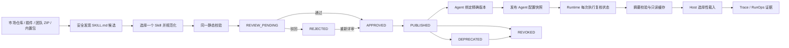
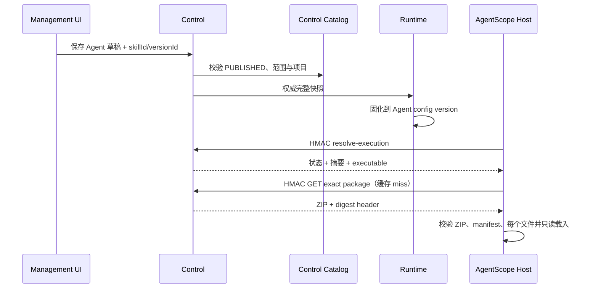

# Agent Skill Center 产品与架构契约

> 状态：CODE_VERIFIED / EXTERNAL_PACKAGE_VERIFIED / BUILD_VERIFIED / LOCAL_CORE_FLOW_VERIFIED / PRODUCTION_PROMOTION_PENDING（2026-08-24）
> 部署证据：以本文第 15 节和 [生产验收手册](../operations/agent-skill-production-runbook.md) 为准
> 外部发现与 GitHub 引入：[Agent Skill 市场产品与架构契约](./agent-skill-market.md)

本文定义 ReachAI 对标准 Agent Skill 包的产品定位、用户流程、运行语义、安全边界和扩展方式。这里的 Skill 是开放 Agent Skills 生态中的岗位工作手册，不是 ReachAI 的业务 Capability 资产，也不是旧 `ai-skills-service` 模型复活。

## 1. 产品判断

引入 Skill 是必要的，前提是把它放在正确的一层：

- Skill 回答“Agent 应该怎样完成一类工作”，承载说明、参考资料、模板和可选脚本。
- Capability 回答“企业系统具备什么业务能力”，是可治理的业务资产。
- Tool 回答“模型怎样调用能力”，是调用协议和权限边界。
- Workflow 回答“确定性的多步执行怎样编排”，运行语义是 GraphSpec。
- Agent 回答“面向用户承担什么职责”，其已发布配置固定 Workflow 和 Skill 的精确版本。

Skill 不拥有 Capability，不自动创建 Tool，不把 `allowed-tools` 变成授权，也不替代 Workflow。这个分层让市场 Skill 可以复用，同时不会污染 ReachAI 已有的能力资产和生产治理模型。

### 与 API 市场的协同边界

API 市场与 Skill Center 面向同一位 Agent 设计者，但交付物和生命周期必须分开：

- API 市场治理 Provider、API/Operation、认证方式、连通性以及最终形成的 Capability / Tool，回答“有哪些经过治理的动作可以调用”；
- Skill Center 治理说明、参考资料、模板、版本、发布者信任和运行载入，回答“面对某类任务应按什么方法工作”；
- 两者只通过稳定引用和发布就绪检查协同。Skill 可以声明所需工具或兼容条件，但导入、发布或绑定 Skill 都不能自动安装 API、生成 Capability、授予 Tool ACL 或注入凭据；
- API/Capability 下线时，Skill 制品和评审历史仍然成立，但 Agent 发布就绪检查应提示依赖不可用；Skill 撤销时，也不能反向删除仍被其他 Agent 或 Workflow 使用的 API/Capability；
- 将来如果提供“岗位解决方案包”，它应是引用 Skill 精确版本、Capability/Tool 稳定标识和 Workflow 发布版本的上层装配清单，而不是把三类资产复制到一张表或共用状态机。

当前版本先完成独立闭环和清晰导航，不假装已经实现跨市场依赖解析。待 API 市场的稳定身份与发布契约落定后，再增加双向跳转、缺失依赖提示和 Agent 发布就绪检查；这类联动不改变任何一侧的所有权。

## 2. 面向谁

| 角色 | 核心诉求 | 产品入口 |
| --- | --- | --- |
| Skill 作者 | 导入团队包或市场下载包，看到格式、兼容性和风险问题 | Skill Center 导入与制品证据 |
| 评审者 | 在发布前检查说明、文件清单、脚本、License 和兼容性 | 版本详情、评审记录、发布治理 |
| Agent 设计者 | 为 Agent 选择合适的工作手册，并控制何时载入 | Agent 编辑页的 Skill 绑定区 |
| 运维与审计 | 知道一次运行实际用了哪个摘要、哪个版本，哪些被跳过 | Trace / RunOps `SKILL_CONTEXT` |
| Runtime 开发者 | 在 AgentScope、未来 Codex harness 或 OpenCode 中复用同一标准包 | Control 包契约、Runtime 精确快照和 host adapter 边界 |

## 3. 用户主流程



状态语义：

- `REVIEW_PENDING`：已完成机器静态检查，等待人工判断。
- `APPROVED`：人工评审通过，但尚不能用于新 Agent 配置。
- `PUBLISHED`：允许新绑定。
- `DEPRECATED`：不允许新绑定；已经发布的 Agent 精确快照仍可复现执行。
- `REVOKED`：不允许继续加载；Runtime 即使已有缓存也必须在使用前向 Control 复核并拒绝。
- `REJECTED`：保留制品与评审证据，可在问题澄清后再次评审；同一版本号不能用不同字节覆盖。

## 4. 标准包兼容策略

[Agent Skills 开放规范](https://agentskills.io/specification)定义的是一个包含 `SKILL.md` 的目录，而不是特定网络分发封装。[OpenAI Codex Build skills 指南](https://developers.openai.com/codex/skills)与 [OpenCode Agent Skills 文档](https://opencode.ai/docs/skills/)也采用这套目录与按需加载思路；OpenCode 明确认识 `name / description / license / compatibility / metadata`，并忽略未知 frontmatter 字段。ReachAI 选择 ZIP 作为管理端上传和内容寻址制品的传输层，支持两类输入：

1. 单 Skill ZIP：包内必须且只能有一个 `SKILL.md`，可直接进入导入；
2. 仓库或插件 ZIP：可包含多个 `SKILL.md`，先只读发现候选，由用户明确选择一个叶子 Skill；Control 仅截取该子树，确定性重写为根布局单 Skill ZIP，再进入与单包完全相同的校验、评审和版本链。

规范化制品仍保留所选 Skill 内的标准目录、Host metadata 和未知扩展文件，不把 ZIP 本身冒充成新标准，也不带入兄弟 Skill、仓库 README 或构建杂项。单 Skill 制品允许两种根布局：

```text
SKILL.md
references/
assets/
scripts/
```

或：

```text
my-skill/
  SKILL.md
  references/
  assets/
  scripts/
```

嵌套布局下目录名必须与 frontmatter 的标准 `name` 相同。基础 frontmatter 兼容开放 Agent Skills 约定：

```yaml
---
name: my-skill
description: What the skill does and when to use it.
license: Apache-2.0
compatibility: Requires network access to the internal API.
metadata:
  version: 1.2.3
allowed-tools: Read Search
---
```

兼容原则：

- `name`、`description` 是必需字段；未知扩展字段被保留并报告，不因 ReachAI 不认识就改写市场包。
- `agents/` 等 host metadata 作为包文件保留；其中 OpenAI 官方定义的 `agents/openai.yaml` 会额外做安全解析，展示 Codex 隐式调用策略与 Tool/MCP 依赖，但是否执行仍由具体 Host adapter 决定。
- `allowed-tools` 只是一项声明，永远不能扩大 ReachAI Tool ACL、角色、确认或 Guard 权限。
- 市场下载的单 Skill ZIP、官方多 Skill 仓库 ZIP、插件 ZIP、团队自建 ZIP 与 ReachAI 内置包最终都走同一单 Skill 校验、版本和评审链。
- 候选发现不依赖仓库品牌或固定父目录：`skills/<name>`、`.opencode/skills/<name>`、`.claude/skills/<name>`、`.agents/skills/<name>` 和更深的插件目录只要以 `SKILL.md` 为叶子描述符即可识别；目录 basename 仍必须匹配 frontmatter `name`。
- 当前 Skill 市场已提供受限的公共 GitHub 连接器：只接受 allowlist HTTPS host，锁定完整 commit，限制 DNS/重定向/体积，重新下载并核对所选包摘要后才进入本目录。它不是任意 URL 下载器；私有仓库、其他 Git host 与签名发布者仍需要独立企业连接器和信任链。用户下载 ZIP 后导入继续作为离线与团队包路径。

## 5. 静态校验与供应链证据

导入期间不解压到工作目录、不运行脚本。`AgentSkillPackageInspector` 在内存中完成：

- ZIP、文件数、原始大小、展开大小和单文件大小限制；
- 主 `SKILL.md` 额外限制为 256 KiB，防止把大附件伪装成主说明直接撑爆模型上下文；
- 单次执行合并的 `ALWAYS` 主说明再受 256 KiB 总上限约束；大资料必须留在 references/assets 中按需读取；
- 绝对路径、Windows drive、`..`、重复路径和多 `SKILL.md` 拒绝；
- 仓库发现最多返回 256 个候选；包含下级 `SKILL.md` 的容器候选不可选，但不会遮蔽同包内合法的叶子候选；发现阶段不持久化包、不解压到宿主文件系统，也不执行任何内容；
- 用户选择后仅复制该 Skill 子树，按路径排序和固定时间戳生成确定性根布局 ZIP；再由同一个 Inspector 二次校验，避免“发现规则”和“正式导入规则”漂移；
- 大小写折叠或 Unicode 规范化后冲突的路径、Windows 保留名和跨 Host 不可移植字符拒绝；
- `SKILL.md` 严格 UTF-8、YAML safe constructor、重复 key 和 alias 限制；
- `agents/openai.yaml` 使用独立的 safe YAML 检查和 256 KiB 上限；只提取官方公开的 `policy.allow_implicit_invocation` 与 `dependencies.tools` 摘要，不把未知字段、Tool/MCP 声明或 URL 当成授权；
- 可选 Codex metadata 无效时，核心 Agent Skill 仍可进入评审，但兼容报告把 Codex 单独标为 `INCOMPATIBLE / HOST_METADATA_INVALID`，避免一个 Host 扩展污染通用包，也避免误报 Codex 兼容；
- 标准名、描述、metadata、license、compatibility、allowed-tools 类型校验；
- 脚本与可执行后缀识别；
- 最终单 Skill ZIP `sourceSha256`、规范化文件树 `contentTreeSha256` 和逐文件摘要；仓库/插件导入还在审计事件中保留原始 `bundleSourceSha256` 与 `bundleSkillRoot`，可从落库制品追溯到用户选择；
- validation、risk、compatibility、package manifest 四类不可变证据快照。

通过正式 Inspector 的单 Skill ZIP 进入 `AgentSkillArtifactStore`：直接单包保留上传字节，仓库/插件包保存所选子树的规范化 ZIP，原始大仓库不进入运行制品存储。当前实现是内容寻址文件系统存储；key 由摘要决定，读取时再次校验。相同版本与摘要的幂等导入也会验证并补回缺失制品，使内置包引导和人工重传具备恢复能力。`AgentSkillUploadLimitGuard` 在 Control 启动时确认 Spring multipart 文件/请求限制足以承载产品声明的包上限，避免管理端展示可上传但传输层提前拒绝的伪能力。开发环境默认使用临时目录以保持零配置可用；生产 profile 会在启动时拒绝相对路径和操作系统临时目录。生产多实例仍必须把目录放在持久化共享卷，或提供对象存储实现，不能把这种重传自愈当成临时目录的替代品。

### 内置包版本维护

内置包由 `BuiltinAgentSkillSource` 声明版本并随 Control 构建发布，必须遵守目录的同版本同字节规则。修改说明、参考文档、脚本或内嵌制品后，应发布新的补丁或功能版本；不能覆盖已导入版本的摘要、制品或绑定快照，也不能用长期关闭 bootstrap 代替版本维护。

打包时，内置文本资源的 CRLF 统一为 LF，文件排序与 ZIP 时间固定，使 Windows 和 Linux 检出的相同文本生成相同制品。该规范化仅在内置包打包过程中进行，不改写工作区文件；二进制资源、未知后缀资源及外部上传包保持原始字节。

版本维护同时在 [`builtin-agent-skill-releases.json`](../../reachai-control-service/src/test/resources/builtin-agent-skill-releases.json) 中追加 `name@version` 的 ZIP 与内容树摘要，保留旧条目。`BuiltinAgentSkillSourceTest` 会核对所有当前内置版本，未升级版本的包内容变化应在构建时被发现。当前接入包为 `0.6.1`；Workflow 包因换行规范化发布 `0.1.1`，Agent 包仍为 `0.1.0`。

默认启动通过既有 `importTrustedBuiltin` 事务完成导入、评审和发布，新版本不会自动替换已有默认版本或 Agent 的精确绑定。`sql/initV2.sql` 仅定义目录与版本表，不硬编码这些内置包版本；版本升级无需新增 schema 或手工修改版本表。完成升级后需验证默认 bootstrap、重复启动幂等性、最新下载摘要及旧版本/绑定完整性。

## 6. 作用域与访问控制

`visibility` 不是展示标签，而是服务端强制策略：

| 范围 | 读取与绑定 | 导入要求 |
| --- | --- | --- |
| `PRIVATE` | 仅所有者与 Platform Admin | 记录当前平台用户为 `owner_user_id` |
| `PROJECT` | 需要目标 `projectCode` 的资源权限；只能绑定到同项目 Agent | 必须选择项目并拥有该项目 `skill:import` |
| `SHARED` | 有相应 Skill 权限的平台用户 | 需要全局导入权限 |
| `PUBLIC` | 有相应 Skill 权限的平台用户；可作为后续市场发布候选 | 需要全局导入权限 |

标准身份由 `publisher / name` 确定；平台目录再用不可见的 `scope_key` 区分独立安装范围。这样两个用户可以分别私有安装同一个市场 Skill，两个项目也可以各自评审同一标准身份，而原始 ZIP 仍按 SHA-256 去重。单个安装记录的作用域不能借导入新版本偷偷改变；未来如开放范围迁移，应使用单独的显式治理操作和审计事件。Agent 配置内仍按 `publisher / name` 禁止重复绑定，避免同一工作手册出现互相冲突的两份说明。

当前上传包的 `publisher` 是导入者声明，不等于平台已验证的发布者身份。管理端明确标记“发布者未验证”；`reachai` 命名空间只允许受控的 `BUILTIN` 注册流程使用。未来市场信任链应单独引入 publisher account、签名、公钥轮换和撤销，而不能从字符串名称推断可信。

Runtime 不负责重新推导用户可见性。Control 在创建 Agent 草稿以及发布 Agent 配置时根据当前平台会话重新校验访问权；除了读取 Skill 的权限，用户还必须拥有目标 Agent 项目的 `skill:bind` 权限，全局 Agent 则要求全局绑定权限。Control 同时确认项目 Skill 与目标 Agent 同项目，并把浏览器字段替换成目录权威快照后再交给 Runtime。发布前还会逐字段核对 Runtime 中的持久化快照与 Control 重新生成的证明；出现范围、摘要或 manifest 漂移时拒绝发布，要求重新保存草稿。绑定快照额外固化 `visibility / projectCode`，Runtime 在发布配置事务和每次执行前都与 Agent 当前项目比对。若任一历史配置含项目级 Skill，Control 拒绝直接移动 Agent 项目；尚未发布时可以先清空草稿绑定，已经发布后应在目标项目新建 Agent，从而避免“先绑定、后改项目”的授权绕过。

## 7. Agent 绑定模型

Agent 配置绑定 `skillId + skillVersionId`，但持久化的是完整的 Control-attested 快照：

- publisher、标准 name、展示名和版本；
- 原始 ZIP 与文件树 SHA-256；
- source root、文件 manifest 和风险报告；
- 是否含脚本、激活方式、脚本策略、必需性、启停和顺序。

不提供“自动跟随最新版”。升级必须在 Agent 编辑页显式选择同一稳定身份的另一个 `PUBLISHED` 版本，再保存并发布新的 Agent 配置版本。这样历史 Trace、回放和问题定位不会因市场更新而漂移。

激活方式：

| 模式 | 当前语义 |
| --- | --- |
| `MODEL_SELECTED` | 将 Skill repository 交给 AgentScope，按需渐进加载 |
| `ALWAYS` | 除 repository 外，把经过评审的主说明固定加入本次系统上下文 |
| `EXPLICIT` | 普通对话不载入；保留给未来显式 Skill 调用入口 |

`required=true` 表示状态复核、下载、摘要校验或 Host 加载失败时阻断本次 Agent 执行。可选 Skill 失败时安全跳过，并把原因写入 `SKILL_CONTEXT`；任何情况下都不会退回未校验缓存。批量状态复核按 Skill 逐项返回结果：单个版本不存在、引用错误、已撤销或摘要不匹配不会把同批其他正常 Skill 误判为不可用；只有 Control 传输、认证、数据库等系统性故障才按整批 fail-closed。

## 8. Control 与 Runtime 边界



Control 拥有包身份、版本、评审和制品；Runtime 拥有 Agent 配置绑定、执行缓存和 Trace。Runtime 禁止直读 `control_agent_skill*` 表。

Runtime→Control 的 `/internal/control/agent-skills/**` 使用与 Agent 执行一致的 HMAC 基础设施：method、精确 path、caller、identity source、tenant、timestamp、nonce 和 body SHA-256 均进入 canonical string。缺少共享密钥时执行端 fail-closed；请求有时间窗，nonce 通过 Control-owned JDBC 表原子消费，因此多个 Control 副本之间也不能重放。

## 9. Host 可移植性

产品契约与 Host 解耦的边界如下：

- Control 的 ZIP、SKILL.md、manifest、摘要、评审、作用域和 API 不包含 AgentScope 私有格式。
- `runtime_agent_skill_binding` 保存 Host-neutral 的精确包快照。
- 当前只有 `AGENTSCOPE` Host：`RuntimeAgentSkillRepositoryFactory` 把已验证目录适配为 AgentScope `FileSystemSkillRepository`，并启用渐进加载。
- production profile 下，`RuntimeAgentSkillCacheProductionGuard` 拒绝空值、相对路径和操作系统临时目录；目录实际可写与 quarantine 演练仍必须由部署证据证明。
- compatibility report 区分格式、Host metadata、依赖、适配器与 E2E 证据：AgentScope 当前为 `adapter=IMPLEMENTED / evidence=UNIT_VERIFIED`；Codex 与 OpenCode 默认只标记 `format=COMPATIBLE / adapter=NOT_IMPLEMENTED / evidence=FORMAT_VERIFIED`。若 `agents/openai.yaml` 无效，只把 Codex 降为 `INCOMPATIBLE / HOST_METADATA_INVALID`；其中声明的 Tool/MCP 依赖记录为 `DECLARED_NOT_RESOLVED`，绝不自动授权。在真实 Host 对话验收前统一保持 `hostE2e=NOT_RUN`。
- 将来接入 Codex harness 或 OpenCode 时，新 Host adapter 应复用相同的状态复核、内容寻址制品和绑定快照，只转换其原生安装目录、上下文注入和生命周期；不能另建一套市场目录或 Skill 数据表。
- 若第二个 Host 落地，应把当前 factory 中的通用“状态复核 + 下载 + 校验 + materialize”提取为 Runtime-neutral materializer，再让各 Host adapter 消费。现在不提前制造没有第二个消费者的空抽象。

这个边界同时避免两个极端：既不把 ReachAI 绑定死在 AgentScope，也不为尚未接入的 Host 伪造无法验证的兼容层。

## 10. 脚本执行边界

含 `scripts/` 或可执行后缀的包可以导入、评审和作为说明资源使用，但当前运行时始终设置 `skillCodeExecutionEnabled=false`：

- 管理端只提供 `DENY`，不会让用户误以为已有安全沙箱。
- 后端保留 `SANDBOX_REVIEWED` 契约和独立 `skill:script:approve` 权限，作为未来沙箱策略输入；它本身仍不执行脚本。
- Skill 不能自行申请 shell、文件写入、网络或凭据。未来沙箱必须独立限制镜像、系统调用、网络、文件挂载、CPU/内存/时长、秘密注入、输出净化和审计。
- 在沙箱完成真实攻击测试与运维证据前，不得把“已评审”表述为“可安全执行”。

## 11. API 与持久化

管理端主路径（平台会话 + Skill RBAC）：

- `GET /api/skills/access`：返回当前用户可导入的范围、服务端包大小/文件数限制与脚本执行边界，不让前端自行猜测权限或写死上传约束；
- `GET /api/skills/bindable-versions?projectCode=...`：为 Agent 编辑器返回服务端过滤后的可绑定精确版本；
- `GET /api/skills`
- `GET /api/skills/{skillId}`
- `GET /api/skills/{skillId}/versions/{versionId}`
- `GET /api/skills/{skillId}/versions/{versionId}/reviews`
- `GET /api/skills/{skillId}/versions/{versionId}/files?path=...`：受作用域保护的只读文本预览；二进制只返回摘要，不执行或渲染；
- `POST /api/skills/discoveries`：上传单 Skill、仓库或插件 ZIP，只读返回候选根目录、格式/脚本摘要、无效原因和原始 Bundle SHA-256，不创建目录或版本；
- `POST /api/skills/imports`：单 Skill ZIP 可直接导入；仓库/插件 ZIP 携带发现阶段返回的 `sourceRoot`，服务端重新校验、截取并规范化，不能信任前端候选元数据；
- `POST /api/skills/{skillId}/versions/{versionId}/reviews`
- `POST /api/skills/{skillId}/versions/{versionId}/{publish|default|deprecate|revoke}`
- `GET /api/skills/{skillId}/versions/{versionId}/package`

发现和导入都必须先通过服务端 `skill:import` 权限检查。未授权请求在读取 ZIP 内容前以稳定的
`SKILL_ACCESS_DENIED` 错误契约拒绝；伪造或过期的 `sourceRoot` 在进入 Catalog 与审计写入前以
`SKILL_PACKAGE_INVALID` 拒绝。前端选择状态使用独立 composable，以单调请求序号隔离快速换包产生的
晚到响应；`File` 和发现快照使用 `shallowRef`，避免 Vue 代理破坏对象身份判断。

公开兼容下载仅用于 ReachAI 内置包：`/api/ai-assist/skills/**`。它不是管理目录，不接受导入、评审或绑定。

Control-owned tables：

- `control_internal_auth_nonce`：Runtime→Control HMAC nonce 的多实例共享防重放表；
- `control_agent_skill`：`scope_key + publisher + name` 安装身份、真实访问范围、所有者/项目和版本指针；
- `control_agent_skill_version`：不可变版本、来源标签、制品 key、摘要和静态报告；
- `control_agent_skill_review`：人工决策与 findings。

Runtime-owned table：

- `runtime_agent_skill_binding`：属于某个不可变 Agent 配置版本的精确包、范围和项目快照。

## 12. 可观测性与失败语义

一次 Agent 执行应区分三层证据：

1. 根 Trace 与 RunOps 记录“配置绑定了什么”；
2. `SKILL_CONTEXT` 记录“本次真正暴露给 Host 的版本”以及安全跳过的版本和原因；
3. 最终响应 metadata 记录 active / skipped 数量和精确身份，不记录 Skill 内容或用户原文。

关键失败规则：

- Control 状态服务不可用：必需 Skill 阻断；可选 Skill 全量安全跳过，不使用可能已撤销的缓存。
- 缓存损坏：移入 quarantine，重新下载并完整复核；复核失败按必需/可选语义处理。
- 摘要或 manifest 不一致：永不载入，且不能降级到“只检查 ZIP header”。
- `DEPRECATED`：已有精确绑定可执行，新绑定拒绝。
- `REVOKED`：下次需要载入时拒绝；可选项跳过、必需项失败。
- `allowed-tools`、frontmatter 或 Skill 正文中的权限要求：不能跳过 Tool ACL、确认、项目、租户和角色策略。

## 13. 当前边界与后续演进

当前已实现单 Skill ZIP、仓库/插件 ZIP“发现候选并逐个选择导入”和内置包闭环，尚未宣称以下能力已经上线：

- 组织内评分、签名发布者信任链和已安装版本的自动更新建议；基础市场浏览、skills.sh 发现、精选来源和公共 GitHub 不可变引入已由 [Skill 市场](./agent-skill-market.md) 提供；
- Git / URL source connector、周期同步和 webhook；
- 仓库内多个 Skill 的一键批量安装、批量范围策略和部分失败恢复；
- 脚本沙箱执行；
- Codex harness / OpenCode Host adapter；
- 对象存储实现和跨实例缓存运营面板。

演进顺序建议：先完成当前市场“发现 + 探针 + 不可变引入 + 人工评审”的真实部署证据，再做可信 publisher 与更新建议；先接第二个真实 Host，再提取通用 materializer；最后在独立安全项目中开放脚本沙箱。任何阶段都不改变精确版本绑定和 Capability / Tool / Workflow 分层。

## 14. 验收门槛

代码或构建通过不等于产品完成。目标环境至少需要验证：

- 从 GitHub 基线 `ae9e1ce6` 升级时完整执行 `sql/upgrade-20260830-platform-consolidated.sql`，回读 Section 02/04 对应的 Skill 目录五张表、市场两张表、来源种子与权限；
- 选择至少一个非 ReachAI 自建、包含 references/assets/scripts/agents 等真实结构的市场 Skill；同时用一个真实多 Skill 仓库或插件 ZIP 验证候选发现、明确选择、兄弟目录隔离和 Bundle→单 Skill 摘要追溯；确认未知扩展文件被保留、`agents/openai.yaml` 调用策略与依赖可见、脚本只标记不执行；
- Control/Runtime 使用相同的 `REACHAI_INTERNAL_SERVICE_SECRET`；
- Control 制品目录是可持久化路径，Runtime 缓存目录可写；
- 浏览器以作者、评审者、Agent 设计者和无权限用户分别走导入、评审、发布、绑定、发布 Agent 配置流程；
- 真实 AgentScope 对话触发 `MODEL_SELECTED` 和 `ALWAYS` Skill，并在 RunOps 中看到精确版本；
- 篡改缓存后能够 quarantine + 重新拉取；撤销后缓存不再被使用；
- 私有 Skill 对其他用户不可见，项目 Skill 不能绑定到其他项目 Agent；
- 可选与必需 Skill 在 Control 不可用、包缺失、摘要错误时呈现不同且可审计的失败语义。

### 14.1 真实外部包兼容探针

`AgentSkillExternalPackageProbeTest` 是一个显式启用的部署前探针。普通 CI 未提供
`reachai.external-skill-dir` 时不依赖开发者目录；提供目录后，它会排除 `.git`、本地浏览器快照、
`node_modules`、`__pycache__` 等运行缓存，将其余源文件确定性打成标准根布局 ZIP，再交给生产
`AgentSkillPackageInspector`。探针必须证明文件没有丢失、ZIP 与文件树摘要稳定、未知扩展被保留、
脚本只进入风险报告，以及可选的 Codex Host 策略和依赖可见；探针本身不执行任何脚本。

Windows PowerShell 示例：

```powershell
$externalSkillDir = Join-Path $env:USERPROFILE '.codex\skills\playwright'
mvn -pl reachai-control-service -am `
  "-Dtest=AgentSkillExternalPackageProbeTest" `
  "-Dsurefire.failIfNoSpecifiedTests=false" `
  "-Dreachai.external-skill-dir=$externalSkillDir" `
  "-Dreachai.external-skill-required-layout=references,assets,scripts,agents" `
  "-Dreachai.external-skill-require-unknown-files=true" test
```

若需要验证 `agents/openai.yaml` 的工具依赖和调用策略，再增加：

```text
-Dreachai.external-skill-require-codex-dependencies=true
-Dreachai.external-skill-expected-implicit-invocation=true
```

2026-08-23 的本机证据：已安装的 Playwright Skill（`references/assets/scripts/agents`）和 ChatGPT Apps
Skill（Codex MCP dependency + implicit invocation policy）均通过该探针。这个证据只证明真实外部包的
导入兼容性，不替代部署后的人工导入、权限、发布、Agent 绑定和真实对话 E2E。

`AgentSkillExternalBundleProbeTest` 对真实仓库/插件 ZIP 执行另一条显式探针：使用生产默认上限做候选
发现，选择指定 Skill，连续两次生成规范化 ZIP，并核对 Bundle 摘要、候选根目录、最终 ZIP/文件树摘要、
文件数和根布局确定性。它同样不解压到宿主工作目录、不持久化、不执行脚本。示例：

```powershell
$externalBundle = Join-Path $env:TEMP 'reachai-agent-skill-bundle-probe\openai-skills-main.zip'
mvn -pl reachai-control-service -am `
  "-Dtest=AgentSkillExternalBundleProbeTest" `
  "-Dsurefire.failIfNoSpecifiedTests=false" `
  "-Dreachai.external-skill-bundle=$externalBundle" `
  "-Dreachai.external-skill-bundle-candidate=skill-creator" `
  "-Dreachai.external-skill-bundle-min-candidates=40" test
```

2026-08-24 的真实下载证据：[OpenAI Skills 官方仓库](https://github.com/openai/skills) ZIP 发现 44 个候选，
[Anthropic Skills 官方仓库](https://github.com/anthropics/skills) ZIP 发现 20 个候选；二者选择
`skill-creator` 后均 1/1 通过确定性隔离探针。该证据仍属于 `EXTERNAL_PACKAGE_VERIFIED`，不是目标环境
导入、评审、发布和运行证据。

### 14.2 部署就绪证据门禁

`scripts/check-agent-skill-production-readiness.mjs` 将本节门槛固化为两层机器检查：未传参数时只读核对
仓库内目录五表与市场两表 DDL、两份升级 SQL、owning service、六项权限、六个市场来源种子、配置契约和关键实现文件；传入
`--evidence=<json-file>` 后，再校验目标环境迁移回读、真实制品与配置、外部包导入、四角色浏览器流程、
AgentScope 对话、Trace/RunOps、缓存篡改和撤销演练。验收器不会连接数据库、调用 HTTP、执行迁移、
读取密钥或运行 Skill 脚本；目标环境证据必须由获批变更流程采集并引用不可变材料。

开发环境的完整证据只能得到 `DEPLOYMENT_READY`；只有 staging/production 分类、具有变更单且全部门槛
通过时，才可能得到 `PRODUCTION_PROMOTION_ELIGIBLE`。Mock 浏览器、格式兼容、旧进程 health、单元测试或
手工勾选任一项都不能替代真实 Host E2E。采集步骤和证据模板见
`docs/operations/agent-skill-production-runbook.md` 与
`scripts/fixtures/agent-skill-production-evidence.example.json`。

## 15. 交付与验收证据矩阵

状态必须区分 `CODE_VERIFIED`、`EXTERNAL_PACKAGE_VERIFIED`、`BUILD_VERIFIED`、`LOCAL_CORE_FLOW_VERIFIED`
与 `PRODUCTION_PROMOTION_PENDING`；任何本地状态都不能改写成“生产已上线”。截至 2026-08-24，当前共享工作树的证据如下：

| 要求 | 权威证据 | 当前状态 |
| --- | --- | --- |
| 标准包静态安全、仓库候选隔离、Host 元数据、风险和兼容报告 | `AgentSkillPackageInspectorTest` 23 项，包含不同 ZIP 条目顺序生成同一规范制品 | `CODE_VERIFIED` |
| 目录、评审、发布、默认版本、废弃和不可变制品 | H2 `AgentSkillCatalogServiceTest` 7 项 | `CODE_VERIFIED` |
| Control 权限、内部 HMAC、绑定快照与发布校验 | Control Skill 专项：80 项，0 失败、2 个未传外部路径时的预期跳过 | `CODE_VERIFIED` |
| AgentScope 懒加载、精确缓存、生产缓存路径守卫、撤销复核、必需/可选失败与 Trace | Runtime Skill 专项：53 项，0 失败；普通 Supervisor 测试显式桥接 Eval 新重载，防止 Mockito 静默返回空值 | `CODE_VERIFIED` |
| 真实外部复杂包格式 | Playwright、ChatGPT Apps 单包探针；OpenAI 44 候选与 Anthropic 20 候选仓库探针均通过 | `EXTERNAL_PACKAGE_VERIFIED` |
| 管理端目录、仓库候选选择、兼容报告和历史报告降级 | `useAgentSkillBundleImport.test.ts` 6 项覆盖换包竞态、失败重试、显式选择与 reset；Skill 前端专项共 9 项；四角色真实浏览器流程通过；生产构建 2350 modules | `BUILD_VERIFIED / LOCAL_CORE_FLOW_VERIFIED` |
| 仓库与部署证据门禁 | `check-agent-skill-production-readiness.test.mjs` 8 项；默认只读仓库预检通过 | `CODE_VERIFIED` |
| MySQL 五表、市场两表、权限与来源种子真实升级、回读 | MySQL 5.7 + `utf8mb4`；两份升级 SQL 均执行两遍，表/列/索引/六项权限/六个市场来源和中文回读全部通过 | `LOCAL_CORE_FLOW_VERIFIED` |
| Control/Runtime 内部鉴权、制品目录和可写缓存 | 真实 AgentScope 调用已证明 Control→Runtime→Control resolve 生效；本地制品/缓存可用。生产持久路径、共享 secret 配置回读和同批制品部署仍待目标环境证明 | `LOCAL_CORE_FLOW_VERIFIED / PRODUCTION_PROMOTION_PENDING` |
| 作者/评审者/设计者/无权限用户完整浏览器流程 | 四个独立账号完成市场引入、风险评审、发布、精确绑定与只读浏览；无权限账号绕过 UI 直调探针/导入均为 403 | `LOCAL_CORE_FLOW_VERIFIED` |
| 真实 AgentScope `MODEL_SELECTED` / `ALWAYS` 对话与 RunOps 证据 | 市场 Skill 的 `ALWAYS` 实际对话通过，Trace `e895acb343b84cddaad5ab8422d6f789` 的 `SKILL_CONTEXT` 显示精确版本与 `activeSkillCount=1`；本轮未重新执行 `MODEL_SELECTED` 双模式门禁 | `LOCAL_CORE_FLOW_VERIFIED / PRODUCTION_PROMOTION_PENDING` |
| 缓存篡改、撤销、跨用户/跨项目隔离的部署态演练 | 单元级已覆盖，目标环境演练尚未执行 | `PRODUCTION_PROMOTION_PENDING` |
