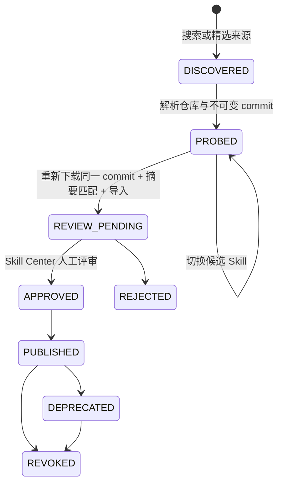
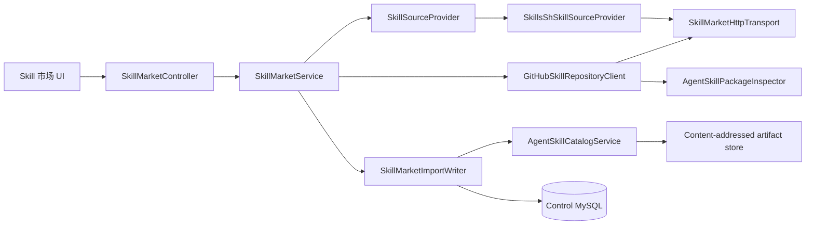

# Agent Skill 市场产品与架构契约

> 状态：CODE_VERIFIED / BUILD_VERIFIED / LOCAL_CORE_FLOW_VERIFIED / PRODUCTION_PROMOTION_PENDING（2026-08-24）
> 关联：[Agent Skill Center](./agent-skill-center.md) · [API 市场](./api-market.md) · [表所有权](./service-table-ownership.md)

本文定义 ReachAI 面向开放 Agent Skills 生态的市场模块。Skill 市场解决“去哪里发现可复用的岗位工作手册、怎样安全地把它带回平台”；Skill Center 继续解决“怎样评审、发布、绑定、执行和审计”。两者组成一条产品链，但不共享信任状态机，也不把 Skill 变成 Capability。

## 1. 产品结论

ReachAI 应该提供 Skill 市场，但第一阶段不是自建一个追求数量和下载量的内容社区，而是建设一个“多来源发现 + 受治理引入”的企业入口：

- 用户不必离开 ReachAI 手工搜索、下载、改包和上传；
- 市场结果只提供发现信号，不直接成为已安装、已发布或可执行资产；
- 引入前必须看到真实 GitHub 仓库、精确 commit、候选 `SKILL.md`、License、脚本和摘要；
- 选中子树经过现有生产 Inspector 的同一套校验后，才进入 Skill Center 的 `REVIEW_PENDING`；
- Agent 永远绑定 ReachAI 已发布的精确版本，不绑定市场“最新版”；
- AgentScope、未来 Codex harness 和 OpenCode 共用同一目录、制品和治理记录，只在 Runtime Host adapter 层转换。

这个定位同时支持市场上下载的通用 Skill、GitHub 多 Skill 仓库、官方插件仓库中的 Skill 子树和企业后续自建源，不要求上游采用 ReachAI 私有格式。

## 2. 用户与待办任务

| 角色 | 用户问题 | 产品能力 | 权限边界 |
| --- | --- | --- | --- |
| Agent 设计者 / Skill 作者 | 有没有可复用的工作手册？它真实包含什么？ | 搜索、精选来源、仓库探针、候选选择、私有/项目导入 | `skill:read`；导入需 `skill:import` |
| 项目负责人 / 评审者 | 来源、License、脚本和说明是否适合本项目？ | 进入 Skill Center 查看完整文件与风险，评审、发布 | 沿用 Skill Center 评审与发布权限 |
| 平台管理员 | 哪些来源值得推荐？Token、大小和网络边界怎样治理？ | 来源目录、显式信任分类、环境配置、审计与迁移 | 全局 Skill 治理与配置管理 |
| Agent 使用者 | 为什么这个 Agent 会按某种方法工作？ | Agent 精确绑定、Trace `SKILL_CONTEXT`、RunOps 证据 | 不直接接触市场导入权限 |
| Runtime / 连接器开发者 | 怎样增加新市场或新 Host，而不复制业务逻辑？ | `SkillSourceProvider`、公共包契约、Host adapter 边界 | 连接器不能扩大 ACL 或执行权限 |
| 审计者 / 只读角色 | 某个版本从哪里来、谁引入、当时是哪份字节？ | 只读市场、可见范围过滤后的导入记录、commit 与双摘要 | `skill:read`，无探针或导入操作 |

四类关键浏览器旅程分别是：作者发现并引入、评审者检查并发布、设计者绑定并真实对话、只读用户浏览但不能引入。平台管理员的来源与配置治理属于第五类管理旅程，不用阻塞普通使用者的首屏。

## 3. 信息架构

主导航位于“智能体与编排”下：

```text
Skill 市场
├─ 发现 Skill
│  ├─ 搜索与来源模式
│  ├─ 热度、上游链接与来源信任标签
│  └─ 检查并导入
├─ 精选来源
│  ├─ 聚合发现源
│  ├─ 传输通道
│  └─ 官方/精选公共仓库
└─ 导入记录
   ├─ provider / marketplace item
   ├─ repository / commit / source root
   ├─ bundle digest / selected package digest
   └─ 进入 Skill Center 评审

Skill Center
├─ 目录与版本
├─ 制品文件、静态证据与评审
├─ 发布 / 默认 / 废弃 / 撤销
└─ Agent 精确绑定与 Runtime
```

页面使用工作台型紧凑布局。首屏先解释“发现不等于信任”，再给搜索和结果；不使用夸张营销 Hero 挤压有效内容。所有写操作使用“检查”“引入”“进入评审”，避免用“安装”误导用户以为代码已经可执行。

## 4. 生命周期与状态

市场条目是上游临时投影，不复制为 ReachAI 的第二套 Skill 资产：



- `DISCOVERED` 和 `PROBED` 不落 Skill 目录，也不保存远程 ZIP；关闭抽屉即可丢弃。
- 探针把分支或默认分支解析为完整 40 位 commit SHA。
- 正式导入不复用浏览器或探针内存中的“信任结果”，而是按同一 commit 重新下载并校验所选单 Skill 包 SHA-256。
- 成功导入只创建或幂等返回 `REVIEW_PENDING` 版本，并记录市场溯源；之后完全复用 Skill Center 状态机。
- 市场上游更新不会自动修改已导入版本。升级是新的探针、新的 commit、新的不可变版本和新的评审。

## 5. 来源模型

来源分成三种职责，不用一个含糊的 `official=true` 代替协议事实：

| 类型 | 当前实现 | 用途 | 信任含义 |
| --- | --- | --- | --- |
| 聚合发现 | [skills.sh](https://skills.sh) | 关键词、owner、热度和上游定位 | 热度只是发现信号；默认 `AGGREGATED` |
| 传输通道 | [GitHub REST API](https://docs.github.com/en/rest) + codeload | 元数据、commit 解析和公共仓库 ZIP | HTTPS 传输不等于发布者可信 |
| 精选仓库 | Anthropic、Vercel、JetBrains、OpenAI Plugins | 无搜索时可直接浏览和检查的受控入口 | `OFFICIAL` / `VERIFIED` 由 ReachAI 来源目录显式配置 |

skills.sh 接口模式必须在产品上可见：

- `OFFICIAL_V1`：配置 Vercel OIDC token 时使用官方 `/api/v1` 搜索或排行榜；
- `LEGACY_PUBLIC_SEARCH`：未配置 token 时，仅对有关键词的请求使用当前公共搜索兼容端点；这是显式降级，不伪装成官方 V1；
- `SOURCE_DISCOVERY_ONLY`：关闭兼容搜索、无 token 或无搜索词时，只展示 ReachAI 精选来源。

官方 V1 与公共兼容端点都只返回发现元数据。实际引入必须重新解析其公共 GitHub 来源。未来上游删除兼容端点时，只会让发现页进入可解释的降级模式，不会影响已导入制品、Skill Center 或 Runtime。

当前种子来源：

- `SKILLS_SH`：聚合发现；
- `GITHUB`：公共 HTTPS 传输；
- `ANTHROPIC_SKILLS`：`anthropics/skills`；
- `VERCEL_AGENT_SKILLS`：`vercel-labs/agent-skills`；
- `JETBRAINS_SKILLS`：`JetBrains/skills`；
- `OPENAI_PLUGINS`：`openai/plugins` 中符合标准的 Skill 子树。插件中的 MCP、App、Hook 或其他资源不会因同仓库存在而自动安装或授权。

## 6. 后端架构



职责边界：

- `SkillSourceProvider`：只把外部目录映射为统一搜索结果，不下载或安装制品；新增市场实现该 port。
- `SkillsShSkillSourceProvider`：区分官方、兼容和仅来源三种模式，过滤不完整或不可导入条目。
- `GitHubSkillRepositoryClient`：解析公共 GitHub 仓库/tree/blob URL，读取仓库和 commit，下载受限 ZIP，调用 Inspector 发现候选。
- `SkillMarketHttpTransport`：统一 HTTPS、host allowlist、DNS、重定向、凭据剥离、超时和流式大小限制。
- `AgentSkillPackageInspector`：远程仓库 Bundle 使用独立较大上限进行候选发现；选中的单 Skill 子树仍回到严格生产单包限制。
- `SkillMarketImportWriter`：以事务调用现有目录导入并写入不可变溯源；重复请求以同一目录版本幂等返回。
- `AgentSkillCatalogService`：仍是 Skill 身份、版本、作用域、制品和治理的唯一业务入口。

没有 `MarketSkillEntity`。搜索结果不落库，避免把易变上游元数据变成另一个需要同步和清理的资产目录。

## 7. API 契约

平台会话和既有 Skill RBAC 适用于全部接口：

| API | 权限 | 语义 |
| --- | --- | --- |
| `GET /api/skill-market/search` | `skill:read` | 搜索指定 provider；返回上游模式和临时条目 |
| `GET /api/skill-market/sources` | `skill:read` | 返回平台来源目录与显式信任分类 |
| `GET /api/skill-market/imports?limit=` | `skill:read` | 仅返回当前用户按 Skill 作用域可见的导入溯源 |
| `POST /api/skill-market/probes` | `skill:import` | 解析 GitHub、锁 commit、发现候选；不持久化 |
| `POST /api/skill-market/imports` | `skill:import` + 目标范围权限 | 重新下载同 commit、核对摘要并进入 Skill Center |

导入请求必须携带：

- 原始公共 GitHub 来源；
- 探针返回的完整 commit SHA；
- 用户明确选择的 `sourceRoot`；
- 探针返回的所选单包 SHA-256；
- publisher、version、visibility 与可选 projectCode；
- 可选的市场 provider 和条目 ID，仅作为溯源，不作为信任输入。

## 8. 数据模型

两张表都由 `reachai-control-service` 唯一拥有：

### `control_agent_skill_market_source`

保存稳定的来源配置投影：`source_key`、显示名、来源类型、基础/仓库 URL、`trust_level`、状态、是否支持搜索/引入、是否官方和排序。表内不保存 OIDC token、GitHub token、Cookie 或调用凭据。

### `control_agent_skill_market_import`

保存一次受治理引入的不可变溯源：provider、市场条目、仓库、精确 commit、所选根目录、原始 Bundle 摘要、所选单包摘要、最终 Skill/版本、导入者和时间。它引用现有 `control_agent_skill` 与 `control_agent_skill_version`，但不复制制品或评审状态。

全新环境由 `sql/initV2.sql` 创建；从 GitHub 基线 `ae9e1ce6` 升级的开发/测试库完整执行 `sql/upgrade-20260830-platform-consolidated.sql`，Agent Skill 目录和市场分别位于 Section 02/04。

## 9. 安全与供应链门禁

### 网络入口

- 当前只支持公共 `https://github.com/{owner}/{repository}`、`tree` 或 `blob` 来源；私有 GitHub 必须使用未来独立企业连接器，不能把 PAT 放进 URL。
- HTTP transport 逐跳要求 HTTPS、443、无 userinfo 和 fragment，并对 host 做显式 allowlist；用户提交的 GitHub 来源额外拒绝 query，协议 adapter 只生成自身定义的查询参数。
- 每次请求前解析 DNS并拒绝 loopback、site-local、link-local、multicast、carrier-grade NAT 和保留的非公网地址。
- 使用可信透明代理且 DNS 被映射到 RFC 2544 `198.18.0.0/15` fake-IP 池时，可显式开启 `allow-synthetic-proxy-dns`；它仍只适用于 adapter 的固定 host allowlist，默认关闭，也不放行任何其他私网段。
- 最多 4 次手工重定向；跨 host 立即剥离 `Authorization`。GitHub archive 仅允许 `api.github.com` 到 `codeload.github.com`。
- JSON、连接/读取超时和下载体积均有服务端硬上限，不能由浏览器参数扩大。

### 制品入口

- 仓库 ZIP 默认最多 64 MiB、展开 256 MiB、8192 文件；这些上限仅用于候选发现。
- 最终单 Skill 仍使用 20 MiB ZIP、100 MiB 展开、20 MiB 单文件和 1024 文件的严格限制。
- Inspector 拒绝 Zip Slip、绝对路径、重复/大小写冲突、Windows 保留名、非法 YAML、嵌套 Skill 容器和超限内容。
- 探针不运行脚本、不渲染 HTML、不安装依赖、不写工作目录、不持久化原始仓库包。
- 正式导入按锁定 commit 重新获取，所选包摘要不一致时 fail closed；落库保存 Bundle 与最终单包两个摘要。
- 上游 License、stars、publisher 字符串和“官方仓库”标签都不能授予 Tool、网络、凭据、MCP 或脚本权限。

### 凭据

- `REACHAI_SKILL_MARKET_SKILLS_SH_OIDC_TOKEN` 只发送给 skills.sh allowlist host；
- `REACHAI_SKILL_MARKET_GITHUB_TOKEN` 只发送给配置的 GitHub API host，跳转至 codeload 前被剥离；
- Token 只来自运行环境，不落数据库、响应、审计详情或前端。

## 10. 配置契约

```yaml
reachai:
  skill:
    bundle-max-archive-bytes: 67108864
    bundle-max-expanded-bytes: 268435456
    bundle-max-single-file-bytes: 67108864
    bundle-max-files: 8192
  skill-market:
    enabled: true
    connect-timeout: 5s
    read-timeout: 30s
    max-json-bytes: 2097152
    allow-synthetic-proxy-dns: false
    skills-sh:
      base-url: https://skills.sh
      oidc-token: ${REACHAI_SKILL_MARKET_SKILLS_SH_OIDC_TOKEN:}
      legacy-search-enabled: true
    github:
      api-base-url: https://api.github.com
      token: ${REACHAI_SKILL_MARKET_GITHUB_TOKEN:}
```

生产配置建议显式决定是否允许 legacy public search；禁用后产品仍可通过精选来源和 GitHub 直接检查工作。GitHub token 只用于提高 API rate limit，不解锁私有仓库。

## 11. 开发者扩展契约

增加第三方市场时：

1. 实现 `SkillSourceProvider`，提供唯一 provider key；
2. 只返回统一 `MarketSkill` 发现投影，不在 provider 内写 Skill 表；
3. 明确条目怎样解析为公共、可重取的制品来源；不能把搜索结果正文直接当制品；
4. 若不是 GitHub，新增独立 transport adapter，并复用相同的网络、大小、摘要和凭据隔离原则；
5. 正式导入必须落到 `AgentSkillPackageInspector` 与 `AgentSkillCatalogService`，不能实现旁路状态机；
6. 新 Host 只消费已发布的标准包，不直接访问市场 provider。

第二阶段的企业私有源应是显式管理员配置的 connector：凭据放 Secret Manager，host 固定 allowlist，审计 connector identity，并继续锁定不可变 revision。它不是给普通用户开放的任意 URL 下载器。

## 12. 与其他产品模块的边界

- Skill 市场：发现“怎样工作”的标准包。
- Skill Center：治理、发布和运行标准包。
- API 市场：发现“能调用什么外部动作”，最终落 Capability / Tool / 项目接入意图。
- Capability：企业业务能力资产。
- Tool：模型调用协议与 ACL。
- Workflow：GraphSpec 确定性编排。
- Agent：选择 Workflow 与 Skill 的岗位载体。

未来“岗位方案”可以引用 Skill 精确版本、Workflow 发布版本与 Tool 稳定 ID，但不应把它们合并成市场中的一种万能资产。OpenAI plugin 仓库也只抽取其中合法的 `SKILL.md` 子树，不自动安装同包 MCP/App/Hook。

## 13. 验收门槛

### 代码与构建

- skills.sh 官方、兼容和仅来源三种模式有单元测试；
- GitHub URL、commit 锁定、私有仓库拒绝、候选选择和摘要变化有单元测试；
- 单 Skill 与仓库 Bundle 上限彼此隔离，旧上传契约不被放大；
- Control 权限、路由保护和异常契约有测试；
- 前端来源信任、热度展示、publisher/version 默认值和候选选择有测试；
- Maven 目标测试、前端 `test:skill`、生产构建和 `git diff --check` 通过。

### 真实环境

- 真实 MySQL 执行升级并回读两张市场表、索引和六个来源种子；
- 重启 Control 后，真实会话可搜索 skills.sh、探针公共 GitHub 并导入一个外部 Skill；
- 作者、评审者、Agent 设计者、只读用户四类浏览器流程分别通过，且服务端权限不能被直接 API 绕过；
- 导入记录中的 commit、source root、Bundle 摘要和最终包摘要与数据库/制品一致；
- 在 Skill Center 完成评审、发布，Agent 绑定精确版本并发布配置；
- 真实 AgentScope 对话的 `SKILL_CONTEXT`、Trace/RunOps 证明实际加载该版本；
- 撤销后 Runtime 重新复核并拒绝使用，市场上游变化不能改写历史版本。

### 13.1 2026-08-24 本地真实环境证据

本轮不是 API mock 或静态页面演示，而是对 MySQL 5.7、真实 Control/Runtime 进程、四个独立账号和真实模型完成的本地开发环境验收：

| 链路 | 真实证据 | 结论 |
| --- | --- | --- |
| 数据库 | 合并前来源脚本 `upgrade-20260823-agent-skill-catalog.sql` 与 `upgrade-20260824-agent-skill-market.sql` 均由 Connector/J 执行两遍；现已完整收口到合并升级 Section 02/04。五张目录/绑定表、两张市场表、六项权限、六个来源种子、索引、`utf8mb4` 和中文回读全部通过 | `LOCAL_LIVE_VERIFIED` |
| 市场发现 | 真实 skills.sh 公共搜索返回 36 个发现结果；后续上游曾间歇返回 502，页面保留可解释降级，精选来源和 GitHub 直接检查不受影响 | `LOCAL_LIVE_VERIFIED_WITH_UPSTREAM_DEGRADATION` |
| 作者引入 | 独立作者账号从 `vercel-labs/agent-skills` 的完整 commit `dd089a8c752c966dee8bf0f27cb625ba193ffd9e` 选择 `skills/web-design-guidelines`；记录 Bundle SHA-256 `e22d0ee9ee5d064d7514c83cf910b3923176f1bf2505aa5ae287717e8e738683` 与单包 SHA-256 `956d7e26f8717124a099bb7ef867e742a9f4507d29e8e1e82c60f7892fd1bc4a` | `LOCAL_LIVE_VERIFIED` |
| 评审与发布 | 独立评审账号检查不可变来源、双摘要、无脚本和 License 未确认风险后批准；Skill 5 / Version 5 进入 `MARKET / PUBLISHED`，内容树 SHA-256 为 `c6a5bac6aff9eb38fb55a88515f16ac477e55ae0776a10ee921eb0666e0849f8` | `LOCAL_LIVE_VERIFIED` |
| 设计与运行 | 独立设计者把精确版本绑定到 Agent 配置 v3，模式为 `ALWAYS`；真实 AgentScope 2.0.0 对话成功，session `284f3b4a5ad94bae`、trace `e895acb343b84cddaad5ab8422d6f789`，`SKILL_CONTEXT` 显示 `activeSkillCount=1` 和精确版本 `vercel-labs/web-design-guidelines@1.0.0#956d7e26f8717124a099bb7ef867e742a9f4507d29e8e1e82c60f7892fd1bc4a` | `LOCAL_LIVE_VERIFIED` |
| 只读边界 | 独立 AUDITOR 账号可浏览 36 个结果，探针和卡片导入按钮均禁用；绕过前端直接 POST `/probes` 与 `/imports` 都返回 403 | `LOCAL_LIVE_VERIFIED` |
| 浏览器布局 | 真实 302px 宽卡片下，长仓库路径不会再扩张 Grid 隐式轨道；导入按钮的左、右、底边均位于卡片边界内 | `LOCAL_LIVE_VERIFIED` |

Control 使用本轮 JDK 17 新制品重启并承载市场接口。Runtime 当前已部署制品本身包含 Skill repository adapter，真实对话证明运行链有效；由于同一共享工作树中另一个窗口正在修改 Runtime/A2A/Eval 配置，本轮没有重新打包并覆盖该进程，避免把未完成的并发 WIP 一并部署。

### 13.2 生产晋级边界

以上证据足以确认“发现 → 锁定 commit → 引入 → 评审 → 发布 → 精确绑定 → 真实 AgentScope 对话”这一核心产品链在本地真实环境可用，但不等于生产发布审批。生产晋级仍需在目标环境完成持久制品/缓存路径、缓存篡改与 quarantine、撤销后 Runtime 复核、跨用户/跨项目隔离、`MODEL_SELECTED` 与 `ALWAYS` 双模式，以及基于干净 revision 的 Control/Runtime 同批制品部署证据。

因此，本模块不再标记为笼统的 `LIVE_PENDING`，而是明确区分 `LOCAL_CORE_FLOW_VERIFIED` 与 `PRODUCTION_PROMOTION_PENDING`；不得把本地证据改写为生产已上线。

## 14. 后续演进顺序

1. 可信 publisher 身份、签名、公钥轮换与撤销；
2. 已安装版本的上游更新提示与人工升级 diff；
3. 企业 GitHub/GitLab 私有 connector 和来源管理 UI；
4. License 策略、恶意规则库、SBOM/外部扫描器证据；
5. 质量评价与组织内推荐，但继续把“受欢迎”与“被信任”分开；
6. 第二个真实 Runtime Host adapter，再提取通用 materializer；
7. 独立安全项目完成后再评估脚本沙箱。

不进入第一阶段：任意 URL 下载、自动执行脚本、自动授予 Tool、按市场最新版漂移、将 MCP/App/Hook 一键全装、把 Capability 改名为 Skill。
