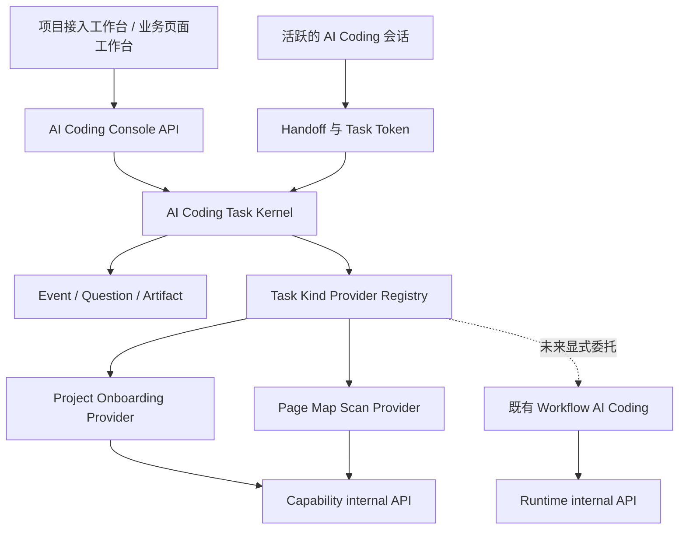
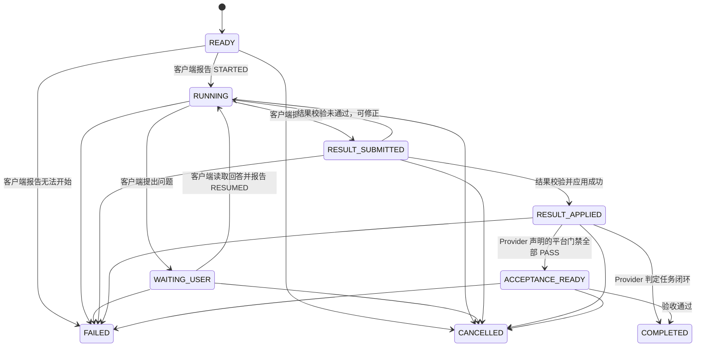
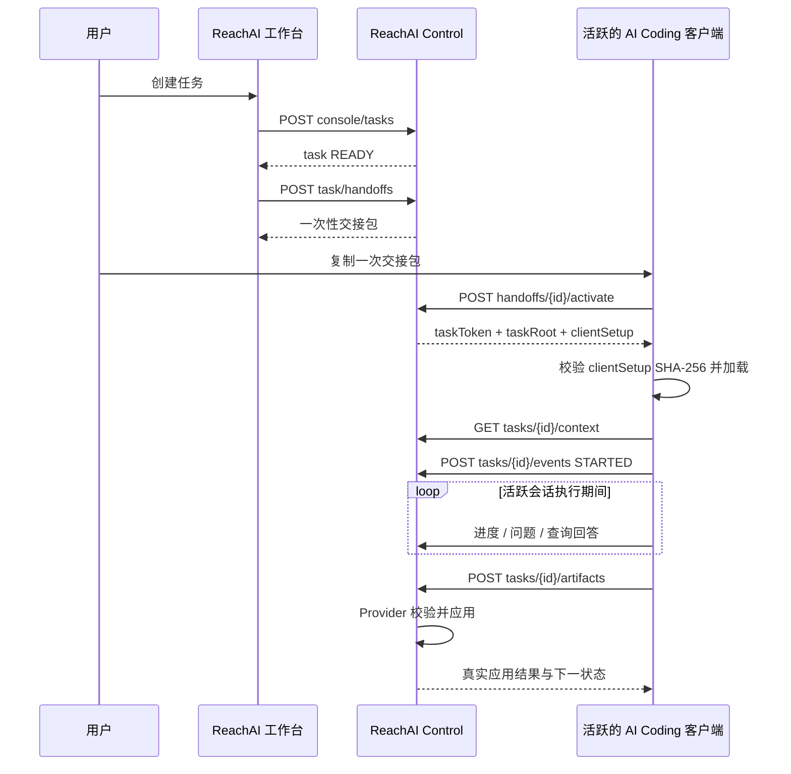

# AI Coding Task Protocol v1

## 1. 状态与适用范围

本文定义 ReachAI 面向 Codex、Cursor、Trae、Claude Code 等外部 AI Coding 客户端的统一任务协议与 Control 公共实现边界。

首批迁移场景：

- `PROJECT_ONBOARDING`：项目接入工作台。
- `PAGE_MAP_SCAN`：业务页面工作台的页面地图扫描。

后续场景在首批真实闭环通过后接入：

- `PAGE_READONLY_ANALYSIS`
- `CODE_IMPLEMENTATION`
- `BROWSER_ACCEPTANCE`
- `PRE_RELEASE_CHECK`
- `WORKFLOW_ENGINEERING`

本文是 AI Coding 任务、交接、连接状态、任务状态、任务级鉴权和结果回传的权威设计。领域文档只定义自己的上下文、结果契约和结果应用规则，不得再次实现一套任务协议。

当前迭代不兼容旧 AI Coding 任务和接入会话数据。实现时允许直接重建相关开发/测试表，不做旧数据迁移，也不做新旧接口双写。

## 2. 目标

1. 用户只复制一次紧凑交接包，活跃的 AI Coding 会话即可与 ReachAI 建立任务级连接。
2. 不要求安装 ReachAI Runner、常驻程序、浏览器扩展、npm 包或系统级软件。
3. 不把长期项目 AI Coding Key、Registry Secret 或其他长期密钥复制进 AI Coding 会话。
4. 连接状态、任务执行状态和环境就绪状态相互独立，所有状态都来自真实服务端事实。
5. 项目接入与页面扫描复用同一任务内核，但保留各自领域正确性。
6. 进度、问题、回答、结果和验收材料都回到当前 ReachAI 任务，支持幂等重试和审计。
7. 公共内核只解决任务交接与协作，不复制 Workflow GraphSpec、Capability、Runtime 或页面目录的领域逻辑。

## 3. 非目标

- 不自动唤醒已经停止的本地 AI Coding 会话。
- 不在浏览器中直接控制用户本地 AI Coding 工具。
- 不建设新的部署服务、Runner 或插件热加载平台。
- 不把所有领域结果做成一个包含大量可选字段的通用 DTO。
- 不用前端计时器、模拟事件或假报告表现“正在同步”。
- 不替代现有 Workflow AI Coding、GraphSpec mutation、发布校验、Trace 或 RunOps。

## 4. ReachAI 边界



公共实现放在 `reachai-control-service`，建议包根：

```text
com.enterprise.ai.control.aicoding
  api
  application
  domain
  persistence
  provider
  security
```

当前不新增 Maven module，不新增微服务。Control 继续通过 owning service 的 internal API / client 获取 Capability 和 Runtime 信息，不跨服务直接读写表。

## 5. 三类状态必须分离

### 5.1 连接状态

连接状态表达 AI Coding 客户端当前是否与 ReachAI 任务保持有效联系，不表达任务成功或失败。

| 内部状态 | 用户文案 | 判定事实 |
| --- | --- | --- |
| `WAITING_CONNECT` | 待对接 | 尚无有效连接；交接包未签发，或已签发但尚未激活 |
| `ACTIVE` | 对接中 | 已激活，最近访问仍在连接租约内 |
| `TIMED_OUT` | 对接超时 | 激活码已过期，或最近访问超过连接租约 |
| `CLOSED` | 对接已关闭 | 任务终止、交接被撤销或显式关闭 |

连接状态不存入任务执行状态列，而是根据最新交接记录的以下事实计算：

- `activation_status`
- `activation_expires_at`
- `activated_at`
- `last_seen_at`
- `lease_expires_at`
- `token_expires_at`
- `closed_at`

连接租约超时不自动把任务改为 `FAILED`。任务级 Token 仍在绝对有效期内时，下一次合法访问可以刷新租约并恢复为 `ACTIVE`；Token 已过期时，用户在同一任务上重新签发交接包。

任务进入终态、进入 `ACCEPTANCE_READY` 或交接被关闭后，任务级 Token 立即撤销；后续请求在认证层返回 `401 Unauthorized` 或任务状态冲突，不再进入任务业务处理。`ACCEPTANCE_READY` 虽不是任务终态，但编码交付已经结束，剩余动作只属于 ReachAI 的人工验收。

### 5.2 任务执行状态

任务执行状态只表达任务生命周期：



终态为：

- `COMPLETED`
- `FAILED`
- `CANCELLED`

重要语义：

- 创建任务后是 `READY`，签发交接包或激活连接不改变任务执行状态。
- 用户回答问题后，问题变成 `ANSWERED`，任务仍保持 `WAITING_USER`；只有客户端真正读取回答并报告 `RESUMED` 后才回到 `RUNNING`。
- `STARTED` 只接受 `READY` 或已经为 `RUNNING` 的任务。重新交接 `WAITING_USER` 任务时必须先读取问题，全部回答后报告 `RESUMED`；不能用 `STARTED` 绕过开放问题。任务进入任一终态时，剩余开放问题统一关闭。
- 客户端提交 Artifact 后是 `RESULT_SUBMITTED`，前端统一显示“结果已提交”，不能直接显示“任务已完成”。
- `STARTED`、`PROGRESS` 和客户端自然语言“已完成”都无权进入 `COMPLETED`；只有 Task Kernel 在 Artifact 校验和领域应用成功后才能继续推进。
- `RESULT_APPLIED` 表示领域 Provider 已校验并应用结果。对声明了验收门禁的 Task Kind，它同时表示“结果已回传，等待平台验证”，不等同于可验收、浏览器验收或发布完成。
- Provider 声明验收 readiness key 后，只有这些 key 的服务端状态全部为 `PASS`，Task Kernel 才允许进入 `ACCEPTANCE_READY`。`WARN`、`FAIL`、`PENDING` 或缺失结果都会保留在 `RESULT_APPLIED`，并追加 `ACCEPTANCE_BLOCKED` 审计事件。
- 所有状态变化必须通过后端状态机并追加不可变事件。

### 5.3 环境就绪状态

环境就绪状态由领域 Provider 计算，不进入公共任务状态机。

项目接入首批保留：

- `CODE_READY`
- `RUNTIME_READY`
- `SDK_CALLBACK_READY`
- `E2E_READY`

四层状态必须来自平台可观测事实：

- `CODE_READY` 只有在接入制品存在、项目已启用并配置 Registry 凭据，且 Capability owning service 已观测到至少一个业务实例完成注册时才是 `PASS`。仅有客户端报告、代码文件或本地配置但尚未观测到实例注册时保持 `PENDING`。
- `RUNTIME_READY` 以已注册实例的真实在线心跳为准；实例存在但离线时是 `WARN`，不是代码接入失败。
- `SDK_CALLBACK_READY` 以 Capability owning service 记录的当前项目配置之后的 `SDK_CALLBACK` 能力快照为准；仅推导出回调 URL 时保持 `PENDING`。
- `E2E_READY` 以当前任务启动后 Control 记录的 Embed SDK Session、用户消息和助手回复为准，不采用客户端自报的测试布尔值。

`POST /api/scan-projects/{projectId}/sdk-access-check` 是 Capability owning service 的平台 SDK 自检，不是任务验收接口。它返回 `CODE_READY / RUNTIME_READY / SDK_CALLBACK_READY`；Control 通过 internal API 复用其中真实的回调快照事实，而不重新猜测或主动探测 URL。`SDK_CALLBACK_READY` 和 `E2E_READY` 是两个独立门禁：前者只证明签名回调与能力快照，后者只证明当前任务之后的真实浏览器会话，两者不能相互替代。

活动中的 `PROJECT_ONBOARDING` 任务可由持有该任务 Bearer Token 的 AI Coding 客户端显式调用：

```http
POST /api/ai-coding/tasks/{taskId}/verifications/SDK_SYNC
Authorization: Bearer <taskToken>
```

该操作不接收业务 `projectId`、不允许跨项目，也不在应用启动时自动执行。Kernel 从任务快照解析项目，由 Project Onboarding Provider 通过 Capability owning service internal API 发起签名同步；成功后追加 `VERIFICATION_COMPLETED` 审计事件。Tool reconcile、评审和发布仍是后续独立动作。

统一只约束返回形状：

```json
{
  "key": "CODE_READY",
  "label": "代码接入",
  "status": "PASS",
  "message": "代码与配置契约已具备",
  "evidence": {}
}
```

公共内核不猜测 readiness，也不把 `WARN`、`PENDING` 自动转换为任务失败；它只执行 Provider 显式声明的验收门禁，并坚持“全部 `PASS` 才可验收”。

## 6. 一次性交接与任务级鉴权

### 6.1 交接原则

交接包包含：

- 任务 ID
- 协议版本
- AI Coding 客户端类型
- 激活 URL
- 一次性激活码
- 最小执行约定
- 提示词字符数，以及已知客户端输入上限（如适用）

交接包不包含：

- 项目级 `aiCodingKey`
- Registry App Secret
- Embed Token
- 数据库凭据
- 可访问其他项目或其他任务的长期 Token

一次性激活码允许出现在用户主动复制的 AI Coding 会话中，因此必须同时满足：

- 高熵随机值
- 任务级 scope
- 短时有效
- 单次消费
- 服务端仅保存带 pepper 的摘要
- 失败尝试限流
- 请求日志必须对 `activationCode` 和 `taskToken` 做字段级脱敏

### 6.2 激活流程



激活码只返回明文一次。ReachAI 不保存可再次读取的激活码或完整交接包；丢失时重新签发交接包，并撤销旧的未消费交接。

如果激活成功响应在网络中丢失，客户端不能重新读取已签发 Token，用户应在同一任务上重新签发交接包。实现不能为了恢复明文 Token 而降低密钥存储安全性。

交接码激活窗口默认 72 小时。项目可以通过公共 Console 凭据策略配置为 1–168 小时；修改只影响此后新签发的交接包。

### 6.3 Task Token

激活成功后返回短期任务 Token：

- 使用 `Authorization: Bearer <taskToken>`。
- 只能访问当前 `taskId` 的任务协议端点。
- 不能直接访问其他项目、任务、Workflow、Capability 或平台 Console API。
- 服务端只保存 Token 摘要。
- 同时具有绝对过期时间和空闲连接租约。
- 任务终止、用户取消或重新交接时可以立即撤销。

连接租约只用于展示连接活跃性。空闲租约过期但 Token 仍在绝对有效期内时，合法请求可以恢复连接；绝对有效期过期后必须重新交接。

Task Token 绝对有效期默认 72 小时。项目可以配置为 1–720 小时；修改只影响此后新激活得到的 Token。延长有效期不能让服务端重新读取 Token 明文；Windows 客户端进程或终端状态丢失时应先从 DPAPI 加密缓存恢复，只有缓存也不可用时才重新签发交接包。

项目级 `X-ReachAI-AiCoding-Key` 继续用于既有 Gateway discovery 和 Workflow AI Coding 等项目级工程 API，不再作为统一任务回传协议的前置条件。

### 6.4 客户端、加密恢复与字符编码

Protocol v1 正式支持以下 `executorProvider`：

- `CODEX`
- `CURSOR`
- `TRAE`
- `CLAUDE_CODE`

任务创建、交接激活和 Artifact reporter 的 provider 必须属于该集合；激活客户端和 Artifact reporter 必须与任务的 `executorProvider` 一致，不能把 Trae 冒充为 Cursor。

聊天框中的 Windows bootstrap 只负责恢复已有会话或消费一次性激活码，不再内嵌完整恢复脚本。激活响应返回 `clientSetup`：脚本正文采用 `BASE64_UTF8` 编码，并带有 SHA-256；bootstrap 必须先校验摘要再加载。任务目标、范围、领域规则和 Artifact Schema 仍只从 `/context` 获取，不能复制进提示词形成第二份契约。

Task Kernel 生成的交接提示词必须不超过 5000 字符的公共安全预算。Trae 当前输入框按 6000 字符展示已知上限；前端同时展示服务端返回的 `promptCharacters`，不能让用户复制后才发现超限。

激活后加载的 `clientSetup` 使用系统自带 DPAPI `CurrentUser` 保护任务会话，并在当前用户的 `%LOCALAPPDATA%\ReachAI\ai-coding-sessions` 下创建：

- `<taskId>.dpapi`：包含任务 Token 的加密缓存，磁盘上不存在 Token 明文。
- `<taskId>.restore.ps1`：不包含激活码或 Token 的任务级恢复函数。

上下文压缩、换 Shell 或新会话时，客户端应点执行该恢复脚本，而不是重新消费一次性交接码。缓存缺失、不可解密、绝对过期或 Token 被撤销时才重新签发交接包。进入 `ACCEPTANCE_READY` / `COMPLETED` 后，Artifact helper 删除当前任务的缓存和恢复脚本。该机制不安装 Runner、不创建常驻进程，也不改变 ReachAI 无法主动唤醒已停止客户端的边界。

所有 JSON 写回必须以 `application/json; charset=utf-8` 和 UTF-8 字节发送。`clientSetup` 创建的 PowerShell 恢复脚本提供统一 helper，禁止依赖默认管道编码传递中文 JSON。写回后必须从事件/问题/Artifact API 回读中文；连续 `?` 视为失败。

## 7. Protocol v1 API

### 7.1 Console API

Console API 使用平台登录态，仅供 ReachAI 管理端：

```text
POST /api/ai-coding-console/tasks
GET  /api/ai-coding-console/tasks/{taskId}
POST /api/ai-coding-console/tasks/{taskId}/handoffs
POST /api/ai-coding-console/tasks/{taskId}/cancel
POST /api/ai-coding-console/tasks/{taskId}/questions/{questionId}/answer
POST /api/ai-coding-console/tasks/{taskId}/acceptance-verification
POST /api/ai-coding-console/tasks/{taskId}/acceptance
GET  /api/ai-coding-console/projects/{projectId}/credential-policy
PUT  /api/ai-coding-console/projects/{projectId}/credential-policy
```

领域工作台可以保留自己的页面、finding、published 等接口，但创建任务、交接、任务详情、问题回答必须调用公共应用服务，不得另建任务状态机。

### 7.2 激活 API

```text
POST /api/ai-coding/handoffs/{handoffId}/activate
```

请求示例：

```json
{
  "schema": "reachai.ai-coding.activation.v1",
  "activationCode": "<one-time-code>",
  "client": {
    "provider": "CURSOR",
    "sessionRef": "optional-client-session-reference"
  }
}
```

响应只在激活成功时返回一次 `taskToken` 和当前协议版本的 `clientSetup`：

```json
{
  "schema": "reachai.ai-coding.activation-result.v1",
  "taskId": "ait_example",
  "protocolVersion": "v1",
  "taskToken": "<task-token>",
  "taskRoot": "https://reachai.example.com/api/ai-coding/tasks/ait_example",
  "tokenExpiresAt": "2026-07-29T10:00:00",
  "leaseExpiresAt": "2026-07-26T10:05:00",
  "clientSetup": {
    "schema": "reachai.ai-coding.client-setup.v1",
    "shell": "WINDOWS_POWERSHELL",
    "encoding": "BASE64_UTF8",
    "scriptVersion": "v1",
    "sha256": "<sha256-of-decoded-utf8-bytes>",
    "payload": "<base64-utf8-script>"
  }
}
```

`clientSetup.payload` 可以大于聊天输入上限，因为它经激活 API 下发，不经过用户复制。它不是长期下载地址，也不包含一次性激活码；客户端不得跳过摘要校验。

### 7.3 Task API

Task API 使用任务 Token：

```text
GET  /api/ai-coding/tasks/{taskId}/context
POST /api/ai-coding/tasks/{taskId}/heartbeat
GET  /api/ai-coding/tasks/{taskId}/events?afterEventId={id}
POST /api/ai-coding/tasks/{taskId}/events
GET  /api/ai-coding/tasks/{taskId}/questions?updatedAfter={time}
POST /api/ai-coding/tasks/{taskId}/questions
POST /api/ai-coding/tasks/{taskId}/artifacts
```

任何经过任务 Token 鉴权的合法访问都会更新 `last_seen_at`。`heartbeat` 不改变任务执行状态，不能代替 `STARTED`、`RESUMED` 或结果提交事件。

AI Coding API 使用真实 HTTP 语义和统一安全错误 envelope：

- 请求体无法解析时返回 `400`，错误码 `AI_CODING_TASK_INVALID_JSON`。
- owning service 或内部依赖不可用时返回 `503`，错误码 `AI_CODING_DEPENDENCY_UNAVAILABLE`。
- 未分类内部错误返回 `500`，错误码 `AI_CODING_INTERNAL_ERROR`。
- 错误响应使用 `reachai.ai-coding.error.v1`，不得把内部服务 URL、Token、凭据或堆栈返回客户端，也不得以 HTTP `200` 包装失败。

## 8. 上下文与回传契约

### 8.1 Task Context

`GET context` 至少返回：

```json
{
  "schema": "reachai.ai-coding.task-context.v1",
  "protocolVersion": "v1",
  "task": {},
  "connection": {},
  "project": {},
  "targets": [],
  "scope": {},
  "readiness": [],
  "questions": [],
  "endpoints": {},
  "artifactContract": {
    "key": "reachai.page-map-report",
    "version": "v1",
    "jsonSchema": {},
    "example": {}
  },
  "protocolGuide": {
    "requestContentType": "application/json; charset=utf-8",
    "supportedEventTypes": ["STARTED", "PROGRESS", "RESUMED", "FAILED"],
    "startedEventExample": {},
    "progressEventExample": {},
    "questionExample": {},
    "artifactEnvelopeExample": {},
    "inputLimits": {
      "clientEventIdMaxCharacters": 96,
      "eventMessageMaxCharacters": 1000,
      "questionIdMaxCharacters": 96,
      "questionTitleMaxCharacters": 256,
      "questionOptionMaxCharacters": 1000,
      "questionOptionMaxCount": 20,
      "textMaxUtf8Bytes": 60000,
      "artifactKeyMaxCharacters": 128,
      "clientSessionRefMaxCharacters": 256
    },
    "artifactIdempotencyPolicy": {
      "identityScope": "TASK_AND_ARTIFACT_KEY",
      "sameKeyRequiresSameContent": true,
      "correctedRevisionRequiresNewKey": true,
      "correctedRevisionKeyExample": "result-v2"
    },
    "completionPolicy": {
      "eventsCanCompleteTask": false,
      "requiredSubmission": "POST_ARTIFACT",
      "submittedStatus": "RESULT_SUBMITTED",
      "acceptanceReadyStatus": "ACCEPTANCE_READY",
      "completedStatus": "COMPLETED",
      "authoritativeStatusField": "task.executionStatus"
    }
  },
  "domainContext": {}
}
```

`artifactContract` 必须提供完整 JSON Schema 和至少一个可提交示例，不能只返回 required section 名称。

`domainContext` 由 Provider 构建，并且必须经过脱敏。公共内核只负责协议 envelope，不解释领域内容。

`protocolGuide` 是所有 Task Kind 共用的精确请求指南，避免客户端猜测 `clientEventId`、`eventType`、provider、输入边界、Artifact envelope 和重试语义。客户端应在发送前遵守 `inputLimits`；平台仍会在服务端校验，越界请求稳定返回 `400`，不会消耗一次性交接码或写入部分状态。`artifactKey` 只对同一任务中的同一份不可变内容承担幂等：网络重试必须复用原 key；校验拒绝后若内容发生修正，必须提交新的 revision key，保留旧版本审计记录。领域 Provider 仍只拥有自己的 Artifact `content` Schema。

### 8.2 Event

事件使用 `clientEventId` 幂等：

```json
{
  "schema": "reachai.ai-coding.event.v1",
  "clientEventId": "cursor-event-001",
  "eventType": "PROGRESS",
  "message": "已完成路由扫描",
  "payload": {
    "stepKey": "ROUTES",
    "status": "PASS",
    "files": [],
    "evidence": {}
  },
  "reportedBy": "CURSOR"
}
```

公共事件类型首批只定义：

- `STARTED`
- `PROGRESS`
- `RESUMED`
- `FAILED`

领域步骤通过 `payload.stepKey` 表达。Protocol v1 不新增通用步骤表，不把项目接入的固定六步写进公共内核。

### 8.3 Question

问题由客户端生成稳定 `questionId`：

```json
{
  "schema": "reachai.ai-coding.question.v1",
  "clientEventId": "cursor-event-002",
  "questionId": "question-business-scope",
  "title": "确认业务范围",
  "body": "是否只扫描订单模块？",
  "options": ["仅订单模块", "订单及售后模块"],
  "askedBy": "CURSOR"
}
```

客户端在活跃执行期间查询当前任务回答。ReachAI 不向已经停止的本地客户端承诺 push 或自动唤醒。

### 8.4 Artifact

公共 Artifact envelope：

```json
{
  "schema": "reachai.ai-coding.artifact.v1",
  "clientEventId": "cursor-event-003",
  "artifactKey": "page-map-main-20260725",
  "contract": {
    "key": "reachai.page-map-report",
    "version": "v1"
  },
  "content": {},
  "reportedBy": {
    "provider": "CURSOR",
    "sessionRef": "optional"
  }
}
```

公共内核只校验 envelope、Token scope、幂等键和 contract 匹配；`content` 由对应 Provider 使用自己的 DTO / JSON Schema 校验。

测试和真实浏览器材料使用公共 `delivery-evidence-v1.schema.json`，避免项目接入、代码实施和浏览器验收分别发明同义字段：

- Test Check 固定包含 `name / status / command / evidence`。
- 对浏览器验证可选的领域 Artifact，未运行时必须将 `browserVerification` 明确设为 `null`，不得构造成功材料；`CODE_IMPLEMENTATION` 和 `BROWSER_ACCEPTANCE` 的最终交付契约要求真实浏览器材料，不能提交 `null`。
- 一旦报告浏览器验证，就必须包含 `passed / browser / url / scenarios / screenshots / evidence`；场景和截图路径至少各一项。
- 这些字段是 AI Coding 客户端提交给用户复核的交付材料，不是平台 readiness。客户端报告 `passed=true` 不会越过 Provider 的服务端门禁或用户验收。
- 公共任务详情必须展示上述摘要、相关改动、测试结果、业务 URL、场景和截图路径，不能只显示“Artifact 已应用”。

幂等规则：

- 相同 `taskId + artifactKey + contentHash` 重复提交，返回原处理结果。
- 相同 `taskId + artifactKey` 但 `contentHash` 不同，返回冲突，不静默覆盖。
- 校验失败的 Artifact 保留真实校验状态和错误；修正后必须使用新的 `artifactKey`。
- Provider 应用结果与 Artifact 状态在同一业务事务中提交，或使用明确的可恢复应用状态，不能先显示成功再异步丢失。

## 9. Task Kind Provider

公共内核通过小型 Registry 选择 Provider：

```java
public interface AiCodingTaskKindProvider {

    String kind();

    AiCodingTaskContract contract();

    JsonNode buildContext(AiCodingTask task);

    List<ReadinessItem> readiness(TaskDescriptor task);

    default List<ReadinessItem> readiness(
            TaskDescriptor task,
            JsonNode applicationResult) {
        return readiness(task);
    }

    default List<String> acceptanceReadinessKeys() {
        return List.of();
    }

    default JsonNode requestVerification(
            TaskDescriptor task,
            String verificationKey) {
        throw new IllegalArgumentException("unsupported verification");
    }

    AiCodingArtifactApplyResult applyArtifact(
            AiCodingTask task,
            AiCodingArtifactEnvelope artifact);
}
```

约束：

- 一个 `taskKind` 只能注册一个 Provider，启动时检查重复和缺失。
- Provider 可以调用领域应用服务和 owning service client，不直接操作其他服务表。
- Provider 不签发 Token、不改变连接状态、不自行绕过任务状态机。
- Provider 返回确定性的应用结果和下一阶段建议，由 Kernel 执行合法状态迁移。
- Provider 只声明哪些 readiness key 是验收前置条件；门禁判断和状态迁移仍由 Kernel 唯一执行。
- Provider 可声明少量具名、任务范围内的验证操作；Kernel 仍负责 Token scope、任务状态和审计事件，Provider 不能接受客户端自报的项目范围。
- Provider 需要校验某次交付中的精确领域对象时，使用最新 `APPLIED` Artifact 的 `applicationResult` 计算 readiness；不能从客户端 Event、自然语言或任意历史对象猜测目标。
- 不做运行时 classpath 插件加载，不做通用 Recipe DSL，不做万能 execute 引擎。

## 10. 领域 Provider

### 10.1 Project Onboarding Provider

```text
capabilityKey: PROJECT_ONBOARDING
taskKind: PROJECT_ONBOARDING
primaryTarget: PROJECT
accessMode: READ_WRITE
artifactContract: reachai.project-onboarding-report.v1
```

负责：

- 构建项目、Manifest、Starter、Gateway、业务 API、Embed Token 和验收上下文。
- 保留以下固定领域步骤：
  - `PROJECT`
  - `STARTER`
  - `GATEWAY`
  - `BUSINESS_API`
  - `EMBED_TOKEN`
  - `FINAL_CHECK`
- 复用并收口 `CODE_READY / RUNTIME_READY / E2E_READY` 计算。
- 将三层 readiness 全部声明为验收前置门禁；Artifact 回传不能绕过 Runtime 与 E2E。
- `RUNTIME_READY` 使用 Capability owning service 返回的真实实例心跳；`E2E_READY` 使用 Control 自己记录、且发生在当前任务启动后的 Embed SDK Session、用户消息和助手回复，不采用客户端报告中的布尔值。
- 校验项目接入报告、文件、命令、证据和剩余问题；如果报告执行了浏览器验证，还必须给出真实业务 URL、入口可见场景、截图路径和页面观察结果。
- 平台自检只追加到 Artifact 的 `applicationResult.platformCheck`，不覆盖 `applicationResult.codingReport` 中 AI Coding 客户端已报告的证据和状态。
- 明确区分“配置已生成”“运行时已在线”“真实调用已通过”。
- Onboarding Skill 同时携带 Embed SDK tgz、制品 Manifest 与安装脚本。安装脚本必须先校验 SHA-256，再复制到业务前端的 `vendor/reachai/` 稳定路径并以相对路径执行 npm；禁止把 Skill 临时解压目录写入业务 `package.json` 或 lockfile。

结构化领域上下文应包含：

```text
prerequisites
scope
steps
securityRules
contracts
examples
acceptanceCriteria
reportRequirements
```

现有超长前端提示词中的有效规则迁移到上述结构，不继续维护第二份字符串模板。

### 10.2 Page Map Scan Provider

```text
capabilityKey: BUSINESS_PAGE_WORKBENCH
taskKind: PAGE_MAP_SCAN
primaryTarget: PROJECT
accessMode: READ_ONLY
artifactContract: reachai.page-map-report.v1
```

负责：

- 构建限定项目范围、仓库位置、已有页面和增量扫描基线。
- 只发现模块、路由、页面组件、关联 API、配置、权限位置和已有页面操作。
- 不生成潜在交互，不判断业务价值或优先级，不修改业务代码。
- 首次允许 `FULL`，后续优先 `INCREMENTAL`。
- 使用 `PageCatalogApplicationService.applyPageMap` 或其收口后的领域应用服务应用结果。
- 按页面稳定键幂等合并，并继续遵守 `MANUAL > SDK > AI_SCAN` 来源优先级。

该 Provider 用来证明公共内核可以承载“无固定步骤、只读扫描、领域结果应用”场景，而不是项目接入会话的改名版本。

### 10.3 Page Workbench Delivery Provider

业务页面工作台的 `CODE_IMPLEMENTATION`、`BROWSER_ACCEPTANCE` 和 `PRE_RELEASE_CHECK` 使用同一 Task Kernel，但各自保持独立 Artifact Schema 和确定性应用规则：

- `CODE_IMPLEMENTATION` 必须包含至少一个改动文件、至少一个全部为 `PASS` 的测试结果，以及通过的结构化浏览器材料。缺失或报告失败时 Artifact 标记为 `REJECTED`，任务返回 `RUNNING`，客户端必须修正后使用新的 `artifactKey` 回传。
- `BROWSER_ACCEPTANCE` 必须同时满足顶层 `passed=true`、全部检查为 `PASS`、浏览器材料 `passed=true`。报告失败时真实材料仍标记为 `APPLIED`，Task Kernel 将任务推进到终态 `FAILED`。
- 浏览器报告通过后仍先停留在 `RESULT_APPLIED`。`PAGE_BROWSER_E2E_READY` 只接受当前任务启动后、当前 `projectCode + pageKey` 的 Control 服务端观测事实：真实 Embed Session 必须上报 SDK 版本，并至少记录一条用户消息和一条助手回复。其他页面、任务开始前的会话或客户端自报截图不能替代该事实；缺失时保持 `PENDING`，用户可完成真实业务页面链路后请求重新验证。
- 从“已发布”列表发起浏览器验收时，任务额外保存一个 `RELATED WORKFLOW` 目标，快照包含精确 `workflowVersionId + workflowVersion`。Page Workbench Provider 在创建任务、持久化快照前，必须通过 Runtime 的已发布查询重新确认该 Workflow、页面和版本仍为精确的 `ACTIVE` 对象，不能信任前端快照。
- 绑定 Workflow 的浏览器验收还要求 `PAGE_WORKFLOW_TRACE_READY`。Control 先从当前任务启动后、当前页面的真实 Embed 会话中选择助手回复关联的 Trace；Runtime 再核对该 Trace 的 Embed Run 已完成，并且 `WORKFLOW_TOOL` 成功 Span 精确匹配任务绑定的 Workflow 和版本。Artifact 回传 `traceId` 时只核对该 Trace；未回传时只有唯一一条符合条件的 Trace 才可自动关联，多条候选保持 `PENDING` 并要求 AI Coding 使用新的 `artifactKey` 明确回传。
- `PAGE_WORKFLOW_TRACE_READY` 只证明“当前页面 Trace 成功执行了指定 Workflow 版本”，不从 GraphSpec 自动推断必须执行哪些 `PAGE_ACTION`，也不替代业务结果、页面入口可见性、截图和人工体验验收。
- `PRE_RELEASE_CHECK` 必须同时满足顶层 `passed=true`、全部检查为 `PASS`，并提供非空 `workflowId` 和 `workflowVersion`。报告失败或缺少明确版本时保留材料并进入 `FAILED`。
- 报告通过后仍先停留在 `RESULT_APPLIED`。Page Workbench Provider 将最新 `APPLIED` Artifact 的 `applicationResult.preRelease` 交给 Runtime owning service，精确核对该 Workflow 属于当前项目、类型为 `PAGE_ASSISTANT`、唯一 `TARGET PAGE` 等于当前主页面、当前发布校验通过，并确认目标版本是尚未占用的合法待发布版本或精确的 `ACTIVE` 已发布版本。
- Runtime 不可用、响应缺失或返回非确定状态时，`PRE_RELEASE_READY` 保持 `PENDING`；对象不匹配或校验失败时为 `FAIL`。只有服务端返回 `PASS`，Task Kernel 才能进入 `ACCEPTANCE_READY`。该门禁验证发布就绪性，不自动发布 Workflow。
- 完整且报告通过的材料只能进入 `ACCEPTANCE_READY`，仍需用户在 ReachAI 确认；客户端自报、自然语言“完成”或普通 Event 都不能完成任务。

这些规则只验证最终交付包内部是否完整且一致，不把 AI Coding 客户端变成平台事实源。能由 ReachAI 服务端观测的 Runtime、调用和发布事实仍应通过 Provider readiness 门禁计算。

## 11. 数据模型

以下表均归属 `reachai-control-service`。

### 11.1 `control_ai_coding_task`

通用任务根对象，建议字段：

| 字段 | 语义 |
| --- | --- |
| `task_id` | 稳定任务 ID |
| `project_id` / `project_code` | 项目范围和审计查询键 |
| `capability_key` | 产品能力域 |
| `task_kind` | Provider Registry 键 |
| `protocol_version` | Task Protocol 版本 |
| `executor_provider` | CODEX / CURSOR / TRAE / CLAUDE_CODE |
| `title` / `objective` | 用户任务目标 |
| `access_mode` | READ_ONLY / READ_WRITE |
| `execution_status` | 任务执行状态 |
| `result_contract_key` / `result_contract_version` | 领域结果契约 |
| `context_snapshot_json` | 创建时脱敏范围快照 |
| `last_message` | 最近真实状态摘要 |
| `lock_version` | 并发状态更新版本 |
| `created_by` | 创建者 |
| `started_at` / `result_submitted_at` / `completed_at` | 生命周期时间 |
| `created_at` / `updated_at` | 审计时间 |

任务根对象不再包含：

- `page_id`
- `page_key`
- 页面专用 `task_type` enum
- 完整 `handoff_prompt`
- 项目长期 Key
- 外部连接状态

### 11.2 `control_ai_coding_task_target`

表达 PROJECT、PAGE、WORKFLOW、API 等任务目标：

- `task_id`
- `target_type`
- `target_key`
- `target_role`：`PRIMARY` / `RELATED`
- `access_mode`
- `snapshot_json`

一个任务必须恰好有一个 `PRIMARY` target。领域 Provider 负责进一步约束允许的 target 类型和数量。

### 11.3 `control_ai_coding_task_handoff`

保存一次性交接和激活后的任务连接事实：

- `handoff_id`
- `task_id`
- `activation_code_hash`
- `activation_status`
- `activation_expires_at`
- `task_token_hash`
- `token_expires_at`
- `client_provider`
- `client_session_ref`
- `activated_at`
- `last_seen_at`
- `lease_expires_at`
- `closed_at`
- `close_reason`
- `issued_by`
- `created_at` / `updated_at`

不保存任何明文激活码或任务 Token。

### 11.4 `control_ai_coding_task_event`

保留不可变事件，继续使用 `client_event_id` 做客户端幂等。状态迁移事件必须包含 `execution_status_after`。

### 11.5 `control_ai_coding_task_question`

保存问题、选项、回答和回答时间。问题状态首批为：

- `OPEN`
- `ANSWERED`
- `CLOSED`

### 11.6 `control_ai_coding_task_artifact`

改为通用 Artifact：

- `artifact_id`
- `task_id`
- `artifact_key`
- `contract_key`
- `contract_version`
- `content_hash`
- `content_json`
- `processing_status`：`RECEIVED / VALIDATED / APPLIED / REJECTED`
- `validation_message`
- `reported_by`
- `created_at` / `validated_at` / `applied_at`

不再由公共表枚举页面地图、页面分析、实施、验收等 Artifact 类型。

## 12. 前端公共边界

公共实现：

```text
ai-admin-front/src/api/aiCodingTasks.ts
ai-admin-front/src/types/aiCodingTask.ts
ai-admin-front/src/composables/useAiCodingTask.ts
ai-admin-front/src/utils/aiCodingPresentation.ts
ai-admin-front/src/components/ai-coding/
  AiCodingTaskDetailPanel.vue
```

公共前端负责：

- 创建、交接、取消和刷新任务。
- 分别展示连接状态与执行状态。
- 共用正式 provider 目录、provider 标签、连接状态标签和执行状态标签。
- 展示真实事件、问题、回答、Artifact 校验结果。
- 展示 Provider readiness；任务停留在 `RESULT_APPLIED` 时允许用户请求服务端“重新验证”，前端不能自行改变状态。
- 领域步骤只表示“AI 已报告”的进度，必须使用“已报告 / 报告失败 / 已声明跳过 / 待验证”等文案，不能把客户端报告显示成平台完成。
- 项目存在多个历史任务时优先展示最新的非终态任务；只有没有活动任务时才回退到最新历史任务，避免新取消的测试任务覆盖仍在执行的真实任务。
- 已激活且仍接受 AI Coding 写回的任务必须提供不含 Token 的“复制恢复命令”。用户应先让原 AI Coding 客户端从当前 Windows 用户的 DPAPI 缓存恢复同一任务；只有缓存不存在、失效或 Token 被撤销时才重新签发交接包。进入 `ACCEPTANCE_READY` 后不再提供恢复或重新交接，因为编码交付已经关闭，只等待 ReachAI 人工验收。
- 活跃连接重新签发交接包前必须明确提示：新交接会撤销当前 Task Token。项目接入工作台不能用主操作静默覆盖一个仍活跃的客户端；切换 AI Coding Provider 前应先显式取消当前接入任务。
- 激活码过期后显式“重新生成交接包”。

领域工作台保留：

- 项目接入的步骤、readiness、自检和项目配置视图。
- 页面工作台的页面地图、finding、页面详情和 published 视图。

公共组件不出现页面专用字段，也不把项目接入固定步骤硬编码进组件。

## 13. 现有实现迁移映射

| 当前实现 | 有效语义 | 新归属 | 动作 |
| --- | --- | --- | --- |
| `ControlAiAccessSessionService` | 固定接入步骤、状态汇总、证据保留 | `ProjectOnboardingTaskProvider` + Kernel event/artifact | 迁移语义，不复制旧会话框架 |
| `control_ai_access_session` / `control_ai_access_step` | 项目接入进度 | 通用 task/event/artifact | 新链路通过后删除，不迁移数据 |
| `ControlSdkAccessReadinessCalculator` | 三层 readiness | Project Onboarding Provider | 保留算法，接入 Provider readiness |
| `useSdkAccessWizardSnippets.ts` | 接入规则、示例、验收条件 | 服务端结构化 domain context | 删除超长前端 Prompt 和长期 Key 注入 |
| `ControlAiCodingProjectController` manifest | 项目级发现和领域上下文 | Gateway discovery + Provider context | 保留 discovery，接入任务上下文 |
| 页面 `AiCodingTaskApplicationService` | 任务、事件、问题、结果应用雏形 | Kernel + Page providers | 拆分公共生命周期和领域应用 |
| `AiCodingTaskPromptFactory` | 交接执行约定 | 公共 Handoff Package Factory | 改为短启动提示词和一次性激活 |
| `AiCodingTaskStateMachine` | 后端状态机 | 通用 Task State Machine | 用新执行状态替换 |
| `TaskResultSubmission` 大联合 DTO | 多种页面结果 | Artifact envelope + Provider DTO | 删除联合 DTO |
| `PageWorkbenchAiCodingController` | context/event/question/result 回写 | 通用 Task API | 领域 external controller 退场 |
| `ControlAiCodingAccessInterceptor` | 项目级 Key 鉴权 | Project Gateway / Workflow AI Coding | 保留；Task API 新增独立 Token Guard |
| `useBusinessPageWorkbench.ts` task 部分 | 页面任务交互 | 公共 composable + 页面领域 composable | 拆分，不影响页面数据状态 |
| `SdkAccessWizard` task/progress 部分 | 项目接入任务交互 | 公共 composable + 接入领域视图 | 迁移后删除 access-session API 依赖 |
| Workflow AI Coding | GraphSpec 工程闭环 | 既有 Workflow/Runtime 领域 | 直接复用，不复制进 Kernel |

## 14. 实施顺序

### Phase 0：协议和破坏性变更确认

- 固化本文的状态语义、API envelope 和安全边界。
- 列出将重建和删除的表、接口、类与前端逻辑。
- 不开始旧数据兼容设计。

### Phase 1：Task Kernel 与安全链路

- 建立通用 task、target、handoff、event、question、artifact 表。
- 实现通用状态机、Provider Registry、Console API、activation API 和 Task Token Guard。
- 实现交接码单次消费、Token scope、租约、超时恢复和撤销。
- 完成协议层单元测试和接口测试。

### Phase 2：两个首批 Provider

- 迁移 `PROJECT_ONBOARDING`。
- 迁移 `PAGE_MAP_SCAN`。
- 两个 Provider 都只调用公共 Kernel，不直接互相依赖。
- 不做新旧表双写。

### Phase 3：两个工作台前端切换

- 抽取公共 API、类型、composable 和组件。
- 项目接入工作台切换到 Project Onboarding Provider。
- 页面工作台扫描切换到 Page Map Scan Provider。
- 保留各自领域页面和产品文案。

### Phase 4：真实 AI Coding 闭环

至少验证：

1. ReachAI 创建任务并签发一次性交接包。
2. 活跃 AI Coding 客户端从交接包激活，不需要预配置项目 Key。
3. 客户端获取完整 Context、`protocolGuide` 和 Artifact JSON Schema。
4. 客户端写回 `STARTED`、真实进度和问题。
5. 用户在 ReachAI 回答，客户端主动查询并 `RESUMED`。
6. 客户端提交结果，ReachAI 校验并应用。
7. 页面地图真实出现扫描结果，或项目接入 readiness 真实变化。
8. 客户端只有在 Artifact 响应为 `ACCEPTANCE_READY` / `COMPLETED` 时才提示用户回到 ReachAI 验收；`RESULT_APPLIED` 只能说明已回传、待平台验证。
9. 连接超时不把任务伪装成失败，同一任务可以恢复或重新交接。
10. Windows 新进程可以从 DPAPI 加密缓存恢复任务会话，且中文事件回读不出现 `?`。

### Phase 5：删除重复旧结构

- 删除 access-session / access-step 表和旧路由。
- 删除页面专用外部任务 Controller。
- 删除前端超长 Prompt 拼接和 Key 注入。
- 删除页面专用任务根字段与结果联合 DTO。
- 更新 `sql/initV2.sql`、升级 SQL、service table ownership 和权威文档。

### Phase 6：扩展其他任务

按需迁移页面分析、代码实施、浏览器验收、发布前检查。只有两个首批 Provider 和真实 AI Coding 闭环通过后，才评估 `WORKFLOW_ENGINEERING` Task Provider。

## 15. 验收条件

- 项目接入和页面扫描只有一套公共任务状态机。
- UI 同时且分别展示“连接状态”和“任务执行状态”。
- `RESULT_SUBMITTED` 统一显示“结果已提交”，不是 `COMPLETED`。
- Event API 不接受 `COMPLETED`，没有成功 Artifact 时客户端文本不能完成任务。
- 交接包不包含长期项目 Key，服务端不保存激活码或 Token 明文。
- Windows 任务 Token 只进入当前用户 DPAPI 加密缓存；恢复脚本不包含激活码或 Token，任务闭环后自动清理。
- Task Token 不能访问其他任务或项目级工程 API。
- Context 返回完整领域 JSON Schema 和提交示例。
- 问答链路不会在 Cursor 未恢复时伪报 `RUNNING`。
- 项目接入保留三层 readiness 和 evidence preservation。
- 项目接入三层 readiness 未全部 `PASS` 时必须停留在 `RESULT_APPLIED`；客户端自报测试或浏览器通过不能进入 `ACCEPTANCE_READY`。
- `CODE_READY` 必须包含 owning service 已观测到的业务实例注册事实；仅有代码、配置和客户端报告时保持 `PENDING`。
- E2E readiness 必须来自当前任务启动后服务端记录的 SDK Session、用户消息和助手回复，且不在 evidence 中暴露消息内容或用户身份。
- AI Coding API 的无效 JSON、依赖不可用和内部错误必须分别使用真实 HTTP `400 / 503 / 500`，不得以 HTTP `200` 伪装失败。
- 页面地图报告按稳定页面键幂等应用，并保留来源优先级。
- 不安装 Runner、常驻程序或隐式依赖。
- 不跨服务直接读写表。
- 后端目标测试、前端构建和一条真实 AI Coding 端到端链路均通过。

## 16. 已确定的架构决策

1. 使用一次性、任务级、短时激活码。
2. 激活后换取短期、任务级 Token。
3. 连接状态和任务执行状态分离。
4. readiness 是第三类独立状态。
5. 公共内核放在 Control，不新增服务或 module。
6. 用 Project Onboarding 与 Page Map Scan 两个 Provider 共同验证公共抽象。
7. 不兼容旧数据，不双写，不保留两套主路径。
8. 保留项目接入的正确业务语义，删除旧实现机制。
9. Workflow AI Coding 继续拥有 GraphSpec 修改、校验、调试和发布语义。
10. ReachAI 不承诺零安装自动唤醒已经停止的本地 AI Coding 客户端。
11. AI Coding provider 是公共 Kernel 的正式枚举，不由领域页面各自维护别名。
12. Windows 通过 DPAPI 加密任务缓存跨进程恢复；所有 JSON helper 强制 UTF-8。
13. `COMPLETED` 的唯一权威是 Task Kernel 的 `task.executionStatus`，自然语言和普通 Event 无完成权限。
