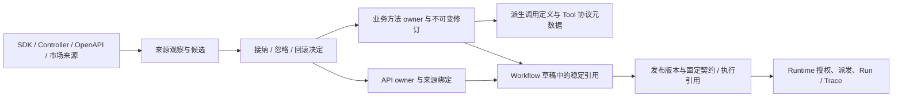

# 业务方法与 API 资产架构

2026-10-07。本文描述 BMAPI-6 的资产所有权与用户后续确认的业务能力工作台；实施证据和环境限制见[专项进度](../plans/业务方法与API重构实施进度.md)与[BMAPI-6 完成条件](../plans/BMAPI-6-资产体系收口方案与验收.md)。

## 产品入口

“业务能力”是统一查找和使用业务操作的工作台，包含“Java 业务方法”和“HTTP API”两个 TAB。业务方法表示业务系统明确开放的 Java 业务操作；API 表示项目内有明确 HTTP 契约的操作。两者各自管理资产事实，统一入口不新增第三套可维护目录，也不要求为同一对象维护通用 Tool。

| 用户任务 | 入口 | 管理的事实 |
| --- | --- | --- |
| Java 开发者接入、声明和同步 | 项目接入与同步、SDK/Starter | 项目、实例、明确分类的声明和来源观察 |
| 实施人员看懂、试通和使用方法 | 业务能力 → Java 业务方法、方法详情 | 输入/返回、调用条件、试调用、具体使用位置 |
| 发现、接纳并使用 HTTP 操作 | 项目来源管理、业务能力 → HTTP API、API 详情 | 多来源、当前接纳契约、连接配置、试调用、具体引用 |
| 处理变化和定位发布影响 | 所属项目的来源变化、资产详情 | 当前候选、接纳/忽略/回滚决定及实际草稿/发布引用 |
| 编排和对外服务 | Workflow Studio、Agent、MCP/A2A/Embed | 已发布 Workflow 与协议身份，不复制源资产 |

发现方式与资产类型分开。普通方法、Controller、OpenAPI、市场都是来源机制；发现到来源不意味着接纳、配置、验证或授权。同一 Java 实现明确同时声明方法与 HTTP API 时，两种资产保持关联，各自维护契约。

工作台通过 `/business-capabilities/java-methods` 与 `/business-capabilities/http-apis` 两个嵌套目录路由保存分类。HTTP API 详情位于 `/business-capabilities/http-apis/:id`；旧目录 URL 仅重定向并迁移原筛选字段。公共筛选/分页机制使用 method/api query 命名空间，保留项目范围和另一类目录条件。面板卸载、项目或会话变化均使旧响应失效。

后端维持 typed method/API 读取接口及既有调用主路径。方法统计 `GET /api/business-methods/summary?projectId=…` 经 Control 同目录授权后转发 Capability；省略项目要求 GLOBAL grant。Capability 一次聚合已接纳 owner 返回 `total/enabled/disabled`，不解析来源详情、不读取调用投影，统计独立于关键词和分页。HTTP API 列表的当前账号连接与最近试调用提示继续由 Runtime 提供，不挪到方法聚合或跨服务表查询中。

## 单向事实链

来源观察、接纳资产和执行事实各自维护一次。调用投影可以删除或重建，不能反向补成资产契约；发现、历史成功或展示状态也不能代替当前执行授权。

## 数据与服务所有权

| 事实 | Owner | 约束 |
| --- | --- | --- |
| SDK 注册项目、实例、来源快照/diff/决定、SDK 签名凭据 | Capability | 同项目锁内接收与接纳；SDK apply 没有审批权，诊断不能变成真实来源 |
| `capability_business_method_asset` | Capability | 项目/方法稳定身份、当前接纳修订；展示名称变化不换资产身份 |
| `capability_business_method_revision` | Capability | 不可变来源与决定引用；分别保存业务契约、完整调用和传输绑定指纹 |
| HTTP API asset/source binding/acceptance | Capability | 项目/环境/操作身份与独立接纳契约；等价来源归同一 API，冲突来源阻止使用 |
| `capability_tool_definition` | Capability | 派生技术调用投影；不作为方法目录、执行或发布的源资产事实 |
| HTTP 连接、运行凭据、Console ledger、Workflow 版本/pin、Run/Trace | Runtime | 配置与验证分离，结果归属当前操作者；发布引用不可静默追最新契约 |
| 平台身份、项目 RBAC、公开 BFF、Page Action/Embed 会话与开放协议管理 | Control | 解析 owner 项目后授权，服务间精确字节 HMAC/nonce；不跨服务读写 owner 表 |

五服务拓扑和同库阶段保持。完整表归属见[所有权清单](./service-table-ownership.md)，服务方向见[服务边界](./service-boundaries.md)。SDK 注册签名凭据继续归 Capability；HTTP 调用连接和运行凭据归 Runtime，两者不混用。

## 接纳、变化与固定引用

同内容同步保持同一方法资产、来源观察和接纳修订。可自动接受的只读新声明或纯展示更新仍按服务端策略处理；风险、身份、参数、路由或契约变化先形成候选，不能由 SDK 请求自行批准。

业务方法目录、详情、试调用条件和内部技术 lookup 从接纳 owner 读取。删除或污染 Tool/扫描投影不改变资产身份、契约或真实来源状态。接纳事务失败一并回滚资产、修订、决定与派生写入；回滚恢复原 owner 修订，再重建投影。

Workflow 草稿明确引用方法资产或 API 资产。GraphSpec 的 `TOOL` 是运行节点技术类型；`businessMethodAssetId`、`httpApiAssetId` 与对应稳定引用说明调用哪个 owner。发布由服务端固定资产、接纳修订、契约、来源和执行绑定，旧发布遇到变更或移除先拒绝派发。升级契约必须显式重新读取、校验和发布，不能自动修改历史版本。

业务契约与传输/执行绑定分层。业务语义不变的凭据轮换、有效期、状态或使用策略变化也会改变执行修订，使旧 Console 确认、Studio 批准和 Workflow 发布引用失效；它们需要重新读取当前条件。

项目删除在锁内直接检查各状态的方法/API owner 和引用，有资产返回带具体目标的409；不级联丢弃接纳记录。来源重扫单独预检，owner 存在本身不阻止同步。

## 调用与使用边界

Console 使用已接纳 owner、项目接入身份、平台操作权限和精确 ACL；浏览器不选择地址、角色、业务用户或凭据。写方法/API 在每个新尝试前明确确认，同一 invocationId 用于去重和只读查询。派发后超时或响应丢失可能已经生效，UNKNOWN 不自动重发；新尝试必须重新确认。

Studio 使用保存的草稿和受签名的 `STUDIO_PROJECT_TEST`，限定当前支持的明确只读方法/API及下游变量。普通 Debug、模型输入和节点配置不能自行制造可信身份；试运行批准绑定草稿、graph、owner 和执行修订，运行留下 Run/Trace，不创建发布版本或 pin。

Agent 按已发布配置与 Workflow-as-Tool 白名单使用 Workflow。MCP 的直接业务方法分支由 owner 派生技术协议元数据，执行核对固定的调用契约 hash 并使用当前可用 SDK 签名凭据；不将它描述为携带完整 Workflow owner/执行引用。API 通过固定 API owner 的已发布 Workflow 暴露；A2A/Embed 保持各自认证与运行边界。Page Action 由 Control 管理，合法交互恢复保存的 Workflow GraphSpec，缺少快照在执行前报 `GRAPH_MISSING`。

## 旧模型与新库

旧能力目录、`/tool` 重定向、人工 scan promote/edit/test 和公开 raw Tool/组合/独立交互执行入口已删除。独立 Module/ToolAsset/CompositionDefinition/InteractionDefinition 不再拥有业务事实；多步骤编排归 Workflow，交互归 Workflow 会话，页面动作归 Control。必要 Tool 协议、ACL、调用日志和内部技术入口保留，不形成另一套资产。

新库以 [initV2.sql](../../sql/initV2.sql) 直接创建当前模型。两份 BMAPI-6 开发库 upgrade 的影响与执行说明见 [SQL README](../../sql/README.md)；未分类旧行不猜测类型、不自动回填 owner，正常可信同步或来源发现重新形成资产。既有引用不会自动迁移。本批没有提交、推送或部署，受控验证不代替客户系统或真人任务签收。
