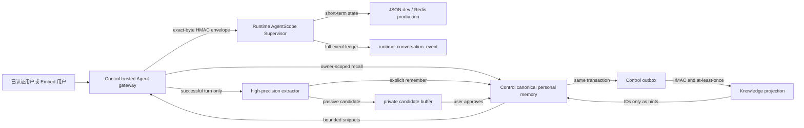
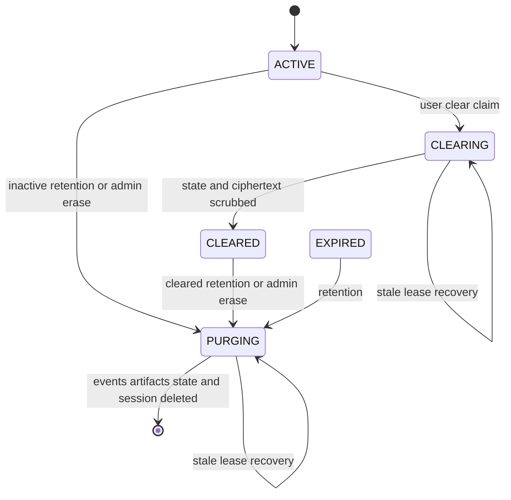

# Personal Agent Memory

> 状态：STAGE_1_LIVE_E2E_VERIFIED / STAGE_2_CONTROLLED_LIVE_E2E_VERIFIED / REAL_EMBEDDING_DEV_CANARY_VERIFIED / OSS_SHADOW_SYNTHETIC_VERIFIED / OUTBOX_REDACTION_SOURCE_VERIFIED / OUTBOX_REDACTION_DB_E2E_NOT_RUN / SEMANTIC_PROJECTION_SOURCE_VERIFIED / SEMANTIC_PROJECTION_DB_E2E_NOT_RUN / SESSION_RETENTION_SOURCE_VERIFIED / SESSION_RETENTION_DB_E2E_NOT_RUN / REMOTE_MYSQL_TLS_IDENTITY_NOT_READY / PRODUCTION_ROLLOUT_PENDING
> 范围：个人长期记忆、单次会话记忆、候选确认、检索投影、业务记忆引用和用户自助治理

## 目标与边界

ReachAI 的记忆能力按事实生命周期拆分，而不是把聊天历史、个人偏好和业务数据混进一个向量库：

| 层级 | 事实源与 owner | 用途 | 不承担的职责 |
| --- | --- | --- | --- |
| 单次会话记忆 | Runtime 的 AgentScope state；`runtime_conversation_*` 保存目录和完整事件账本 | 同一用户、Agent、session 的多轮连续对话 | 不自动升级为长期个人事实 |
| 个人长期记忆 | Control 的 `control_context_namespace/item/binding/evidence/audit_event` | 用户确认的 FACT / PREFERENCE / RULE / NOTE | 不授予权限，不保存密码、Token、密钥，不代替业务主数据 |
| 记忆候选 | Control 的 `control_context_memory_candidate` | 对成功对话做高精度、低置信度的待确认提取 | 被动提取不能直接成为已确认事实 |
| 检索投影 | Knowledge 的 `knowledge_personal_memory_index` | 可扩展、可重建的 owner-scoped 搜索召回 | 不是事实源；命中后仍由 Control 重读并校验 canonical item |
| 业务记忆 | 业务系统是事实源；Knowledge Business Index 只保存检索投影和带版本引用 | 定位订单、客户、流程等业务资源，再按当前身份回源 | 不复制进个人偏好存储，不把索引快照当成当前事实或授权依据 |

这里没有把 Mem0、ReMe 或 Graphiti 作为核心依赖。核心治理、身份和删除语义由 ReachAI 自己拥有；以后可以把外部检索/图谱实现接在 Knowledge 投影层，不能绕过 Control canonical owner。

### 开源复用决策

- 当前检索实现首选 ReachAI 自有、可替换的 Knowledge 投影，embedding 统一经 Model Gateway 的 OpenAI-compatible 契约接入；开发 canary 采用 TEI + `BAAI/bge-small-zh-v1.5`。这样保留 Java 服务治理、owner 隔离、outbox/source version 和 canonical revalidation，同时不把某个 Python 记忆框架升级为产品事实源。
- [ReMe](https://github.com/agentscope-ai/ReMe) 与 AgentScope 体系接近，保留为上下文压缩、离线提取和文件式记忆实验候选。合成检索 benchmark 中它没有超过原生投影，并出现负向查询误召回，因此当前不进入在线检索主链路。
- [Mem0](https://github.com/mem0ai/mem0) 保留为个人化记忆成熟对照组。合成 benchmark 中它与原生向量投影的排序完全相同、延迟更高，没有证明引入 Python + Qdrant 运行面的收益；后续仍可在真实脱敏 shadow 中继续竞争。
- [Graphiti](https://github.com/getzep/graphiti) 只在真实需求出现跨实体关系、事实有效时间和历史时点查询时试点。它需要额外图数据库和 LLM ingestion，不能为了普通用户偏好预先引入这套运维成本，更不能把业务索引图当作当前授权事实。
- LangGraph checkpointer/store 不进入当前主线：ReachAI 已有 AgentScope 短期状态、Runtime 会话账本和 GraphSpec 执行语义，再引入第二套运行时状态模型会制造恢复、取消和审计双写。可借鉴其 thread/store 分层，不替换现有 Runtime。

因此，当前最合适的组合不是“选一个框架全包”，而是 `ReachAI canonical/governance + 现有 AgentScope session state + Knowledge 原生可替换检索投影 + Model Gateway embedding`。ReMe/Mem0 只有在真实脱敏语料的质量、延迟、隔离、删除一致性和运维成本上形成明确净收益后，才允许灰度替换投影实现。

## 主链路



### 会话记忆

- 只有 HMAC 验证过、可解析 user ACL 的 `AGENT` / `EMBED_SESSION` 身份进入持久会话；匿名、Debug 和直连 Runtime 请求保持 turn-local。
- 状态键由 tenant、可信 user、Agent、session 派生，原始用户 ID 不进入 AgentScope key。
- 同一 session 使用数据库 turn lease 防止并发写乱序；`turnId + role` 提供 durable event 幂等。
- AgentScope 上下文按 `RUNTIME_SESSION_MEMORY_MAX_CONTEXT_MESSAGES` 做滑动窗口；完整用户/助手事件另写 Runtime ledger。
- `DELETE /api/runtime/agents/sessions/{sessionId}` 只能经 Control 以精确路径和空 body HMAC 签名调用；它清理短期状态并标记 session cleared，不静默销毁合规事件账本。

### 会话保留、Legal Hold 与并发擦除



- tenant policy 只定义 `ACTIVE` 未活动天数和 `CLEARED` 保留小时数；无 tenant 行时使用 Runtime 配置默认值。自动任务按有界批次执行，且默认关闭，必须在迁移、策略、Legal Hold、备份到期和恢复流程验证后显式设置 `RUNTIME_SESSION_RETENTION_ENABLED=true`。
- Legal Hold 使用机器原因码、可选外部案件/审批引用、设置时间和设置者哈希；它阻止用户 clear、自动 retention 和管理员 erase。Hold 与生命周期状态更新都使用条件更新，不能跨过已取得的 `CLEARING` / `PURGING` claim。
- 普通用户 clear 先取得 `CLEARING` 生命周期租约，再删除 AgentScope state 并擦除 Tool artifact 密文，最后进入 `CLEARED`。失败会保留可重试的 `CLEARING`，后台只在租约过期后恢复；事件账本此时仍保留。
- retention 或管理员 erase 先取得 `PURGING` claim，再幂等删除 AgentScope state、Tool artifact 行、`runtime_conversation_event` 和 `runtime_conversation_session`。崩溃后只有租约过期的工作可被其他副本接管。
- 活跃 turn 的数据库租约阻止 clear/purge；AgentScope 常规保存、上下文裁剪、超限恢复持久化、Tool artifact 写入/读取以及 turn 结束写账本都必须持有精确 lease owner，并在外部副作用前原子续租。失去租约的旧 turn 无法重建已擦除 state/artifact、继续读取已清理 artifact、提交事件或把已清理 session 重新激活。
- Control 管理入口是 `/api/runtime/session-retention/**`，要求实时平台登录和全局权限 `runtime:session:retention:manage`；Control 只通过 exact-byte V2 HMAC 调 Runtime，签名中的 `PLATFORM_SESSION` actor 和 tenant 必须与目标一致。Control 记录请求审计，Runtime 记录完成/失败事实。
- Runtime 审计不保存会话正文、AgentState、Tool 结果、原始 session ID 或原始 actor ID；保留 tenant、session/actor 哈希、机器原因码、可选引用、前后状态和异常类名。
- “Runtime 会话擦除”不等于全平台合规擦除。它不处理个人长期 canonical memory、候选/outbox、Knowledge 投影、业务索引/业务主数据、RunOps/Trace/Interaction 或任何备份；跨域数据主体请求需要独立编排和每个 owner 的完成证明。

### 个人长期记忆

- `/api/context/personal-memories/**` 的 owner 只从服务端已认证平台 session 和 tenant 映射解析；请求不能指定另一个 user ID。
- default tenant 没有显式映射时使用平台 user ID；存在映射时，普通 Agent 同步执行、SSE、清会话、长期记忆召回和“我的记忆”管理统一复用同一个服务端解析出的 runtime user owner。映射查询异常时失败关闭，不退回另一个身份；非 default tenant 必须存在唯一 ACTIVE runtime-user mapping。
- runtime-user mapping 的列举、创建和删除要求全局 `context:runtime-user:mapping:manage` 权限，并写入平台高风险变更审计；普通已登录用户不能把自己映射到其他 owner。数据库保证每个 tenant/platform user 只能有一个 ACTIVE owner 槽位，删除后才能建立新映射。该权限默认只授予 `PLATFORM_ADMIN`。
- `POST` 支持 `clientRequestId` 幂等和可选 `semanticKey` 替换；已确认内容为 `PRIVATE + VERIFIED + USER_CONFIRMED`。
- 同一 owner 的记忆写入先锁定个人 namespace，编辑/删除再锁定目标 item；跨会话并发的幂等写、语义替换和删除不会靠最后写入者把已删除正文重新激活。
- 召回把用户确认的全局 `RULE` / `PREFERENCE` 保留在有界候选中，并对姓名、常住地、时区、岗位和回复语言使用稳定语义键匹配；其他 FACT / NOTE 仍需词面相关，避免无关私密信息被广泛注入。
- 删除立即把 canonical item 置为 `DELETED`，擦除标题、正文、摘要、来源引用、保留时间和创建/更新者，并物理删除该条目的 binding、evidence、已批准或冲突候选；同一事务还擦除历史审计中的内容派生字段和 outbox payload、终止旧投递，再写更高版本 tombstone。检索投影异步 tombstone；即使投影延迟，Control 也会重新验证 owner、状态和过期时间，旧正文不会重新注入。
- `POST /api/context/personal-memories/erase-all` 是当前 owner 的强确认批量遗忘入口：在 namespace 行锁内处理全部未删除 canonical item，物理删除该 owner 的全部候选，并把历史个人记忆审计收敛为无正文擦除元数据。使用显式命令路由避免依赖可能被网关丢弃的 DELETE request body；返回值明确列出仍需独立处理的 Runtime session、RunOps/Trace/Interaction、业务源系统和备份域，不能把 Control 域清空冒充完整数据主体请求。
- 带 `expiresAt` 的个人记忆由 Control 生命周期任务按有界批次处理。到期后使用与主动遗忘相同的 canonical 擦除和 Knowledge tombstone 链路，并记录 `EXPIRE / SYSTEM / RETENTION_EXPIRED`；它不是只在查询时隐藏一条仍保留原文的记录。
- 所有 create/read/search/update/delete/candidate review 都记录 owner-scoped audit；查询审计只返回安全元数据，不写用户正文。
- 私有 `RUNTIME_USER` lane 是保留域。旧的通用 Context item、namespace、query/package、lifecycle 和 audit 接口不能列出、按 ID 读取、创建、修改或运维个人记忆；它们只治理项目/开发上下文。个人内容必须走服务端身份解析的 self-service API，因此平台管理工作台不是个人记忆后门。

### 候选和同意

- “请记住……”和明确的长期规则是显式信号，成功 turn 后直接写入已确认记忆，并用 turn 派生的 idempotency key 防重。
- 被动观察只识别姓名、常住地、时区、岗位和明确偏好等高精度模式；问题、歧义和密钥样式直接忽略。
- 被动候选为 `PRIVATE + LOW + PENDING`，30 天过期；相同内容合并 occurrence count，相同 semantic key 的不同内容标记 replacement conflict。
- 显式“请记住”在成功 turn 后同步落库，失败会让 gateway 返回错误而不是虚假宣称已记住；只有被动提取使用独立有界线程池。持续过载时丢弃最新的 best-effort passive observation，不反向拖慢已完成的用户请求。线程数和队列容量可用 `REACHAI_PERSONAL_MEMORY_CANDIDATE_*` 调整。
- 用户通过“我的记忆”页面确认、编辑或忽略；审批/忽略先锁定 candidate 行，避免并发重复决策。通用管理员候选接口不展示或审核私有 `RUNTIME_USER` candidate。
- 请求字段 `contributeMemory=false` 关闭本 turn 候选提取；`useMemory=false` 关闭本 turn 长期记忆召回。这两个开关彼此独立，是逐次请求策略，不在 session 表中伪装成持久化授权策略。

## Runtime 注入安全

Control 先召回最多 `topK` 条、`maxChars` 字符的 canonical 记忆，再把 `personalMemory` 放在 `body` 旁边的 HMAC 签名 envelope 中。Runtime：

1. 从公共 `body` 中删除 `personalMemory`、`personalMemoryContext` 和 `__personalMemory` 等伪造别名；
2. 只接受签名 envelope 的 `reachai-personal-memory-context-v1`；
3. 对条数、类型、单条和总字符数再次限额；
4. 把内容引用为“用户提供的上下文”，明确禁止其覆盖安全、授权、Tool policy、Workflow contract 或当前请求；
5. 不把个人记忆复制进 Workflow input、continuation payload 或 Trace。

## Knowledge 搜索投影

- Control 在 canonical 写事务中同步写 `control_context_memory_outbox`，数据库生成的 outbox ID 是全局单调 `sourceVersion`。
- outbox 失败只持久化最长 64 字符的异常类型机器码，禁止保存异常 message、HTTP 响应或记忆正文；成功投递在同一次条件更新中把正文 payload 替换为只含 sourceVersion/eventType 的无身份 receipt。历史异常文本和 PUBLISHED 正文副本由 `upgrade-20260815-personal-memory-outbox-redaction.sql` 幂等擦除。PENDING/PUBLISHING 暂留投递所需 payload，DEAD 必须通过零死信门禁处置；主动遗忘仍会立即擦除该 memory 的全部历史 payload。Control 发布无身份标签的 `reachai.personal_memory.outbox.snapshot_fresh/backlog/dead/oldest_unpublished_seconds/last_success_epoch_seconds` 指标，SHADOW 和生产准入同时要求快照新鲜、死信为零且最老未发布事件不超过 300 秒。
- publisher 用 CAS 抢占、指数退避、过期锁恢复和 12 次后 `DEAD`，交付语义为 at-least-once。
- Knowledge 用事件唯一键去重，用 `UPDATE ... WHERE source_version < incoming` 保证多副本乱序投递时最高版本获胜。
- Knowledge 只保存 `HMAC(index identity secret, tenant + runtime user)` 的 owner hash，不保存原始 runtime user ID。
- Control -> Knowledge event/query 只允许 `MEMORY_INDEXER` source，使用 exact-byte HMAC、时间窗和 Redis 共享 nonce；签名 tenant/user 必须与正文 owner 完全一致，body/response 均有大小上限，Redis 不可用时鉴权 fail-closed。
- `REACHAI_PERSONAL_MEMORY_KNOWLEDGE_QUERY_MODE` 有 `OFF / SHADOW / ACTIVE` 三态，默认 `OFF`。`SHADOW` 会真实查询 Knowledge 并比较结果，但绝不改变 canonical 答案；只有准入指标持续达标后才切换 `ACTIVE`。兼容变量 `REACHAI_PERSONAL_MEMORY_KNOWLEDGE_QUERY_ENABLED=true/false` 仅映射为 `ACTIVE/OFF`。
- `ACTIVE` 模式下，投影命中 ID 仍必须回读 Control canonical 数据。只有通过 owner、状态和过期时间校验的 ID 才获得有界排序加权，并与有界的全局规则/偏好和稳定个人档案候选取并集，不能压掉这些 sticky canonical memory。
- Knowledge 的内部 query 响应只返回有序 `memoryId` 候选和 `truncated`，不返回索引中的标题、正文、摘要、trust level 或分数。字符预算仍在 Knowledge 内部参与候选截断；正文只能由 Control 根据当前 owner 重读 canonical item。
- SHADOW 指标为 `reachai.personal_memory.retrieval.requests`、`latency`、`returned_ids`、`canonical_coverage`、`projected_precision` 和 `invalid_id_ratio`。指标标签不包含 tenant、user、query 或 memory ID，避免把私密内容和高基数标识写入监控系统。

Knowledge 排序由独立的 `REACHAI_PERSONAL_MEMORY_KNOWLEDGE_SEARCH_MODE` 控制：`LEXICAL` 是默认安全模式，`HYBRID` 合并语义与词面分数并在单条投影尚未完成 embedding 时保留词面降级，`VECTOR` 只接受达到阈值的当前向量。`HYBRID` / `VECTOR` 必须配置 `REACHAI_PERSONAL_MEMORY_EMBEDDING_MODEL_INSTANCE_ID`；query embedding 和异步文档 embedding 都统一经过 Model Gateway。它与 Control 的 `OFF / SHADOW / ACTIVE` 路由开关是两个不同维度，推荐先在 Knowledge 启用 `HYBRID` 构建投影，同时让 Control 保持 `SHADOW`。

当前 ranking mode 和 embedding instance 是 Knowledge 部署级配置，不是 tenant 自选配置。要求不同数据驻留区域、不同 provider 合同或 tenant 专属模型的部署，必须使用隔离的 Knowledge/Model 部署单元，或在 tenant-scoped 模型策略实现前保持该 tenant 为 `LEXICAL/OFF`；不能让一个全局实例 ID 暗中绕过租户的数据处理约束。

当前实现按 owner hash 的联合索引先读取最多 1000 条 ACTIVE 候选，再对 MySQL 行内、版本化 `FLOAT32_BE_V1` 向量做精确 cosine 排序。个人 owner 的 canonical 配额本就限制在 1000 条，因此这种设计有明确上界、没有 ANN 近似误差，也不会依赖容易漏写 tenant/user filter 的共享向量集合。向量只是 Knowledge-owned 的可重建 `MEDIUMBLOB` 投影；将来容量证明超过此边界时，可以在不改变 ID-only 响应、owner 隔离和 canonical revalidation 的前提下替换为 Milvus 等后端。

embedding 构建不阻塞 Control outbox 事务。Knowledge worker 使用 `PENDING / PROCESSING / RETRY / READY / DEAD` 状态、CAS claim token、租约恢复、指数退避和最多 12 次尝试；同一次 Model Gateway batch 只包含同一 tenant 的文本，不跨 tenant 混批，且请求不携带原始 user ID 或 owner hash。完成更新必须同时匹配行 ID、`sourceVersion` 和 claim token。新版本到达会使旧完成失效，模型实例 ID 或向量格式变化会触发重建；embedding 模型、revision 或维度变更必须创建新的 Model Center 实例 ID，不能在同一 ID 下原地换模型。同一个数据库不能同时运行目标 embedding 实例 ID 不同的 Knowledge worker，否则两个版本会相互判定为过期并反复重建；模型切换必须先排空旧 worker，再启动唯一目标版本。删除事件在同一个条件更新中清空向量、模型、摘要、重试和 claim 字段并标记 `DELETED`。供应商响应或记忆正文不会写入错误字段和指标；在线 query 的 Model Gateway 错误会显式返回到 Control，让 `SHADOW/ACTIVE` 的 canonical fallback 和降级指标生效。

语义投影持续发布无身份标签的聚合指标：`reachai.personal_memory.embedding.projection.enabled`、`snapshot_fresh`、`active`、`ready`、`ready_ratio`、`dead`、`oldest_pending_seconds`、`unsafe_deleted_vectors`、`last_success_epoch_seconds` 和 `refresh{outcome=success|error}`；worker 另发布 `reachai.personal_memory.embedding.provider_latency{outcome}`。这些指标没有 tenant、user、owner、memory ID 或正文标签。刷新失败时保留上一次计数但把 `snapshot_fresh` 置为 0，避免陈旧的高就绪率被误当作当前证据。

SHADOW 质量准入检查使用：

```powershell
node scripts/check-personal-memory-shadow-readiness.mjs
```

脚本默认要求至少 100 个 SHADOW 样本、canonical coverage 和 projected precision 均不低于 0.8、非法 ID 比例和查询错误率均不高于 0.01；指标缺失时失败关闭。阈值可由 `REACHAI_MEMORY_SHADOW_*` 环境变量覆盖，但降低阈值只能用于开发验收，不能替代真实生产语料观测。

Knowledge 语义投影聚合准入使用 `scripts/check-personal-memory-semantic-readiness.mjs`。它要求语义模式启用、监控快照新鲜、active canary 非空、READY 比例至少 0.99、死信和删除残留为零、最老积压不超过 300 秒；任一 Actuator 指标缺失都会失败关闭。

目标环境负载、双 owner 隔离、跨域擦除和备份恢复使用 [Agent Memory 生产运行手册](../operations/personal-memory-production-runbook.md)。`scripts/check-mysql-transport-readiness.mjs` 在发送任何数据库凭据前验证 MySQL TLS 能力、证书链和目标身份；`scripts/load-personal-memory.mjs` 默认只预演，远程写入必须同时提供 HTTPS 目标、两个独立短期平台 session、`ALLOW_REMOTE=YES` 和精确执行确认；`scripts/verify-memory-erasure-e2e.mjs` 只接受带唯一后缀的合成 owner，验证创建/证据幂等重放、九域清单、Legal Hold 和 raw owner 不出响应，零数据 smoke 会明确标记为非数据面验收；`scripts/check-personal-memory-production-readiness.mjs` 只读取证据并失败关闭，不自动迁移、发布或切换检索模式，并要求嵌入完整的远程九域验收器输出。

### 真实 embedding 与开源影子评测

2026-08-15 使用脱敏合成语料完成了首轮可重复 benchmark。语料包含 3 个 tenant/user owner 槽位、14 条记忆（其中 1 条先加入再删除）和 13 个中英日查询，`topK=3`。Node 主控在调用任何 provider 前将 `tenantId + runtimeUserId` 转成 HMAC owner key；Mem0/ReMe 只收到 owner key、canonical ID 和合成文本，响应契约只允许 ID 与分数。每个结果再计算 owner 越权、删除泄漏、非法 ID、负向误召回、coverage、MRR、nDCG 和 p50/p95。

真实神经向量由本机隔离 [Text Embeddings Inference](https://github.com/huggingface/text-embeddings-inference) CPU canary 提供，镜像为 `ghcr.io/huggingface/text-embeddings-inference:cpu-1.8.2`，模型为 [BAAI/bge-small-zh-v1.5](https://huggingface.co/BAAI/bge-small-zh-v1.5)、512 维。模型 revision 固定为 `4bf3c54884c552e68da7eb27f3e9bdc5a32e32d4`；同一端点先通过 Model Gateway `test-draft` 验证 512 维响应，再供 benchmark 使用。没有创建模型实例、没有写远程 MySQL。`minScore=0.5` 只来自这批合成样本的开发校准，不能直接作为生产阈值。

| Provider | coverage@3 | MRR | relevance precision@3 | 负向误召回率 | p95 | 开发质量门槛 |
| --- | ---: | ---: | ---: | ---: | ---: | --- |
| ReachAI lexical | 0.167 | 0.167 | 1.000 | 0.000 | 0.264 ms | 未通过：语义召回不足 |
| ReachAI TEI vector | 1.000 | 1.000 | 0.600 | 0.000 | 20.231 ms | 通过 |
| ReachAI TEI hybrid | 1.000 | 1.000 | 0.600 | 0.000 | 17.600 ms | 通过 |
| Mem0 2.0.18 + local Qdrant | 1.000 | 1.000 | 0.600 | 0.000 | 40.758 ms | 通过，但无质量增益且延迟更高 |
| ReMe 0.4.1.7 hybrid | 1.000 | 1.000 | 0.375 | 1.000 | 22.326 ms | 未通过：负向查询误召回 |

五个 provider 的 `projectedPrecision=1`，owner 越权、已删除项泄漏、非法 ID 和显式 forbidden hit 都为 0；Mem0 与 ReMe 的物理删除检查也通过。这里的“开发质量门槛通过”仍不等于可上线：样本只有 13 个查询，全部为合成数据，没有容量、故障、备份恢复或生产分布证据，报告统一保持 `productionPromotionEligible=false`。

可重复入口：

```powershell
node scripts/benchmark-personal-memory-shadow.mjs `
  --providers=lexical,tei-vector,tei-hybrid,mem0,reme `
  --tei-base-url=http://127.0.0.1:18781/v1 `
  --model=BAAI/bge-small-zh-v1.5 `
  --dimensions=512 `
  --min-score=0.5 `
  --mem0-python=<isolated-mem0-python> `
  --reme-python=<isolated-reme-python>
```

基准语料、主控和两个 ID-only adapter 分别位于 `scripts/fixtures/personal-memory-shadow-benchmark-v1.json`、`scripts/benchmark-personal-memory-shadow.mjs` 和 `scripts/adapters/`。Model Gateway embedding 已接入 Knowledge 派生向量投影源码，但新增 schema 尚未在远程开发库执行，正式语义模式 E2E 仍为 `NOT RUN`。下一步是按 `LEXICAL -> HYBRID + Control SHADOW -> Control ACTIVE` 灰度，不是把 Mem0/ReMe 直接嵌入 Runtime。正式切换前必须用至少 100 个经过批准的真实脱敏 shadow 样本重新校准阈值，并补充吞吐、并发删除、provider 超时、向量投影重建和灾备恢复。

## 业务记忆引用契约

- Knowledge 的业务索引保留 `search_text`、字段 JSON 和附件文本是为了召回，不是事实副本。搜索响应中的业务内容始终标记为 `authoritative=false`。
- 历史索引默认 `agent_memory_enabled=0`，因此不会因为升级而自动暴露给 Agent。只有索引同时具备 tenant、project、source system 和 `resolver_capability_key`，且每条记录具备 `source_version` 时，才允许产生 Agent 可见引用；缺任何一项都失败关闭。
- Agent 可见引用使用 `reachai-business-memory-reference-v1`，包含 tenant、project、source system、resource type/id、source version、resolver Capability 和 observed time，并明确 `hydrationRequired=true`。
- Resolver 参数只包含 `resourceType`、`resourceId` 和 `expectedSourceVersion`。调用身份不能从索引复制，必须由 Runtime 使用当前已认证业务身份调用 Capability；租户/项目不匹配、无权限、资源已删除或版本冲突都不能退回使用索引正文作答。
- Runtime 会在业务索引结果进入下一个 Workflow 节点或 LLM 之前递归识别引用。legacy/未启用索引、scope 不匹配、非法引用、resolver 失败、响应超限或返回资源不匹配时，只留下 `authoritative=false` 与低敏感安全状态码；原始 `matchContent`、附件名、metadata、资源 ID 和 resolver 引用均被剥离，不能降级使用陈旧投影，也不能在行级授权成功前泄露资源标识。
- Resolver 必须是引用指定的精确 qualified name、属于当前 Agent 项目、存在业务注册凭证、生成签名调用并携带当前可信 user；这些条件由 Capability 在实际调用前再次校验，而不是只靠 Runtime 预检查。
- 成功返回使用 `reachai-business-memory-resolution-v1`。tenant、project、source system、resource type/id 必须与引用和当前身份一致；resolver 返回的当前 `sourceVersion` 可以与索引版本不同，此时仍使用实时结果并标记 `RESOLVED_VERSION_CHANGED / indexVersionMatched=false`，推动索引后续刷新。
- JDK 8 业务系统可直接使用 `ReachBusinessMemoryResolverRequest`、`ReachBusinessMemoryAccessScope` 和 `ReachBusinessMemoryResolution`；前者字段携带 `@ReachParam`，后者字段携带 `@ReachOutput`。Starter 会把扁平 Tool 输入绑定到单个、字段带 `@ReachParam` 的 DTO，同时继续兼容显式的参数名包装对象。带 `business-memory-resolver` 标签或使用标准 resolver 请求/返回类型的 Capability 在业务代码执行前强制要求签名 tenant/user 和完整请求，执行后强制要求 `createAuthorized(...)` 产生的行授权证明以及 tenant/project/resource 精确一致；漏写标签不能绕过标准 DTO 的守卫。完整示例位于 `reachai-spring-boot2-starter/README.md`。
- 每个节点默认最多解析 8 个引用，单条 resolution 默认不超过 256 KiB；可用 `RUNTIME_BUSINESS_MEMORY_MAX_REFERENCES` 和 `RUNTIME_BUSINESS_MEMORY_MAX_RESOLUTION_BYTES` 收紧。指标为 `reachai.business_memory.hydration.references`、`latency` 和 `batch_references`，不包含 tenant、user 或 resource ID 标签。

### Business Index 企业入口

- 历史匿名 `/ai/biz-index/**` 已退役。管理端调用 `/api/knowledge/biz-index/**`：Control 校验平台 session，并按操作要求全局 `platform:read` 或 `platform:write`，只记录不含查询正文/业务正文的审计元数据，再以 exact-byte V2 HMAC 调用 Knowledge。
- 控制台 multipart 附件在 Control 和 Knowledge 两端都有大小上限；签名 body 超过 1 MiB 时使用请求期临时文件重放，避免为了 HMAC 把 100 MiB 请求复制到 JVM 堆。临时文件在请求结束后删除，生产仍须把系统 temp 目录放在受控加密卷并配置异常退出后的陈旧文件清理。
- 业务系统结构化同步调用 `/api/knowledge-ingress/projects/{projectCode}/biz-index/{indexCode}/{upsert,batch,delete}`。Starter 的 `ReachAiBusinessIndexClient` 使用 `REACHAI_PROJECT_REQUEST_V1`，把方法、公共路径、projectCode、appKey、timestamp、nonce 和精确 JSON body SHA-256 全部入签。
- Control 不读取 Capability-owned appSecret。它先校验实际 body 摘要，再通过内部 HMAC 请求 Capability 验签；Capability 在 `capability_registry_request_nonce` 消费外部 nonce，只返回 project/credential 标识。Control 随后以独立的 `PROJECT_CREDENTIAL` 内部身份调用 Knowledge；Knowledge 再绑定签名 project 与内部路径，并要求索引记录的 `project_code` 完全一致。
- 自动项目入口只支持结构化 JSON upsert/batch/delete。附件自动同步在定义流式 detached-signature 契约前不开放；平台操作员仍可通过受 RBAC 保护的控制台 BFF 上传附件。

业务 resolver Capability 的输入：

```json
{
  "resourceType": "order",
  "resourceId": "O-20260814-1",
  "expectedSourceVersion": "12"
}
```

业务系统在校验 `X-ReachAI-Invocation-Token` 中的 tenant/user/Agent/session 后返回标准业务 envelope；其中 `data` 必须符合随 `ai-runtime-contract` 打包的 resolution JSON Schema：

```json
{
  "code": 0,
  "data": {
    "schema": "reachai-business-memory-resolution-v1",
    "tenantId": "tenant-a",
    "projectCode": "mall",
    "sourceSystem": "mall-order",
    "resourceType": "order",
    "resourceId": "O-20260814-1",
    "sourceVersion": "13",
    "data": {
      "status": "PAID"
    },
    "resolvedAt": "2026-08-14T12:00:00Z"
  }
}
```

当前阶段已完成共享 reference/resolution/access-scope 契约、Knowledge fail-closed eligibility、Runtime 自动 hydration、Capability 调用约束、JDK 8 SDK DTO 和远程 MySQL schema。SDK 主类字节码为 Java 8 major version 52，并通过真实 `javac 1.8` 编译。真实业务仓库 `qmssmp-teams-construction-service` 的 `bzjs20:team.memory.resolve` 现在同时校验签名 tenant 与显式配置的单租户部署绑定、当前用户可见班组列表和当前详情回读，只返回无成员 PII 的最小字段，并以确定性 SHA-256 表示当前可见版本。当前 SDK 16 个测试、Starter 40 个测试和业务仓库 JDK 8 下 8 个签名身份/Resolver 测试通过；QMSSMP 父 POM 将 Surefire 写死为跳过，因此业务用例使用 Maven 编译后的真实 test classpath 通过 JUnit 4 直接执行，不能把 reactor 的 `Tests are skipped` 误报为通过。此前标准部署文件 `depart-construction-api-service.jar` 已验证为 Spring Boot fat JAR，包含 `BOOT-INF`、Resolver 类和 ReachAI Starter，而不是仅能编译的薄 JAR；本次 tenant 加固只完成 reactor compile 与目标测试，尚未重新 package/deploy。

2026-08-15 已使用隔离 canary 完成 `Runtime Supervisor -> 已发布 Workflow -> Knowledge Business Index -> Capability -> QMSSMP resolver` 的受控运行态闭环。最终验收链路不经过诊断代理；模型和 embedding 使用本机确定性 OpenAI-compatible stub，业务 resolver 和行级可见性查询使用真实 QMSSMP 代码及其远程开发 MySQL。正向用户得到 `RESOLVED_VERSION_CHANGED`、`authoritative=true` 和实时 resolution；负向用户得到 `RESOLVER_REJECTED`，且两条路径都没有把原始 `matchContent` 暴露给 Supervisor。Runtime -> Capability 使用 exact-byte V2 HMAC，Capability -> QMSSMP 使用项目凭证签发的短期调用 Token；重放和正文篡改均返回 401。索引记录删除后 Knowledge 搜索为零命中，Runtime 不再得到业务 resolution 或索引正文。停止权限依赖 stub、但保持 QMSSMP resolver 进程存活时，正向用户同样降级为 `RESOLVER_REJECTED`，证明依赖故障不会回退使用索引快照。

该结果标记为 `CONTROLLED_DEPENDENCY_E2E`，不是完整生产外部依赖验收：在这轮受控验收发生时，Consul 中原有 `qmssmp-basic-service` 的注册地址不可达，因此 canary 使用只返回空组织权限的本地 stub；用户直接班组成员/周期关系和班组详情仍来自真实远程开发库。验收后，临时 Agent、Workflow、Tool 和 Knowledge index 已定向删除，两个临时模型实例已归档，所有 canary 进程已停止；原有 8080/8089 和 18601-18605 服务未被重启或停止。

随后又完成了更强的 `REAL_BASIC_AND_LLM_E2E_WITH_DETERMINISTIC_EMBEDDING`：从 Consul 解析到且仅解析到一个健康、非 loopback 的真实 `qmssmp-basic-service`，QMSSMP Resolver 通过 Feign load balancing 调用它并继续使用远程开发 MySQL；Runtime Agent 绑定真实模型实例 `seed-deepseek-v4-flash`，完整 Supervisor/Workflow 执行中存在真实首事件、连续 Tool 调用轮次、完成原因和 token 用量，且未触发 fallback。正向用户得到 `RESOLVED_VERSION_CHANGED`、`authoritative=true` 和实时 resolution；负向用户得到 `RESOLVER_REJECTED`，业务 reference、resource ID、resolution 和 `matchContent` 均未进入 Supervisor state。两条 RunOps 均为 `COMPLETED` 且包含 Workflow span。临时 Agent、Workflow、Tool、业务索引和 embedding model 均完成定向清理，签名 session state 清零；Milvus 写入后的首次查询存在短暂不可见，验收器使用有上限的重试而没有放宽最终断言。收口时五个隔离 canary 端口均已停止，原有 8089 和 18601 服务仍保持监听。

这仍不是完整生产外部依赖验收：该轮 embedding 是维度固定的确定性 OpenAI-compatible canary，不是真实 embedding 供应商。正式发布门槛还包括在目标环境使用真实 embedding、正式 TLS/mTLS 和生产密钥重跑同一矩阵。

这次 E2E 还发现并修复了一个独立 Runtime 缺陷：当 `var` 命名空间存在时，普通 Tool 字符串参数会被误判为变量表达式并渲染成 `null`。现在只有真实存在的 bare business variable 才按变量解析，普通字面量保持原值；对应 `RuntimeGraphSpecExecutorTest` 回归已通过。

## 自助 API 和管理端

| API | 说明 |
| --- | --- |
| `GET/POST /api/context/personal-memories` | 当前用户分页列表和显式新增 |
| `POST /api/context/personal-memories/erase-all` | 强确认清空当前 owner 的全部长期记忆与候选；明确返回未覆盖的数据域 |
| `GET/PUT/DELETE /api/context/personal-memories/{id}` | owner-only 读取、修改和删除；越权统一 404 |
| `POST /api/context/personal-memories/query` | owner-scoped、有 topK/字符预算的召回 |
| `GET /api/context/personal-memories/export` | 导出当前用户未删除记忆 |
| `GET /api/context/personal-memories/audit` | 当前用户审计记录 |
| `GET /api/context/personal-memory-candidates` | 当前用户私有候选 |
| `POST /api/context/personal-memory-candidates/{id}/approve|reject` | owner-only 确认或忽略 |
| `POST /api/context/memory-erasure-requests` | `context:memory:erasure:manage` 独立权限下创建九域擦除请求；raw Runtime user 只在 body 中出现 |
| `GET /api/context/memory-erasure-requests/{requestId}` | 查看不含 raw owner 的请求和逐域证据状态 |
| `POST /api/context/memory-erasure-requests/{requestId}/retry` | 在保留原始目标的失败/Legal Hold 请求上重试未完成自动域 |
| `POST /api/context/memory-erasure-requests/{requestId}/domains/{domainCode}/evidence` | 自动域完成后由责任方提交人工域结果和不可变证据引用 |

管理端 `/settings/personal-memory`（“我的记忆”）提供当前 owner 的已确认记忆、候选、审计、增改删和 JSON 导出；`/settings/memory-erasure`（“跨域记忆擦除”）是独立权限保护的企业操作台。后者固定创建九个责任域，其中 Control canonical/outbox、Knowledge projection 和 Runtime state/ledger 共五域自动执行，RunOps/Trace/Interaction、Business Index、业务源系统和备份共四域必须人工出具证据。请求只有在九域全部完成后才进入 `COMPLETED`；任何 `RETAINED_LEGAL` 会得到 `COMPLETED_WITH_RETENTION`，不会伪装为物理删除。自动域完成后数据库立即清空 raw Runtime user，只保留独立密钥 HMAC、聚合计数、机器状态码和证据引用。

## 生产配置

Control、Runtime、Knowledge 必须使用相同的高熵 `REACHAI_INTERNAL_SERVICE_SECRET`。此外：

```text
RUNTIME_SESSION_MEMORY_STATE_STORE=redis
RUNTIME_SESSION_MEMORY_REDIS_URI=redis://...
RUNTIME_SESSION_RETENTION_ENABLED=false
RUNTIME_SESSION_RETENTION_ACTIVE_DAYS=30
RUNTIME_SESSION_RETENTION_CLEARED_HOURS=24
RUNTIME_SESSION_RETENTION_BATCH_SIZE=100
RUNTIME_SESSION_RETENTION_LEASE_SECONDS=300
REACHAI_INTERNAL_SERVICE_ACCEPTED_SECRETS=<verification-only old secrets, comma-separated>
REACHAI_INTERNAL_TRANSPORT_MODE=DIRECT_TLS
REACHAI_PERSONAL_MEMORY_INDEX_IDENTITY_SECRET=<dedicated high entropy secret>
REACHAI_PERSONAL_MEMORY_KNOWLEDGE_SEARCH_MODE=HYBRID
REACHAI_PERSONAL_MEMORY_EMBEDDING_MODEL_INSTANCE_ID=<versioned embedding instance id>
REACHAI_PERSONAL_MEMORY_EMBEDDING_CANDIDATE_LIMIT=1000
REACHAI_PERSONAL_MEMORY_EMBEDDING_BATCH_SIZE=32
REACHAI_PERSONAL_MEMORY_EMBEDDING_MIN_SCORE=<shadow-calibrated threshold>
REACHAI_PERSONAL_MEMORY_EMBEDDING_VECTOR_WEIGHT=<shadow-calibrated weight>
REACHAI_PERSONAL_MEMORY_EMBEDDING_MAX_TEXT_CHARS=4000
REACHAI_PERSONAL_MEMORY_EMBEDDING_MAX_QUERY_CHARS=4000
REACHAI_PERSONAL_MEMORY_KNOWLEDGE_QUERY_MODE=SHADOW
REACHAI_PERSONAL_MEMORY_OUTBOX_ENABLED=true
REACHAI_PERSONAL_MEMORY_MAX_ACTIVE_ITEMS_PER_OWNER=1000
REACHAI_PERSONAL_MEMORY_MAX_PENDING_CANDIDATES_PER_OWNER=500
REACHAI_PERSONAL_MEMORY_LIFECYCLE_ENABLED=true
REACHAI_PERSONAL_MEMORY_LIFECYCLE_BATCH_SIZE=100
REACHAI_PERSONAL_MEMORY_LIFECYCLE_DELAY_MS=60000
REACHAI_MEMORY_ERASURE_WORKER_ENABLED=false
REACHAI_MEMORY_ERASURE_WORKER_BATCH_SIZE=10
REACHAI_MEMORY_ERASURE_WORKER_DELAY_MS=5000
RUNTIME_BUSINESS_MEMORY_MAX_REFERENCES=8
RUNTIME_BUSINESS_MEMORY_MAX_RESOLUTION_BYTES=262144
REACHAI_KNOWLEDGE_CONSOLE_MAX_BODY_BYTES=104857600
REACHAI_KNOWLEDGE_CONSOLE_MAX_RESPONSE_BYTES=16777216
REACHAI_KNOWLEDGE_PROJECT_MAX_BODY_BYTES=10485760
# single-tenant business host only; multi-tenant hosts must use the source-row tenant
REACHAI_BUSINESS_MEMORY_TENANT_ID=<authoritative deployment tenant>
```

- production profile 默认要求 Runtime state store 为 Redis；本地开发可使用 JSON。
- prod/production profile 会在启动时强制 `REACHAI_INTERNAL_SERVICE_SECRET` 及全部 overlap 验签密钥至少 32 字符；`REACHAI_INTERNAL_SERVICE_SECRET` 只用于签发新请求，`REACHAI_INTERNAL_SERVICE_ACCEPTED_SECRETS` 最多配置 3 个额外旧密钥，仅供 Runtime、Capability 和 Knowledge 验签。标准轮换顺序是：先把新密钥加入全部验签端的 overlap 集合，再切换签发端 active secret，确认旧版本实例全部退出后移除旧密钥。该环境变量使用逗号分隔，因此密钥本身不得包含逗号，也不要把 overlap 集合长期当作多租户密钥池。
- prod/production profile 还拒绝默认 `DEVELOPMENT_PLAINTEXT` 传输模式。`DIRECT_TLS` 强制全部配置的内部 URL 以及 Capability 动态业务端点使用 HTTPS；`MTLS_MESH` 允许应用看到 HTTP sidecar hop，但它只是运维对已部署 mTLS service mesh 的显式声明，代码无法替代证书、mesh policy 和抓包验收。
- `REACHAI_PERSONAL_MEMORY_INDEX_IDENTITY_SECRET` 是独立、稳定的伪名化密钥；prod/production profile 强制它至少 32 字符且不能与内部调用密钥相同。轮换它会改变 owner hash，必须先设计双读或全量重建，不能直接替换。
- owner 配额在 namespace 行锁内判定：新的显式 ACTIVE 记忆超过上限返回 429；被动 PENDING 候选达到上限时跳过并记录 `OWNER_PENDING_CANDIDATE_QUOTA` 审计，不阻断主对话。幂等重放、已有记忆更新和候选合并不消耗新配额。
- Knowledge HMAC nonce 依赖共享 Redis；不可用时 personal-memory、Business Index console 和 project-ingress internal route 都返回 401。外部项目凭证 nonce 由 Capability 的 MySQL replay ledger 独立消费。
- `PRIVATE` 表示 owner-only 授权，不等于内容加密。生产环境必须为 Control/Runtime/Knowledge 内部链路启用 TLS 或 mTLS，并对 MySQL、Redis、磁盘快照和备份启用组织批准的静态加密与密钥轮换策略；HMAC 只提供身份、完整性和防重放，不提供传输保密。
- `DELETE /api/runtime/agents/sessions/{sessionId}` 清理短期 state 和 Tool artifact 密文，但完整会话事件账本只在后续 retention purge 时删除。自动 purge 默认关闭；受监管部署必须先配置 tenant 保留期、Legal Hold、管理员擦除和备份到期策略，不能把“清会话”误当成跨数据域合规擦除。
- 建议告警：outbox 最老 PENDING 年龄、PENDING/PUBLISHING/DEAD 数、embedding PENDING/RETRY/DEAD 数与最老等待时间、Model Gateway embedding 错误率/延迟、Knowledge apply/query 错误率、SHADOW coverage/precision/invalid ID、lifecycle 失败、candidate PENDING 年龄、recall 降级率和 session lease 冲突率。
- 仍对应 ACTIVE canonical 的 `DEAD` outbox 必须在定位配置/网络/数据错误后由运维人工重置为 `PENDING`；不要自动无限重试。canonical 已删除后由应用原子转成的 `SUPERSEDED` 是不可投递终态，禁止重置。
- Outbox 仅在待投递窗口暂存 Knowledge 建投影所需正文和 owner 路由字段；成功投递后立即替换为无身份的发布收据。canonical 删除/到期时，全部历史 payload 原子替换为仅含 schema 与删除标记的中性擦除收据，尚可重试或已死信的旧事件转为 `SUPERSEDED` 终态；新的 DELETE 事件只携带 Knowledge 定位 tombstone 所需的 tenant、runtime user、memory ID 和单调版本，不复制正文或内容哈希，投递成功后同样收据化。已经在进程内发送的旧副本可能完成，但更高版本的 DELETE tombstone 始终为 Knowledge 权威状态。

## 数据库和验收

全新库使用 `sql/initV2.sql`。已有环境在部署前执行：

```text
target-environment mysql client < sql/upgrade-20260813-runtime-session-memory.sql
target-environment mysql client < sql/upgrade-20260814-runtime-conversation-turn-id.sql
target-environment mysql client < sql/upgrade-20260813-personal-memory-candidates.sql
target-environment mysql client < sql/upgrade-20260815-personal-memory-outbox-redaction.sql
target-environment mysql client < sql/upgrade-20260815-personal-memory-semantic-projection.sql
target-environment mysql client < sql/upgrade-20260814-business-memory-reference.sql
target-environment mysql client < sql/upgrade-20260815-runtime-session-retention.sql
target-environment mysql client < sql/upgrade-20260815-knowledge-enterprise-ingress.sql
target-environment mysql client < sql/upgrade-20260815-cross-domain-memory-erasure.sql
```

上述命令只表达脚本顺序。仓库 `scripts/apply-memory-migrations.mjs` 复用服务现有的 `AI_MYSQL_*` 环境变量：默认只输出计划，`--preflight` 连接并只读检查基础 schema，`--execute --confirm=reach_ai` 才会执行；非本机开发库额外要求 `--allow-remote`。runner 不改写 JDBC 传输配置，也不要求本地开发者准备 DNS SAN、CA 或 JVM truststore。每份脚本完成结构回查后会再执行一遍验证幂等性，可选证据文件不包含连接地址、凭据或业务正文。升级脚本不会自动执行。

本轮已验证：

1. 在 Redis state store 下，同 user/Agent/session 跨 Runtime 副本连续两轮，历史可用且并发 turn 返回明确冲突；清理后旧 state 不再召回。
2. 用户 A 不能读取、编辑、删除、导出或审核用户 B 的记忆和候选。
3. `useMemory=false` 不注入，`contributeMemory=false` 不创建 candidate；公共 Runtime body 伪造 personal memory 无效。
4. 显式“请记住”幂等，被动事实进入 PENDING，冲突必须经用户确认。
5. canonical 删除后立即无法召回；暂停 Knowledge、积压 upsert/delete、恢复后最终 tombstone；乱序旧 upsert 不得复活。
6. Redis nonce 不可用、共享 secret 不匹配、过期/重放/篡改签名都必须 fail-closed。
7. “我的记忆”页面完成新增、编辑、删除、候选确认/忽略、审计和导出浏览器验收。
8. SHADOW 模式真实调用 Knowledge 但不改变 canonical 答案；开发准入样本 coverage/precision 均为 1、错误率和非法 ID 比例均为 0。
9. 带 TTL 的个人记忆到期后 canonical 隐私字段被擦除，产生 SYSTEM expiry audit 和已发布 delete outbox，Knowledge 投影最终 `DELETED`，随后查询不可见。
10. `bzjs20:team.memory.resolve` 在 JDK 8 下通过扁平 DTO 绑定和签名上下文调用；可见班组成功解析，签名 tenant 与配置的权威部署 tenant 不一致或未配置时在读取班组前失败，用户越权在读取详情前失败，删除/源响应错配失败关闭，相同可见数据版本稳定且数据变化后版本变化；独立的安全桥测试证明不可信 `auth_user_detail` 不能覆盖签名用户。
11. 已发布 Agent/Workflow 的完整 Runtime 链路中，正向用户获得当前 QMSSMP resolution，索引版本过期时标记 `RESOLVED_VERSION_CHANGED`，不使用旧索引正文。
12. 同一资源对负向用户只返回 `RESOLVER_REJECTED` 安全状态；业务 resolution、资源 ID、metadata 和 `matchContent` 均不进入 Supervisor Tool 结果。
13. Runtime -> Capability V2 HMAC 的重放与正文篡改均被拒绝；签名身份不能由模型参数、GraphSpec input 或公共请求体覆盖。
14. 权限依赖不可用而 QMSSMP resolver 仍存活时，hydration 失败关闭；不会把检索投影升级为权威事实。
15. 删除 Knowledge 业务索引记录后搜索立即零命中，后续 Runtime 执行无 resolution、无索引正文；canary 对象和进程在验收后完成定向清理。
16. 真实 `qmssmp-basic-service` 通过 Consul/Feign 参与 Resolver 行级权限判断，且可用实例唯一、地址非 loopback；正负向调用都没有使用本地 basic stub。
17. 已发布 Agent 绑定真实 DeepSeek 模型，正负向执行均产生真实模型 Tool 调用轮次、finish reason 和 token usage，且 `fallback=false`。
18. 真实 Basic 与真实 LLM 的既有业务 E2E 使用确定性 embedding canary；随后另以本机 TEI `BAAI/bge-small-zh-v1.5` 通过 Model Gateway `test-draft` 验证了真实 512 维向量，并完成原生/Mem0/ReMe 合成 shadow 对照。两项证据尚未合并为生产配置、真实脱敏语料和正式网络下的完整 E2E。
19. Business Index 控制台入口要求平台 session 和读写 RBAC，Control→Knowledge 使用 exact-byte HMAC；未签名、body 篡改、nonce 重放和超限请求失败关闭，大 multipart 使用请求期临时文件并完成清理。
20. 业务系统结构化同步使用 body-bound 项目签名；Capability 验签且消费 nonce 后才产生 `PROJECT_CREDENTIAL` 内部身份，Knowledge 对签名 project 和索引 `project_code` 做双重绑定，跨项目写入返回 403。项目 ingress schema 升级和 live E2E 尚未在远程开发库执行。
21. 双用户负载脚本的目标/写入双重确认、owner 隔离、删除后零召回和 finally 清理，以及生产证据检查器的迁移 checksum、证据时效、备份恢复和九域擦除失败关闭规则已通过 Node 自动化测试；它们尚未在远程环境执行。
22. Knowledge 在线语义投影已接入 Model Gateway，使用 owner-scoped 有界精确 cosine、异步 CAS 租约、版本/模型一致性校验、重试/死信和删除原子擦除；LEXICAL/VECTOR/HYBRID 排序、语义无词面召回、未就绪词面降级、错误上抛和旧版本完成失效均有自动化覆盖。新增 schema 和真实服务 E2E 尚未执行。
23. 当前 owner 可通过双重确认清空全部个人长期记忆和待确认候选；namespace 锁阻止并发写回穿透，删除同时清理 binding/evidence、关联候选、内容派生审计元数据和历史 outbox payload，并为每条 canonical item 生成更高版本 Knowledge tombstone。API 和管理端会明确提示 Runtime session、业务源、RunOps 与备份不在本操作范围内；源码测试与前端生产构建通过，目标环境 E2E 尚未执行。
24. 平台管理员可通过独立权限创建持久九域擦除请求；五个自动域使用 outbox correlation、Knowledge owner aggregate proof 和 Runtime owner-batch erase 逐步完成，四个人工域必须提交机器结果码与外部证据引用。任务有幂等键、租约、退避、死信/Legal Hold 失败关闭、原始 owner 自动销毁和 `COMPLETED_WITH_RETENTION` 语义；合成 owner 专用的自动验收器及其生产证据硬门禁已通过 Node 模拟 E2E，管理端生产构建与后端自动化通过，但新迁移、worker 和目标环境九域 E2E 均为 `NOT RUN`。

此外，遗忘操作已通过真实 MySQL 回读确认：canonical item 的 `title`、`summary`、`source_ref` 被显式置为 `NULL`，正文和 metadata 只保留无敏感内容的 tombstone；不能依赖 MyBatis-Plus 默认的非空字段更新策略。测试数据、投影、outbox、审计、会话账本和 Redis state 均在验收后定向清理并复查为零残留。

生产发布前仍需在目标环境重新执行升级、密钥和 owner-hash 配置校验，并完成会话保留与九域编排 E2E、正式 embedding 配置下的真实语料 shadow、真实 TLS/mTLS、静态加密、密钥托管与轮换、备份到期擦除、脱敏审计、告警、容量压测、SSE 长连接回归和故障演练。Stage 2 已完成受控依赖 E2E，后续又以真实 Basic 和真实 DeepSeek 重跑成功；本机 TEI + BGE 真实 embedding canary 和合成 shadow benchmark 已通过，但不能替代生产语料准入。会话保留/Legal Hold/并发擦除、outbox 错误脱敏与持续指标、在线语义投影、跨域擦除编排、tenant 行级 ACL、生产传输模式及 Business Index 双凭证入口当前均为 source-verified；`upgrade-20260815-runtime-session-retention.sql`、`upgrade-20260815-personal-memory-outbox-redaction.sql`、`upgrade-20260815-cross-domain-memory-erasure.sql`、`upgrade-20260815-personal-memory-semantic-projection.sql`、`upgrade-20260815-knowledge-enterprise-ingress.sql` 和对应 live E2E 尚未在远程开发库执行，正式证书/mesh 也未验收。Mem0、ReMe、Graphiti 等开源项目只进入 Knowledge 检索投影的 shadow benchmark；除非在真实脱敏语料的质量、延迟、隔离、删除一致性和运维成本上胜出，否则不替换 ReachAI 自有的 canonical owner、授权、审计和遗忘语义。
