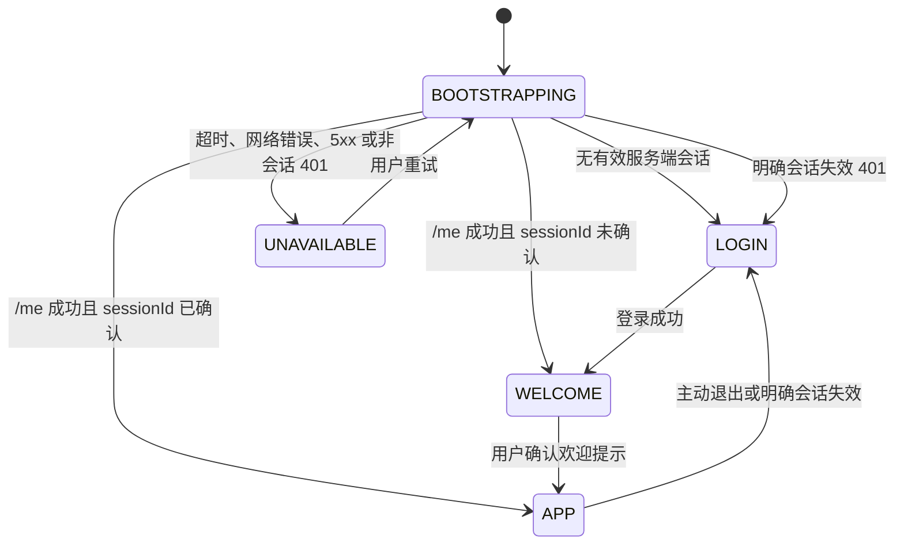

# ReachAI 管理端认证状态机

> 实施状态：代码、目标测试、前端构建和隔离端口双标签浏览器验收已完成；现有 18603/5200 进程未重启。本次 Cookie 传输改造不涉及 schema 变化。

## 同源多标签登录顺序

管理端以服务端登录会话为边界。同一 Origin（协议、主机、端口一致）的浏览器窗口和标签页共享 HttpOnly Cookie；任意新标签页访问受保护路由时都会先调用 `/me`，已有有效会话则直接恢复身份，不要求再次登录。



`WELCOME` 不是在已加载工作台上的遮罩：布局层只渲染欢迎容器，目标 `router-view` 在确认前不挂载，因此不会预先执行项目管理、项目接入工作台等页面的 API 请求。

## 浏览器会话契约

| 数据 | 存储 | 规则 |
| --- | --- | --- |
| 会话凭据 | 服务端签发的 Host-only HttpOnly Cookie | `Path=/api`、`SameSite=Strict`；JavaScript 不可读取，不写入 Web Storage、URL 或日志。 |
| `expiresAt`、最小用户资料、`sessionId` | `sessionStorage` | 仅是当前标签页的显示与 CSRF 同步元数据；不能单独证明已登录，新标签页仍以 `/me` 为准。 |
| 欢迎提示确认 | `localStorage` | 只保存非敏感确认标记，按服务端随机 `sessionId` 隔离；同一会话的多个标签页共享。 |
| 退出同步事件 | `localStorage` | 只广播 `LOGOUT` 与时间，不包含凭据；其他标签页收到后清理元数据并跳登录。 |
| 遗留脚本可读平台 Token | 启动时删除 | 同时删除旧 `localStorage` 和 `sessionStorage` Token，绝不迁移。 |

Cookie 不以端口隔离，但前端会话契约仍要求使用同一 Origin。`localhost` 与 `127.0.0.1` 是不同主机，浏览器不会在二者之间共享本会话；验收和部署入口必须统一主机名。

## API 与失败语义

1. 路由守卫在每个新标签页调用 `GET /api/platform/auth/me`，浏览器自动携带 HttpOnly Cookie，并使用 8 秒 `AbortController` 超时。
2. 只有 `401` 且响应头为 `X-ReachAI-Auth-Failure: PLATFORM_SESSION_INVALID` 才清除当前窗口会话并跳登录；项目签名、Embed、Task 等其他 401 不会误登出。
3. 网络错误、超时、5xx、无此明确标志的 401 或响应结构错误进入 `/auth-unavailable`，保留当前标签页元数据，用户可重试。
4. `POST /api/platform/auth/login` 通过 `Set-Cookie` 写入会话凭据；JSON 只返回 `expiresAt`、随机 `sessionId` 与 `principal`，登录和 `/me` 都不回显原始 Token。
5. 未配置可用控制台登录方式时，登录接口返回 `503` 和 `X-ReachAI-Auth-Readiness: PLATFORM_AUTH_NOT_CONFIGURED`（或未实现 Provider 的稳定码），不以密码错误伪装。
6. Cookie 认证的非安全方法必须携带 `X-ReachAI-CSRF: <sessionId>`；Control 将其与已认证服务端会话做常量时间比较，缺失或不一致返回 403。Bearer 兼容调用不受浏览器 CSRF 规则影响。
7. 主动退出只有在服务器成功撤销会话并过期 Cookie 后才清理前端状态；网络失败不会伪装成成功退出，用户可重试。

## 后端认证与治理

- Cookie 内的会话 Token 为随机不透明值，`control_platform_login_session.access_token_id` 只保存 SHA-256 摘要；数据库和 JSON 响应均不保存或回显原始值。
- 服务端保留 Authorization Bearer 解析兼容边界，已有非浏览器调用不会被 Cookie 改造强制切换；浏览器管理端不再接触 Bearer Token。
- `PlatformAuthenticatedSession` 从数据库解析 ACTIVE 角色、角色权限和 scope；`platform:admin` 必须来自 `GLOBAL/*` 授权。请求体不能提供操作者身份。
- `/api/platform/auth-providers`、用户/角色管理等高危操作需 `platform:admin`；普通已认证用户得到 403，不会被登出。
- 角色替换在事务内校验角色状态和 scope，且用锁保护至少一个 ACTIVE 全局 `PLATFORM_ADMIN` 不变量。
- 认证 Provider 读接口只返回 `configurationPresent`，不返回 `configJson`。当前只有 LOCAL 可实现；HEADER、OIDC、SAML 均不可启用，直到适配器和密文配置存储完成。
- 开源本地启动默认使用 `REACHAI_AUTH_PROVIDER=LOCAL`、`REACHAI_LOCAL_AUTH_ENABLED=true`，数据库 LOCAL provider 仍必须为 `ACTIVE`。生产部署必须显式关闭 LOCAL 或切换到已实现的企业 Provider；Control 即使无法登录仍可继续承担 Embed/SDK/BFF。
- 本地 bootstrap 默认启用，并在没有任何 ACTIVE 全局管理员时创建 `admin / admin123`。自定义 bootstrap 密码至少 12 位；同名用户存在而又没有合格管理员时 fail-fast，绝不覆盖密码或角色。生产部署必须显式关闭 bootstrap。
- Provider 保存和用户角色替换会写入 `control_platform_auth_audit_event`，只含操作者会话引用和非敏感元数据，不记录密码、Token、密钥或完整配置。

本地开箱不需要额外认证环境变量；以下变量用于覆盖默认管理员（不要把真实密码提交到仓库）：

```text
REACHAI_BOOTSTRAP_ADMIN_ENABLED=true
REACHAI_BOOTSTRAP_ADMIN_USERNAME=<本地管理员用户名>
REACHAI_BOOTSTRAP_ADMIN_PASSWORD=<至少12位的本地开发密码>
```

生产部署至少应设置 `REACHAI_LOCAL_AUTH_ENABLED=false`、`REACHAI_BOOTSTRAP_ADMIN_ENABLED=false` 与 `REACHAI_PLATFORM_SESSION_COOKIE_SECURE=ALWAYS`；若生产仍需 LOCAL，必须在首次启动前替换默认账号密码。

## 尚待真实验收

- [ ] 执行经批准的两份 20260811 认证升级 SQL，并确认旧 Token 不可恢复。
- [ ] 用实际环境变量重启 Control，核对 PID、端口、启动时间和 `platformConsoleAuth` health 详情。
- [x] 用真实浏览器验证登录后第二标签页直接进入 `/dashboard`、任一标签页退出后其他标签页同步退出。
- [ ] 验证刷新、显式 401、503、断网和 5xx 的分支。

实现入口：`ai-admin-front/src/auth/platformSession.ts`、`ai-admin-front/src/views/layout/MainLayout.vue`、`reachai-control-service/.../identity` 与 [Control API 认证边界矩阵](./platform-api-auth-matrix.md)。
