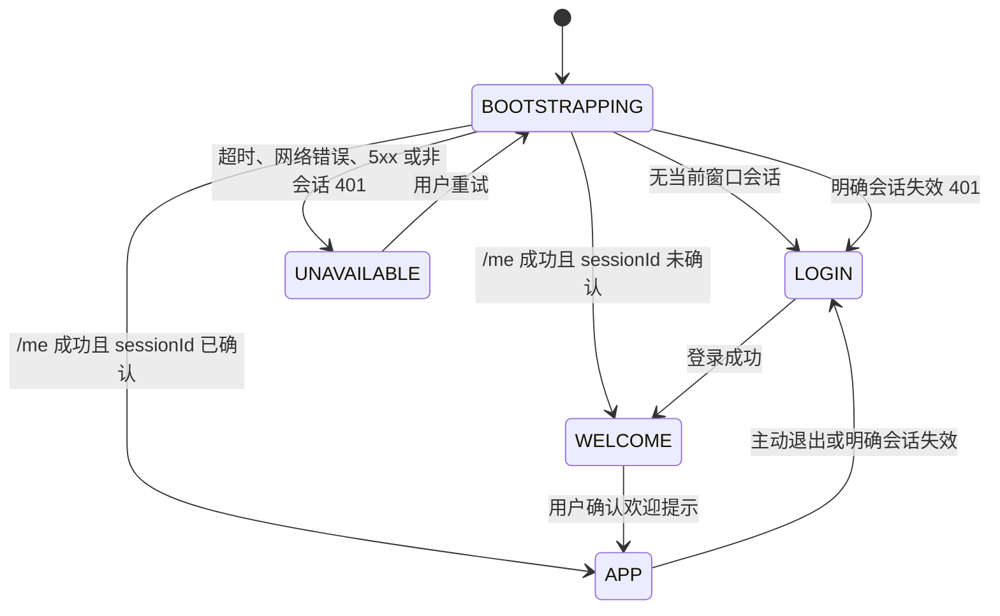

# ReachAI 管理端认证状态机

> 实施状态：代码已落地；真实服务重启、升级 SQL 与独立浏览器验收尚未执行。

## 窗口级登录顺序

管理端以独立浏览器窗口/标签页为会话边界。正常新窗口访问任意受保护路由时，顺序固定为：**登录页 →「欢迎来到 ReachAI 探索站」提示 → 原目标工作台**。



`WELCOME` 不是在已加载工作台上的遮罩：布局层只渲染欢迎容器，目标 `router-view` 在确认前不挂载，因此不会预先执行项目管理、项目接入工作台等页面的 API 请求。

## 浏览器会话契约

| 数据 | 存储 | 规则 |
| --- | --- | --- |
| `accessToken`、`expiresAt`、最小用户资料、`sessionId` | `sessionStorage` | 仅当前窗口有效；不可写入 `localStorage`、URL 或日志。 |
| 欢迎提示确认 | `sessionStorage` | 键按服务端随机 `sessionId` 隔离；同窗口刷新不重复提示，退出/新登录会重新提示。 |
| 遗留 Local Storage 平台键 | 启动时删除 | 不迁移到 `sessionStorage`，防止新窗口复用旧 Token 绕过登录。 |
| 浏览器拒绝 sessionStorage | 内存降级 | 刷新后需要重新登录；绝不回退到跨窗口持久化存储。 |

浏览器复制标签页或 `window.open` 的同源 `sessionStorage` 复制行为存在浏览器差异。当前 P0 保证正常新窗口/新标签页；若验收要求复制页也必须重新登录，需追加窗口实例冲突检测。

## API 与失败语义

1. 路由守卫调用 `GET /api/platform/auth/me`，并使用 8 秒 `AbortController` 超时。
2. 只有 `401` 且响应头为 `X-ReachAI-Auth-Failure: PLATFORM_SESSION_INVALID` 才清除当前窗口会话并跳登录；项目签名、Embed、Task 等其他 401 不会误登出。
3. 网络错误、超时、5xx、无此明确标志的 401 或响应结构错误进入 `/auth-unavailable`，保留当前会话，用户可重试或自行清除。
4. `POST /api/platform/auth/login` 成功响应含一次性原始 `accessToken`、`expiresAt`、随机 `sessionId` 与 `principal`；`GET /me` 只返回 `sessionId`、`expiresAt` 和 `principal`，不回显 Token。
5. 未配置可用控制台登录方式时，登录接口返回 `503` 和 `X-ReachAI-Auth-Readiness: PLATFORM_AUTH_NOT_CONFIGURED`（或未实现 Provider 的稳定码），不以密码错误伪装。

## 后端认证与治理

- Bearer Token 为随机不透明值，`control_platform_login_session.access_token_id` 只保存 SHA-256 摘要。
- `PlatformAuthenticatedSession` 从数据库解析 ACTIVE 角色、角色权限和 scope；`platform:admin` 必须来自 `GLOBAL/*` 授权。请求体不能提供操作者身份。
- `/api/platform/auth-providers`、用户/角色管理等高危操作需 `platform:admin`；普通已认证用户得到 403，不会被登出。
- 角色替换在事务内校验角色状态和 scope，且用锁保护至少一个 ACTIVE 全局 `PLATFORM_ADMIN` 不变量。
- 认证 Provider 读接口只返回 `configurationPresent`，不返回 `configJson`。当前只有 LOCAL 可实现；HEADER、OIDC、SAML 均不可启用，直到适配器和密文配置存储完成。
- 开源本地启动默认使用 `REACHAI_AUTH_PROVIDER=LOCAL`、`REACHAI_LOCAL_AUTH_ENABLED=true`，数据库 LOCAL provider 仍必须为 `ACTIVE`。生产部署必须显式关闭 LOCAL 或切换到已实现的企业 Provider；Control 即使无法登录仍可继续承担 Embed/SDK/BFF。
- 本地 bootstrap 默认启用，并在没有任何 ACTIVE 全局管理员时创建 `admin / admin123`。自定义 bootstrap 密码至少 12 位；同名用户存在而又没有合格管理员时 fail-fast，绝不覆盖密码或角色。生产部署必须显式关闭 bootstrap。
- Provider 保存和用户角色替换会写入 `control_platform_auth_audit_event`，只含操作者会话引用和非敏感元数据，不记录密码、Token、密钥或完整配置。

本地开箱不需要额外认证环境变量；以下变量用于覆盖默认管理员（不要把真实密码提交到仓库）：

```text
REACHAI_BOOTSTRAP_ADMIN_ENABLED=true
REACHAI_BOOTSTRAP_ADMIN_USERNAME=<本地管理员用户名>
REACHAI_BOOTSTRAP_ADMIN_PASSWORD=<至少12位的本地开发密码>
```

生产部署至少应设置 `REACHAI_LOCAL_AUTH_ENABLED=false` 与 `REACHAI_BOOTSTRAP_ADMIN_ENABLED=false`；若生产仍需 LOCAL，必须在首次启动前替换默认账号密码。

## 尚待真实验收

- [ ] 执行经批准的两份 20260811 认证升级 SQL，并确认旧 Token 不可恢复。
- [ ] 用实际环境变量重启 Control，核对 PID、端口、启动时间和 `platformConsoleAuth` health 详情。
- [ ] 用独立浏览器上下文验证登录 → 欢迎提示 → 项目管理/项目接入工作台，并在 Network 确认欢迎确认前没有目标页面 API。
- [ ] 验证新窗口、刷新、显式 401、503、断网和 5xx 的分支。

实现入口：`ai-admin-front/src/auth/platformSession.ts`、`ai-admin-front/src/views/layout/MainLayout.vue`、`reachai-control-service/.../identity` 与 [Control API 认证边界矩阵](./platform-api-auth-matrix.md)。
