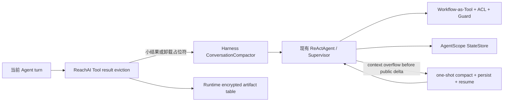

# Runtime 上下文工程

> 状态：CODE_READY / DEV_DATABASE_APPLIED / LIVE_CANARY_PARTIAL / PRODUCTION_ROLLOUT_PENDING  
> 范围：AgentScope Supervisor 的短期上下文压缩、超大 Tool 结果卸载与上下文超限恢复

## 决策

ReachAI 不整体切换为 Harness Agent。Runtime 继续使用现有 `ReActAgent`、Supervisor、
Workflow-as-Tool 白名单、Tool ACL、流式输出、取消、交互恢复和 AgentScope StateStore；仅复用
`agentscope-harness` 的 `ConversationCompactor`，并由 ReachAI 实现企业边界适配。

本能力不是个人长期记忆：

- 会话状态仍由 Runtime 的 AgentScope StateStore 保存，生产环境使用 Redis。
- 个人长期记忆仍以 Control canonical context 为事实源，Knowledge 只承载可重建检索投影。
- `runtime_tool_result_artifact` 只是会话级、短期、加密的大结果工件，不能被长期记忆 API 召回。



## 执行顺序

1. 每轮 reasoning 前先检查 Tool 结果。超过阈值时，把完整文本写入 Runtime-owned 加密工件，
   本轮模型输入和活动 `AgentState` 同时替换为头尾预览及不可猜测的 `tra_*` 引用。
2. 再按消息数或估算 token 数触发主动压缩。压缩摘要写回活动状态，并保留最近消息和完整
   Tool call/result 配对。
3. 若模型仍返回稳定错误 `MODEL_CONTEXT_LENGTH_EXCEEDED`，且尚未公开任何正文、未取消，
   使用本次 invocation 唯一的一次恢复预算执行紧急压缩。
4. 持久会话先保存压缩后的 `AgentState`，再以空输入恢复同一个 `ReActAgent`。已完成 Workflow
   的 Tool 结果仍在尾部，Runtime 的 completed-Workflow guard 继续阻止重复业务副作用；未完成的
   结构化计划步骤仍可继续。
5. 若超限发生在强制 no-tool 最终回答阶段，复用同一个恢复预算，重建压缩后的最终回答输入后
   只重试一次。已经输出公开 token 时禁止重试，避免重复或拼接错误的流式正文。

主动压缩失败会继续使用原上下文；恢复压缩、状态持久化或第二次模型请求失败时保留原始稳定错误。
不会无限重试，也不会因为供应商明确返回超限而再走同步模型调用重复计费。

## Harness 使用边界

当前只启用 `ConversationCompactor`。明确不启用：

- Harness 整体 Agent 生命周期；
- memory flush、`MEMORY.md` 或 workspace 持久化；
- Harness 文件系统 Tool、`read_file`、shell、Skill、子智能体和计划模式；
- Harness 默认的本地文件 Tool-result eviction。

所有 flush/offload/truncate/prune 开关均由 Runtime 硬编码关闭；适配层不构造
`MemoryFlushManager` 或 `WorkspaceManager`，因此不会读取或写入 Agent 工作目录。

压缩模型输出会被校验，Harness 的“摘要失败”占位文本不会当成成功结果；有效摘要还会放入
`<compacted_history_data>` 数据边界，明确不能覆盖当前 system、策略、Tool ACL 或用户指令。

## 大 Tool 结果工件

`runtime_tool_result_artifact` 由 `reachai-runtime-service` 独占：

- 只允许可信、可持久化的 Runtime user/Agent/session 状态槽使用；匿名、Debug 和直连 Runtime
  调用不会创建可跨轮读取的工件。
- 数据库只保存 owner/session 状态键的 SHA-256 作用域摘要，不保存原始用户 ID 或公开 session ID。
- 正文使用 AES-256-GCM 加密；随机 96-bit nonce，AAD 绑定 artifact ref、owner scope、session
  scope 和 HMAC-SHA-256 正文摘要，防止密文跨作用域搬移。数据库不保存可离线猜测的裸正文 hash。
- `read_tool_result` 是 Runtime 注册的只读保留 Tool，只能在当前状态槽内按字符偏移有界读取；
  返回内容始终标记为不可信 Tool 数据。
- 默认 24 小时过期；定时任务和清会话操作会把密文与 nonce 擦除，再标记为 `EXPIRED` 或
  `DELETED`。擦除同时释放 ACTIVE 去重槽，后续重放相同 Tool call 时可创建新的短期工件。
- 单工件字节数和每次读取字符数均有硬上限，防止数据库、堆内存和模型上下文被无界占用。
  若结果本身超过单工件硬上限，Runtime 只保留有界头尾预览及非文本块，明确标记完整文本本轮
  不可用且不生成 `artifactRef`；不会把超限正文重新塞回模型。该降级在 Trace 中以
  `toolResultHardLimitDropCount` 单独计数，不能与成功卸载混淆。

启用卸载前必须确认数据库至少达到 GitHub 基线 `ae9e1ce6`（更早数据库从对应 Git tag 获取历史迁移或重建），并配置至少 32 字符的
`REACHAI_RUNTIME_CONTEXT_ARTIFACT_SECRET`。当前实现按一个 active key ID 读写；轮换密钥前必须等待
旧工件 TTL 到期并确认密文已擦除，或先扩展为双 key 解密，不能直接替换 secret 造成存量工件不可读。

## 配置与灰度

| 配置 | 默认值 | 说明 |
| --- | ---: | --- |
| `RUNTIME_CONTEXT_ENGINEERING_ENABLED` | `false` | 总开关；默认不改变既有行为 |
| `RUNTIME_CONTEXT_COMPACTION_ENABLED` | `true` | 总开关打开后启用主动压缩 |
| `RUNTIME_CONTEXT_OVERFLOW_RECOVERY_ENABLED` | `true` | 每次 invocation 最多一次超限恢复 |
| `RUNTIME_CONTEXT_COMPACTION_TRIGGER_MESSAGES` | `24` | 主动压缩消息阈值，低于会话 40 条硬窗口 |
| `RUNTIME_CONTEXT_COMPACTION_TRIGGER_TOKENS` | `24000` | Harness 估算 token 阈值 |
| `RUNTIME_CONTEXT_COMPACTION_KEEP_MESSAGES` | `10` | 主动压缩保留尾部消息数 |
| `RUNTIME_CONTEXT_EMERGENCY_KEEP_MESSAGES` | `2` | 紧急压缩最小尾部，Tool 配对边界可自动扩大 |
| `RUNTIME_TOOL_RESULT_OFFLOAD_ENABLED` | `false` | 独立开关；需先建表和配置密钥 |
| `RUNTIME_TOOL_RESULT_MAX_CHARS` | `80000` | Tool 文本卸载阈值 |
| `RUNTIME_CONTEXT_ARTIFACT_MAX_BYTES` | `16777216` | 单个明文工件上限 |
| `RUNTIME_CONTEXT_ARTIFACT_RETENTION_HOURS` | `24` | 密文保留时间 |

建议灰度顺序：

1. 仅打开总开关、主动压缩和超限恢复，按单实例或小流量 Agent canary。
2. 观察 `contextCompactionCount`、`contextOverflowRecoveryCount`、稳定错误码、模型调用次数、
   `toolResultHardLimitDropCount`、Workflow 调用次数、取消时延及最终流式输出。
3. 建表、配置专用密钥后，再单独打开 Tool 结果卸载，验证跨用户/跨 session 读取均失败。
4. 完成 Redis、多 Runtime 副本、真实模型供应商、MySQL、SSE 断连和交互暂停/恢复验收后再扩大流量。

## 2026-08-14 开发环境验收

本轮使用环境变量指向的远程开发 MySQL，不是本机 MySQL；Runtime canary 使用本机独立端口和
专用 Redis key 前缀，既有 `18604` Runtime 未替换。验收结束后三个 canary 会话均通过受信任
内部接口清理为 `CLEARED`，租约已释放，专用 Redis 前缀清零，短期工件表为 0 行。

| 验收项 | 结果 | 当前证据与边界 |
| --- | --- | --- |
| 主动压缩与后续召回 | PASS | 第 5 个 turn 触发一次压缩，后续能回答压缩前信息；未发生 Workflow 调用或溢出恢复 |
| Redis 持久化与多副本 | PASS | 两个独立 Runtime 进程共享专用 Redis 状态，同一可信用户可从第二副本继续会话 |
| 用户隔离 | PASS | 其他用户复用同一 session 在进入模型前被拒绝；同步接口返回 HTTP 409 和 `RUNTIME_SESSION_OWNERSHIP_CONFLICT` |
| SSE 正常完成 | PASS | 事件序列为 `execution.started`、`message.delta`、`execution.completed`，没有错误事件 |
| SSE 断连取消 | PASS_WITH_TUNING_GAP | 客户端断连后 RunOps 最终为 `CANCELLED`，租约释放且没有完成事件；观测取消时延约 15.9 秒，需在生产灰度前调小或重构 8 秒 heartbeat 探测窗口 |
| 加密工件存储边界 | PASS | opt-in live smoke 真实写入 MySQL，验证有界读取、跨用户/跨 session 拒绝、清会话与过期密文擦除；测试自行删除元数据，结束后表为 0 行 |
| Runtime 全量回归 | PASS | 595 项，0 失败、0 错误、1 项 live smoke 默认跳过 |
| 供应商真实 context overflow | NOT RUN | 尚未用真实供应商稳定触发 `MODEL_CONTEXT_LENGTH_EXCEEDED`，不能宣称一次性恢复已完成 live 验收 |
| Supervisor 内真实业务 Tool 卸载 | NOT RUN | 为避免业务副作用，本轮未通过真实 Workflow 生成超大 Tool 结果；当前 live smoke 只覆盖工件服务与 MySQL 边界 |
| 交互暂停/恢复叠加压缩 | NOT RUN | 原有回归通过，但尚未做真实多副本交互等待 canary |

跨副本续聊的完整一轮另观测到约 52.5 秒时延，且该轮没有 Workflow/Tool 调用。它提示模型链路存在
性能风险，但本轮没有完成逐阶段 trace 对照，不能直接归因为模型供应商；扩大流量前需按 Supervisor、
模型首 token、最终回答三个阶段分别测量。

远程开发库已执行合并前的 20260813 Runtime Context Engineering 与 20260814 conversation turn-id 历史迁移：为既有 8 条事件补齐 `turn_id`，收紧为
非空并建立 `(conversation_session_id, turn_id, role)` 唯一索引。生产与其他环境仍需按各自迁移
流程单独执行，开发库结果不能代替生产部署验收。

工件 live smoke 默认不会连接数据库；显式运行时必须使用临时的 32+ 字符高熵密钥，且禁止打印密钥：

```powershell
$env:REACHAI_RUN_LIVE_ARTIFACT_SMOKE='true'
$env:REACHAI_RUNTIME_CONTEXT_ARTIFACT_SECRET='<ephemeral-high-entropy-secret>'
mvn.cmd -pl reachai-runtime-service -Dtest=RuntimeToolResultArtifactLiveSmokeTest test
```

## 验收门槛

- 长历史在阈值处只压缩一次，后续 turn 能读取摘要和保留尾部。
- context overflow 在未输出公开正文时最多恢复一次；恢复后业务 Workflow 不重复执行。
- 强制最终回答阶段超限同样可恢复，且最终只产生一段公开回答。
- 已公开部分正文、取消或交互等待状态不触发恢复重试。
- 超大 Tool 结果的中间正文不进入下一次模型请求；模型可用 `tra_*` 在当前 session 分页回读。
- 用户 A、其他 Agent/session、过期引用和被篡改密文均无法读取正文。
- 清会话和过期清理确实擦除 `content_ciphertext` 与 `encryption_nonce`。
- 原有 Supervisor、Workflow-as-Tool、流式、取消、交互恢复和会话状态回归全部通过。
