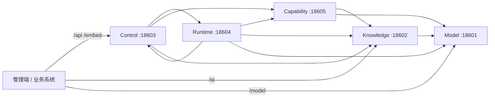

# 五服务边界与本地启动

本文是 ReachAI 后端部署拓扑、职责边界、公共入口和本地启动方式的当前事实入口。路由逐项归属见 [Public Route Contracts](./public-route-contracts.md) 和 [Physical Split Route Ownership](./physical-split-route-ownership.md)；服务间调用见 [Internal API Contracts](./internal-api-contracts.md)；同库表归属见 [Service Table Ownership](./service-table-ownership.md)。

## 当前结论

- 后端主路径由五个 Spring Boot 部署单元组成；根 `pom.xml`、`.run/`、Dockerfile 和 K8s 清单均以这五个服务为准。
- 第一阶段共用一个 MySQL 库，但每张表仍只有一个 owning service；同库不等于可以跨服务直接读写。
- `reachai-control-service` 是 `/api/**`、`/embed/**`、SDK 注册兼容入口和开放协议的公共控制面。
- 管理端可直接使用 Knowledge 的 `/ai/**` 和 Model 的 `/model/**`；不得直接调用 Runtime `18604` 或 Capability `18605`。
- 旧 `ai-agent-service`、旧技能服务定位和 `/model/openai-proxy` 均已退出主路径，不是兼容回退方案。

## 部署单元

| 服务 | 端口与入口 | 拥有的职责 | 不拥有的职责 |
| --- | --- | --- | --- |
| `reachai-model-service` | `18601`，`/model/**` | 模型模板/实例、Chat、结构化流、Embedding、Rerank | Agent 编排、知识检索、OpenAI HTTP 代理 |
| `reachai-knowledge-service` | `18602`，context path `/ai` | 知识库、文件与 Chunk、文档导入、检索、RAG、业务索引、个人记忆检索投影 | Capability 目录、模型实例、个人记忆 canonical 数据 |
| `reachai-control-service` | `18603`，`/api/**`、`/embed/**`、MCP、A2A | 平台身份与 RBAC、公共 BFF、项目/页面工作台、Embed、AI Coding、Context、Agent Skill 目录、A2A Hub、MCP、治理聚合 | Workflow/Agent 执行、Capability 目录实现、知识检索实现 |
| `reachai-runtime-service` | `18604`，由 Control 转发；`/internal/runtime/**` | Agent 配置版本、Workflow/GraphSpec、Supervisor、执行、交互、凭据、Trace/RunOps、EvalOps、会话状态、Skill 运行载入 | 公共平台身份、Skill 制品目录、Capability 或 Knowledge 表 |
| `reachai-capability-service` | `18605`，由 Control 转发；`/internal/capability/**` | SDK 注册与实例、能力快照/diff/review、来源观察、业务方法/API 资产目录、运行时 Tool 投影、语义与 API 图谱、调用候选检索、API 市场目录 | Agent/Workflow 执行、第三方调用凭据、Knowledge 数据 |

## 调用方向



服务间调用使用显式 client/internal API。`/internal/**` 只是路由命名，不构成认证；涉及可信身份或写操作的链路必须遵守 HMAC、nonce、防重放、body 摘要和传输模式约束。

## 公共入口与兼容面

| 调用方 | 稳定入口 | 说明 |
| --- | --- | --- |
| 管理端业务 API | `/api/**` → Control | Runtime/Capability 数据由 Control 保持公共契约并委托 owning service |
| Knowledge 管理/检索 | `/ai/**` → Knowledge | Business Index 与文档导入的受保护控制台入口例外地终止于 Control |
| Model 管理/调试 | `/model/**` → Model | 当前只提供模板、实例、Chat、Embedding、Rerank |
| Embed 与 Page Bridge | `/api/embed/**`、`/embed/**` → Control | 业务身份、会话、页面动作和 Runtime 执行在 Control 边界汇合 |
| SDK 注册 | `/api/registry/**` → Control | Control 区分平台会话与项目签名，再委托 Capability |
| MCP / A2A | `/mcp/**`、`/.well-known/agent-card.json`、`/a2a/v1/**` → Control | 使用各自协议身份，平台会话不能替代协议凭据 |

兼容 Controller 只能维护仍受支持的 public contract；不得恢复 generic catch-all、旧 Agent 后端代理、disabled 占位响应或跨服务表访问。

## 本地启动

仓库提供 `.run/00-reachai-five-services.run.xml`，可在 IntelliJ IDEA 中按以下顺序启动：

1. `reachai-model-service`：`18601`
2. `reachai-knowledge-service`：`18602`，context path `/ai`
3. `reachai-capability-service`：`18605`
4. `reachai-runtime-service`：`18604`
5. `reachai-control-service`：`18603`

也可以从各模块目录执行 `mvn spring-boot:run`。管理端默认运行在 `5200`：

```powershell
Set-Location ai-admin-front
npm ci
npm run dev
```

本地开源模式默认提供开发账号 `admin / admin123`，并由登录页预填；五服务还会获得公开的开发专用加密、签名、内部调用和个人记忆身份值，均只用于首次体验。显式配置始终优先；`prod` / `production` profile、Kubernetes 环境或 `REACHAI_LOCAL_DEVELOPMENT_DEFAULTS_ENABLED=false` 不会注入这些值。生产必须显式关闭 `REACHAI_LOCAL_AUTH_ENABLED` 和 `REACHAI_BOOTSTRAP_ADMIN_ENABLED`，从 Secret 注入独立密钥，并接入正式身份体系。

## 配置分组

| 分组 | 主要变量 | 说明 |
| --- | --- | --- |
| MySQL | `AI_MYSQL_URL`、`AI_MYSQL_HOST`、`AI_MYSQL_PORT`、`AI_MYSQL_DATABASE`、`AI_MYSQL_USER`、`AI_MYSQL_PASSWORD` | 五服务共享连接，表所有权仍按服务隔离 |
| 基础设施 | `REDIS_*`、`MILVUS_*` | Control/Knowledge/Runtime 按各自职责使用 |
| 服务地址 | `CONTROL_SERVICE_URL`、`RUNTIME_SERVICE_URL`、`CAPABILITY_SERVICE_URL`、`KNOWLEDGE_SERVICE_URL`、`MODEL_SERVICE_URL` | 默认指向本机五服务端口 |
| 内部认证 | `REACHAI_INTERNAL_SERVICE_SECRET`、`REACHAI_INTERNAL_SERVICE_ACCEPTED_SECRETS`、`REACHAI_INTERNAL_TRANSPORT_MODE` | 本地默认值免配置；生产必须注入独立密钥，轮换和传输模式见相关安全契约 |
| 功能配置 | 各服务 `application.yml` 中的 `REACHAI_*`、`RUNTIME_*`、`MODEL_*` | 以 owning service README 和配置类为准，不在总览重复完整清单 |

不要把凭据写入 README、Run Configuration、Git 或命令输出。生产配置还必须逐项验证持久存储、加密密钥、TLS/mTLS、网络策略、备份与恢复。

## 验证分层

```powershell
node scripts/check-backend-boundary-naming.mjs
node scripts/check-internal-module-boundaries.mjs
node scripts/check-internal-api-contracts.mjs
node scripts/check-physical-service-route-contracts.mjs
node scripts/check-frontend-public-api-routes.mjs
node scripts/check-service-table-ownership.mjs
node scripts/verify-architecture.mjs
```

源码契约通过不等于运行态已加载新制品。五服务启动后，再依次核对：

1. 可部署 JAR 是否晚于源码；
2. `18601`–`18605` 的监听进程是否属于预期制品；
3. 各服务 actuator 健康与 Control 聚合健康；
4. 与本次变更相关的真实浏览器/业务 E2E。

可使用：

```powershell
node scripts/check-local-service-artifact-freshness.mjs --check-running
$env:REACHAI_PLATFORM_SESSION_TOKEN = '<当前平台会话令牌>'
node scripts/check-physical-service-smoke.mjs --wait-ms 120000 --interval-ms 3000
Remove-Item Env:REACHAI_PLATFORM_SESSION_TOKEN
```

脚本不会输出平台会话令牌；执行后仍需按业务验收清单核对真实结果。
