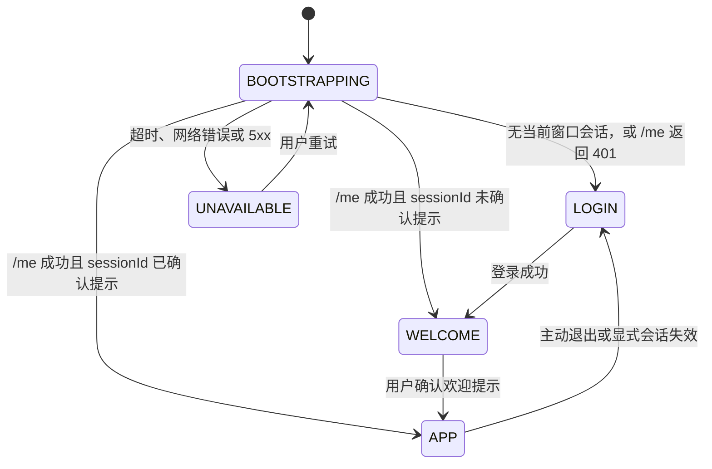

# ReachAI 管理端认证与会话治理改造实施计划

> 状态：实施中（2026-08-11 已完成前后端会话、欢迎门禁、RBAC、控制台路由保护、Provider/bootstrap/readiness 与审计代码；尚未执行数据库升级、重启服务或浏览器验收）。
>
> 最近复查：2026-08-11，已对照当前前端、Control identity 代码、`initV2.sql` 和现有升级 SQL 修订。
>
> 范围：Control 管理端认证、浏览器会话、管理 API 鉴权、平台 RBAC、启动 bootstrap 与 Token 数据治理。
>
> 不包含：Embed、SDK、AI Coding Task 的认证协议重写；这些协议只做边界保护和回归验证。

相关文档见：[管理端认证状态机](../architecture/platform-console-auth-state-machine.md) 和 [Control API 认证边界矩阵](../architecture/platform-api-auth-matrix.md)。当前状态机文档同时包含目标行为和部分已落地行为，在 P0-A 完成前不能单独作为运行现状证明。本计划是对当前实现中发现问题的改造清单；完成后应回写上述两份文档，使其只描述已落地行为。

## 1. 背景与本次完成标准

当前存在八个阻断项：

1. 平台 Token 仍保存在 `localStorage`，新独立窗口可复用旧 Token，绕过登录页。
2. 探索提示的确认状态与用户绑定而不是与登录会话绑定；当前目标页面组件会先挂载，再由弹窗覆盖，仍可能提前发起管理 API。
3. 仅部分 Control API 受平台会话保护，`/api/workflows`、`/api/tools` 等管理入口需要完成盘点和保护。
4. 已认证普通用户可调用用户角色、认证提供方等高危管理接口；权限列表还由角色名硬编码推导，没有读取已有的角色—权限表。
5. 认证提供方接口直接返回 `configJson`；一旦写入 Client Secret 等敏感字段，会进入浏览器响应。
6. LOCAL 登录与 bootstrap 曾默认关闭，但登录页又预填开发账号，导致开源用户无法开箱登录且不知道隐藏开关；当前策略改为源码默认启用 LOCAL 与已知开发账号，生产部署模板显式关闭。
7. `/me` 初始化没有真正的超时取消。
8. 数据库升级脚本只撤销旧会话，没有不可逆覆盖历史原始 Token 值。

本次改造完成的判定不是“编译通过”，而是同时满足：

- 新独立窗口严格遵循“登录 → 欢迎提示 → 目标工作台”。
- 欢迎提示确认前，目标路由组件不挂载，也不发起该页面的管理 API。
- 同一窗口的刷新和站内跳转不重复登录、不重复欢迎提示。
- 已登录用户进入项目管理、项目接入工作台等受保护页面时不发生第二次、矛盾的登录跳转。
- 管理 API 有明确且唯一登记的认证策略，普通用户不能提升权限。
- 重启后的 Control 至少存在一种已配置且真实可用的登录方式。
- Token 在数据库、日志和错误响应中均不以原始值持久化或输出。
- 认证提供方敏感配置不以明文从 API 返回，也不能在未实现对应认证适配器时被启用。
- 自动化测试、重启后的服务验证、独立浏览器验收分别留有证据。

## 2. 目标行为与产品决策

### 2.1 会话范围

本计划采用“每个独立浏览器窗口/标签页一次登录”的管理端策略：

| 场景 | 预期行为 |
| --- | --- |
| 新开独立窗口或标签页 | 无平台会话，先进入登录页。 |
| 登录成功 | 显示一次探索提示，确认后到原目标路由。 |
| 同一窗口刷新 | 会话仍有效时保留登录，不重复探索提示。 |
| 同一窗口站内跳转 | 保留登录，不重复探索提示。 |
| 主动退出后重新登录 | 创建新的服务端会话，重新展示探索提示。 |
| 会话过期或被撤销 | `/me` 返回 401，清理当前窗口会话并跳到登录页。 |
| 认证服务超时、断网或 5xx | 展示认证服务不可用页；不得清理 Token 或伪装为退出登录。 |

浏览器复制标签页或由 `window.open` 打开的同源页面可能复制 `sessionStorage`。P0 先保证正常的新窗口和新标签页行为；若产品验收要求复制标签页也必须重新登录，P1 增加窗口实例冲突检测，并另行覆盖该浏览器差异场景。

### 2.2 认证状态机



认证初始化是管理端渲染的前置条件。登录页和认证不可用页可以独立渲染；欢迎提示只能在 `AUTHENTICATED` 后出现。进入 `WELCOME` 后，应用可以挂载最小欢迎容器，但目标 `router-view` 组件必须等到确认后才挂载，避免页面闪现和页面级 API 抢跑。实现上可以使用专用欢迎路由，也可以在布局层增加显式 gate，但不能仅用模态遮罩覆盖已经挂载的页面。

### 2.3 浏览器存储契约

| 数据 | 存储位置 | 生命周期 | 规则 |
| --- | --- | --- | --- |
| `accessToken` | `sessionStorage` | 当前窗口会话 | 不得写入 `localStorage`、URL、日志或截图。 |
| `expiresAt`、最小用户资料 | `sessionStorage` | 当前窗口会话 | 仅作 `/me` 前的快速预判，不能作为认证成功证明。 |
| `sessionId` | `sessionStorage` | 当前窗口会话 | 复用现有 `control_platform_login_session.session_id`；返回随机、非敏感的公开会话引用，不返回自增主键。 |
| 探索提示确认标记 | `sessionStorage` | 当前登录会话 | 键按 `sessionId` 隔离，例如 `reachai.exploration.ack.{sessionId}`。 |
| `returnTo` | 内存或 `sessionStorage` | 本次登录流程 | 只接受站内、单斜杠起始的相对路径。 |

应用启动时必须删除旧版 `localStorage` 平台会话键，但**不得**把旧 Token 自动迁移到 `sessionStorage`；迁移会再次让新窗口绕过登录。

如果隐私模式或浏览器策略使 `sessionStorage` 不可用，不得回退到 `localStorage`。可以退化为仅存内存、刷新后重新登录的会话，也可以显示浏览器存储不可用提示；两种方式都必须 fail-closed 并有测试。

### 2.4 登录与 `/me` 响应契约

会话元数据不能混入用户身份对象。目标响应保持现有登录字段并新增 `sessionId`，`/me` 改为同构的会话视图：

```jsonc
// POST /api/platform/auth/login
{
  "accessToken": "<仅本次响应返回的原始Token>",
  "expiresIn": 86400,
  "expiresAt": "<ISO-8601>",
  "sessionId": "pls_<random>",
  "principal": { "userId": 1, "username": "...", "roles": [], "permissions": [] }
}

// GET /api/platform/auth/me
{
  "sessionId": "pls_<random>",
  "expiresAt": "<ISO-8601>",
  "principal": { "userId": 1, "username": "...", "roles": [], "permissions": [] }
}
```

`/me` 不返回 `accessToken`，前端不能从 `principal` 推导 `sessionId`。实际响应如继续使用统一 `ApiResult.data` 外壳，外壳内字段必须保持上述语义。

## 3. 认证与授权边界

### 3.1 失败语义

| 情况 | HTTP | 前端动作 |
| --- | --- | --- |
| 无 Token、过期 Token、撤销 Token | 401 + `X-ReachAI-Auth-Failure: PLATFORM_SESSION_INVALID` | 清理当前窗口平台会话，去登录页。 |
| 已认证但无权限 | 403 | 显示无权限，不退出登录。 |
| 认证依赖超时、网络错误、5xx | 非 401 | 进入认证服务不可用页，可重试。 |
| Embed、SDK、Task、AI Coding Key 失败 | 各自协议错误 | 不得清理平台管理端会话。 |

### 3.2 API 凭证域

`/api/**` 不是单一认证域。每条 Controller 路由都必须在认证矩阵中登记唯一的认证策略；一条策略可以显式允许多个主体，但必须规定判定顺序、成功主体和失败语义，不能隐式混用凭证。不能为了快速覆盖而使用“一条全局 Bearer 拦截器”。初始分类如下，最终以 Controller 全量盘点结果为准：

| 路径类型 | 凭证域 | 处理要求 |
| --- | --- | --- |
| `/api/platform/auth/login` | PUBLIC | 仅登录入口匿名；未知用户不自动创建。 |
| `/api/platform/**`（除 login） | PLATFORM_SESSION | 高危管理操作还需权限检查。 |
| 管理端 Workflow、Tool、项目与工作台路由 | PLATFORM_SESSION | 盘点后逐条纳入控制台认证拦截器。 |
| `/api/embed/**` | EMBED_TOKEN 或项目 HMAC | 不接受平台 Token 作为替代。 |
| `/api/ai-coding/tasks/**` | TASK_TOKEN | 只接受任务级凭证。 |
| `/api/ai-coding/projects/**`、AI Coding 协作路由 | AI_CODING_KEY | 只接受项目 AI Coding Key。 |
| SDK 注册、同步、心跳 | SDK_SIGNATURE / PROJECT_CREDENTIAL | 保留签名、防重放和项目归属校验。 |
| `/internal/**` 服务协作路由 | INTERNAL_SERVICE_AUTH | 普通平台 Token 不得调用，路径名和网络位置本身不是认证。 |
| `/api/internal-services/health` | PLATFORM_SESSION | 这是 Dashboard 的 Control 聚合接口，不是服务间 `/internal/**` 接口。 |
| 存活检查 | PUBLIC 或 INTERNAL | 只暴露最小信息；详情健康检查不可匿名。 |

`/api/registry/**` 是现有兼容边界，可能同时服务 Starter SDK 和管理端。它在具备“平台会话或已验证项目签名”的显式适配器前，不得被笼统标记为已受保护；新控制台 API 不再继续复用该兼容路径。

### 3.3 平台 RBAC 最小规则

P0 先建立可靠的“已认证”和“平台管理员”两层能力，后续再按 Workflow、Tool、项目等模块细化权限。已有 `control_platform_permission` 和 `control_platform_role_permission` 是权限事实源，不能继续由 `PLATFORM_ADMIN` 等角色名在 Java 中硬编码生成权限列表。

| 操作 | 最小权限 |
| --- | --- |
| `/api/platform/auth/me`、普通工作台访问 | 已认证平台用户 |
| 用户列表、角色列表、认证提供方查看 | `platform:admin` |
| 修改用户角色 | `platform:admin` |
| 新增、修改、启停认证提供方 | `platform:admin` |
| 强制下线、平台安全策略变更 | `platform:admin` |

服务端必须从认证上下文取得 `userId`、角色和权限，绝不信任请求体中的操作者身份。用户角色替换需先确认目标用户存在、校验所有角色 ID 和状态，并放入单个事务；任一角色无效或写入失败时整体回滚。所有高危管理操作写入平台认证审计事件，但不得记录密码、Token、认证提供方密钥或完整 `configJson`。

`control_platform_user_role` 带有 scope。全局平台管理只能由 ACTIVE 角色上 `scope_type=GLOBAL` 且 `scope_value=*` 的授权产生；PROJECT 等资源范围的同名角色不得被提升为全局管理员。角色替换还必须在事务和必要的行锁保护下维持“至少一个 ACTIVE 全局平台管理员”不变量，禁止并发操作把最后一个管理员移除。

认证提供方的读写 DTO 必须分离：读接口只返回非敏感元数据、配置状态和掩码摘要；写接口中的掩码占位符不能覆盖已存密钥。未完成适配器和加密存储的 HEADER、OIDC、SAML 不能被启用。

## 4. 实施批次

### P0-A：固化契约和回归基线

目的：先把产品语义写清楚，再调整代码，避免后续测试把错误行为重新固化。

改动：

1. 将本计划的会话范围、欢迎提示范围、401/403/不可用语义确认为产品契约。
2. 更新 [管理端认证状态机](../architecture/platform-console-auth-state-machine.md)，将“当前用户本窗口确认提示”改为“当前服务端 `sessionId` 确认提示”。
3. 更新 [Control API 认证边界矩阵](../architecture/platform-api-auth-matrix.md)，先标记未盘点路由为待收口，禁止把它们写成已保护。
4. 将“`localStorage` 中的有效 Token 可恢复登录”的测试改为“遗留 `localStorage` 会话被清理”；同时保留“当前 `sessionStorage` 中的 Token 必须经 `/me` 验证后才能恢复”的测试。
5. 扫描 Control 全部 `@RequestMapping`、`@GetMapping`、`@PostMapping` 等映射，形成路径—凭证域清单。

完成条件：文档、测试名称和真实预期一致；新增 API 没有“默认匿名”或“默认平台 Bearer”的隐含规则。

### P0-B：前端窗口级会话与导航收口

主要文件：

- `ai-admin-front/src/utils/platformAuth.ts`
- `ai-admin-front/src/auth/platformSession.ts`
- `ai-admin-front/src/router/index.ts`
- `ai-admin-front/src/views/layout/MainLayout.vue`
- `ai-admin-front/src/views/AuthUnavailable.vue`
- `ai-admin-front/src/api/request.ts`

改动：

1. 把平台 Token、用户、过期时间改为 `sessionStorage`，应用启动时清理历史 `localStorage` 键。
2. 按 2.4 的同构会话视图改造登录和 `/me`；返回并保存现有服务端会话的随机 `sessionId`，欢迎提示确认键改为按 `sessionId`。
3. `/me` 使用 `AbortController`，超时建议为 8 秒；实现单飞初始化，避免并发导航重复请求。
4. 路由守卫只允许登录页、认证不可用页及必要错误页匿名访问；其余路由先完成会话初始化。
5. 仅 HTTP 401 且携带明确 `PLATFORM_SESSION_INVALID` 信号时清理平台会话；403、5xx、网络错误不退出登录。
6. 欢迎提示只在 `AUTHENTICATED` 后展示；确认前不得挂载目标 `router-view` 组件，不得仅依赖弹窗遮罩阻止交互。
7. 安全保存和恢复 `returnTo`；拒绝协议、域名、双斜杠等开放重定向输入。
8. 退出登录时清理当前窗口全部平台会话键和本次会话欢迎提示键。
9. `sessionStorage` 不可用时只允许内存级降级或明确报错，不得退回跨窗口持久化。

完成条件：新独立窗口访问受保护路由时，只会先看到登录页；登录后只出现一次欢迎提示，确认后回到原目标。

### P0-C：服务端会话、RBAC 与管理接口保护

主要文件：

- `reachai-control-service/src/main/java/com/enterprise/ai/control/identity/PlatformIdentityController.java`
- `reachai-control-service/src/main/java/com/enterprise/ai/control/identity/PlatformBearerAuthService.java`
- `reachai-control-service/src/main/java/com/enterprise/ai/control/identity/PlatformConsoleAuthInterceptor.java`
- `reachai-control-service/src/main/java/com/enterprise/ai/control/identity/PlatformConsoleAuthWebConfig.java`
- `reachai-control-service/src/main/java/com/enterprise/ai/control/identity/PlatformSessionTokenCodec.java`

改动：

1. 将 Bearer 解析扩展为统一的 `PlatformAuthenticatedSession`：包含用户、现有 `sessionId`、过期时间、角色和权限；拦截器把该主体放入请求上下文。
2. 当前 `resolveBearerUser` 和 `USER_REQUEST_ATTRIBUTE` 已被 Runtime public controller、AI Coding console 等代码使用。迁移时先让旧方法委托给新会话解析，并在同一批次逐个迁移消费者，不能直接改返回类型造成隐蔽回归。
3. 新增 `control_platform_permission`、`control_platform_role_permission` 对应的 Entity/Mapper/查询服务，删除按角色名硬编码生成权限的逻辑；权限匹配支持数据库中的 `*`，但只接受 ACTIVE 角色产生的授权。
4. 新增可复用的服务端授权入口，例如 `requireAuthenticated()` 与 `requirePermission("platform:admin")`；授权入口必须同时检查 permission 和 scope，避免在 Controller 中散落字符串判断。
5. 对用户/角色读取、修改用户角色、认证提供方及其他平台安全配置施加 `platform:admin`；普通用户一律 403。
6. 角色替换前确认目标用户存在、验证全部角色 ID 处于 ACTIVE，并验证 `GLOBAL/*`、PROJECT 等 scope 组合合法；事务内删除旧绑定、写入新绑定，且不能移除最后一个 ACTIVE 全局管理员，失败时回滚。
7. 登录和 `/me` 按 2.4 返回会话视图：`sessionId`、`expiresAt` 与 `principal` 分层；`principal` 中的角色/权限来自数据库，不返回敏感数据。
8. 认证提供方查询只返回掩码配置；保存时校验 provider type、支持状态和配置 schema，未实现的 provider 不允许切换到 ACTIVE。
9. 维持随机不透明 Token + SHA-256 摘要比对；原始 Token 只在登录响应中出现一次。
10. 统一 401 和 403 响应，并对角色、认证提供方修改写持久化审计事件。

完成条件：普通用户无法给自己或他人授予管理员，无法修改认证提供方；管理员可以在授权范围内完成操作。

### P0-D：Control API 全量认证矩阵收口

改动：

1. 为 Control Controller 的每条路由指定唯一认证策略、允许主体、拦截器/认证器、判定顺序、失败 HTTP 语义及调用方。
2. 将控制台拥有的 Workflow、Tool、项目管理、工作台和详情健康接口逐条纳入平台会话保护。
3. 明确 `/api/registry/**` 的兼容适配计划：由同一条显式策略按确定顺序验证平台会话或 SDK 签名，再产生受内部认证保护、标明 `callerType` 的调用主体。
4. 加入“未分类路由失败”的自动检查；新增 Controller 不登记矩阵或测试时，构建应失败。
5. 保留 Embed、Task、AI Coding Key、SDK、内部服务的独立认证器与失败协议，不让管理端 Axios 把其错误理解成平台登出。

`/api/registry/**` 的首次接入采用“零人工凭据回填”的一次性 Enrollment Token：

1. 平台管理员登录后调用 `POST /api/platform/registry-enrollments`，只提交 `projectCode`；Control 以带平台用户身份的内部 HMAC 请求 Capability。签发响应只返回一次原始 token，固定有效期 **72 小时**。
2. Capability 仅保存 token 的 SHA-256 摘要；首次注册以 `X-ReachAI-Registry-Enrollment-Token` 提交，事务锁定并立即消费 token，再随机生成长期 `appKey/appSecret`。
3. Starter 不再在首次注册请求体发送 `appSecret`。它收到一次性响应后将长期凭据自动写入进程用户的 `.reachai/registry-credentials/<project>.properties`（可用 `reachai.registry.credential-store-path` 接入受管密钥路径），后续启动自动加载；Enrollment Token 不会落盘或写日志。
4. 已存在项目的再次注册必须携带项目签名，不能利用 Enrollment Token 覆盖既有凭据。Capability 对 Control 内部签发请求验证 HMAC、时间窗和一次性 nonce。

其余旧版 `/api/registry/**` 管理兼容路由仍保持显式 `COMPATIBILITY_PENDING`，直到平台会话与 SDK 签名适配器覆盖所有遗留操作；不得把该兼容域笼统标记为已安全收口。

完成条件：匿名调用控制台管理 API 为 401；错误凭证域不能互相替代；矩阵与拦截器配置可由测试交叉验证。

### P0-E：可启动的认证配置与 bootstrap

主要文件：

- `reachai-control-service/src/main/java/com/enterprise/ai/control/identity/PlatformAuthProperties.java`
- `reachai-control-service/src/main/java/com/enterprise/ai/control/identity/PlatformLocalBootstrapAdminInitializer.java`
- `reachai-control-service/src/main/resources/application.yml`

改动：

1. 区分“Control 进程可运行”和“平台管理端可登录”。Control 还承载 Embed、SDK 和公共 BFF；仅因管理端 Provider 未配置就终止整个进程，会扩大故障面。
2. 发布/启动脚本必须在替换旧进程前执行平台认证预检；没有可用登录方式时阻止发布。运行中的 Control 同时暴露非敏感的 `PLATFORM_AUTH_NOT_CONFIGURED` readiness 状态，平台登录返回 503 和稳定错误码，而不是用 401 伪装成密码错误。
3. 只有显式选择了某个 Provider、但其配置自相矛盾、缺必需密钥或 bootstrap 参数非法时，Control 才在启动期 fail-fast。
4. P0 明确只启用已实现且经过测试的 LOCAL 登录。Provider 的真实可用性由“适配器已实现 + 环境配置完整 + Provider 状态允许”共同决定；数据库中的 ACTIVE 不能单独证明可登录。
5. HEADER、OIDC、SAML 在真正实现前不得被标记为可用，也不得在管理 UI 中显示“可登录”；现有 HEADER ACTIVE 种子需在基线和升级 SQL 中改为 INACTIVE。
6. 开源本地默认启用 bootstrap，并在系统中不存在任何 ACTIVE `PLATFORM_ADMIN` 时创建已知开发管理员；生产模板显式关闭，创建过程在单个事务中完成用户和角色绑定。
7. 如果 bootstrap 用户名已存在但不是合格管理员，必须失败并给出明确错误，不得静默跳过、覆盖用户或修改密码。
8. 内置开发账号固定为 `admin / admin123` 并采用 BCrypt 保存；通过环境变量提供的自定义密码至少 12 位，日志中绝不打印密码。生产必须关闭 LOCAL/bootstrap 或在首次启动前替换默认凭据。
9. bootstrap 成功后关闭其环境开关并重启验证；已有用户和已有管理员不得被 bootstrap 覆盖或改密。
10. 提供不包含真实密码的本地环境变量模板、认证预检命令与启动说明。

建议的本地环境变量：

```text
REACHAI_AUTH_PROVIDER=LOCAL
REACHAI_LOCAL_AUTH_ENABLED=true
REACHAI_BOOTSTRAP_ADMIN_ENABLED=true
REACHAI_BOOTSTRAP_ADMIN_USERNAME=<本地管理员用户名>
REACHAI_BOOTSTRAP_ADMIN_PASSWORD=<至少12位、不可提交的密码>
```

完成条件：替换旧进程前的认证预检能阻止“无人可登录”的发布；Control 的其他公共能力不会因为控制台 Provider 未配置而无条件停机；首次管理员创建后关闭 bootstrap，第二次启动不改写用户密码。

### P0-F：Token、Provider 配置与审计数据治理

主要文件：

- `sql/initV2.sql`
- 历史 `upgrade-20260811-platform-session-token-hardening.sql`（已并入基线并从当前树清理）
- 历史 `upgrade-20260811-platform-auth-governance.sql`（已并入基线并从当前树清理）
- `sql/README.md`
- `docs/architecture/service-table-ownership.md`

改动：

1. 新库基线明确 `control_platform_login_session.access_token_id` 保存 SHA-256 摘要，而非原始 Token；本批次不为纯命名调整扩大 schema 迁移。
2. 升级期间先停止旧 Control 并撤销全部既有会话。因为这些行已全部撤销，可以对所有升级前 `access_token_id` 统一再次 SHA-256 或使用 `session_id + 旧值` 不可逆覆盖；不要只凭“是否为 64 位十六进制”判断，以免把恰好符合格式的旧原始 Token 当成安全摘要。
3. `platform-session-token-hardening` 脚本只负责撤销和不可逆覆盖历史会话；新增 `platform-auth-governance` 脚本负责权限种子、Provider 状态/配置清理和审计表，执行顺序写入 `sql/README.md`，避免一个脚本承担不相干职责。
4. `control_platform_permission` 和 `control_platform_role_permission` 继续作为权限事实源；基线与 governance 升级脚本补齐 P0 所需权限种子，但不删除已有合法授权。
5. 新增 Control-owned `control_platform_auth_audit_event`，记录认证提供方、用户角色和会话管理操作的 actor、target、outcome、request/correlation id 与脱敏详情；同时更新表所有权文档。
6. HEADER、OIDC、SAML 在适配器完成前统一设为 INACTIVE。现有未实现 Provider 的 `config_json` 不保留潜在明文密钥；升级说明中明确清理影响。
7. 后续启用含 Client Secret 的 Provider 前，由 Control 自有加密服务以 `aesgcm:` 密文保存配置，密钥来自独立环境变量；API 只返回掩码，不跨服务复用 Model Service 的实体或 Mapper。
8. 记录升级影响：所有现有平台会话失效，用户需重新登录；未实现 Provider 的旧配置会被禁用并清理。
9. 升级后回读验证无原始 Token、无未实现的 ACTIVE Provider、审计表归属唯一，且新登录会话只存摘要。

SQL 执行属于有影响操作，不在本计划写入时执行。执行必须另行获得授权，并在维护窗口内按“停旧 Control → 加密备份认证相关表 → 执行升级 → 启动新 Control → 登录验证”的顺序进行。备份本身可能含历史原始 Token 或 Provider 配置，必须限制访问、设置短期保留并禁止恢复到在线可用状态。

完成条件：数据库、日志、错误响应中没有原始 Token 或 Provider Secret；平台审计事件可追溯且无敏感数据；新旧环境的 SQL 语义一致。

### P1：复制标签页与更细粒度权限

2026-08-27 已完成第一条源码纵向切片：新增建设/运营治理工作区访问权限、业务用户目录读写权限、Control 统一请求鉴权入口，以及菜单/深链同权限码过滤；SQL 尚未执行，真实角色登录与浏览器 E2E 尚未验收。长期契约见 [平台授权与工作区底座](../architecture/platform-authorization-foundation.md)。

P0 验收稳定后再评估以下增强项：

1. 对复制标签页、`window.open` 和浏览器会话恢复增加窗口实例冲突检测，保证它们也不能复用另一个窗口的登录态。
2. 继续从粗粒度 `platform:read/write` 扩展为 Workflow、Agent、Capability、Model、Knowledge、RunOps 等资源级权限。
3. 增加管理员强制下线、会话列表、可疑会话告警和认证事件审计查询。
4. 实现并验证 OIDC/HEADER 提供方、Control-owned AES-GCM 配置加密和密钥轮换，再在管理端开放对应配置与登录入口。

## 5. 自动化与浏览器验收

### 5.1 前端测试

- [ ] 无窗口 Token 打开受保护路由，进入登录页。
- [ ] 有效当前窗口会话经 `/me` 验证后进入目标路由。
- [ ] 登录成功后先显示欢迎提示，确认后才可使用工作台。
- [ ] 欢迎提示确认前，目标路由组件未挂载且没有发起页面级 API。
- [ ] 同一窗口刷新不重复欢迎提示。
- [ ] 新独立窗口不会读取历史 `localStorage` Token。
- [ ] `sessionStorage` 不可用时不会退回 `localStorage`。
- [ ] 401 清理会话；403 不清理会话。
- [ ] `/me` 的 5xx、断网、8 秒超时均进入认证不可用页。
- [ ] 重试成功恢复原始目标路由。
- [ ] 不安全 `returnTo` 被拒绝。
- [ ] 并发导航只发起一次 `/me`。

### 5.2 后端测试

- [ ] 未知用户、禁用用户、LOCAL 关闭用户均无法登录。
- [ ] 有效、过期、撤销、伪造 Token 的 `/me` 语义正确。
- [ ] 新签发 Token 在数据库只以摘要保存。
- [ ] `/me` 返回现有随机 `sessionId`，不返回数据库自增会话主键。
- [ ] 权限来自角色—权限表；修改数据库授权后 `/me` 与服务端授权结果一致。
- [ ] 普通用户调用角色修改、认证提供方修改接口返回 403。
- [ ] 管理员成功执行授权范围内操作，失败角色替换会整体回滚。
- [ ] 不存在的目标用户、无效角色和非 ACTIVE 角色不会产生部分绑定。
- [ ] PROJECT scope 的角色不能执行全局平台管理；不能移除最后一个 ACTIVE 全局管理员，并发更新也保持该不变量。
- [ ] Provider 读接口不返回完整 `configJson` 或 Secret，未实现 Provider 无法切换到 ACTIVE。
- [ ] 管理端 Workflow、Tool、项目管理接口未认证返回 401。
- [ ] Platform Token、Embed Token、Task Token、AI Coding Key、SDK 签名不能跨域替用。
- [ ] 无可用管理端认证方式时发布预检失败、登录返回稳定的 503 readiness 错误；Control 非控制台能力不被无条件停机。
- [ ] bootstrap 首次、已有管理员、同名非管理员和重复启动行为正确。
- [ ] 所有 Controller 路由均被认证矩阵覆盖。
- [ ] `resolveBearerUser` 的既有 Runtime/AI Coding 消费者迁移后行为无回归。

### 5.3 构建与真实浏览器验收

- [ ] 前端认证单测通过，`npm run build` 通过。
- [ ] Control 认证、授权、路径矩阵的目标 Maven 测试通过。
- [ ] `git diff --check` 通过。
- [ ] 重启后确认实际前端、Control PID、端口、启动时间和健康状态，避免旧进程掩盖修改。
- [ ] 使用独立浏览器上下文清理站点存储，验证登录、欢迎提示、项目管理、项目接入工作台的完整链路。
- [ ] 验证新窗口重新登录、同窗口刷新保留会话、401 失效、服务不可用与重试恢复。
- [ ] 浏览器控制台无路由循环、未处理 Promise 和错误凭证导致的误登出。
- [ ] 浏览器 Network 证明欢迎确认前没有目标工作台 API；不能只凭视觉遮罩判定通过。

## 6. 上线顺序、回退边界与责任清单

### 6.1 上线前

- [ ] 完成 P0-A 至 P0-F 的代码、SQL 和文档评审。
- [ ] 准备真实但不入库的 LOCAL/首个管理员环境变量。
- [ ] 在不停止旧服务的前提下先运行平台认证发布预检，确认新版本存在真实可用的登录路径。
- [ ] 确认维护窗口、认证相关表备份位置和受影响用户通知。
- [ ] 明确当前 OIDC/HEADER 是否不可用；不可用时不得把它作为回退路径。
- [ ] 完成所有自动化测试和构建检查。

### 6.2 维护窗口

1. 停止旧 Control，避免升级期间继续签发明文 Token。
2. 加密备份认证相关表并记录会话数量；限制访问和保留期，不能把原始 Token 或旧 Provider 配置恢复到生产可用状态。
3. 在获得单独授权后执行 Token 升级 SQL。
4. 以明确的认证环境变量启动新 Control。
5. 使用首个管理员完成登录、`/me`、管理员 200、普通用户 403、未登录 401 的最小服务验收。
6. 部署前端，执行完整独立浏览器验收。
7. 若启用过 bootstrap，关闭 bootstrap 并重启 Control，再重复最小登录验收。

### 6.3 回退边界

前端可以回退，但用户仍需重新登录，因为旧 `localStorage` 会话不会恢复。后端认证和 Token 摘要迁移不应回退到会重新签发或验证明文 Token 的旧版本；若发生紧急故障，应保持维护状态并前向修复。不得为了恢复旧登录态而恢复原始 Token 数据。

## 7. 最终交付物

- [ ] 更新后的认证状态机与 API 认证矩阵。
- [ ] 前端窗口级会话、欢迎提示与认证不可用处理。
- [ ] 后端会话上下文、RBAC、管理操作审计与完整路径保护。
- [ ] 可启动的认证配置与安全 bootstrap 说明。
- [ ] Provider 配置脱敏、未实现 Provider 禁用和未来密文存储边界。
- [ ] 基线 SQL、升级 SQL、平台认证审计表、表所有权与升级影响说明。
- [ ] 前后端测试报告、重启后服务验证记录、浏览器验收记录。

只有全部交付物完成后，才可以将本计划状态改为“已实施”。当前仍缺少受单独授权的数据库升级、实际服务重启和独立浏览器证据。
