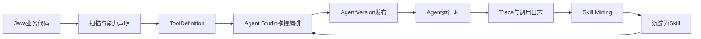

# 企业 Agent 开发与 Java 业务融合定位

> 本文用于沉淀 Enterprise Agent Framework 后续产品定位与关键技术方向：如何助力企业 Agent 开发，如何与传统 Java 项目深度结合，以及如何把固定业务流程、拖拽编排、运行时变量和业务系统真正打通。

## 一、核心定位

Enterprise Agent Framework 不应只定位为一个“Agent 聊天框架”，也不应走向泛化低代码平台。更准确的定位是：

**面向 Java 企业系统的 Agent 开发与治理中台。**

它的核心价值是把企业已有 Java 业务系统中的接口、服务、流程、权限、数据和审计能力，转化为 Agent 可以理解、可以调用、可以编排、可以治理、可以观测的能力资产。

一句话表达：

**让 Java 企业把已有业务接口快速变成可拖拽、可治理、可观测、可复用的 Agent 能力。**

当前项目已有的扫描项目、动态 Tool、AI 语义理解、Agent Studio、Tool ACL、Trace、Skill Mining、接口图谱等能力，已经具备向这个方向演进的基础。

## 当前落地状态（2026-05）

本文最初是产品定位与技术方向讨论稿。当前已经有一批内容进入代码或专题设计，后续阅读时应区分“已具备骨架”和“下一阶段继续深化”。

已具备骨架的能力：

- **能力声明**：已形成 `@AiCapability / @AiParam / @AiOutput` 的 SDK 注解与扫描入库方向，详见 `docs/AiCapability能力声明与扫描入库设计.md`。
- **能力元数据承载**：扫描侧和全局 Tool 侧已预留 `capability_metadata_json`，用于保存领域、标签、副作用、权限建议、超时重试建议等结构化元数据。
- **扫描链路融合**：Controller 扫描可读取能力声明，并把能力级、参数级元数据合并进扫描结果，后续 promote 为全局 Tool 时继续保留。
- **Studio 变量映射 MVP**：画布节点已具备 `outputAlias`、`inputMapping`、映射备注和变量预览的基础结构。
- **接口图谱反哺**：已确认的 `REQUEST_REF` 关系可以生成参数来源提示，并反哺 Tool 描述与 Studio 节点参数映射建议。
- **流程沉淀 Skill 草稿**：Studio 画布中的稳定 Tool 链可以生成 Skill 草稿，进入现有 Skill Mining 评审流。

仍需要继续深化的能力：

- 画布变量映射目前偏“配置与提示”，下一阶段需要进入确定性运行时执行。
- `capability_metadata_json` 当前适合作为第一阶段扩展字段，后续若业务验证稳定，可把 `domain / tags / requiredRoles` 等高频字段拆成治理表。
- 接口图谱参数来源已经能提示和反哺描述，但还需要结合运行时 Trace 值匹配、业务对象键和人工确认持续提升置信度。
- Studio 画布转 Skill 草稿目前以 Tool 链为主，后续需要保留变量映射、确认节点、表单节点等更完整的流程语义。

## 二、三层产品价值

### 2.1 让 Agent 看见业务能力

通过 OpenAPI / Spring Controller 扫描，把历史 Java 系统中的 HTTP 接口注册为动态 Tool。

当前主线已经基本成立：

```text
扫描项目 -> tool_definition -> DynamicHttpAiTool -> Agent 调用历史系统 HTTP 接口
```

这解决的是“有没有能力”的问题。

### 2.2 让 Agent 看懂业务能力

仅扫描接口名和参数结构是不够的。企业接口常见问题是：

- Swagger 描述为空或过于技术化。
- 方法名无法体现真实业务语义。
- 参数含义、返回值、调用前置条件、业务注意事项没有进入 Agent 上下文。
- Agent 在多个相似接口之间容易选错。

因此需要继续强化 AI 语义理解：

- 项目级：理解项目所属业务域和模块地图。
- 模块级：理解 Controller / Service / Mapper 形成的业务能力组。
- 接口级：结合方法体、Service 调用、DTO 字段、JavaDoc 生成面向 Agent 的业务说明。

接口级结果应继续写入 `tool_definition.ai_description`，让运行时 Tool 描述优先使用业务语义，而不是原始接口名。

这解决的是“懂不懂能力”的问题。

### 2.3 让 Agent 稳定执行业务流程

固定流程不应该完全交给 ReAct 临场推理。

例如：

```text
查询客户 -> 校验额度 -> 创建合同 -> 发起审批 -> 通知负责人
```

这种流程如果每次由 LLM 自己决定步骤，生产上会存在跳步、漏步、参数错传和重复调用风险。

更合理的分工是：

- Java 业务代码负责原子能力和事务正确性。
- Agent Studio 负责流程编排、节点关系、参数映射和版本发布。
- LLM 负责意图理解、参数抽取、自然语言解释和缺参追问。
- Skill 负责把高频稳定流程封装成粗粒度业务能力。

这解决的是“稳不稳执行”的问题。

## 三、与传统 Java 项目的三种结合深度

### 3.1 轻接入：零改造扫描接口

适合历史系统、遗留系统、短期 PoC。

接入方式：

1. 管理端录入项目名称、域名、磁盘路径。
2. 扫描 OpenAPI 或 Spring Controller。
3. 生成 `tool_definition`。
4. 运营或开发补充描述、启停、权限、副作用等级。
5. Agent 通过 `DynamicHttpAiTool` 调用原业务系统。

优点是接入快、对历史系统侵入小。

不足是业务语义、权限上下文、变量关系和流程稳定性需要后续补齐。

### 3.2 中接入：业务代码声明 Agent 能力

对于可改造的 Java 项目，建议引入结构化能力声明，而不是只依赖扫描推断。

可以设计类似注解：

```java
@AiCapability(
    name = "queryCustomerCredit",
    title = "查询客户授信额度",
    description = "根据客户ID查询当前可用授信额度",
    domain = "finance",
    sideEffect = SideEffectLevel.READ_ONLY,
    tags = {"客户", "授信", "额度"}
)
@PostMapping("/customer/credit/query")
public CreditVO queryCredit(@RequestBody CreditQueryRequest request) {
    // business code
}
```

参数也应支持结构化描述：

```java
public class CreditQueryRequest {

    @AiParam(
        description = "客户ID",
        sourceHint = "通常来自 queryCustomer.response.data.customerId"
    )
    private Long customerId;
}
```

这类注解的目标不是替代业务代码，而是让平台在扫描时获得更可靠的能力元数据：

- 能力名称。
- 业务标题。
- 业务描述。
- 所属领域。
- 标签。
- 副作用等级。
- 参数说明。
- 参数来源提示。
- 权限建议。
- 是否可被 Agent Studio 拖拽。

因此，“在业务代码中写一个 `@标签`，平台上即可拖拽为节点”这个方向是成立的，但这个标签必须是结构化的能力声明，而不是简单文本备注。

### 3.3 深接入：SDK + 上下文 + 事件

对于新系统、核心系统或长期要规模化使用的系统，可以提供更深的 SDK 接入。

深接入应覆盖：

- 主动注册 Tool / Skill。
- 透传登录用户、租户、角色、部门等业务上下文。
- 接入业务字典，如部门、人员、客户、产品、状态枚举。
- 接入业务事件，如订单创建、审批通过、合同归档。
- 接入企业权限体系和审计体系。
- 接入事务边界和幂等机制。

深接入的目标是让 Agent 进入企业已有治理体系，而不是绕过业务系统直接操作数据。

## 四、可拖拽节点的本质

Agent Studio 里的拖拽节点不应是任意代码块，而应是经过治理的能力资产。

建议节点类型逐步收敛为：

```text
Tool              原子业务能力，通常对应一个接口或方法
Skill             多个 Tool 封装后的粗粒度能力
InteractiveForm   带槽位补全、字典选择、用户确认的交互式能力
Knowledge         知识库检索能力
Condition         条件判断节点
HITL              人工审批节点
Start / End       流程起止节点
```

一个节点至少需要具备：

- `ref`：引用哪个 Tool / Skill / Knowledge。
- `inputMapping`：入参来自哪里。
- `outputAlias`：输出结果在流程变量中的名称。
- `sideEffect`：副作用等级。
- `acl`：谁可以使用。
- `retry / timeout`：可靠性配置。
- `trace`：运行时可观测信息。

拖拽的本质不是“画图”，而是把这些结构化元数据组合为一个可发布、可回滚、可审计的 Agent 版本。

### 4.1 Studio 从可视化配置到确定性执行

当前 Agent Studio 的价值，首先是让运营和解决方案工程师能把 Agent 的能力范围、提示词、Tool / Skill 白名单和画布关系可视化。但如果画布只停留在“展示和配置”，它仍然无法解决固定流程不稳定的问题。

下一阶段 Studio 需要从“可视化配置器”推进到“确定性流程执行器 MVP”。

建议先做顺序执行，不急着做复杂流程控制：

```text
start -> toolA -> toolB -> toolC -> end
```

运行时按画布连线顺序执行节点：

1. 找到 `start` 节点。
2. 沿唯一出边找到下一个 Tool / Skill 节点。
3. 根据当前节点的 `inputMapping` 解析入参。
4. 调用 Tool / Skill。
5. 将输出写入 `vars[outputAlias]`。
6. 继续执行下一个节点。
7. 到达 `end` 后汇总最终结果。

第一阶段建议只支持：

- 单一路径。
- Tool 节点。
- Skill 节点。
- Knowledge 节点作为检索前置上下文。
- `outputAlias`。
- `inputMapping`。
- 失败即中止。

暂不支持：

- 并行。
- 循环。
- 多条件分支。
- 任意脚本节点。
- 复杂表达式引擎。
- 任意数据库写入节点。

这样做的原因是：企业固定流程最怕不确定性。Studio 的第一价值不是功能多，而是让一个已知业务流程能稳定、可审计、可回滚地执行。

### 4.2 顺序流程执行器 MVP

后端可以新增一个轻量执行入口，用于执行 Studio 画布中的确定性流程。

建议概念模型：

```text
CanvasRuntimeExecutor
├─ CanvasGraphParser        解析 canvasJson
├─ CanvasVariableResolver   解析 inputMapping
├─ CanvasNodeInvoker        调用 Tool / Skill / Knowledge
├─ CanvasTraceRecorder      写入 Trace 与变量解析日志
└─ CanvasResultBuilder      汇总最终结果
```

执行时应和现有 Agent 能力共享底座：

- 继续使用 `ToolDefinitionService` 和 `ToolRegistry` 调用 Tool。
- 继续使用 Tool ACL 过滤不可见能力。
- 继续使用 `sideEffect` 和 `allowIrreversible` 运行时闸口。
- 继续写入 `tool_call_log` 和 Trace。
- 继续使用 `agent_version.snapshot_json` 保证发布版本不可变。

画布执行器不应替代 ReAct Agent。两者关系应是：

- ReAct Agent：适合开放式问答、意图不明确、多工具自主选择。
- Canvas Runtime：适合流程固定、步骤明确、参数可映射的业务操作。

最终同一个 Agent 可以同时具备两种模式：

```text
用户问题 -> AgentRouter
  -> 开放式问题：走 ReAct
  -> 固定流程意图：走 Canvas Runtime
```

### 4.3 发布前检查

当画布进入确定性执行后，发布前检查必须更严格。

至少检查：

- 是否存在唯一 `start` 和唯一 `end`。
- 是否存在孤立节点。
- 是否存在多入口或多出口但当前运行时不支持。
- Tool / Skill 是否仍然存在且启用。
- 当前 Agent 角色是否有权限看到所有节点。
- `inputMapping` 是否覆盖所有必填参数。
- `outputAlias` 是否唯一。
- `sideEffect=IRREVERSIBLE` 的节点是否被允许。
- 是否存在敏感字段直接输出到最终回答。

这些检查应在保存草稿时提示，在发布版本时强校验。

## 五、固定流程如何与业务代码结合

固定流程建议采用“代码原子能力 + 画布流程编排 + Skill 沉淀”的模式。



落地原则：

1. 单个业务动作沉淀为 Tool。
2. 多步稳定流程沉淀为 Skill。
3. 需要用户补全信息的流程沉淀为 InteractiveFormSkill。
4. 复杂但边界清晰的子域沉淀为 SubAgentSkill。
5. 高频 Trace 中反复出现的调用链，通过 Skill Mining 进入草稿评审。
6. 评审通过后成为可复用 Skill，再回到 Studio 供拖拽使用。

## 六、运行时变量如何与业务系统融合

Agent 调用过程中的变量不应只是临时 JSON，而应设计为企业级的 Agent Execution Context。

### 6.1 用户上下文变量

来自业务网关、登录态或调用方系统。

典型字段：

```text
userId
tenantId
roles
deptId
orgId
locale
channel
```

这些变量应进入 `ChatRequest`，并在 Tool / Skill 调用链路中通过上下文透传。

### 6.2 会话变量

来自用户自然语言、多轮对话和交互式表单。

典型内容：

```text
当前客户
当前订单
当前合同
时间范围
用户已确认的字段
挂起中的表单槽位
```

会话变量适合与 `InteractiveFormSkill`、短期记忆和挂起 / 恢复机制结合。

### 6.3 流程变量

来自画布节点之间的数据传递。

典型形式：

```text
queryCustomer.output.data.customerId
queryOrder.output.orderNo
createApproval.output.instanceId
```

流程变量应支持在 Studio 中可视化映射：

```text
queryCustomer.response.data.customerId
  -> createContract.request.customerId
```

### 6.4 业务对象变量

来自企业真实业务对象。

典型形式：

```text
customer.id
customer.name
order.orderNo
contract.contractId
approval.instanceId
```

业务对象变量应尽量通过接口图谱、DTO 字段和语义理解建立关系，而不是依赖运营手工猜字段。

### 6.5 变量映射运行时设计

变量映射的目标，是让 Studio 画布从“能力清单”变成“可稳定执行的业务流程”。运行时需要围绕 `outputAlias` 和 `inputMapping` 建立一个轻量流程上下文。

建议运行时上下文结构：

```json
{
  "context": {
    "userId": "u1001",
    "tenantId": "t001",
    "roles": ["contract_operator"]
  },
  "input": {
    "customerName": "南京星河科技",
    "amount": 300000
  },
  "vars": {
    "customer": {},
    "credit": {},
    "contract": {},
    "approval": {}
  }
}
```

#### `outputAlias`

每个 Tool / Skill 节点执行成功后，运行时把结果写入 `vars[outputAlias]`。

例如：

```text
queryCustomer.outputAlias = customer
```

如果 `queryCustomer` 返回：

```json
{
  "customerId": 10086,
  "customerName": "南京星河科技"
}
```

则流程上下文变为：

```json
{
  "vars": {
    "customer": {
      "customerId": 10086,
      "customerName": "南京星河科技"
    }
  }
}
```

`outputAlias` 应满足：

- 同一画布内唯一。
- 只允许字母、数字、下划线。
- 不允许覆盖系统保留名，如 `context`、`input`、`vars`、`result`。
- 节点无别名时，可用 Tool 名规范化后兜底，但发布前应提示运营补齐。

#### `inputMapping`

`inputMapping` 表达“当前节点入参从哪里来”。

示例：

```json
{
  "customerId": "customer.customerId",
  "amount": "$input.amount",
  "operatorId": "$context.userId"
}
```

最小解析规则：

- `customer.customerId`：从 `vars.customer.customerId` 读取。
- `$input.amount`：从用户输入或前置槽位中读取。
- `$context.userId`：从业务系统透传上下文读取。
- `"固定值"`：作为常量字符串。
- `300000`、`true`、`false`：按 JSON 字面量解析。

第一阶段只建议支持点路径，不急着引入完整表达式引擎。复杂表达式容易把 Studio 带向低代码平台，不符合当前产品定位。

#### JSONPath / 点路径边界

建议先支持以下形式：

```text
customer.customerId
customer.data.id
contract.contractNo
$input.amount
$context.userId
```

暂不支持：

```text
$.customer.list[0].id
customer.items[?(@.active==true)]
amount * 0.8
```

如确实需要数组取值，可以先在 Tool 的 `ai_description` 或 `@AiOutput` 中要求业务接口返回更稳定的业务对象字段，避免把复杂数据整形放进 Studio。

#### 缺参处理

当 `inputMapping` 解析不到值时，运行时按参数类型和业务风险分三类处理：

1. **可追问参数**：如客户名称、时间范围、金额，交给 LLM 或 InteractiveFormSkill 追问用户。
2. **必须由上游产生的参数**：如 `customerId`、`contractNo`，提示缺少前置节点或前置节点执行失败。
3. **敏感上下文参数**：如 `userId`、`roles`、`tenantId`，只能来自 `$context`，不能由用户自然语言覆盖。

缺参错误应写入 Trace：

```json
{
  "nodeId": "createContractDraft",
  "missing": ["customerId"],
  "mapping": "customer.customerId",
  "reason": "upstream value not found"
}
```

#### 权限与变量隔离

变量不能跨越权限边界随意传递。建议遵守：

- Tool ACL 决定用户是否能看到和调用某个节点。
- 若用户无权调用某个上游 Tool，则该 Tool 输出不能进入下游变量。
- `sensitive=true` 的字段默认不展示完整值，只展示脱敏摘要。
- Trace 中对敏感字段做掩码，如手机号、身份证、银行卡、密钥。
- `$context.roles` 只能由业务网关或调用方系统注入，不能由用户输入覆盖。

#### 变量映射与接口图谱的关系

接口图谱提供“推荐映射”，Studio 保存“确认映射”。

```text
接口图谱候选边 -> 运营确认 -> Studio 一键应用 -> inputMapping 固化到 canvasJson
```

运行时只执行 Studio 中已保存的 `inputMapping`，不应每次临场读取候选边自动改流程。这样可以保证版本可回滚、Trace 可复盘、发布行为可审计。

## 七、接口图谱的关键价值

接口图谱不应只是一个可视化展示工具，它更重要的价值是反哺 Agent 调用链路。

核心问题是：

**哪个接口的出参，通常可以作为另一个接口的入参？**

例如：

```text
queryCustomer.response.data.customerId
  -> createContract.request.customerId
```

这类关系一旦被推断和确认，就可以反哺三个地方：

1. Tool 描述：让 Agent 看到参数来源提示。
2. Agent Studio：选中节点时提示缺少哪些前置节点。
3. Tool Retrieval：让召回结果更理解接口之间的组合关系。

推荐闭环：

```mermaid
flowchart LR
  scan["扫描接口"] --> semantic["AI语义理解"]
  semantic --> graph["接口图谱投影"]
  graph --> infer["候选边推断"]
  infer --> review["运营确认"]
  review --> hints["参数来源提示"]
  hints --> studio["Studio参数映射"]
  hints --> agent["Agent选Tool与填参"]
  agent --> trace["运行时Trace"]
  trace --> infer
```

这条链路能让平台从“能调用接口”升级为“知道接口之间如何协作”。

## 端到端样例：客户合同审批 Agent

为了验证“Java 业务能力 Agent 化”的完整闭环，建议优先选择一个足够典型、但范围可控的业务场景：

```text
查询客户 -> 查询授信 -> 创建合同 -> 发起审批
```

这个场景覆盖了企业 Agent 落地中最常见的四类能力：

- 查询类能力：按客户名称、手机号、统一社会信用代码等查询客户。
- 校验类能力：根据客户 ID 查询授信额度、冻结状态、黑名单状态。
- 写入类能力：创建合同草稿或合同申请单。
- 流程类能力：发起审批并返回审批实例 ID。

### 端到端目标

用户可以用自然语言表达：

```text
帮我给南京星河科技创建一份年度服务合同，金额 30 万，走标准审批。
```

平台需要完成：

1. 识别客户名称和合同金额。
2. 调用客户查询接口获取 `customerId`。
3. 调用授信查询接口确认可用额度。
4. 调用合同创建接口，使用前两步得到的客户和额度信息。
5. 调用审批接口，发起流程。
6. 返回合同编号、审批实例 ID 和下一步处理人。
7. 记录完整 Trace，并支持从该链路沉淀 Skill 草稿。

### Java 侧能力声明

业务系统中建议声明四个能力：

```java
@AiCapability(
    name = "queryCustomer",
    title = "查询客户",
    description = "根据客户名称、手机号或统一社会信用代码查询客户基础信息",
    domain = "crm",
    module = "customer",
    tags = {"客户", "查询"},
    sideEffect = SideEffectLevel.READ_ONLY
)
@PostMapping("/customers/search")
public CustomerVO queryCustomer(@RequestBody CustomerQueryRequest request) {
    return customerService.query(request);
}
```

```java
@AiCapability(
    name = "queryCustomerCredit",
    title = "查询客户授信",
    description = "根据客户ID查询可用授信额度和授信状态",
    domain = "finance",
    module = "credit",
    tags = {"客户", "授信"},
    sideEffect = SideEffectLevel.READ_ONLY
)
@PostMapping("/customers/credit")
public CreditVO queryCustomerCredit(@RequestBody CreditQueryRequest request) {
    return creditService.query(request);
}
```

```java
@AiCapability(
    name = "createContractDraft",
    title = "创建合同草稿",
    description = "为指定客户创建合同草稿，返回合同编号",
    domain = "contract",
    module = "contract",
    tags = {"合同", "创建"},
    sideEffect = SideEffectLevel.WRITE,
    requiredRoles = {"contract_operator"}
)
@PostMapping("/contracts/draft")
public ContractVO createContractDraft(@RequestBody ContractCreateRequest request) {
    return contractService.createDraft(request);
}
```

```java
@AiCapability(
    name = "startContractApproval",
    title = "发起合同审批",
    description = "根据合同编号发起标准合同审批流程",
    domain = "workflow",
    module = "approval",
    tags = {"审批", "合同"},
    sideEffect = SideEffectLevel.WRITE,
    requiredRoles = {"contract_operator"}
)
@PostMapping("/contracts/approval/start")
public ApprovalVO startApproval(@RequestBody ApprovalStartRequest request) {
    return approvalService.start(request);
}
```

DTO 字段中需要声明输入和输出关系：

```java
public class CustomerVO {
    @AiOutput(
        description = "客户ID，可作为授信查询、合同创建的 customerId",
        businessKey = "customer.id",
        canBeSourceFor = {"customerId", "contract.customerId"}
    )
    private Long customerId;
}
```

```java
public class CreditQueryRequest {
    @AiParam(
        description = "客户ID",
        sourceHint = "通常来自 queryCustomer.response.customerId",
        required = true
    )
    private Long customerId;
}
```

```java
public class ContractCreateRequest {
    @AiParam(
        description = "客户ID",
        sourceHint = "通常来自 queryCustomer.response.customerId",
        required = true
    )
    private Long customerId;

    @AiParam(
        description = "合同金额",
        example = "300000",
        required = true
    )
    private BigDecimal amount;
}
```

### 平台侧闭环

扫描后，平台应得到四个可拖拽 Tool 节点：

```text
queryCustomer
queryCustomerCredit
createContractDraft
startContractApproval
```

在 Studio 画布中，运营或解决方案工程师按顺序连线：

```text
start -> queryCustomer -> queryCustomerCredit -> createContractDraft -> startContractApproval -> end
```

节点变量映射建议：

```text
queryCustomer.outputAlias = customer
queryCustomerCredit.inputMapping.customerId = customer.customerId

queryCustomerCredit.outputAlias = credit
createContractDraft.inputMapping.customerId = customer.customerId
createContractDraft.inputMapping.amount = $input.amount

createContractDraft.outputAlias = contract
startContractApproval.inputMapping.contractNo = contract.contractNo
```

接口图谱应能确认或提示：

```text
queryCustomer.response.customerId -> queryCustomerCredit.request.customerId
queryCustomer.response.customerId -> createContractDraft.request.customerId
createContractDraft.response.contractNo -> startContractApproval.request.contractNo
```

运行后 Trace 应至少包含：

- 每个 Tool 的入参。
- 每个 Tool 的出参摘要。
- 变量解析结果。
- 成功 / 失败状态。
- 耗时、Token、traceId。

当该链路多次成功执行后，运营可以从 Trace 或画布生成 Skill 草稿：

```text
createContractApprovalSkill
```

这个 Skill 对 LLM 暴露为一个粗粒度能力，而不是每次都让 ReAct 自己决定四个 Tool 的顺序。

### 验收标准

这个端到端样例完成后，应满足：

- 业务 Java 项目中至少 4 个方法使用 `@AiCapability` 声明。
- 扫描结果中能看到 `capability_metadata_json`。
- Tool 参数 JSON 中能看到 `@AiParam / @AiOutput` 产生的 `metadata`。
- Agent Studio 可以拖入 4 个 Tool 节点并保存变量映射。
- 接口图谱可以提示至少 2 条参数来源关系。
- 调试一次自然语言请求后生成完整 Trace。
- 可以从画布或 Trace 生成 Skill 草稿。

## 八、建议的能力声明模型

后续可以考虑设计一组 Java 注解或 SDK 元数据模型。

### 8.1 `@AiCapability`

用于声明一个方法或接口是否可成为 Agent 能力。

建议字段：

```text
name
title
description
domain
module
tags
sideEffect
visible
agentVisible
requiredRoles
timeoutMs
retryLimit
```

### 8.2 `@AiParam`

用于声明参数语义。

建议字段：

```text
description
required
example
sourceHint
dictType
sensitive
```

### 8.3 `@AiOutput`

用于声明输出字段语义。

建议字段：

```text
description
businessKey
canBeSourceFor
sensitive
```

### 8.4 `@AiWorkflow`

用于声明代码侧已经稳定存在的业务流程。

适用于固定编排场景：

```text
name
description
steps
inputSchema
outputSchema
sideEffect
```

不过需要注意：`@AiWorkflow` 不应把平台变成 Java DSL 工作流引擎。它更适合作为“已有稳定业务流程”的能力声明，真正的运营编排仍放在 Agent Studio。

## 九、后续演进优先级

### 9.1 第一优先级：能力声明标准化

设计 Java 注解或 SDK 元数据，让业务项目可以明确声明哪些接口是 Agent 能力。

目标：

- 降低纯扫描误判。
- 提升 Tool 描述质量。
- 为 Studio 节点提供稳定元数据。

### 9.2 第二优先级：变量映射体系

Agent Studio 需要支持：

- 节点输出引用。
- 节点入参绑定。
- 用户上下文变量。
- 会话变量。
- 缺参追问。
- 默认值与表达式。

没有变量映射，画布只能展示能力，不能稳定执行流程。

### 9.3 第三优先级：接口图谱反哺 Agent

将 `REQUEST_REF / RESPONSE_REF` 确认关系写入 Tool 描述和 Studio 参数提示。

目标：

- 提升 Agent 填参准确率。
- 降低运营配置成本。
- 支持一键添加前置 Tool。

### 9.4 第四优先级：固定流程 Skill 化

把高频稳定调用链从 ReAct 中拿出来，沉淀为 Skill。

来源包括：

- 工程手写。
- Studio 编排发布。
- Trace 挖掘生成草稿。
- 运营评审上架。

### 9.5 第五优先级：企业治理补齐

继续补齐生产必需能力：

- Tool / Skill ACL。
- 副作用等级。
- 限流。
- HITL。
- Trace。
- 版本灰度。
- 回滚。
- 审计。

这些能力是与普通 Demo Agent 拉开差距的关键。

## 十、近期三个 Sprint 建议

后续推进不建议继续横向扩很多能力，而应围绕一个端到端样例，把“能力声明 -> 扫描 -> Studio 编排 -> 确定性执行 -> Trace -> Skill 沉淀”跑通。

### Sprint 1：端到端 Demo 与样例工程

目标：用一个真实感足够强的 Java 业务样例验证产品主线。

范围：

- 准备一个 `legacy-contract-demo` 或同类 Java 示例项目。
- 实现 `queryCustomer`、`queryCustomerCredit`、`createContractDraft`、`startContractApproval` 四个接口。
- 在接口和 DTO 上添加 `@AiCapability / @AiParam / @AiOutput`。
- 用扫描项目功能把这些接口扫描入库。
- 在 AI 理解 Tab 生成项目、模块、接口级语义。
- 在接口图谱中确认至少 2 条参数来源关系。
- 在 Studio 中拖拽 4 个 Tool 节点并保存变量映射。
- 调试一次自然语言请求，生成 Trace。
- 从画布生成 Skill 草稿。

验收条件：

- 扫描结果能看到能力元数据。
- Tool 描述优先使用业务语义。
- Studio 画布能保存变量映射。
- 图谱能反哺参数来源提示。
- Trace 能回放完整链路。
- Skill 草稿进入评审列表。

产出物：

- 一个可重复演示的样例项目。
- 一份操作手册。
- 三张截图：扫描结果、Studio 画布、Trace 时间线。
- 一条完整演示脚本。

### Sprint 2：变量映射运行时执行

目标：让 Studio 画布真正参与确定性流程执行。

范围：

- 实现 `CanvasRuntimeExecutor` 最小版本。
- 支持单一路径顺序执行。
- 支持 Tool / Skill 节点。
- 支持 `outputAlias` 写入流程变量。
- 支持 `inputMapping` 从 `$input`、`$context`、上游 `vars` 解析参数。
- 支持缺参错误写 Trace。
- 支持发布前校验必填参数映射。
- 支持调试抽屉展示变量解析结果。

验收条件：

- 不依赖 LLM 自主选择 Tool，也能按画布顺序完成合同审批样例。
- 任一上游节点失败时，下游节点不会继续误执行。
- 任一必填参数缺失时，能返回明确错误。
- Trace 中能看到每个节点的输入、输出、变量映射结果。
- 同一 `agent_version` 的执行结果可复现。

### Sprint 3：生产治理最小闭环

目标：让 Demo 能进入接近生产的安全边界。

范围：

- Redis 令牌桶限流，防止 Agent 或画布流程错误循环打爆业务接口。
- AgentVersion / Prompt / Canvas diff，发布和回滚时能看清变化。
- HITL 最小审批点，用于 `WRITE / IRREVERSIBLE` 节点。
- 敏感字段脱敏，保护 Trace 与最终回答。
- 发布前风险检查，把 `sideEffect`、ACL、变量缺失、孤立节点纳入校验。

验收条件：

- 同一用户或同一 Agent 超过限流阈值时被拦截。
- 发布新版本时可以查看和上一版本的差异。
- 命中 HITL 的节点会挂起而不是直接执行。
- 敏感字段不会明文出现在 Trace 面板和最终回答中。
- 发布前检查能阻止明显危险配置。

## 十一、阶段验收清单

当以下清单全部完成时，可以认为“Java 企业业务能力 Agent 化”第一阶段闭环成立。

能力声明：

- Java 示例项目中至少 4 个接口使用 `@AiCapability`。
- 至少 3 个入参字段使用 `@AiParam`。
- 至少 3 个出参字段使用 `@AiOutput`。
- 扫描后 `capability_metadata_json` 非空且字段完整。

扫描与语义：

- 扫描项目能显示接口、参数、返回值结构。
- AI 理解能生成项目级、模块级、接口级语义。
- `tool_definition.ai_description` 能看到业务描述。
- Tool Retrieval 能使用业务语义召回相关 Tool。

Studio 编排：

- Studio 能拖拽 4 个 Tool 节点。
- 每个节点能保存 `outputAlias`。
- 下游节点能保存 `inputMapping`。
- 参数来源提示可以一键应用为变量映射。
- 发布前能发现缺少必填映射的问题。

运行时：

- 自然语言输入能触发合同审批样例。
- 画布顺序执行时每个节点入参正确。
- 上游输出能传给下游入参。
- 缺参、权限不足、业务接口失败能被明确记录。
- Trace 能展示完整执行链路。

图谱反哺：

- 至少生成 2 条 `REQUEST_REF` 候选边。
- 运营确认后能生成参数来源提示。
- Tool 描述中能出现参数来源提示。
- Studio 节点属性面板能看到并应用提示。

Skill 沉淀：

- Trace 可以抽取 Skill 草稿。
- Studio 画布可以抽取 Skill 草稿。
- 草稿能进入评审页。
- 评审通过后能发布为 Skill。
- 新 Skill 能回到 Studio 中作为粗粒度节点拖拽。

治理：

- Tool ACL 能限制不同角色看到不同能力。
- `sideEffect` 能在发布前和运行时生效。
- 限流能保护业务接口。
- HITL 能拦截高风险写操作。
- 版本灰度和回滚能用于上线控制。

## 十二、风险与边界

后续推进时需要持续守住几条边界。

### 不把 Studio 做成通用低代码平台

Studio 的目标是 Agent 能力编排，不是替代 BPM、低代码表单、ETL 或后端服务编排平台。凡是复杂事务、一致性、长事务、补偿逻辑，仍应回到业务系统或专业流程系统。

### 不让 LLM 决定核心交易正确性

LLM 可以理解意图、抽取参数、解释结果，但不应决定合同是否能创建、额度是否足够、审批是否通过。这些判断必须由 Java 业务代码和企业规则系统完成。

### 不把注解变成新的重侵入框架

`@AiCapability` 是能力声明，不是要求业务系统继承平台框架。历史项目仍应支持零改造扫描；可改造项目才逐步加注解。

### 不让变量映射变成脚本语言

变量映射只做字段绑定、上下文引用和简单常量。复杂转换应由 Tool、AugmentedTool 或业务代码处理。

### 不自动上架挖掘出来的 Skill

无论来自 Trace 还是画布，Skill 草稿都必须经过人工评审。系统可以推荐，但不能无人值守发布到生产。

## 十三、阶段性结论

Enterprise Agent Framework 后续应坚持一个主线：

**不是让 Agent 简单调用 Java 接口，而是让 Java 企业的业务能力被 Agent 正确理解、稳定编排、安全执行、持续沉淀。**

围绕这条主线，平台要持续把四件事做深：

1. 业务能力资产化：从接口、方法、流程中抽取 Agent 可用能力。
2. 业务语义结构化：让 Agent 理解能力的用途、参数、返回值和约束。
3. 业务流程可编排：让固定流程通过 Studio 和 Skill 稳定运行。
4. 业务治理平台化：让权限、副作用、限流、审批、审计、Trace 成为内建能力。

最终目标是让企业 Java 团队可以用熟悉的技术栈，把已有系统渐进式升级为 Agent 可调用、可组合、可运营的智能业务底座。
