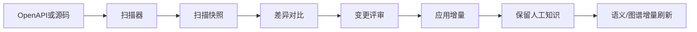
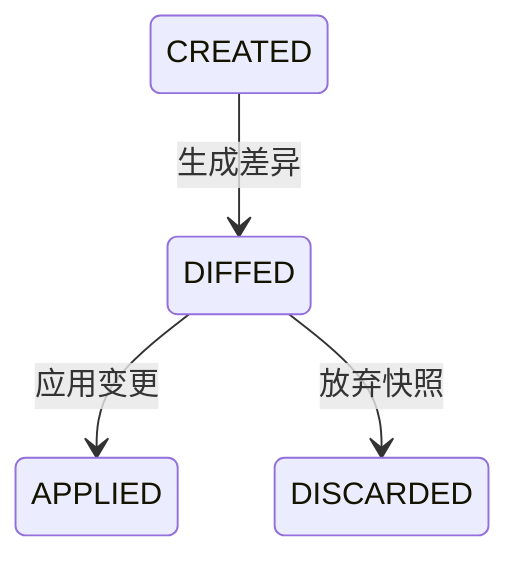

# 扫描增强：差异对比、增量冲突与深扫设计

> 承接 `背景、现状、目标.md` 和 `AI能力系统升级规划.md` 中“扫描能力增强”的后续目标。扫描已经完成运行时主线收口，下一步重点是让真实企业老项目可以长期反复扫描、增量演进、保留人工知识。

## 一、设计目标

当前扫描链路已经能将 OpenAPI / Controller 转为动态 Tool，并生成模块、语义文档和接口图谱。真实落地后会遇到新问题：

1. 历史系统持续迭代，重扫时不知道接口发生了什么变化。
2. 运营人工编辑过的 Tool 描述、AI 语义文档、图谱手工边可能被覆盖。
3. Controller 注解只能看到入口，业务语义藏在 Service、JavaDoc、DTO 注释和 Mapper 中。
4. OpenAPI 复杂 schema、泛型、文件上传、多 content-type、鉴权模板解析不完整。

本阶段目标是让扫描从“一次性导入”升级为“可持续同步”。

## 二、整体流程



关键变化：

- 扫描结果先进入 snapshot，不直接覆盖当前 Tool。
- 通过 diff 生成变更单。
- 用户确认后再 apply。
- apply 时保留人工编辑与手工图谱关系。

## 三、扫描快照

新增 `scan_snapshot`：

```text
id
project_id
scan_id
source_type       -- OPENAPI / CONTROLLER
source_hash
status            -- CREATED / DIFFED / APPLIED / DISCARDED
summary_json
created_at
```

新增 `scan_snapshot_tool`：

```text
id
snapshot_id
stable_key
http_method
path
operation_id
controller_class
method_name
request_schema_json
response_schema_json
raw_manifest_json
fingerprint
```

`stable_key` 建议：

```text
{httpMethod} {normalizedPath}
```

如果 path 缺失，则 fallback：

```text
{controllerClass}#{methodName}
```

`fingerprint` 用于判断接口内容是否变化，组成：

- HTTP method
- path
- 参数 schema
- 响应 schema
- 鉴权要求
- sideEffect 推断结果

## 四、差异对比

新增 `scan_diff_item`：

```text
id
project_id
snapshot_id
change_type       -- ADDED / REMOVED / CHANGED / UNCHANGED / RENAMED
stable_key
old_tool_id
new_snapshot_tool_id
diff_json
resolution        -- PENDING / APPLY / IGNORE / MERGE_MANUAL
created_at
updated_at
```

差异类型：

- `ADDED`：新接口。
- `REMOVED`：旧接口不再存在。
- `CHANGED`：参数、响应、路径、方法、鉴权、描述发生变化。
- `RENAMED`：路径或方法名变化，但 operationId / 语义 / 参数高度相似。
- `UNCHANGED`：无变化，可不展示。

`diff_json` 示例：

```json
{
  "path": { "old": "/user/{id}", "new": "/users/{id}" },
  "request": {
    "added": ["body.email"],
    "removed": ["body.nickname"],
    "changed": ["body.age:int->long"]
  },
  "response": {
    "added": ["data.roles"]
  }
}
```

## 五、冲突与保留策略

### 5.1 人工编辑识别

需要给以下对象增加或复用人工编辑标记：

- Tool `description / ai_description / enabled / agent_visible`
- SemanticDoc `status=edited`
- ApiGraph manual edge
- MCP visibility
- Tool ACL 规则

apply 增量时默认规则：

- 系统字段更新：路径、方法、参数 schema、响应 schema。
- 人工字段保留：名称、描述、AI 描述、可见性、启停、ACL。
- 若 schema 删除了人工文档中引用的字段，标记为冲突。

### 5.2 冲突类型

- `MANUAL_DESCRIPTION_CONFLICT`：扫描描述变了，但用户手工编辑过描述。
- `PARAM_REMOVED_BUT_REFERENCED`：字段被删除，但语义文档或图谱边仍引用。
- `TOOL_REMOVED_BUT_AGENT_USED`：接口被删除，但 AgentDefinition 仍引用。
- `ACL_OR_MCP_EXPOSED_REMOVED`：接口被删除，但对外暴露或授权仍存在。

冲突默认不自动应用，进入评审。

## 六、Service / JavaDoc 深扫

### 6.1 深扫目标

Controller 只能告诉我们“接口长什么样”，Service 和 JavaDoc 能告诉我们“业务为什么这么做”。

深扫输出：

- 业务动作摘要。
- 参数业务含义。
- 返回字段含义。
- sideEffect 细化。
- 可能的前置条件和异常。
- 下游 Mapper / Feign / HTTP 调用线索。

### 6.2 采集范围

从 Controller 方法出发：

1. 方法 JavaDoc。
2. 参数类型 / DTO 字段注释。
3. 调用的 Service 方法。
4. Service 方法 JavaDoc 和关键分支。
5. Mapper 方法名和 SQL 注释。
6. Feign / RestTemplate / WebClient 调用。

为控制成本：

- 默认最大深度 2。
- 单接口最大源码上下文 20KB。
- 超限时只保留签名、JavaDoc、字段注释。

### 6.3 与 AI 语义理解关系

深扫不直接生成最终 AI 文档，而是作为 `SemanticContextCollector` 的增强上下文：

```text
Controller签名 + DTO + JavaDoc + Service摘要 + Mapper线索 -> LLM生成AI语义文档
```

这样能复用现有项目级、模块级、接口级语义生成链路。

## 七、OpenAPI 复杂契约增强

优先支持：

- `oneOf / anyOf / allOf`
- 泛型包装：`Result<T>`、`Page<T>`、`List<T>`
- 枚举和枚举描述。
- `multipart/form-data` 文件上传。
- 多 `content-type` 请求和响应。
- Header / Cookie / Query / Path / Body 参数位置。
- Security scheme 到鉴权模板的映射。
- `$ref` 循环引用检测。

输出要求：

- 保持 `ToolDefinitionParameter` 树稳定。
- `ParameterLocation` 明确记录参数位置。
- 枚举值进入 schema，供 InteractiveFormSkill 生成表单。
- 文件上传 Tool 默认不 agentVisible，需人工确认。

## 八、前端评审体验

扫描项目详情新增“变更评审”Tab：

- 差异摘要：新增、删除、变更、冲突数量。
- 按模块筛选。
- 展开查看字段级 diff。
- 批量应用无冲突变更。
- 冲突逐条处理。
- 对删除接口提示影响范围：Agent、Skill、MCP、A2A、ACL、图谱边。

状态流：



## 九、API 设计

```text
POST /api/scan-projects/{id}/scan-snapshot
GET  /api/scan-projects/{id}/snapshots
POST /api/scan-projects/{id}/snapshots/{snapshotId}/diff
GET  /api/scan-projects/{id}/snapshots/{snapshotId}/diff-items
POST /api/scan-projects/{id}/snapshots/{snapshotId}/apply
POST /api/scan-projects/{id}/diff-items/{itemId}/resolve
GET  /api/scan-projects/{id}/diff-items/{itemId}/impact
```

## 十、验收用例

1. 重扫项目时先生成 snapshot，不直接覆盖现有 Tool。
2. 新增接口显示为 `ADDED`，应用后进入 `tool_definition`。
3. 删除接口若被 Agent 使用，生成冲突并提示影响范围。
4. 参数类型从 `int` 改为 `long` 时，diff 展示字段级变化。
5. 用户手工编辑过的 `ai_description` 在应用变更后保留。
6. JavaDoc 和 Service 方法摘要进入接口级语义生成上下文。
7. OpenAPI 的枚举、文件上传、多 content-type 能正确进入参数树。
8. 图谱手工边在重扫应用后不丢失，失效字段关系进入冲突提示。

## 十一、推荐拆分

1. `Scan 2.1`：snapshot 表、diff 表、后端 diff 引擎。
2. `Scan 2.2`：前端变更评审 Tab、批量应用和冲突处理。
3. `Scan 2.3`：增量 apply 与人工知识保留。
4. `Scan 2.4`：Service / JavaDoc 深扫接入语义上下文。
5. `Scan 2.5`：OpenAPI 复杂契约增强。
