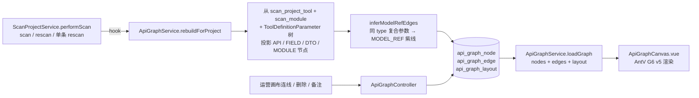

# 接口图谱（ApiCallGraph）设计与落地

> Phase 4.0 一期：节点投影 + 数据模型共享自动生成 + 运营手动连线 + 画布持久化布局
>
> 一期目标 — 让运营在画布上"看见"扫描出的接口、参数、DTO 之间的关系，并通过手动连线沉淀
> 「请求引用 / 响应引用」业务知识；二期再叠加自动启发式推断与 AI 反哺。

---

## 一、背景与定位

扫描器（[ai-skills-service/`/ai/scanner/*`](../ai-skills-service)）能把历史 Java 项目的 Controller / OpenAPI 拆出
`tool_definition` + 嵌套 `ToolDefinitionParameter` 树。但运营拿到几百个接口后会面临的问题：

- 某个接口的 `userId` 究竟是从哪个接口出来的？
- 同一个 `UserDTO` 被多少个接口引用？散在哪些模块？
- 给 Agent 用做 ReAct 决策时，LLM 看不出"先调 A 拿 userId 再调 B"的依赖关系

接口图谱用一张交互式画布把"接口/字段/DTO/模块"建模为节点，把它们之间的引用关系显式画
出来。一期只解决"运营手工梳理 + 数据模型共享自动暴露"，不直接干预 Agent 调用决策。

---

## 二、整体架构

- 数据流单向：扫描完成→投影节点→自动推断 MODEL_REF→运营画布交互→读取 → G6 渲染
- 旁路 hook：`ApiGraphService` 在 `ScanProjectService` 内 `@Autowired(required = false)`，画布失败
  不会影响扫描主链路；`rebuildForProject` 内部 try/catch 不向上抛
- 数据访问统一抽象在 `ApiGraphRepository` 接口（默认实现 `MysqlApiGraphRepository`），方便二期
  按需替换为图 DB 副本

---

## 三、数据模型

### 3.1 节点 `api_graph_node`

| 字段 | 说明 |
|---|---|
| `kind` | `API` / `FIELD_IN` / `FIELD_OUT` / `DTO` / `MODULE` |
| `ref_id` | 业务表外键：`API → scan_project_tool.id`；`MODULE → scan_module.id`；`FIELD/DTO` 为 null |
| `parent_id` | 字段树嵌套：`FIELD_*.parent_id` 指向所属 API 节点或父字段；`API.parent_id` 指向所在 MODULE（用于布局分组） |
| `label` | 展示名（字段名 / 接口名 / 模块名 / DTO 简名） |
| `type_name` | 字段类型 / DTO 全名（含泛型，如 `List<RoleDTO>`），是 MODEL_REF 推断的关键字段 |
| `props_json` | 附加属性 JSON：`required / location / paramPath / httpMethod / endpointPath / aiDescription` 等 |

唯一键 `(project_id, kind, ref_id, parent_id, label)` —— 重扫时 upsert 幂等。

设计取舍：

- **持久化投影 vs 纯虚拟化**：DTO 字段也建独立行，让运营能在节点上挂备注 / 布局 / 手动边而不
  在重扫时丢失（节点 ID 稳定）
- **同名 DTO 项目内复用**：同一项目内引用 `UserDTO` 的所有字段共享同一个 DTO 节点（按 `simpleTypeName` 聚合），
  避免 N 个引用方各自建一个 DTO 节点导致画布爆炸
- **基础类型不建 DTO 节点**：`string / int / boolean / date` 等不视为复合类型，不参与 MODEL_REF
  推断（详见 `ApiGraphService.PRIMITIVE_TYPE_NAMES`）

### 3.2 边 `api_graph_edge`

| 字段 | 说明 |
|---|---|
| `kind` | `REQUEST_REF`（蓝实线） / `RESPONSE_REF`（绿实线） / `MODEL_REF`（紫虚线） / `BELONGS_TO`（灰虚线，字段→DTO） |
| `source` | `auto`（系统推断） / `manual`（运营手动连线，永不被覆盖） |
| `confidence` | 0~1，自动推断置信度；手动连线为 1.0 |
| `evidence_json` | 推断依据 JSON：例如 `{"by":"shared_type","type":"UserDTO"}` |

唯一键 `(project_id, kind, source_node_id, target_node_id, source)` ——
- `auto` 边：重新推断时整批 `deleteAutoEdges` 后重建，幂等
- `manual` 边：永远保留；同 source/target/kind 重复 upsert 只更新 note / confidence

### 3.3 布局 `api_graph_layout`

单独表，避免每次写边都改节点。`(project_id, node_id)` 唯一键。

---

## 四、自动推断策略（一期仅 MODEL_REF）

`ApiGraphService.inferModelRefEdges(projectId)`：

1. 拉取项目下所有 `FIELD_IN` / `FIELD_OUT` 节点
2. 按 `simpleTypeName(type_name)` 聚合（去掉泛型/数组/包名后的简短类名，如 `List<RoleDTO>` → `RoleDTO`）
3. 跳过基础类型 / 看起来不像类名的（首字母小写）
4. 同一桶内的所有字段两两生成 `MODEL_REF` 边（同 API 内部不画，避免噪音）
5. 重新推断前先删除所有 `source=auto AND kind=MODEL_REF` 的边（manual 不受影响）

复杂度：单 DTO 引用方 N 次时生成 `N*(N-1)/2` 条边。一期假设单项目 ≤ 5K 节点 / 10K 边，MySQL
索引可秒级查询。

---

## 五、为什么一期不用图数据库

| 维度 | MySQL 双表（一期） | Neo4j / Nebula |
|---|---|---|
| 当前规模 | 单项目 ~500 接口 × 8 字段 ≈ 5K 节点 / 10K 边 | 杀鸡用牛刀 |
| 现有运维栈 | 已有 MySQL，零新增组件 | 新增组件 / 备份 / 监控 |
| 90% 查询模式 | 按 project_id 拉全图 + 1~2 跳邻居 | 仅多跳推理（≥3 跳）才有显著优势 |
| 替换成本 | 走 `ApiGraphRepository` 接口，新增图 DB 实现即可 | — |

### 演进策略（迁移阈值）

下一期需要图 DB 的真实信号：

- 单项目边 > 50K 或 全局边 > 500K
- 运行时挖掘启用后，`tool_call_log` 共现边累积到百万级
- 出现真实的多跳推理需求（"从 username 到 permissionList 最短路径"）
- 需要 PageRank / 社区发现等全图算法

届时新增 `NebulaApiGraphRepository` 实现，CDC 把 MySQL 变更同步到图 DB（保留 MySQL 作 SoT）。
业务代码无需改动。

---

## 六、前端实现

### 6.1 选型：AntV G6 v5

为什么不复用项目已有的 `@vue-flow/core`：

- vue-flow 偏向"流程图固定形状"（Agent Studio 那种 start / end / skill 节点），节点形状内置类型有限
- G6 v5 对"关系图谱"语义更友好：内置 `antv-dagre` 分层布局、`force` 力导向、`circular` 等
- G6 边样式更灵活：直接 `style.lineDash` / `style.stroke`，三色边一行配置即可
- MIT 协议；中文生态成熟（蚂蚁集团长期维护）
- v5 是 ESM-first 的现代 API，TS 类型完整

### 6.2 组件结构

`ai-admin-front/src/views/scan/ApiGraphCanvas.vue`：

- 工具栏：刷新 / 重新构建 / 重新推断紫线 / 保存布局 / 导出 PNG / 连线模式切换 / 节点类型过滤 / 边类型过滤
- 画布：G6 Graph，`antv-dagre` 默认布局；行为：`zoom-canvas` / `drag-canvas` / `drag-element` /
  `click-select` / `create-edge`（仅在连线模式下生效）
- 右侧抽屉：选中节点显示 props（HTTP 方法 / AI 描述 / 字段路径 ...）；选中边显示来源 / 置信度 /
  推断依据 / 删除按钮
- 边类型选择对话框：拖拽 create-edge 完成后弹出，让运营选 REQUEST_REF / RESPONSE_REF / MODEL_REF

### 6.3 接入入口

`ScanProjectDetail.vue` 末尾追加「接口图谱」折叠卡，**懒加载**（`defineAsyncComponent` + `watch
detailPanelActive`）—— 不展开折叠卡时不创建 G6 实例，避免拖慢扫描详情页的初始渲染。

---

## 七、与现有功能的关系

不破坏既有路径：

- 复用 `ScanProjectToolService` / `ScanModuleService` / `SemanticDocService` 提供节点元数据 + AI tooltip
- 不修改 `tool_call_log` / `AgentRouter` / `AiToolAgentAdapter` —— 一期完全是"读 + 旁路"
- 删除扫描项目时，`ScanProjectService.delete(id)` 内追加 `apiGraphService.deleteByProject(id)`
- 单条接口「扫描更新」(`rescanSingleTool`) 不触发 rebuild —— 单条更新对图谱影响小，避免每次单测都重算

---

## 八、二期规划

不在本次实施范围，按优先级：

1. **启发式蓝/绿边自动推断**：扫描后扫所有"出参字段名+类型 ≈ 别处入参字段名+类型"的对，给运营
   一个 70~85% 准确的起点；UI 上以低饱和度显示，运营可一键确认/删除
2. **运行时挖掘**：从 `tool_call_log.args_json / result_summary` 抽具体值，同 traceId 内字段值
   匹配 → 反推真实的跨接口数据流（最高准确率，但前提是项目已有真实流量）
3. **AI 反哺（Agent 闭环）**：`ApiGraphService.buildParamSourceHint(toolName)` 把
   "userId 通常来源：user_login 出参 / user_info_query 出参"拼接到 `DynamicHttpAiTool.description()`，
   ReAct 决策时直接看到参数依赖关系
4. **必要时迁移到 Nebula Graph 副本**：见 §5「演进策略」迁移阈值

---

## 九、验收用例（一期）

1. **节点投影**：扫描某项目 → 详情页"接口图谱"折叠区展开，画布上能看到 API / DTO / FIELD /
   MODULE 节点；同名 DTO 在项目内只一个节点
2. **MODEL_REF 自动生成**：项目内多个接口都引用 `UserDTO`，对应字段之间出现紫色虚线
3. **手动连线**：开启「连线模式」 → 拖拽两个字段节点 → 弹窗选「蓝-请求引用」 → 画布上出现蓝色实线
4. **删除边**：选中边 → 抽屉「删除该边」 → 画布消失，刷新仍消失
5. **保存布局**：拖动节点 → 点「保存布局」 → 刷新页面位置不变
6. **删除项目联动**：扫描项目删除 → `api_graph_node / api_graph_edge / api_graph_layout` 同步清理
7. **重新推断不影响 manual**：手动连一条蓝线 → 点「重新推断紫线」 → 蓝线仍在
8. **重新构建幂等**：连续点两次「重新构建」结果一致，节点 / 边数量不变

---

## 十、相关文件索引

后端（`ai-agent-service`）：

- [ai-agent-service/sql/api_graph_phase4_0.sql](../ai-agent-service/sql/api_graph_phase4_0.sql) — 三表迁移
- [graph/ApiGraphRepository.java](../ai-agent-service/src/main/java/com/enterprise/ai/agent/graph/ApiGraphRepository.java) — 数据访问抽象
- [graph/MysqlApiGraphRepository.java](../ai-agent-service/src/main/java/com/enterprise/ai/agent/graph/MysqlApiGraphRepository.java) — 默认实现
- [graph/ApiGraphService.java](../ai-agent-service/src/main/java/com/enterprise/ai/agent/graph/ApiGraphService.java) — 投影 / 推断 / CRUD
- [controller/ApiGraphController.java](../ai-agent-service/src/main/java/com/enterprise/ai/agent/controller/ApiGraphController.java) — REST `/api/api-graph/projects/{id}/*`
- [scan/ScanProjectService.java](../ai-agent-service/src/main/java/com/enterprise/ai/agent/scan/ScanProjectService.java) — `performScan` 末尾 + `delete` 中 hook

前端（`ai-admin-front`）：

- [src/api/apiGraph.ts](../ai-admin-front/src/api/apiGraph.ts) — REST 封装 + types
- [src/views/scan/ApiGraphCanvas.vue](../ai-admin-front/src/views/scan/ApiGraphCanvas.vue) — G6 v5 画布
- [src/views/scan/ScanProjectDetail.vue](../ai-admin-front/src/views/scan/ScanProjectDetail.vue) — 折叠卡入口（懒加载）

数据库：

- 单服务脚本：[ai-agent-service/sql/api_graph_phase4_0.sql](../ai-agent-service/sql/api_graph_phase4_0.sql)
- 全量脚本同步：[sql/init.sql](../sql/init.sql) §七.f
