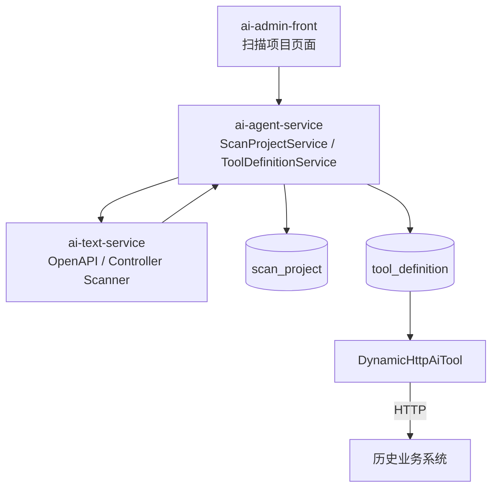

# Enterprise Agent Framework — 背景、现状、目标

> 文档版本：v1.8
> 更新时间：2026-04-16
> 状态：运行时扫描主线已收口；`ai-skill-services` 与 `ai-skill-scanner` 已下线，scanner 已并入 `ai-text-service`。

## 一、背景

企业里大量历史 Java 系统仍在稳定运行，但这些系统很难直接被 AI Agent 消费。完全重写成本高，因此当前方案选择：

1. 历史系统继续按原方式运行。
2. 管理端录入项目名、域名、磁盘路径。
3. 后端在运行时扫描 OpenAPI 或 Spring MVC Controller。
4. 扫描结果直接写入数据库并注册为动态 Tool。
5. Agent 通过 `DynamicHttpAiTool` 直接调用历史系统 HTTP 接口。

## 二、当前模块边界

```text
EnterpriseAgentFramework/
├── ai-common/        公共库
├── ai-skill-sdk/     Tool 契约（AiTool / ToolRegistry）
├── ai-model-service/ 模型网关
├── ai-text-service/  知识 / Tooling 基础层（RAG + scanner 核心）
├── ai-agent-service/ 智能体编排 + 动态 Tool 管理 + 扫描项目后端
├── ai-admin-front/   管理前端
└── deploy/           部署配置
```

当前最相关的职责分工：

- `ai-admin-front`：创建扫描项目、触发扫描/重扫、编辑动态 Tool。
- `ai-agent-service`：编排扫描流程、维护 `scan_project` / `tool_definition`、注册动态 Tool、执行最小安全降级。
- `ai-text-service`：承载 RAG 与 scanner 核心代码，供 `ai-agent-service` 直接复用。

## 三、运行时主线



关键数据：

- `scan_project`：扫描项目元信息、扫描状态、错误信息、接口数量。
- `tool_definition`：动态 Tool 定义，通过 `project_id` 归属到扫描项目。

## 四、当前收口结果

### 4.1 Tooling 侧

- `ai-skill-services` 已下线。
- `query_database`、`call_business_api`、`query_user_profile` 已从代码、默认定义、文档中移除。
- scanner 已迁入 `ai-text-service` 的 `tooling/scanner` 包。

### 4.2 编排侧

- `ai-agent-service` 继续保留 `AgentWorkflow` 作为降级路径。
- 降级路径只保留 `KNOWLEDGE_QA` 与 `GENERAL_CHAT`。
- 其他历史意图在降级时统一转为 `GENERAL_CHAT`。

### 4.3 接入侧

- 管理端扫描后结果直接入库。
- 开发者可在页面上编辑名称、描述、参数、启停、Agent 可见性。
- 启用后由 `ToolDefinitionService` 注册 `DynamicHttpAiTool` 到 `ToolRegistry`。

## 五、下一步目标

1. 继续增强 OpenAPI 复杂契约解析能力。
2. 补齐 Service / JavaDoc 深扫能力。
3. 增加扫描差异对比、增量更新与冲突提示。
4. 在边界稳定后再讨论 `ai-text-service` 的正式命名与部署迁移。

## 六、结论

项目已经完成从“扫描后生成代码”到“扫描后直接入库并运行时注册”的方向收口，同时把 Tooling 能力进一步并入 `ai-text-service`，让仓库模块边界更简单、主链路更短、维护成本更低。
