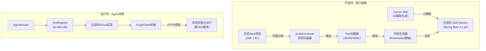
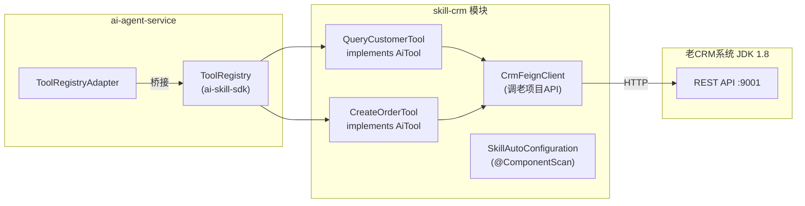
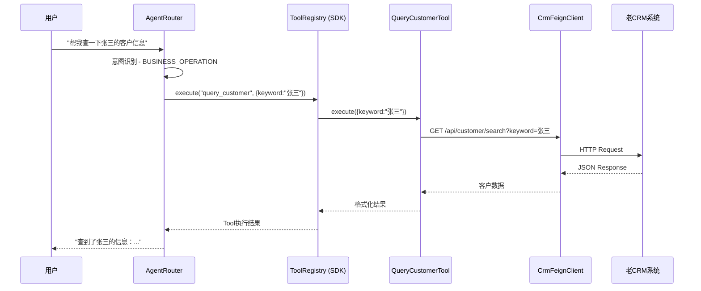
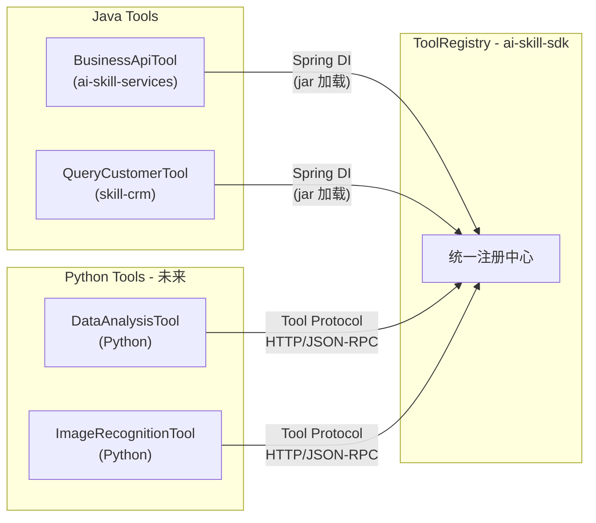

# Enterprise Agent Framework — 历史 Java 项目 AI 化架构设计

> 文档版本：v1.2
> 更新时间：2026-04-11
> 状态：ai-skill-sdk 和 ai-skill-services 已落地；ai-admin-front 已覆盖 Agent/模型/概览等管理面；扫描器待开发

---

## 一、背景与动机

### 1.1 为什么要做这件事

在企业数字化转型浪潮中，AI 不再是实验室里的技术玩具，而是要深入业务链路的"增强能力"。然而大多数传统 Java 企业面临一个共同困境：

- **存量系统庞大**：核心业务系统运行多年，基于 Spring Boot / Spring MVC / SSM 甚至更早期的框架，JDK 版本从 1.6 到 17 不等
- **AI 落地难接入**：想让 AI Agent 调用业务能力，却发现老系统和 AI 框架之间隔着巨大的技术鸿沟
- **重写成本不可接受**：不可能为了接入 AI 而重写整个业务系统

Enterprise Agent Framework 的这一架构演进，目的就是**在不改动历史项目一行代码的前提下，让老系统的业务能力成为 AI Agent 可调用的 Tool**，让存量系统焕发新生。

### 1.2 为什么用 Java 而不是 Python

**第一，现有系统体系以 Java 为主。** 公司原有业务系统基本都是 Spring Boot 体系，如果用 Java 做 Agent，可以直接复用现有服务、接口和权限体系，集成成本更低。

**第二，AI 在我们这里是"增强能力"，不是独立系统。** 很多场景是要嵌入到业务流程里的，比如调用接口、操作数据。如果用 Python，会多一层服务调用，增加复杂度。

**第三，稳定性和团队协作。** 团队大部分是 Java 背景，用 Java 可以更快推进，也更容易维护。

当然 Python 在 AI 生态上更丰富，我们在一些辅助场景（比如数据处理、脚本、图像识别）也会用，但核心业务链路还是放在 Java 里。因此架构上需要**预留 Python 扩展能力**。

### 1.3 核心目标

1. 将历史 Java 项目（甚至是 JDK 1.8 的项目）**零改动**接入智能体框架
2. 对于**复杂项目**，自动根据模板生成 Skill Service，提供与业务紧密结合的业务系统 Skill，供智能体使用
3. 对于**简单项目**，扫描历史项目接口，自动生成 Tool 定义进行 AI 调用
4. 配合 Cursor 等 AI 开发工具，形成**开发时辅助 + 运行时调用**的完整工具链
5. 兼容未来拓展 Python 等跨语言能力

### 1.4 关键架构决策

- **集成方式**：老项目保持独立运行（原 JDK 版本、原部署方式），框架通过 HTTP/Feign 桥接调用，老项目零改动
- **扫描策略**：三级优先级 — 有 Swagger 文档优先解析 Swagger，其次扫描 Controller 注解，最后分析 Service 层源码
- **Skill Service 定位**：不独立部署，作为 jar 包被 ai-agent-service 引用，避免多一跳网络开销

---

## 二、当前架构现状

Enterprise Agent Framework 经过 P0（调用链路归正）和 P1（核心能力补齐）两轮重构，已具备完整的 AI Agent 基础设施：

```
EnterpriseAgentFramework/
├── ai-common/           公共库（DTO、异常、通用配置）
├── ai-skill-sdk/        Skill 开发 SDK（AiTool 接口、ToolParameter、ToolRegistry）  [已实现]
├── ai-skill-services/   业务工具实现（jar 加载到 agent-service）                   [已实现]
├── ai-model-service/    模型网关（LLM Chat / Embedding，多 Provider）
├── ai-text-service/     RAG 引擎（知识库、文档 Pipeline、向量检索）
├── ai-agent-service/    智能体编排（AgentScope、意图识别、Tool 调用、会话记忆）
├── ai-admin-front/      统一管理前端（Vue 3 + Element Plus；对接 text / agent / model 多服务）
└── deploy/              部署配置（Docker / K8s）
```

### 已落地的 Tool 体系

当前 Tool 设计已经有良好的分层解耦，并形成了完整的 SDK 化体系：

```
AgentScope ReActAgent
    ↓
ToolRegistryAdapter（AgentScope @Tool 注解的唯一位置）
    ↓
ToolRegistry（ai-skill-sdk 提供，框架无关）
    ↓
AiTool 实现（ai-skill-sdk 定义接口，零框架依赖）
    ├── KnowledgeSearchTool（ai-agent-service 内置，调 text-service）
    ├── DatabaseQueryTool（ai-skill-services，调业务系统）
    ├── BusinessApiTool（ai-skill-services，调业务系统）
    └── UserProfileTool（ai-skill-services，Mock 实现）
         ↓
    业务系统 Client（Feign / REST）
```

`AiTool` 接口已从 ai-agent-service 下沉到 ai-skill-sdk，包含 `parameters()` 方法提供参数 Schema。新增的历史系统工具只要实现 `com.enterprise.ai.skill.AiTool` 接口并打包为 jar，就能被 Agent 自动发现和调用。

---

## 三、架构设计方案

### 3.1 整体架构全景



整个方案分为**开发时**和**运行时**两个阶段：

- **开发时**：扫描历史项目 → 生成 Tool 元数据 → 基于模板生成 Skill Service 代码（或由 Cursor AI 辅助生成）
- **运行时**：Skill Service 作为 jar 包加载到 ai-agent-service，其中的 AiTool 实现通过 Spring Boot AutoConfiguration 自动注册到 ToolRegistry，Agent 通过 Feign 桥接调用老项目 API

### 3.2 目录结构演进

在当前已有基础上扩展：

```
EnterpriseAgentFramework/
├── ai-common/                  (已有) 公共库
├── ai-skill-sdk/               (已有) Skill 开发 SDK ✅
│   └── AiTool、ToolParameter、ToolRegistry
├── ai-skill-services/          (已有) 内置业务工具 ✅
│   └── DatabaseQueryTool、BusinessApiTool、UserProfileTool
├── ai-model-service/           (已有) 模型网关
├── ai-text-service/            (已有) RAG引擎
├── ai-agent-service/           (已有) 智能体编排
├── ai-admin-front/             (已有) 统一管理前端：RAG/知识库 + Dashboard + Agent 配置/调试 + 模型调试 + Tool 页（Tool 列表依赖后端 REST）
│
├── ai-skill-scanner/           (待开发) 项目扫描器 + 代码生成器
│   └── Swagger扫描、Controller扫描、源码扫描、模板代码生成
│
├── skill-services/             (待开发) 生成的 Skill Service 存放目录
│   ├── skill-crm/              示例：CRM系统技能服务
│   └── skill-oa/               示例：OA系统技能服务
│
├── templates/                  (待开发) Skill Service 代码模板
│   ├── pom.xml.ftl
│   ├── FeignClient.java.ftl
│   ├── AiTool.java.ftl
│   └── application.yml.ftl
│
├── .cursor/
│   └── skills/
│       └── generate-skill/     (待开发) Cursor Skill - 辅助生成Skill Service
│
├── deploy/
└── docs/
```

### 3.3 ai-skill-sdk — Skill 开发 SDK ✅ 已实现

**定位**：Skill/Tool 开发的统一契约层，让生成的 Skill Service 和手写的 Tool 都遵循同一套标准。

**已实现：**

- `AiTool` 接口：统一的工具契约，包含 `name()`、`description()`、`execute(args)`、`parameters()`
- `ToolParameter` 记录类：参数描述（名称、类型、描述、是否必填）
- `ToolRegistry`：通用工具注册中心，支持注册、查找、执行

**待实现（P2）：**

- `ToolMetadata`：增强版工具描述（权限要求、来源系统标识、返回值描述）
- `RemoteTool`：基于 HTTP 调用远程服务的 AiTool 通用实现 — 所有桥接生成的 Tool 的基类
- `ToolAutoConfiguration`：更完善的 Spring Boot Starter 自动配置

与现有 ai-agent-service 的关系：AiTool 接口已从 agent-service 下沉到 skill-sdk。agent-service 中保留了一个 `@Deprecated` 的兼容层接口，新 Tool 直接实现 `com.enterprise.ai.skill.AiTool`。

### 3.4 ai-skill-scanner — 项目扫描器（待开发）

**定位**：开发时 CLI 工具，扫描历史项目、输出元数据、生成代码。

三级扫描策略（按优先级）：

- **优先级 1 — Swagger/OpenAPI**：解析 swagger.json / openapi.yaml
- **优先级 2 — Controller 注解**：基于 JavaParser 静态分析 @RequestMapping 等注解
- **优先级 3 — Service 层源码**：JavaParser 分析方法签名 + JavaDoc 注释

扫描输出统一的 **Tool Manifest**（JSON/YAML），格式示例：

```yaml
project:
  name: legacy-crm
  base-url: http://localhost:9001
  context-path: /api

tools:
  - name: query_customer
    description: "查询客户信息，支持按姓名、手机号、客户编号检索"
    endpoint: GET /api/customer/search
    parameters:
      - name: keyword
        type: string
        required: true
        description: "搜索关键词（姓名/手机号/编号）"
      - name: page
        type: integer
        required: false
        description: "页码，默认1"
    response-type: "JSON数组，包含客户列表"
    
  - name: create_order
    description: "创建销售订单"
    endpoint: POST /api/order
    parameters:
      - name: customer_id
        type: string
        required: true
        description: "客户ID"
      - name: items
        type: string
        required: true
        description: "JSON格式商品列表"
```

代码生成器基于 Tool Manifest + Freemarker 模板生成完整的 Skill Service 模块。

### 3.5 Skill Service 架构

每个生成的 Skill Service 遵循 ai-skill-services 的现有模式 — 轻量级 Spring Boot 模块（不独立部署，作为 ai-agent-service 的 Maven 依赖加载）：



与 ai-skill-services 的一致性：

- 依赖 `ai-skill-sdk`（AiTool 接口）
- 提供 `SkillAutoConfiguration` + `META-INF/spring/org.springframework.boot.autoconfigure.AutoConfiguration.imports`
- Spring Boot 组件扫描自动注册 AiTool Bean

### 3.6 Cursor Skill — AI 辅助生成

定义一个 Cursor Skill（`.cursor/skills/generate-skill/SKILL.md`），指导 Cursor AI：

1. 读取老项目的目录结构、Controller、Service、Swagger 文档
2. 理解框架的 AiTool 接口契约和 Skill Service 模板
3. 根据老项目特征，生成 Skill Service 脚手架代码
4. 开发者审查调整后即可使用

Cursor Skill 与 ai-skill-scanner 是**互补关系**：

- Scanner 适合批量、标准化的 API 扫描和代码生成
- Cursor Skill 适合需要理解业务语义、做智能决策的场景

---

## 四、运行时 Tool 发现与调用链路



---

## 五、Python 扩展兼容设计

预留 `RemoteToolProvider` 机制，支持未来的跨语言 Tool：

- 定义标准的 **Tool Protocol**（HTTP/JSON-RPC），Python 端实现此协议即可注册为 Tool
- Java 端通过 `RemoteToolProvider` 发现远程 Tool 并自动注册到 ToolRegistry
- 协议设计可参考 MCP（Model Context Protocol）的思路，保持兼容性



---

## 六、实施路径

### ~~第一阶段 — 基础能力（已完成）~~ ✅

- [x] 创建 ai-skill-sdk 模块，AiTool 接口从 agent-service 下沉
- [x] 实现 ToolParameter 参数描述（名称、类型、描述、是否必填）
- [x] 实现 ToolRegistry 通用注册中心
- [x] 创建 ai-skill-services，迁移 DatabaseQueryTool/BusinessApiTool/UserProfileTool
- [x] 实现 Spring Boot AutoConfiguration 自动注册
- [x] ai-agent-service 通过 jar 依赖加载 skill-services，验证自动发现

### 第二阶段 — 扫描与生成（待开发，2-3 周）

- [ ] 实现 Swagger/OpenAPI 扫描器
- [ ] 实现 Controller 注解扫描器（基于 JavaParser）
- [ ] 实现 Freemarker 模板代码生成器
- [ ] 编写 Cursor Skill（generate-skill），建立 AI 辅助生成流程
- [ ] 以一个真实老项目验证端到端流程：扫描 → 生成 Skill Service → Agent 调用

### 第三阶段 — 完善与扩展（持续迭代）

- [ ] ToolMetadata 增强（权限要求、来源标识）
- [ ] RemoteTool 基类（HTTP 桥接通用实现）
- [ ] 源码级扫描器（Service 层 + JavaDoc）
- [ ] Python Tool Protocol 支持（RemoteToolProvider）
- [x] Tool 管理前端（ai-admin-front：`/tool` 列表、Schema 展开、测试弹窗；**监控与注册**仍待后端 API 与产品化）
- [ ] Tool 权限、限流、审计等企业级特性

---

## 七、未来愿景

### 7.1 从"AI 化改造"到"AI 原生开发"

本方案解决的是**存量系统 AI 化**的问题。但随着框架的成熟，未来新业务系统可以**从设计之初就以 AI-Native 的方式开发**：

- 业务模块在开发时直接实现 `com.enterprise.ai.skill.AiTool` 接口，同时提供 REST API 和 Tool 能力
- 新系统不再需要"扫描 + 生成"的过程，业务能力天然可被 Agent 调用
- 形成"业务即技能"的开发范式

### 7.2 Tool 市场与能力共享

当企业内部积累了足够多的 Skill Service 后，可以建设**内部 Tool 市场**：

- 各业务团队发布自己的 Skill Service 到市场
- Agent 开发者按需"安装"所需的业务 Skill
- Tool 具备版本管理、兼容性检测、灰度发布等能力
- 最终形成企业内部的 AI 能力生态

### 7.3 多语言 Agent 生态

通过 Tool Protocol 标准协议，不限于 Java 和 Python：

- Go、Rust、Node.js 等语言的服务都可以通过实现 Tool Protocol 接入
- 异构技术栈的企业可以统一在一个 Agent 编排层下
- 甚至可以对接外部 SaaS 服务的 API（如钉钉、企业微信、飞书等），将其封装为 Tool

### 7.4 智能编排进化

随着 Tool 数量增长，静态的意图路由将不够用，需要演进到：

- **动态 Tool 选择**：Agent 根据用户意图和可用 Tool 列表，自主决策调用哪些 Tool
- **多 Agent 协作**：不同业务域的 Agent 各自管理自己的 Tool 集合，通过 MsgHub/Pipeline 协作完成跨域任务
- **Tool 编排优化**：基于历史调用数据，自动优化 Tool 的调用顺序和参数默认值

### 7.5 可观测性与治理

企业级落地离不开治理能力：

- **调用链追踪**：用户提问 → 意图识别 → Tool 选择 → 工具调用 → 结果返回，全链路可追踪
- **成本管理**：LLM Token 消耗、Tool 调用次数、响应时间的统计与预警
- **安全审计**：谁在什么时间通过 Agent 调用了哪个业务 API、操作了什么数据
- **效果评估**：Agent 回答准确率、用户满意度、Tool 调用成功率的量化分析
